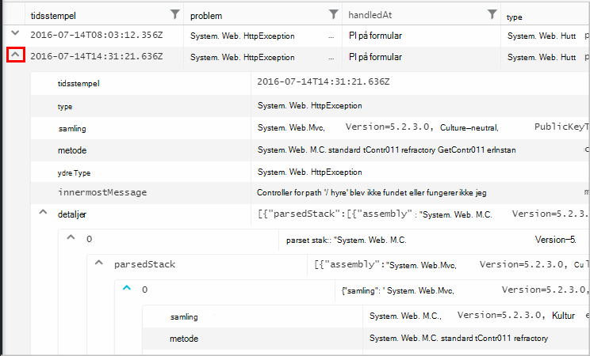

<properties 
    pageTitle="Brug af Analytics - værktøjet effektiv søgning i programmet indsigt | Microsoft Azure" 
    description="Brug af analyser, effektive diagnosticering søgeværktøjet af programmet indsigt. " 
    services="application-insights" 
    documentationCenter=""
    authors="danhadari" 
    manager="douge"/>

<tags 
    ms.service="application-insights" 
    ms.workload="tbd" 
    ms.tgt_pltfrm="ibiza" 
    ms.devlang="na" 
    ms.topic="article" 
    ms.date="10/21/2016" 
    ms.author="awills"/>

# Brug af Analytics i programmet indsigt

[Analytics](app-insights-analytics.md) er effektive søgefunktionen af [Programmet indsigt](app-insights-overview.md). Disse sider beskriver forespørgselssprog analyser.

* **[Se indledende videoen](https://applicationanalytics-media.azureedge.net/home_page_video.mp4)**.
* **[Test drev analyser af vores simuleret data](https://analytics.applicationinsights.io/demo)** , hvis din app ikke sende data til programmet indsigt endnu.

## Åbn Analytics

Klik på Analytics fra din app privat ressource i programmet indsigt.

Indbygget selvstudiet giver dig nogle ideer til, hvad du kan gøre.

Der er en [mere omfattende rundvisning her](app-insights-analytics-tour.md).

## Forespørgsel din telemetri

### Skrive en forespørgsel

Starte med navnene på en af de tabeller, der er anført på venstre (eller de [område](app-insights-analytics-reference.md#range-operator) eller [union](app-insights-analytics-reference.md#union-operator) operatorer). Brug `|` til at oprette en rørledning af [operatorer](app-insights-analytics-reference.md#queries-and-operators). IntelliSense beder dig om med operatorerne og nogle af de Udtrykselementer, du kan bruge.

Se [Oversigt over Analytics sprog](app-insights-analytics-tour.md) og [language reference](app-insights-analytics-reference.md).

### Køre en forespørgsel

1. Du kan bruge enkelt linjeskift i en forespørgsel.
2. Placere markøren i eller i slutningen af den forespørgsel, du vil køre.
3. Klik på Udfør for at køre forespørgslen.
4. Sæt ikke tomme linjer i forespørgslen. Du kan holde flere adskilte forespørgsler i en under forespørgselsfanen ved at adskille dem med tomme linjer. Kun ene med markøren kører.

### Gemme en forespørgsel

1. Gemme den aktuelle forespørgselsfil.
2. Åbn en gemt forespørgsel-fil.
3. Oprette en ny forespørgselsfil.

## Få vist detaljer

Udvide en hvilken som helst række i resultaterne for at se den komplette liste over egenskaber. Du kan yderligere udvide en egenskab, der er en strukturerede værdi – for eksempel, brugerdefinerede mål eller listen over i en undtagelse stablen.

 

## Arranger resultaterne

Du kan sortere, filtrere, indstillinger og gruppere resultaterne returneres fra din forespørgsel.

> [AZURE.NOTE] Sortering, gruppering og filtrering i browseren, ikke køre forespørgslen igen. De kun omarrangere de resultater, der blev returneret af din seneste forespørgsel. 
> 
> For at udføre disse opgaver i serveren, før resultaterne returneres, skal du skrive din forespørgsel med [sortering](app-insights-analytics-reference.md#sort-operator), [opsummere](app-insights-analytics-reference.md#summarize-operator) og [hvor](app-insights-analytics-reference.md#where-operator) operatorer.

Vælg de kolonner, du gerne vil se, træk kolonneoverskrifter for at omarrangere dem og ændre størrelse på kolonner ved at trække i kanterne.

### Sortere og filtrere elementer

Sortere dine resultater ved at klikke på afsnit i en kolonne. Klik igen for at sortere anden vej, og klik på en tredje tid til at vende tilbage til den oprindelige rækkefølge, der returneres af din forespørgsel.

Brug filterikonet til at indsnævre søgningen.

### Gruppeelementer

For at sortere efter mere end én kolonne, skal du bruge gruppering. Først aktivere den, og træk derefter kolonneoverskrifter på plads over tabellen.

### Mangler nogle resultater?

Er der en grænse på omkring 10 k rækker på siden resultater, der returneres fra portalen. En advarsel vises, hvis du går hen over grænsen. Hvis det sker, viser sortere dine resultater i tabellen ikke altid dig alle de faktiske første eller sidste resultater. 

Det er god praksis at undgå at ramme grænsen. Bruge operatorer som f.eks.:

* [hvor tidsstempel > ago(3d)](app-insights-analytics-reference.md#where-operator)
* [top 100 efter tidsstempel](app-insights-analytics-reference.md#top-operator) 
* [tage 100](app-insights-analytics-reference.md#take-operator)
* [opsummere](app-insights-analytics-reference.md#summarize-operator) 

## Diagrammer

Vælg typen diagram, du vil have:

Hvis du har flere kolonner med den rigtige type, kan du vælge x og y-akser og en kolonne med dimensioner opdele resultaterne efter.

Resultaterne vises først som en tabel, og du vælger manuelt diagrammet som standard. Men du kan bruge den [gengive direktiv](app-insights-analytics-reference.md#render-directive) i slutningen af en forespørgsel til at vælge et diagram.

## Fastgøre til dashboard

Kan du fastgøre et diagram eller tabel til en af dine [delte dashboards](app-insights-dashboards.md) - bare klikke på pinkoden. (Du kan være nødvendigt at [opgradere din app er priser pakke](app-insights-pricing.md) til at slå denne funktion.) 

Det betyder, at når du placerer sammen at hjælpe dig med at overvåge ydeevnen eller brugen af dine webtjenester, kan du medtage helt komplekse analyser sammen med anden metrik. 

Hvis der er fire eller færre kolonner, kan du fastgøre en tabel til dashboard. Kun de øverste syv rækker vises.

#### Dashboard-opdatering

Fastgjort til dashboard diagrammet opdateres automatisk, ved at køre forespørgslen cirka hver halv time.

#### Automatisk forenklinger

I nogle tilfælde anvendes visse forenklinger til et diagram, når du fastgøre den til et dashboard.

Når du Fastgør et diagram, der viser en masse separate placeringer (typisk et liggende søjlediagram), mindre på forhånd placeringer grupperes automatisk i en enkelt placering "andre". For eksempel denne forespørgsel:

    requests | summarize count_search = count() by client_CountryOrRegion

ser sådan ud i Analytics:

men når du Fastgør den til et dashboard, ser den således ud:

## Eksporter til Excel

Når du har kørt en forespørgsel, kan du hente en .csv-fil. Klik på **Eksporter til Excel**.

## Eksportere til Power BI

Placer markøren i en forespørgsel, og vælg **Eksportér til Power BI**.

Du kører forespørgslen i Power BI. Du kan indstille den til at opdatere en tidsplan.

Med Power BI, kan du oprette dashboards, der samler data fra en lang række kilder.

[Lær mere om Eksportér til Power BI](app-insights-export-power-bi.md)

[AZURE.INCLUDE [app-insights-analytics-footer](../../includes/app-insights-analytics-footer.md)]

