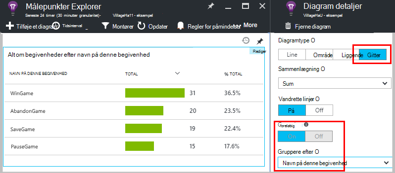

<properties 
    pageTitle="Programmet indsigt API til brugerdefinerede hændelser og målepunkter | Microsoft Azure" 
    description="Indsætte et par kodelinjer i din enhed eller skrivebord app, webside eller -tjeneste til at registrere brugen og diagnosticere problemer." 
    services="application-insights"
    documentationCenter="" 
    authors="alancameronwills" 
    manager="douge"/>
 
<tags 
    ms.service="application-insights" 
    ms.workload="tbd" 
    ms.tgt_pltfrm="ibiza" 
    ms.devlang="multiple" 
    ms.topic="article" 
    ms.date="10/19/2016" 
    ms.author="awills"/>

# <a name="application-insights-api-for-custom-events-and-metrics"></a>Programmet indsigt API til brugerdefinerede hændelser og målepunkter 

*Programmet indsigt er i Vis udskrift.*

Indsætte et par kodelinjer i dit program til at finde ud af, hvad brugerne laver med den, eller at finde årsagerne problemer. Du kan sende telemetri fra enheden og pc'en apps, web-klienter og -servere. [Visual Studio programmet indsigt](app-insights-overview.md) core telemetri API kan du sende brugerdefinerede hændelser og målepunkter og din egen versioner af standard telemetri. Denne API er den samme API, der bruges af de almindelige programmet indsigt dataindsamlere.

## <a name="api-summary"></a>Oversigt over API

API er ensartet på tværs af alle platforme, bortset fra et par små variationer.

Metode | Bruges til
---|---
[`TrackPageView`](#page-views) | Sider, skærmbilleder, blade eller formularer
[`TrackEvent`](#track-event) | Brugerhandlinger og andre begivenheder. Bruges til at registrere bruger funktionsmåde eller til at overvåge ydeevnen.
[`TrackMetric`](#track-metric) | Ydeevnen mål som kø længde ikke er relateret til bestemte hændelser
[`TrackException`](#track-exception)|Log undtagelser til diagnosticering. Spore, hvor de forekommer i forhold til andre begivenheder og undersøge staksporinger.
[`TrackRequest`](#track-request)| Log hyppigheden og varigheden af anmodninger til serveren til analyse af ydeevnen.
[`TrackTrace`](#track-trace)|Diagnosticeringsloggene meddelelser. Du kan også hente 3 tredjepart logfiler.
[`TrackDependency`](#track-dependency)|Log varigheden og hyppigheden for opkald til eksterne komponenter, som din app afhænger af.

Du kan [vedhæfte egenskaber og målepunkter](#properties) i de fleste af disse telemetri opkald. 


## <a name="prep"></a>Før du starter

Hvis du ikke har gjort det disse:

* Føje programmet indsigt SDK til dit projekt:
 * [ASP.NET-projekt][greenbrown]
 * [Java project][java] 
 * [JavaScript i hver enkelt webside][client]   

* I din enheds- eller web server-kode, omfatte:

    *C#:*`using Microsoft.ApplicationInsights;`

    *VB:*`Imports Microsoft.ApplicationInsights`

    *Java:*`import com.microsoft.applicationinsights.TelemetryClient;`

## <a name="construct-a-telemetryclient"></a>Oprette en TelemetryClient

Oprette en forekomst af TelemetryClient (undtagen i JavaScript på websider):

*C#:* 

    private TelemetryClient telemetry = new TelemetryClient();

*VB:* 

    Private Dim telemetry As New TelemetryClient

*Java*

    private TelemetryClient telemetry = new TelemetryClient();

TelemetryClient er tråd sikker.

Vi anbefaler, at du bruger en forekomst af `TelemetryClient` for hvert modul af din app. Du kan for eksempel har en `TelemetryClient` i din webtjeneste at rapportere indgående HTTP-anmodninger og et andet i en programmer klasse til rapport business logik begivenheder. Du kan angive egenskaber som `TelemetryClient.Context.User.Id` til at registrere brugere og -sessioner, eller `TelemetryClient.Context.Device.Id` til at identificere maskinen. Disse oplysninger er knyttet til alle de hændelser, der er sendt af forekomsten.


## <a name="track-event"></a>Registrer begivenhed

I programmet viden, en *brugerdefineret hændelse* er et datapunkt, du kan få vist både i i [Målepunkter Explorer] [ metrics] som en samlet antal, og som individuelle forekomster i [Diagnosticering Søg][diagnostic]. (Det ikke er relateret til MVC eller andre framework "begivenheder.") 

Indsætte TrackEvent opkald i din kode for at tælle, hvor ofte brugere vælge en bestemt funktion, hvor ofte de nå bestemte mål, eller måske foretage bestemte typer fejl. 

For eksempel sende en begivenhed, når en bruger vinder game i en game app: 

*JavaScript*

    appInsights.trackEvent("WinGame");

*C#*
    
    telemetry.TrackEvent("WinGame");

*VB*


    telemetry.TrackEvent("WinGame")

*Java*

    telemetry.trackEvent("WinGame");


### <a name="view-your-events-in-the-azure-portal"></a>Få vist dine begivenheder på portalen Azure

Åbn en [Metrikværdi Explorer](app-insights-metrics-explorer.md) blade for at få vist en optælling af dine begivenheder, tilføje et nyt diagram, og vælg begivenheder.  


For at sammenligne optællinger for de forskellige hændelser skal du angive diagramtypen til gitter og gruppen ved navn på denne begivenhed:




I gitteret, skal du klikke på via en begivenhed navn for at se individuelle forekomster over den pågældende begivenhed.


Klik på en hvilken som helst forekomst for at få vist flere detaljer.

Angiv den blade filter til begivenhed navnene, som du er interesseret i for at fokusere på specifikke hændelser i Søg eller metrisk Explorer:


## <a name="track-metric"></a>Registrere metrisk

Brug TrackMetric til at sende målepunkter, der ikke er knyttet til bestemte hændelser. For eksempel kan du overvåge en længde på kø med jævne mellemrum. 

Målepunkter vises som statistiske diagrammer i metriske explorer, men i modsætning til hændelser, du kan ikke søge efter individuelle forekomster i diagnosticering Søg.

Metriske værdier skal være > = 0 skal vises korrekt.


*JavaScript*

    appInsights.trackMetric("Queue", queue.Length);

*C#*

    telemetry.TrackMetric("Queue", queue.Length);

*VB*

    telemetry.TrackMetric("Queue", queue.Length)

*Java*

    telemetry.trackMetric("Queue", queue.Length);

Faktisk, kan du gøre dette i en baggrundstråd:

*C#*

    private void Run() {
     var appInsights = new TelemetryClient();
     while (true) {
      Thread.Sleep(60000);
      appInsights.TrackMetric("Queue", queue.Length);
     }
    }


Åbn målepunkter Stifinder for at se resultaterne, og tilføje et nyt diagram. Indstille den til at få vist din metrisk.


Er der nogle [begrænsninger på antallet af målepunkter](#limits) , du kan bruge.

## <a name="page-views"></a>Sidevisninger

Siden visning telemetri sendes i en enhed eller webside app, som standard, når hver skærmen eller siden er indlæst. Men du kan ændre, for at spore sidevisninger på flere eller andre tidspunkter. For eksempel en app, der viser fanerne eller blade skal du måske ønsker at spore en "side", når brugeren åbner en ny blade. 


Bruger-og session sendes som egenskaber sammen med sidevisninger, så bruger- og session diagrammerne levende, når der er siden visning telemetri.

#### <a name="custom-page-views"></a>Brugerdefineret sidevisninger

*JavaScript*

    appInsights.trackPageView("tab1");

*C#*

    telemetry.TrackPageView("GameReviewPage");

*VB*

    telemetry.TrackPageView("GameReviewPage")


Hvis du har flere faner i forskellige HTML-sider, kan du angive URL-adressen for:

    appInsights.trackPageView("tab1", "http://fabrikam.com/page1.htm");

#### <a name="timing-page-views"></a>Tidsindstilling sidevisninger

Som standard klokkeslæt, rapporteret som "Side visning indlæsningstiden" måles fra, når browseren sender anmodningen, indtil browserens siden Indlæs hændelse kaldes.

I stedet kan du enten:

* Angive en eksplicit varighed i [trackPageView](https://github.com/Microsoft/ApplicationInsights-JS/blob/master/API-reference.md#trackpageview) opkaldet.
 * `appInsights.trackPageView("tab1", null, null, null, durationInMilliseconds);`
* Bruge sidevisningen timing opkald `startTrackPage` og `stopTrackPage`.

*JavaScript*

    // To start timing a page:
    appInsights.startTrackPage("Page1");

... 

    // To stop timing and log the page:
    appInsights.stopTrackPage("Page1", url, properties, measurements);

Navnet, du bruger, som den første parameter associates start- og opkald. Som standard sidenavnet på den aktuelle. 

De resulterende side Indlæs varighed, vises i metrisk Explorer er udledt fra intervallet mellem start- og opkald. Det er til dig det interval, du rent faktisk tid.

## <a name="track-request"></a>Registrer anmodning

Bruges af serveren SDK til at logge HTTP-anmodninger. 

Du kan også ringe det selv hvis du vil simulere anmodninger i en kontekst hvor du ikke har modulet web service, der kører.

*C#*

    // At start of processing this request:

    // Operation Id and Name are attached to all telemetry and help you identify
    // telemetry associated with one request:
    telemetry.Context.Operation.Id = Guid.NewGuid().ToString();
    telemetry.Context.Operation.Name = requestName;
    
    var stopwatch = System.Diagnostics.Stopwatch.StartNew();

    // ... process the request ...

    stopwatch.Stop();
    telemetry.TrackRequest(requestName, DateTime.Now,
       stopwatch.Elapsed, 
       "200", true);  // Response code, success


## <a name="operation-context"></a>Handlingen kontekst

Telemetri elementer kan knyttes sammen ved at knytte til dem et almindelige handling-ID. Standard anmodningen sporing modul gør dette for undtagelser og andre begivenheder, der sendes under behandling af en HTTP-anmodning. I [Søg](app-insights-diagnostic-search.md) og [analyse](app-insights-analytics.md), kan du bruge ID'ET til nemt for at finde alle hændelser, der er knyttet til din anmodning. 

Den nemmeste måde at indstille-ID'ET er at angive en handling kontekst ved hjælp af dette mønster:

    // Establish an operation context and associated telemetry item:
    using (var operation = telemetry.StartOperation<RequestTelemetry>("operationName"))
    {
        // Telemetry sent in here will use the same operation ID.
        ...
        telemetry.TrackEvent(...); // or other Track* calls
        ...
        // Set properties of containing telemetry item - for example:
        operation.Telemetry.ResponseCode = "200";
        
        // Optional: explicitly send telemetry item:
        telemetry.StopOperation(operation);

    } // When operation is disposed, telemetry item is sent.

Samt angive en handling kontekst `StartOperation` opretter et telemetri element af typen, du angiver, og sender den, når du sælger handlingen, eller hvis du eksplicit ringe `StopOperation`. Hvis du bruger `RequestTelemetry` som typen telemetri, derefter dens varighed er indstillet til tidsindstillede intervallet mellem start- og.

Handlingen kontekster kan ikke indlejres. Hvis der allerede er en handling kontekst, derefter er dets ID knyttet til alle de indeholdte elementer, herunder det element, der er oprettet med StartOperation.

I søgning bruges konteksten handling til at oprette listen Relaterede elementer:


## <a name="track-exception"></a>Registrere undtagelse

Sende undtagelser til programmet indsigt: til at [tælle dem][metrics], som angivelse af hyppigheden for et problem og for at [undersøge individuelle forekomster][diagnostic]. Rapporterne, der omfatter staksporinger.

*C#*

    try
    {
        ...
    }
    catch (Exception ex)
    {
       telemetry.TrackException(ex);
    }

*JavaScript*

    try
    {
       ...
    }
    catch (ex)
    {
       appInsights.trackException(ex);
    }

SDK'er løse mange undtagelser automatisk, så du ikke behøver at ringe TrackException eksplicit altid.

* ASP.NET: [skrive programkode til at opfange undtagelser](app-insights-asp-net-exceptions.md)
* J2EE: [undtagelser er taget automatisk](app-insights-java-get-started.md#exceptions-and-request-failures)
* JavaScript: Taget automatisk. Hvis du vil deaktivere automatisk af websteder, skal du tilføje en linje til det kodestykke, du indsætter i dine websider:

    ```
    ({
      instrumentationKey: "your key"
      , disableExceptionTracking: true
    })
    ```


## <a name="track-trace"></a>Registrere sporing 

Brug dette til at diagnosticere problemer ved at sende 'brødkrummen spor' til programmet indsigt. Du kan sende mængde diagnosticering data og undersøge dem i [diagnosticering Søg][diagnostic]. 

 

[Log kort] [ trace] Brug denne API til at sende fra tredjepart logge på portalen.


*C#*

    telemetry.TrackTrace(message, SeverityLevel.Warning, properties);


Du kan søge efter meddelelsesindhold, men (i modsætning til egenskabsværdier) du kan ikke filtrere på den.

Tilladte størrelse på `message` er meget større end grænsen for egenskaber.
En fordel af TrackTrace er, at du kan anbringe relativt lange data i meddelelsen. Du kan for eksempel koder INDLÆG dataene der.  


Desuden kan du føje en prioritering til din meddelelse. Og som andre telemetri, kan du tilføje egenskabsværdier, som du kan bruge til at filtrere eller søge efter forskellige typer sporinger. Eksempel:


    var telemetry = new Microsoft.ApplicationInsights.TelemetryClient();
    telemetry.TrackTrace("Slow database response",
                   SeverityLevel.Warning,
                   new Dictionary<string,string> { {"database", db.ID} });

På denne måde kan du, i [Søg][diagnostic], til at filtrere nemt alle meddelelserne i en bestemt prioritering, der vedrører en bestemt database.

## <a name="track-dependency"></a>Registrere afhængighed

Brug dette opkald til at registrere svar gange og succes satser for opkald til en ekstern stykke kode. Resultaterne vises i afhængighed diagrammerne på portalen. 

```C#

            var success = false;
            var startTime = DateTime.UtcNow;
            var timer = System.Diagnostics.Stopwatch.StartNew();
            try
            {
                success = dependency.Call();
            }
            finally
            {
                timer.Stop();
                telemetry.TrackDependency("myDependency", "myCall", startTime, timer.Elapsed, success);
            }
```

Husk, at serveren SDK'er omfatter et [afhængighed modul](app-insights-dependencies.md) , der opdager og registrerer bestemte afhængighed ringer automatisk – for eksempel til databaser og REST API'er. Du skal installere en agent på din server for at gøre modulet, der fungerer. Du vil bruge dette opkald, hvis du vil registrere opkald, der ikke er omfattet af automatisk registrering, eller hvis du ikke ønsker at installere agenten.

For at deaktivere modulet standard afhængighed registrering skal du redigere [ApplicationInsights.config](app-insights-configuration-with-applicationinsights-config.md) og slette referencen til `DependencyCollector.DependencyTrackingTelemetryModule`.


## <a name="flushing-data"></a>Træk data

Normalt sender SDK data til tider valgt at minimere påvirkning af brugeren. Men i nogle tilfælde du muligvis vil tømme bufferen - f.eks, hvis du bruger SDK i et program, lukkes ned.

*C#*

    telemetry.Flush();

    // Allow some time for flushing before shutdown.
    System.Threading.Thread.Sleep(1000);

Bemærk, at funktionen asynkron til [server telemetri kanal](https://www.nuget.org/packages/Microsoft.ApplicationInsights.WindowsServer.TelemetryChannel/), men synkron, hvis du vælger at bruge den i hukommelsen kanal eller [fast kanal](app-insights-api-filtering-sampling.md#persistence-channel).


## <a name="authenticated-users"></a>Godkendte brugere

I en online er brugere som standard, der er identificeret med cookie. En bruger kan tælles mere end én gang, hvis de får adgang til din app fra en anden computer eller en browser, eller slette cookies. 

Men hvis brugere logger på din app, kan du få en mere nøjagtig tælling ved at angive den godkendte bruger-id i koden browser:

*JavaScript*

```JS
    // Called when my app has identified the user.
    function Authenticated(signInId) {
      var validatedId = signInId.replace(/[,;=| ]+/g, "_");
      appInsights.setAuthenticatedUserContext(validatedId);
      ...
    }
```

I en ASP.NET web MVC-program, for eksempel:

*Razor*

        @if (Request.IsAuthenticated)
        {
            <script>
                appInsights.setAuthenticatedUserContext("@User.Identity.Name
                   .Replace("\\", "\\\\")"
                   .replace(/[,;=| ]+/g, "_"));
            </script>
        }

Det er ikke nødvendigt at bruge brugerens faktiske logon navn. Den kun skal være et id, der er entydige til den pågældende bruger. Den må ikke indeholde mellemrum eller tegn `,;=|`. 

Bruger-id er også angive i en sessionscookie og sendt til serveren. Hvis serveren SDK er installeret, skal den godkendte bruger-id sendes som en del af kontekstegenskaberne for både klienten og serveren telemetri, så du kan filtrere og søge på den.

Hvis din app grupperer brugere i konti, kan du også overføre et id for kontoen (med de samme tegnbegrænsninger).


      appInsights.setAuthenticatedUserContext(validatedId, accountId);

I [målepunkter explorer](app-insights-metrics-explorer.md), kan du oprette et diagram, der tæller antallet af **brugere, godkendt** og **brugerkonti**. 

Du kan også [søge] [ diagnostic] for klient datapunkter med bestemte brugernavne og -konti.

## <a name="properties"></a>Filtrere, søge og opdele dataene med egenskaber

Du kan vedhæfte egenskaber og målinger til dine begivenheder (og siden også visninger, undtagelser og andre telemetridata til Metrisk,).

**Egenskaber** er strengværdier, som du kan bruge til at filtrere dine telemetri i Anvendelsesrapporterne. Eksempelvis hvis din app indeholder flere spil, du skal vedhæfte afgørende til hver enkelt hændelse, så du kan se, hvilke spil er mere populære. 

Er der en grænse på om 1k på strenglængden. (Hvis du vil sende store dele af data, bruge parameteren meddelelse af [TrackTrace](#track-trace).)

**Målepunkter** er numeriske værdier, der kan præsenteres grafisk. Du kan for eksempel vil se, om der er en gradvist stigning i læsbarhedstest din spillere opnå. Graferne kan opdelt ved de egenskaber, der er sendt med begivenheden, så du kan finde separat eller stablet grafer til forskellige spil.

Metriske værdier skal være > = 0 skal vises korrekt.


Er der nogle [begrænsninger på antallet af egenskaber, egenskabsværdier, og målepunkter](#limits) , som du kan bruge.


*JavaScript*

    appInsights.trackEvent
      ("WinGame",
         // String properties:
         {Game: currentGame.name, Difficulty: currentGame.difficulty},
         // Numeric metrics:
         {Score: currentGame.score, Opponents: currentGame.opponentCount}
         );

    appInsights.trackPageView
        ("page name", "http://fabrikam.com/pageurl.html",
          // String properties:
         {Game: currentGame.name, Difficulty: currentGame.difficulty},
         // Numeric metrics:
         {Score: currentGame.score, Opponents: currentGame.opponentCount}
         );
          

*C#*

    // Set up some properties and metrics:
    var properties = new Dictionary <string, string> 
       {{"game", currentGame.Name}, {"difficulty", currentGame.Difficulty}};
    var metrics = new Dictionary <string, double>
       {{"Score", currentGame.Score}, {"Opponents", currentGame.OpponentCount}};

    // Send the event:
    telemetry.TrackEvent("WinGame", properties, metrics);


*VB*

    ' Set up some properties:
    Dim properties = New Dictionary (Of String, String)
    properties.Add("game", currentGame.Name)
    properties.Add("difficulty", currentGame.Difficulty)

    Dim metrics = New Dictionary (Of String, Double)
    metrics.Add("Score", currentGame.Score)
    metrics.Add("Opponents", currentGame.OpponentCount)

    ' Send the event:
    telemetry.TrackEvent("WinGame", properties, metrics)


*Java*
    
    Map<String, String> properties = new HashMap<String, String>();
    properties.put("game", currentGame.getName());
    properties.put("difficulty", currentGame.getDifficulty());
    
    Map<String, Double> metrics = new HashMap<String, Double>();
    metrics.put("Score", currentGame.getScore());
    metrics.put("Opponents", currentGame.getOpponentCount());
    
    telemetry.trackEvent("WinGame", properties, metrics);


> [AZURE.NOTE] Tager sig ikke, hvis du vil logge af personlige oplysninger i egenskaber.

**Hvis du har brugt målepunkter**, Åbn metrisk Stifinder og vælge metrikværdien fra den brugerdefinerede gruppe:


*Hvis din metrisk ikke vises, eller hvis overskriften brugerdefineret ikke er der, Luk bladet markeringen, og prøv senere. Nogle gange kan det tage en time på målepunkter være sammenlagt gennem en pipeline.*

**Hvis du har brugt egenskaber og målepunkter**segmentet metrisk af egenskaben:


**Diagnosticering søgning i**, kan du se de egenskaber og målepunkter af individuelle forekomster af en begivenhed.


Brug søgefeltet til at se begivenhed forekomster med en bestemt egenskabsværdi.


[Lær mere om søgeudtryk][diagnostic].

#### <a name="alternative-way-to-set-properties-and-metrics"></a>Mulighed for at angive egenskaber og målepunkter

Hvis det er mere praktisk, kan du indsamle parametrene for en begivenhed i et separat objekt:

    var event = new EventTelemetry();

    event.Name = "WinGame";
    event.Metrics["processingTime"] = stopwatch.Elapsed.TotalMilliseconds;
    event.Properties["game"] = currentGame.Name;
    event.Properties["difficulty"] = currentGame.Difficulty;
    event.Metrics["Score"] = currentGame.Score;
    event.Metrics["Opponents"] = currentGame.Opponents.Length;

    telemetry.TrackEvent(event);

> [AZURE.WARNING] Ikke genbruge den samme telemetri element forekomst (`event` i dette eksempel) til at ringe Track*() flere gange. Dette kan medføre telemetri til at blive sendt med forkert konfiguration.


## <a name="timed"></a>Tidsindstilling begivenheder

Nogle gange vil du gerne diagram, hvor lang tid det tager for at udføre en handling. For eksempel du måske gerne vide, hvor lang tid brugere Tag skal du tænke på valgmuligheder i et game. Dette er en praktisk eksempel på brug af parameteren mål.


*C#*

    var stopwatch = System.Diagnostics.Stopwatch.StartNew();

    // ... perform the timed action ...

    stopwatch.Stop();

    var metrics = new Dictionary <string, double>
       {{"processingTime", stopwatch.Elapsed.TotalMilliseconds}};

    // Set up some properties:
    var properties = new Dictionary <string, string> 
       {{"signalSource", currentSignalSource.Name}};

    // Send the event:
    telemetry.TrackEvent("SignalProcessed", properties, metrics);


## <a name="defaults"></a>Standardegenskaber for brugerdefineret telemetri

Hvis du vil angive standard egenskabsværdier for nogle af de brugerdefinerede hændelser, du skriver, kan du angive dem i en TelemetryClient. De er knyttet til hver telemetri element, der er sendt fra klienten. 

*C#*

    using Microsoft.ApplicationInsights.DataContracts;

    var gameTelemetry = new TelemetryClient();
    gameTelemetry.Context.Properties["Game"] = currentGame.Name;
    // Now all telemetry will automatically be sent with the context property:
    gameTelemetry.TrackEvent("WinGame");
    
*VB*

    Dim gameTelemetry = New TelemetryClient()
    gameTelemetry.Context.Properties("Game") = currentGame.Name
    ' Now all telemetry will automatically be sent with the context property:
    gameTelemetry.TrackEvent("WinGame")

*Java*

    import com.microsoft.applicationinsights.TelemetryClient;
    import com.microsoft.applicationinsights.TelemetryContext;
    ...


    TelemetryClient gameTelemetry = new TelemetryClient();
    TelemetryContext context = gameTelemetry.getContext();
    context.getProperties().put("Game", currentGame.Name);
    
    gameTelemetry.TrackEvent("WinGame");


    
Individuelle telemetri opkald kan tilsidesætte standardværdierne i deres egenskab ordbøger.

**JavaScript til web-klienter**, som [bruger JavaScript telemetri initialisering](#js-initializer).

**Tilføje egenskaber til alle telemetri** herunder dataene fra standard samling moduler [implementere `ITelemetryInitializer` ](app-insights-api-filtering-sampling.md#add-properties).


## <a name="sampling-filtering-and-processing-telemetry"></a>Indsamle, filtrering og behandling af telemetri 

Du kan skrive kode for at behandle dit telemetri, før den er sendt fra SDK. Behandling indeholder data, der sendes fra standard telemetri moduler som HTTP-anmodning om indsamling og afhængighed af websteder.

* [Føj egenskaber](app-insights-api-filtering-sampling.md#add-properties) til telemetri ved at implementere `ITelemetryInitializer` – for eksempel til at tilføje version tallene eller værdier beregnes ud fra andre egenskaber. 
* [Filtrering](app-insights-api-filtering-sampling.md#filtering) kan ændre eller slette telemetri, før det sendes fra SDK ved at implementere `ITelemetryProcesor`. Du kan styre, hvad der sendes eller kasseret, men du skal tage hensyn til indvirkning på din målepunkter. Afhængigt af hvordan du sletter elementer, kan du miste muligheden for at navigere mellem relaterede elementer.
* [Indsamle](app-insights-api-filtering-sampling.md#sampling) er en pakket løsning at reducere mængden data, der sendes fra din app til portalen. Sker det uden at påvirke den viste målepunkter og uden at påvirke din mulighed for at diagnosticere problemer ved at navigere mellem relaterede elementer som undtagelser, anmodninger og sidevisninger.

[Lær mere](app-insights-api-filtering-sampling.md)


## <a name="disabling-telemetry"></a>Deaktivere telemetri

Sådan **dynamisk stoppe og starte** samlingen og overførslen af telemetri:

*C#*

```C#

    using  Microsoft.ApplicationInsights.Extensibility;

    TelemetryConfiguration.Active.DisableTelemetry = true;
```

**Deaktivere markerede standard opkøber** - eksempelvis tællere i ydeevne, HTTP-anmodninger eller afhængigheder - slette eller kommentar ud af de relevante linjer i [ApplicationInsights.config][config]. Du kan gøre dette, f.eks, hvis du vil sende dine egne TrackRequest data.

## <a name="debug"></a>Udviklertilstand

Under fejlfinding, er det nyttigt at have din telemetri hurtig gennem en pipeline, så du kan få vist resultater med det samme. Du kan også få flere meddelelser, der hjælper dig med at spore problemer med telemetri. Slå den fra fremstilling, som den kan nedsætte din app.


*C#*
    
    TelemetryConfiguration.Active.TelemetryChannel.DeveloperMode = true;

*VB*

    TelemetryConfiguration.Active.TelemetryChannel.DeveloperMode = True


## <a name="ikey"></a>Indstille nøglen instrumentation for markerede brugerdefinerede telemetri

*C#*
    
    var telemetry = new TelemetryClient();
    telemetry.InstrumentationKey = "---my key---";
    // ...


## <a name="dynamic-ikey"></a>Dynamisk instrumentation nøgle

Hvis du vil undgå at blande op telemetri fra udvikling, test og miljøer, kan du [oprette separate programmet indsigt ressourcer] [ create] og ændre deres nøgler afhængigt af miljøet.

I stedet for at få tasten instrumentation fra konfigurationsfilen, skal angive du den i din kode. Angive en nøgle i en initialiseringsmetode, som global.aspx.cs i en ASP.NET-tjenesten:

*C#*

    protected void Application_Start()
    {
      Microsoft.ApplicationInsights.Extensibility.
        TelemetryConfiguration.Active.InstrumentationKey = 
          // - for example -
          WebConfigurationManager.Settings["ikey"];
      ...

*JavaScript*

    appInsights.config.instrumentationKey = myKey; 


På websider vil du angive den fra webserveren tilstand i stedet for kodningssprog den direkte ind i script. For eksempel på en webside, der er oprettet i en ASP.NET-app:

*JavaScript i Razor*

    <script type="text/javascript">
    // Standard Application Insights web page script:
    var appInsights = window.appInsights || function(config){ ...
    // Modify this part:
    }({instrumentationKey:  
      // Generate from server property:
      @Microsoft.ApplicationInsights.Extensibility.
         TelemetryConfiguration.Active.InstrumentationKey"
    }) // ...


## <a name="telemetrycontext"></a>TelemetryContext

TelemetryClient har Kontekstegenskaben, som indeholder et antal værdier, der sendes sammen med alle telemetridata. De normalt er angivet som standard telemetri moduler, men du kan også angive dem dig selv. Eksempel:

    telemetry.Context.Operation.Name = "MyOperationName";

Hvis du indstiller nogen af disse værdier dig selv, kan du overveje at fjerne den relevante linje fra [ApplicationInsights.config][config], så din og de standard værdier ikke få forveksles.

* **Komponent** Identificerer appen og dens version
* **Enhed** Data om den enhed, som app'en kører (i webapps, er det som telemetri er sendt fra serveren eller klienten enheden)
* **InstrumentationKey** Identificerer programmet indsigt ressourcen i Azure, hvor telemetri vises. Normalt valgte fra ApplicationInsights.config
* **Placering** Identificerer den geografiske placering på enheden.
* **Handling** I webapps, den aktuelle HTTP-anmodning. I andre typer af app kan du angive dette til gruppebegivenheder sammen.
 * **Id**: en oprettede værdi, der svarer forskellige hændelser, så når du undersøge en hvilken som helst begivenhed i diagnosticering søgning, kan du se "Relaterede emner"
 * **Navn**: et id, som regel URL-adressen på HTTP-anmodningen. 
 * **SyntheticSource**: Hvis ikke null eller er tom, denne streng angiver, at kilden for din anmodning er identificeret som en robot eller web test. Som standard skal udelades fra beregninger i målepunkter Explorer.
* **Egenskaber** Egenskaber, der sendes med alle telemetridata. Kan tilsidesættes i individuelle Registrer * opkald.
* **Session** Identificerer brugerens session. Id'et er indstillet til en oprettede værdi, som er blevet ændret, når brugeren ikke har været aktiv i et stykke tid.
* **Bruger** Brugeroplysninger. 

## <a name="limits"></a>Begrænsninger


[AZURE.INCLUDE [application-insights-limits](../../includes/application-insights-limits.md)]

*Hvordan kan jeg undgå, at ramme grænsen data?*

* Brug [udvalg](app-insights-sampling.md).

*Hvor lang tid der data bevares?*

* Se [dataopbevaring og beskyttelse af personlige oplysninger][data].


## <a name="reference-docs"></a>Reference dokumenter

* [ASP.NET-reference](https://msdn.microsoft.com/library/dn817570.aspx)
* [Java reference](http://dl.windowsazure.com/applicationinsights/javadoc/)
* [JavaScript reference](https://github.com/Microsoft/ApplicationInsights-JS/blob/master/API-reference.md)
* [Android SDK](https://github.com/Microsoft/ApplicationInsights-Android)
* [iOS SDK](https://github.com/Microsoft/ApplicationInsights-iOS)


## <a name="sdk-code"></a>SDK kode

* [ASP.NET Core SDK](https://github.com/Microsoft/ApplicationInsights-dotnet)
* [ASP.NET 5](https://github.com/Microsoft/ApplicationInsights-aspnet5)
* [Windows Server-pakker](https://github.com/Microsoft/applicationInsights-dotnet-server)
* [Java SDK](https://github.com/Microsoft/ApplicationInsights-Java)
* [JavaScript SDK](https://github.com/Microsoft/ApplicationInsights-JS)
* [Alle platforme](https://github.com/Microsoft?utf8=%E2%9C%93&query=applicationInsights)

## <a name="questions"></a>Spørgsmål

* *Hvilke undtagelser kan Track_() opkald Udløs?*
    
    Ingen. Du behøver ikke at ombryde dem i prøve-produkter delsætninger. Hvis SDK støder på problemer, vil det logge meddelelser, som du får vist i console fejlfindingsoplysninger og - hvis meddelelserne får gennem - i diagnosticering søgning.


* *Er der en REST-API til at hente data fra portalen?*

    Ja, kommer snart. I mellemtiden kan bruge [fortløbende Eksportér](app-insights-export-telemetry.md).

## <a name="next"></a>Næste trin


[Søg begivenheder og logfiler][diagnostic]

[Eksempler og gennemgange](app-insights-code-samples.md)

[Fejlfinding i forbindelse med][qna]


<!--Link references-->

[client]: app-insights-javascript.md
[config]: app-insights-configuration-with-applicationinsights-config.md
[create]: app-insights-create-new-resource.md
[data]: app-insights-data-retention-privacy.md
[diagnostic]: app-insights-diagnostic-search.md
[exceptions]: app-insights-asp-net-exceptions.md
[greenbrown]: app-insights-asp-net.md
[java]: app-insights-java-get-started.md
[metrics]: app-insights-metrics-explorer.md
[qna]: app-insights-troubleshoot-faq.md
[trace]: app-insights-search-diagnostic-logs.md

 
