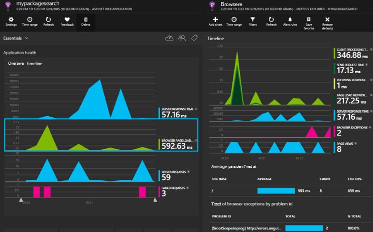

<properties 
    pageTitle="Programmet indsigt til ASP.NET Core" 
    description="Overvåge webprogrammer for tilgængelighed, ydeevne og brug." 
    services="application-insights" 
    documentationCenter=".net"
    authors="alancameronwills" 
    manager="douge"/>

<tags 
    ms.service="application-insights" 
    ms.workload="tbd" 
    ms.tgt_pltfrm="ibiza" 
    ms.devlang="na" 
    ms.topic="article" 
    ms.date="08/30/2016" 
    ms.author="awills"/>

# Programmet indsigt til ASP.NET Core

[Visual Studio programmet indsigt](app-insights-overview.md) kan du overvåge webprogrammet for tilgængelighed, ydeevne og brug. Med den feedback, du får om ydeevne og effektivitet af din app vilde, kan du foretage dig informeret valg om retningen af designet i hver udviklingslivscyklus.

Du skal have et abonnement med [Microsoft Azure](http://azure.com). Logge på med en Microsoft-konto, som du muligvis nødt til Windows, XBox Live eller andre Microsofts skytjenester. Dit team kan have en organisations abonnement på Azure: Bed ejer om at føje dig til den med din Microsoft-konto.

## Kom godt i gang

Følg [vejledningen Introduktion](https://github.com/Microsoft/ApplicationInsights-aspnetcore/wiki/Getting-Started).

## Brug af programmet indsigt

Log på [Microsoft Azure-portalen](https://portal.azure.com) , og gå til ressourcen, du har oprettet for at overvåge din app.

Bruge din app til et stykke tid i et separat browservindue. Du får vist data, der vises i programmet indsigt diagrammer. (Du skal muligvis klikke på Opdater). Der vil være en lille mængde data, mens du udvikler, men disse diagrammer virkelig levende når du publicerer din app og har mange brugere. 

Oversigtssiden viser de ydeevne diagrammer, du er sandsynligvis interesseret i: serverens svartid, siden indlæsningstiden og optællinger for de mislykkede anmodninger. Klik på et diagram for at se flere diagrammer og data.

Visninger i portalen falder inden for to overordnede kategorier:

* [Målepunkter Explorer](app-insights-metrics-explorer.md) viser grafer og målepunkter og tæller som svar gange, manglende satser eller målepunkter selv oprette med [API](app-insights-api-custom-events-metrics.md). Filtrere og segment skal tildeles datatypen ved egenskabsværdier for at få en bedre forståelse af din app og dens brugere.
* [Search Explorer](app-insights-diagnostic-search.md) viser individuelle hændelser, som specifikke anmodninger, undtagelser, log sporinger eller hændelser, du selv har oprettet med [API](app-insights-api-custom-events-metrics.md). Filtrere og søge i hændelserne, og navigere mellem relaterede hændelser, der skal Undersøg problemer.
* [Analyser](app-insights-analytics.md) kan du køre synes godt om SQL-forespørgsler over din telemetri og er et effektivt værktøj analytical og diagnosticering.

## Beskeder

* Får du automatisk [proaktiv diagnosticering beskeder](app-insights-proactive-diagnostics.md) , der fortæller dig om uoverensstemmende ændringer i manglende satser og anden metrik.
* Konfigurere [tilgængeligheden test](app-insights-monitor-web-app-availability.md) til at teste webstedet kontinuerligt fra placeringer i hele verden, og få mails, så snart en hvilken som helst test mislykkes.
* Konfigurere [metriske beskeder](app-insights-monitor-web-app-availability.md) til at vide, hvis målepunkter som svar gange eller undtagelse satser gå uden for acceptable grænser.

## Få flere telemetri

* [Tilføj telemetri til dine websider](app-insights-javascript.md) til at overvåge siden brugen og ydeevne.
* [Overvåge afhængigheder](app-insights-dependencies.md) at se, hvis RESTEN, SQL eller andre eksterne ressourcer langsommere du.
* [Brug API](app-insights-api-custom-events-metrics.md) til at sende din egen begivenheder og måleredskaber for en mere detaljeret visning af din app ydeevne og format.
* [Tilgængelighed test](app-insights-monitor-web-app-availability.md) kontrollere din app konstant fra hele verden. 

## Åbn kilde

[Læse og bidrage til koden](https://github.com/Microsoft/ApplicationInsights-aspnetcore#recent-updates)

