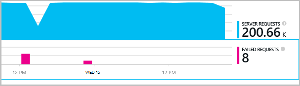

<properties 
    pageTitle="Afhængighed registrering i programmet indsigt" 
    description="Analysere brugen, tilgængelighed og ydeevnen i din lokale eller Microsoft Azure-webprogrammet med programmet indsigt." 
    services="application-insights" 
    documentationCenter=".net"
    authors="alancameronwills" 
    manager="douge"/>

<tags 
    ms.service="application-insights" 
    ms.workload="tbd" 
    ms.tgt_pltfrm="ibiza" 
    ms.devlang="na" 
    ms.topic="article" 
    ms.date="10/24/2016" 
    ms.author="awills"/>


# <a name="set-up-application-insights-dependency-tracking"></a>Konfigurere programmet indsigt: afhængighed registrering


[AZURE.INCLUDE [app-insights-selector-get-started-dotnet](../../includes/app-insights-selector-get-started-dotnet.md)]


En *afhængighed* er en ekstern komponent, der kaldes af din app. Det er normalt en tjeneste, der kaldes ved hjælp af HTTP, eller en database eller et filsystem. I Visual Studio programmet viden, kan du nemt se, hvor længe dit program venter afhængigheder, og hvor ofte en afhængighed kaldet mislykkes.


Out box afhængighed skærmen rapporterer aktuelt opkald til disse typer afhængigheder:

* ASP.NET
 * SQL-databaser
 * ASP.NET web og WCF-tjenester, der bruger HTTP-baseret bindinger
 * Lokal eller ekstern HTTP-opkald
 * Azure DocumentDb, tabel, blob-lager og kø
* Java
 * Opkald til en database via en [JDBC](http://docs.oracle.com/javase/7/docs/technotes/guides/jdbc/) driver, som MySQL, SQL Server, PostgreSQL eller SQLite.
* JavaScript på websider - [webside SDK](app-insights-javascript.md) automatisk registreres Ajax opkald som afhængigheder.

Du kan skrive din egen SDK opkald til at overvåge andre afhængigheder, ved hjælp af [TrackDependency API](app-insights-api-custom-events-metrics.md#track-dependency).


## <a name="to-set-up-dependency-monitoring"></a>Konfigurere overvågning af afhængighed

Du skal bruge et [Microsoft Azure](http://azure.com) -abonnement.

### <a name="if-your-app-runs-on-your-iis-server"></a>Hvis din app kører på din IIS-server

Hvis din online kører på .NET 4.6 eller nyere, kan du enten [installere programmet indsigt SDK](app-insights-asp-net.md) i din app eller installere programmet indsigt Status skærm. Du behøver ikke begge dele.

Ellers skal du installere programmet indsigt Status skærm på serveren:

1. På din IIS webserver, logon med administratorrettigheder.
2. Hente og køre [Status skærm installer](http://go.microsoft.com/fwlink/?LinkId=506648).
4. Log på Microsoft Azure i installationsguiden.

    

    *Forbindelsesfejl? Se [fejlfinding](#troubleshooting).*

5. Vælg den installerede webprogram eller websted, som du vil overvåge, og derefter konfigurere den ressource, hvor du vil se resultaterne i portalen programmet indsigt.

    

    Normalt, du vælger at konfigurere en ny ressource og [ressourcegruppe][roles].

    Ellers skal bruge en eksisterende ressource, hvis du allerede konfigureret [web tester] [ availability] for dit websted eller [webklient overvågning][client].

6. Genstarte IIS.

    

    Din webtjeneste afbrydes for kort tid.

6. Bemærk, at ApplicationInsights.config er blevet indsat i web-apps, du vil overvåge.

    

   Der er også nogle ændringer i web.config.

#### <a name="want-to-reconfigure-later"></a>Vil du konfigurere senere (ad)?

Når du har afsluttet guiden, kan du konfigurere agenten igen, når du vil. Du kan også bruge dette, hvis du har installeret agenten, men der er nogle problemer med den indledende installation.


### <a name="if-your-app-runs-as-an-azure-web-app"></a>Hvis din app kører som en Azure Web App

Tilføj filtypenavnet programmet indsigt i Kontrolpanel af din Azure Web App.


### <a name="if-its-an-azure-cloud-services-project"></a>Hvis det er et Azure cloud services-projekt

[Tilføje scripts til internettet og arbejder roller](app-insights-cloudservices.md#dependencies). Eller [installere .NET framework 4.6 eller nyere](../cloud-services/cloud-services-dotnet-install-dotnet.md).

## <a name="diagnosis"></a>Diagnosticere problemer med ydeevnen afhængighed

Åbne bladet ydeevne for at vurdere ydeevnen for anmodninger på din server, og Rul ned til Kig på gitter af anmodninger om:


Den øverste, der tager meget lang tid. Lad os se, hvis vi kan finde ud af, hvor den tid.

Klik på rækken for at få vist individuel anmodning hændelser:


Klik på en hvilken som helst længerevarende forekomst for at undersøge det yderligere.

Rul ned til de ekstern afhængighed-opkald, der er relateret til denne anmodning:


Det ser ud som de fleste af de tid vedligeholdelse anmodningen blev brugt i et opkald til en lokal tjeneste. 


Markér rækken til at få flere oplysninger:


Detaljerne indeholder tilstrækkelige oplysninger til at undersøge problemet.


Ingen afhængighed opkaldet er lang tid i et andet tilfælde, men ved at skifte til tidslinjevisningen, kan vi se, hvor der opstod forsinkelsen i vores interne behandling:


## <a name="failures"></a>Fejl

Hvis der er mislykkede anmodninger skal du klikke på diagrammet.



Klik dig gennem en anmodning om type og anmodning om forekomst, til at finde et mislykkedes opkald til en ekstern afhængighed.


## <a name="custom-dependency-tracking"></a>Brugerdefineret afhængighed registrering

Afhængighed til sporing af standardmodul opdager automatisk eksterne afhængigheder som databaser og REST API'er. Men ønsker du måske nogle yderligere komponenter skal behandles på samme måde. 

Du kan skrive programkode, der sender oplysninger om afhængighed, ved hjælp af den samme [TrackDependency API](app-insights-api-custom-events-metrics.md#track-dependency) , der bruges af de almindelige moduler.

Hvis du opretter din kode med en samling, som du ikke selv har skrevet dig selv, kan du samtidig alle opkald til det, at finde ud af hvilke bidrag til din svar tid. Hvis disse data, der vises i afhængighed diagrammerne i programmet viden, skal du sende det via `TrackDependency`.

```C#

            var startTime = DateTime.UtcNow;
            var timer = System.Diagnostics.Stopwatch.StartNew();
            try
            {
                success = dependency.Call();
            }
            finally
            {
                timer.Stop();
                telemetry.TrackDependency("myDependency", "myCall", startTime, timer.Elapsed, success);
            }
```

Hvis du vil skifte fra modulet standard afhængighed sporing, skal du fjerne referencen til DependencyTrackingTelemetryModule i [ApplicationInsights.config](app-insights-configuration-with-applicationinsights-config.md).

## <a name="troubleshooting"></a>Fejlfinding i forbindelse med

*Afhængighed succes flag altid viser enten true eller false.*

* Opgradere til den nyeste version af SDK. Hvis din .NET version er mindre end 4.6, skal du installere [Status skærm](app-insights-monitor-performance-live-website-now.md).

## <a name="next-steps"></a>Næste trin

- [Undtagelser](app-insights-asp-net-exceptions.md)
- [Bruger og data][client]
- [Tilgængelighed](app-insights-monitor-web-app-availability.md)


<!--Link references-->

[api]: app-insights-api-custom-events-metrics.md
[apikey]: app-insights-api-custom-events-metrics.md#ikey
[availability]: app-insights-monitor-web-app-availability.md
[azure]: ../insights-perf-analytics.md
[client]: app-insights-javascript.md
[diagnostic]: app-insights-diagnostic-search.md
[metrics]: app-insights-metrics-explorer.md
[netlogs]: app-insights-asp-net-trace-logs.md
[portal]: http://portal.azure.com/
[qna]: app-insights-troubleshoot-faq.md
[redfield]: app-insights-asp-net-dependencies.md
[roles]: app-insights-resources-roles-access-control.md

 
