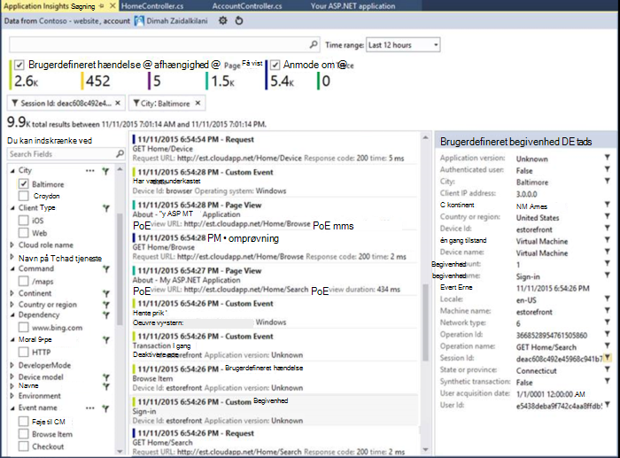
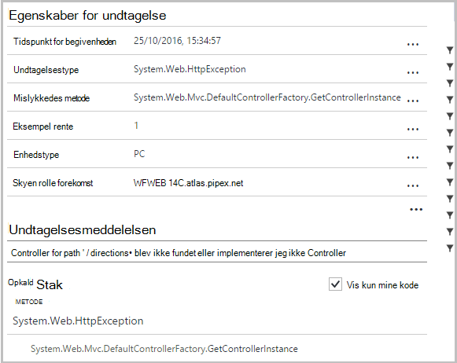
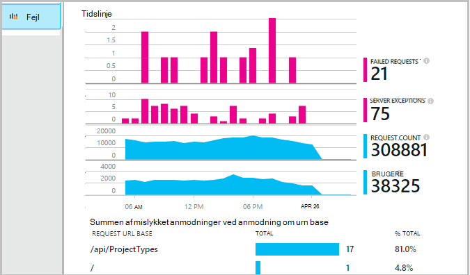
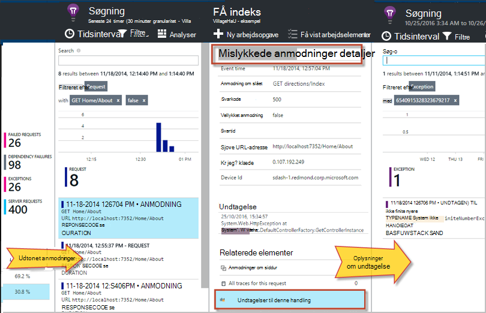
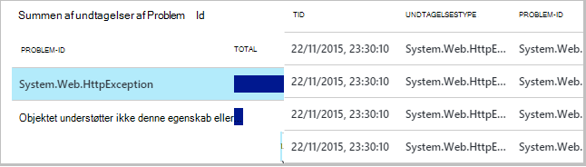
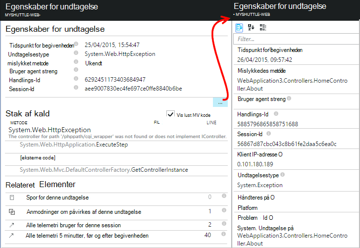
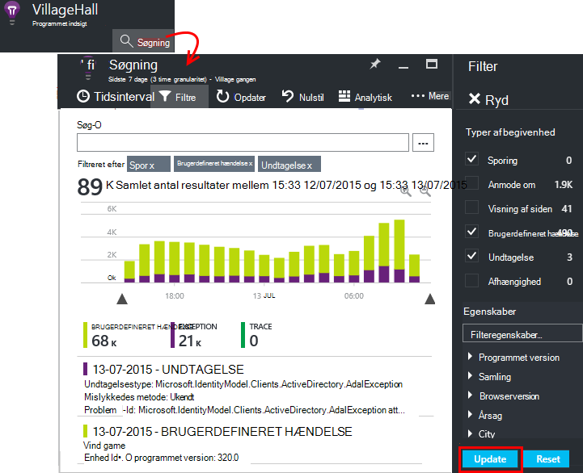
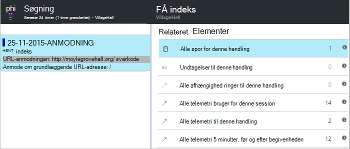

<properties 
    pageTitle="Diagnosticere fejl og undtagelser i ASP.NET-apps med programmet indsigt" 
    description="Registrere undtagelser fra ASP.NET-apps sammen med anmodning om telemetri." 
    services="application-insights" 
    documentationCenter=".net"
    authors="alancameronwills" 
    manager="douge"/>

<tags 
    ms.service="application-insights" 
    ms.workload="tbd" 
    ms.tgt_pltfrm="ibiza" 
    ms.devlang="na" 
    ms.topic="article" 
    ms.date="10/27/2016" 
    ms.author="awills"/>


# <a name="set-up-application-insights-diagnose-exceptions"></a>Konfigurere programmet indsigt: diagnosticere undtagelser

[AZURE.INCLUDE [app-insights-selector-get-started-dotnet](../../includes/app-insights-selector-get-started-dotnet.md)]


Ved at overvåge dit program med [Visual Studio programmet indsigt][start], du kan justere mislykkede anmodninger med undtagelser og andre begivenheder på både klienten og serveren, så du kan hurtigt diagnosticere årsagerne.

Hvis du vil overvåge en ASP.NET-app, du skal [tilføje programmet indsigt SDK] [ greenbrown] til programmet eller [installere Status skærm på din IIS-server][redfield], eller hvis din app er en Azure-WebApp, tilføje [Programmet indsigt filtypenavn](app-insights-azure-web-apps.md).

## <a name="diagnosing-exceptions-using-visual-studio"></a>Diagnosticere undtagelser ved hjælp af Visual Studio

Åbn app-løsning i Visual Studio med hjælp til fejlfinding.

Køre appen, skal du enten på din server eller på computeren udvikling ved hjælp af F5.

Åbn vinduet programmet indsigt Søg i Visual Studio, og indstille den til at vise begivenheder fra din app. Mens du fejlfinding, kan du gøre dette ved at klikke på knappen programmet indsigt.



Bemærk, at du kan filtrere rapporten for at vise kun undtagelser. 

*Ingen undtagelser, der viser? Se [registrere undtagelser](#exceptions).*

Klik på en for undtagelsesrapport for at vise dens staksporing.



Klik på en linje reference i stablen sporingen, til at åbne den ønskede fil.  

## <a name="diagnosing-failures-using-the-azure-portal"></a>Diagnosticering af fejl ved hjælp af portalen Azure

Fra programmet indsigt oversigt over din app, kan du se diagrammer over undtagelser og mislykkedes HTTP-anmodninger, sammen med en liste over anmodningen feltet mislykkede forsøg på URL-adresser, der kan medføre hyppigste mislykkede forsøg.



Klik dig gennem en af typerne mislykkede anmodninger på listen for at få adgang til individuelle forekomster af fejlen. Klik på gennem til undtagelserne eller sporingsdata tilknyttet derfra:




**Alternativt** kan du starte fra listen over undtagelser, du vil finde længere nede bladet mislykkede forsøg. Bevar at klikke på, indtil du kommer til sidst på de enkelte undtagelser.




*Ingen undtagelser, der viser? Se [registrere undtagelser](#exceptions).*

Derfra kan du se på staksporing og detaljerede egenskaber for hver undtagelse og finde relaterede log sporing eller andre begivenheder.




[Få flere oplysninger om diagnosticering Søg][diagnostic].


## <a name="dependency-failures"></a>Afhængighed af fejl

En *afhængighed* er en tjeneste, som dit program kalder, typisk via en REST-API eller database-forbindelse. [Programmet indsigt Status skærm] [ redfield] overvåger automatisk en række forskellige typer afhængighed opkaldet, skal du måling opkaldsvarighed og lykkes eller mislykkes. 

For at få afhængighed data, du skal [installere Status skærm] [ redfield] på din IIS-server, eller hvis din app er en Azure Web App, kan du bruge [Programmet indsigt filtypenavn](app-insights-azure-web-apps.md). 

Mislykkedes opkald til afhængigheder, findes på bladet fejl, og du kan også finde dem under relaterede elementer i anmodning om oplysninger og detaljer om undtagelse.

*Ingen afhængighed fejl? Det er godt. Men for at bekræfte, at du får afhængighed data, åbne bladet ydeevne og se på afhængighed varighed diagrammet.*

 

## <a name="custom-tracing-and-log-data"></a>Brugerdefineret sporing, og logdata

For at få diagnosticering data, der er specifikke for din app, kan du indsætte kode for at sende din egen telemetridata. Dette vises i diagnosticering søgningen sammen med anmodningen, sidevisning og andre automatisk indsamles data. 

Har du forskellige valgmuligheder:

* [TrackEvent()](app-insights-api-custom-events-metrics.md#track-event) bruges typisk til at overvåge brugsmønstre, men de data, sender programmet også vises under brugerdefineret begivenheder i diagnosticering Søg. Hændelser navngives og kan udføre strengegenskaber og numeriske målepunkter, kan du [filtrere dine diagnosticering søgninger][diagnostic].
* [TrackTrace()](app-insights-api-custom-events-metrics.md#track-trace) kan du sende længere data som INDLÆG.
* [TrackException()](#exceptions) sender staksporinger. [Lær mere om undtagelser](#exceptions).
* Hvis du allerede bruger et logføring framework såsom Log4Net eller NLog, kan du [registrere disse logfiler] [ netlogs] og se dem i diagnosticering Søg sammen med anmodningen og undtagelse data.

For at se disse hændelser skal du åbne [søgning i][diagnostic], åbne Filter, og vælg derefter brugerdefineret begivenhed, sporing eller undtagelse.





> [AZURE.NOTE] Hvis din app genererer en masse telemetri, vil modulet tilpasset udvalg automatisk reducere lydstyrken, der sendes til portalen ved at sende en repræsentant brøkdel af begivenheder. Hændelser, der er en del af den samme handling markeres eller ikke er markeret som en gruppe, så du kan navigere mellem relaterede begivenheder. [Få mere at vide om udvalg.](app-insights-sampling.md)

### <a name="how-to-see-request-post-data"></a>Sådan får du vist anmodning om INDLÆG data

Anmodning om oplysninger indeholder ikke de data, der er sendt til din app i et INDLÆG opkald. Sådan har disse data vises:

* [Installere SDK] [ greenbrown] i projektet programmet på computeren.
* Indsætte kode i dit program til at ringe til [Microsoft.ApplicationInsights.TrackTrace()][api]. Sende INDLÆG dataene i parameteren meddelelse. Er der en grænse for den tilladte størrelse, så du skal prøve at sende de vigtige data.
* Når du undersøge et mislykkede anmodninger, skal du finde de tilknyttede sporinger.  




## <a name="exceptions"></a>Hente undtagelser og relaterede diagnosticering data

I første, kan ikke du se i portalen alle de undtagelser, der kan medføre fejl i din app. Du får vist en hvilken som helst browser undtagelser (Hvis du bruger [JavaScript SDK] [ client] på dine websider). Men undtagelser for de fleste er taget af IIS, og du skal skrive lidt af kode for at få dem vist.

Du kan:

* **Log undtagelser eksplicit** ved at indsætte kode i undtagelse programmer til at rapportere undtagelserne.
* **Hent undtagelser automatisk** ved at konfigurere din ASP.NET framework. De nødvendige tilføjelser er forskellige for forskellige typer framework.

## <a name="reporting-exceptions-explicitly"></a>Rapportering undtagelser eksplicit

Den nemmeste måde er at indsætte et opkald til TrackException() i en undtagelsesbehandler.

JavaScript

    try 
    { ...
    }
    catch (ex)
    {
      appInsights.trackException(ex, "handler loc",
        {Game: currentGame.Name, 
         State: currentGame.State.ToString()});
    }

C#

    var telemetry = new TelemetryClient();
    ...
    try 
    { ...
    }
    catch (Exception ex)
    {
       // Set up some properties:
       var properties = new Dictionary <string, string> 
         {{"Game", currentGame.Name}};

       var measurements = new Dictionary <string, double>
         {{"Users", currentGame.Users.Count}};

       // Send the exception telemetry:
       telemetry.TrackException(ex, properties, measurements);
    }

VB

    Dim telemetry = New TelemetryClient
    ...
    Try
      ...
    Catch ex as Exception
      ' Set up some properties:
      Dim properties = New Dictionary (Of String, String)
      properties.Add("Game", currentGame.Name)

      Dim measurements = New Dictionary (Of String, Double)
      measurements.Add("Users", currentGame.Users.Count)
  
      ' Send the exception telemetry:
      telemetry.TrackException(ex, properties, measurements)
    End Try

Parametrene egenskaber og mål er valgfrit, men er nyttige til [filtrering og tilføje] [ diagnostic] yderligere oplysninger. Hvis du har en app, som kan køre flere spil, kan du finde alle de undtagelse-rapporter, der er relateret til en bestemt game. Du kan tilføje lige så mange elementer, som du gerne hver ordbog.

## <a name="browser-exceptions"></a>Browser undtagelser

De fleste browser undtagelser rapporteres.

Hvis din webside omfatter scriptfiler fra netværk til levering af indhold eller andre domæner, sikre, at din script mærke har attributten ```crossorigin="anonymous"```, og at serveren sender [CORS sidehoveder](http://enable-cors.org/). Dette gør det muligt at få en staksporing og detaljer for ikke-afviklet JavaScript undtagelser fra disse ressourcer.

## <a name="web-forms"></a>Web-formularer

I webformularer kunne HTTP-modulet indsamle undtagelserne, når der er ingen omdirigeringer, der er konfigureret med CustomErrors.

Men hvis du har aktive omdirigeringer, kan du tilføje følgende linjer til funktionen Application_Error i Global.asax.cs. (Tilføj filen Global.asax, hvis du ikke allerede har en.)

*C#*

    void Application_Error(object sender, EventArgs e)
    {
      if (HttpContext.Current.IsCustomErrorEnabled && Server.GetLastError  () != null)
      {
         var ai = new TelemetryClient(); // or re-use an existing instance

         ai.TrackException(Server.GetLastError());
      }
    }


## <a name="mvc"></a>MVC

Hvis [CustomErrors](https://msdn.microsoft.com/library/h0hfz6fc.aspx) konfigurationen er `Off`, vil nu være tilgængelige for [HTTP-modul](https://msdn.microsoft.com/library/ms178468.aspx) til at indsamle undtagelser. Men hvis det er `RemoteOnly` (standard), eller `On`, og klik derefter på undtagelse er ikke markeret og ikke tilgængeligt for programmet indsigt til at indsamle automatisk. Du kan løse, ved at tilsidesætte [System.Web.Mvc.HandleErrorAttribute klasse](http://msdn.microsoft.com/library/system.web.mvc.handleerrorattribute.aspx)og anvende klassen tilsidesat, som vist i de forskellige MVC versioner under ([github kilde](https://github.com/AppInsightsSamples/Mvc2UnhandledExceptions/blob/master/MVC2App/Controllers/AiHandleErrorAttribute.cs)):

    using System;
    using System.Web.Mvc;
    using Microsoft.ApplicationInsights;

    namespace MVC2App.Controllers
    {
      [AttributeUsage(AttributeTargets.Class | AttributeTargets.Method, Inherited = true, AllowMultiple = true)] 
      public class AiHandleErrorAttribute : HandleErrorAttribute
      {
        public override void OnException(ExceptionContext filterContext)
        {
            if (filterContext != null && filterContext.HttpContext != null && filterContext.Exception != null)
            {
                //If customError is Off, then AI HTTPModule will report the exception
                if (filterContext.HttpContext.IsCustomErrorEnabled)
                {   //or reuse instance (recommended!). see note above  
                    var ai = new TelemetryClient();
                    ai.TrackException(filterContext.Exception);
                } 
            }
            base.OnException(filterContext);
        }
      }
    }

#### <a name="mvc-2"></a>MVC 2

Erstat attributten HandleError med din nye attributter i dine enheder.

    namespace MVC2App.Controllers
    {
       [AiHandleError]
       public class HomeController : Controller
       {
    ...

[Eksempel](https://github.com/AppInsightsSamples/Mvc2UnhandledExceptions)

#### <a name="mvc-3"></a>MVC 3

Registrere `AiHandleErrorAttribute` som et globalt filter i Global.asax.cs:

    public class MyMvcApplication : System.Web.HttpApplication
    {
      public static void RegisterGlobalFilters(GlobalFilterCollection filters)
      {
         filters.Add(new AiHandleErrorAttribute());
      }
     ...

[Eksempel](https://github.com/AppInsightsSamples/Mvc3UnhandledExceptionTelemetry)


#### <a name="mvc-4-mvc5"></a>MVC 4, MVC5

Registrere AiHandleErrorAttribute som et globalt filter i FilterConfig.cs:

    public class FilterConfig
    {
      public static void RegisterGlobalFilters(GlobalFilterCollection filters)
      {
        // Default replaced with the override to track unhandled exceptions
        filters.Add(new AiHandleErrorAttribute());
      }
    }

[Eksempel](https://github.com/AppInsightsSamples/Mvc5UnhandledExceptionTelemetry)

## <a name="web-api-1x"></a>Web API 1.x


Tilsidesætte System.Web.Http.Filters.ExceptionFilterAttribute:

    using System.Web.Http.Filters;
    using Microsoft.ApplicationInsights;

    namespace WebAPI.App_Start
    {
      public class AiExceptionFilterAttribute : ExceptionFilterAttribute
      {
        public override void OnException(HttpActionExecutedContext actionExecutedContext)
        {
            if (actionExecutedContext != null && actionExecutedContext.Exception != null)
            {  //or reuse instance (recommended!). see note above 
                var ai = new TelemetryClient();
                ai.TrackException(actionExecutedContext.Exception);    
            }
            base.OnException(actionExecutedContext);
        }
      }
    }

Du kan tilføje denne tilsidesat attribut til bestemte enheder eller føje den til den globale filter konfiguration i klassen WebApiConfig: 

    using System.Web.Http;
    using WebApi1.x.App_Start;

    namespace WebApi1.x
    {
      public static class WebApiConfig
      {
        public static void Register(HttpConfiguration config)
        {
            config.Routes.MapHttpRoute(name: "DefaultApi", routeTemplate: "api/{controller}/{id}",
                defaults: new { id = RouteParameter.Optional });
            ...
            config.EnableSystemDiagnosticsTracing();

            // Capture exceptions for Application Insights:
            config.Filters.Add(new AiExceptionFilterAttribute());
        }
      }
    }

[Eksempel](https://github.com/AppInsightsSamples/WebApi_1.x_UnhandledExceptions)

Der findes et antal sager, der ikke kan håndtere undtagelse filtre. Eksempel:

* Undtagelser fra controller konstruktører. 
* Undtagelser fra meddelelse programmer. 
* Undtagelser udløst under distribution. 
* Undtagelser under svar indhold serialiseringen. 

## <a name="web-api-2x"></a>Web API 2.x

Tilføje en implementering af IExceptionLogger:

    using System.Web.Http.ExceptionHandling;
    using Microsoft.ApplicationInsights;

    namespace ProductsAppPureWebAPI.App_Start
    {
      public class AiExceptionLogger : ExceptionLogger
      {
        public override void Log(ExceptionLoggerContext context)
        {
            if (context !=null && context.Exception != null)
            {//or reuse instance (recommended!). see note above 
                var ai = new TelemetryClient();
                ai.TrackException(context.Exception);
            }
            base.Log(context);
        }
      }
    }

Tilføje denne værdi i tjenesterne i WebApiConfig:

    using System.Web.Http;
    using System.Web.Http.ExceptionHandling;
    using ProductsAppPureWebAPI.App_Start;

    namespace WebApi2WithMVC
    {
      public static class WebApiConfig
      {
        public static void Register(HttpConfiguration config)
        {
            // Web API configuration and services

            // Web API routes
            config.MapHttpAttributeRoutes();

            config.Routes.MapHttpRoute(
                name: "DefaultApi",
                routeTemplate: "api/{controller}/{id}",
                defaults: new { id = RouteParameter.Optional }
            );
            config.Services.Add(typeof(IExceptionLogger), new AiExceptionLogger()); 
        }
      }
  }

[Eksempel](https://github.com/AppInsightsSamples/WebApi_2.x_UnhandledExceptions)

Som alternativer kan du:

2. Erstat kun ExceptionHandler med en brugerdefineret installation af IExceptionHandler. Dette kaldes kun, når, som er stadig kan vælge, hvilke svar, der skal sendes (ikke når forbindelsen er afbrudt for eksempel) 
3. Undtagelse filtre (som beskrevet i afsnittet om Web API 1.x enheder ovenfor) - ikke kaldt i alle tilfælde.


## <a name="wcf"></a>WCF

Tilføje en klasse, der udvider attribut og implementerer IErrorHandler og IServiceBehavior.

    using System;
    using System.Collections.Generic;
    using System.Linq;
    using System.ServiceModel.Description;
    using System.ServiceModel.Dispatcher;
    using System.Web;
    using Microsoft.ApplicationInsights;

    namespace WcfService4.ErrorHandling
    {
      public class AiLogExceptionAttribute : Attribute, IErrorHandler, IServiceBehavior
      {
        public void AddBindingParameters(ServiceDescription serviceDescription,
            System.ServiceModel.ServiceHostBase serviceHostBase,
            System.Collections.ObjectModel.Collection<ServiceEndpoint> endpoints,
            System.ServiceModel.Channels.BindingParameterCollection bindingParameters)
        {
        }

        public void ApplyDispatchBehavior(ServiceDescription serviceDescription, 
            System.ServiceModel.ServiceHostBase serviceHostBase)
        {
            foreach (ChannelDispatcher disp in serviceHostBase.ChannelDispatchers)
            {
                disp.ErrorHandlers.Add(this);
            }
        }

        public void Validate(ServiceDescription serviceDescription, 
            System.ServiceModel.ServiceHostBase serviceHostBase)
        {
        }

        bool IErrorHandler.HandleError(Exception error)
        {//or reuse instance (recommended!). see note above 
            var ai = new TelemetryClient();

            ai.TrackException(error);
            return false;
        }

        void IErrorHandler.ProvideFault(Exception error, 
            System.ServiceModel.Channels.MessageVersion version, 
            ref System.ServiceModel.Channels.Message fault)
        {
        }
      }
    }

Føje attributten til service-installation:

    namespace WcfService4
    {
        [AiLogException]
        public class Service1 : IService1 
        { 
         ...

[Eksempel](https://github.com/AppInsightsSamples/WCFUnhandledExceptions)

## <a name="exception-performance-counters"></a>Undtagelse tællere i ydeevne

Hvis du har [installeret Status skærm] [ redfield] på din server, kan du få et diagram over undtagelser hastigheden målt af .NET. Dette omfatter både håndteret og ikke-afviklet .NET undtagelser.

Åbn en metrikværdi Explorer blade, tilføje et nyt diagram, og vælg **undtagelse rente**, der er angivet under tællere i ydeevne. 

.NET framework beregner rente ved tælle antallet af undtagelser i et interval og dividere med længden af intervallet. 

Bemærk, at det vil være forskellige fra 'Undtagelser' antallet beregnes af programmet indsigt portal ved at tælle TrackException rapporter. Intervallerne stikprøver, hvor der er forskellige, og i SDK sende ikke TrackException rapporter for alle håndteres og ikke-afviklet undtagelser.

<!--Link references-->

[api]: app-insights-api-custom-events-metrics.md
[client]: app-insights-javascript.md
[diagnostic]: app-insights-diagnostic-search.md
[greenbrown]: app-insights-asp-net.md
[netlogs]: app-insights-asp-net-trace-logs.md
[redfield]: app-insights-monitor-performance-live-website-now.md
[start]: app-insights-overview.md

 
