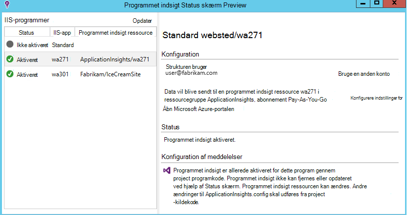
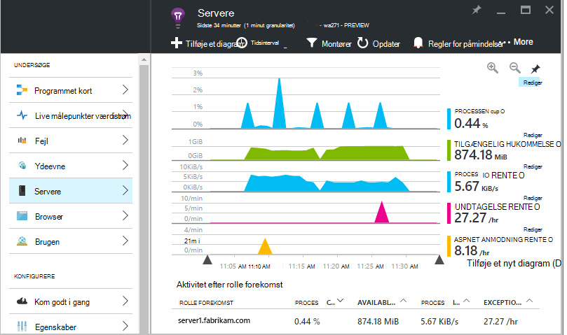
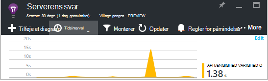
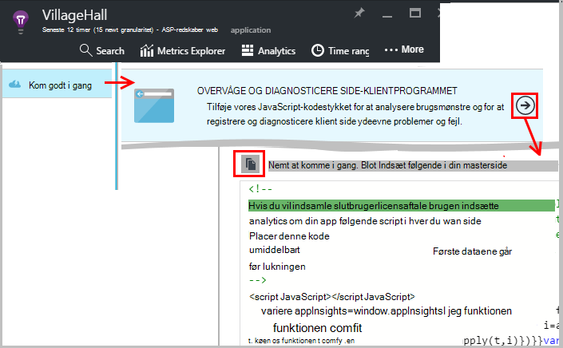
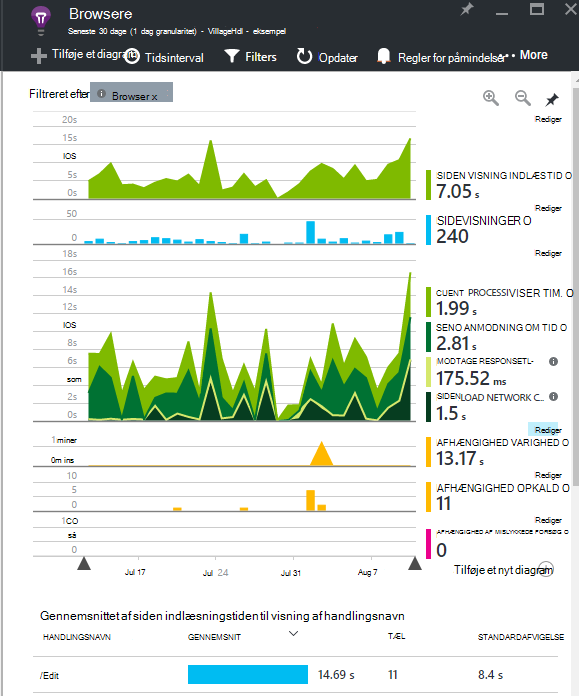
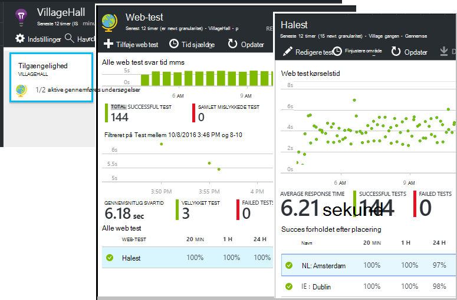
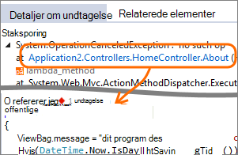
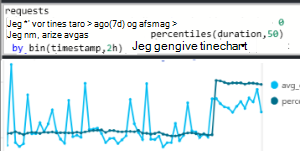
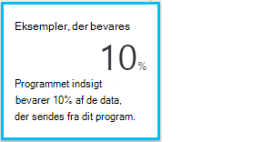

<properties 
    pageTitle="Få mere ud af programmet indsigt | Microsoft Azure" 
    description="Når du går i gang med programmet viden, er her en oversigt over de funktioner, du kan udforske." 
    services="application-insights" 
    documentationCenter=".net"
    authors="alancameronwills" 
    manager="douge"/>

<tags 
    ms.service="application-insights" 
    ms.workload="tbd" 
    ms.tgt_pltfrm="ibiza" 
    ms.devlang="na" 
    ms.topic="article" 
    ms.date="10/27/2016" 
    ms.author="awills"/>

# <a name="more-telemetry-from-application-insights"></a>Flere telemetri fra programmet indsigt

Når du har [tilføjet programmet indsigt i din ASP.NET-kode](app-insights-asp-net.md), er der et par ting, du kan gøre for at få endnu flere telemetri. 

## <a name="if-your-app-runs-on-your-iis-server-"></a>Hvis din app kører på din IIS-server...

Hvis din app er hostet på IIS-servere i din kontrolelement, skal du installere overvågning af programmet indsigt på servere. Hvis det allerede er installeret, behøver du ikke foretage dig noget.

1. Logge på med legitimationsoplysninger for administrator på hver IIS webserver.
2. Hente og køre [Status skærm installer](http://go.microsoft.com/fwlink/?LinkId=506648).
3. Log på Microsoft Azure i installationsguiden.

Du behøver ikke at gøre noget som helst, men du kan bekræfte, at overvågning er aktiveret for din app.



(Du kan også bruge Status skærm til at [aktivere overvågning på kørselstidspunktet](app-insights-monitor-performance-live-website-now.md), selvom du ikke har instrumentere dine apps i Visual Studio.)

### <a name="what-do-you-get"></a>Hvad får du?

Hvis Status skærm er installeret på din server-computere, får du nogle ekstra telemetri:

* Afhængighed telemetri (SQL-kald og RESTEN opkald foretages af din app) til .NET 4.5 apps. (Til senere versioner af .NET Status skærm er ikke påkrævet for afhængighed telemetri.) 
* Undtagelse staksporinger vist flere detaljer.
* Tællere i ydeevne. I programmet viden vises disse tællere i bladet servere. 



For at se flere eller færre tællere, [redigere diagrammerne](app-insights-metrics-explorer.md). Hvis tælleren ydeevne, du vil ikke i det tilgængelige sæt, kan du [føje den til det sæt, der indsamles via Ydelsestællermodulet](app-insights-performance-counters.md).

## <a name="if-its-an-azure-web-app-"></a>Hvis det er en Azure-WebApp...

Hvis din app kører som en Azure WebApp, gå til kontrolpanelet i Azure for den app eller VM, og Åbn bladet programmet indsigt. 

### <a name="what-do-you-get"></a>Hvad får du?

* Undtagelse staksporinger vist flere detaljer.
* Afhængighed telemetri (SQL-kald og RESTEN opkald foretages af din app) til .NET 4.5 apps. (Til senere versioner af .NET filtypenavnet er ikke påkrævet for afhængighed telemetri.) 



(Du kan også bruge denne metode til at [aktivere overvågning på kørselstidspunktet af ydeevnen](app-insights-monitor-performance-live-website-now.md), selvom du ikke har instrumentere din app i Visual Studio).

## <a name="client-side-monitoring"></a>Klientsiden overvågning

Du har installeret SDK, som sender telemetridata fra serveren (back-end) af dit program. Du kan nu føje klientsiden overvågning. Dette giver dig data med brugere, sessioner, sidevisninger og eventuelle undtagelser eller nedbrud, der forekommer i browseren. Du kan også skrive din egen programkode for at spore, hvordan brugerne arbejder med din app højre ned til det detaljerede niveau af Klik og tastetryk.

Føje programmet indsigt JavaScript-kodestykket til hver webside, for at få telemetri fra klientbrowsere.

1. Åbn programmet indsigt ressourcen for din app i Azure.
2. Åbn Introduktion, overvåge klientsiden, og Kopiér kodestykket.
3. Indsæt den, så den vises i overskriften af hver enkelt webside - typisk kan du gøre dette ved at indsætte på siden masterlayoutet.



Bemærk, at koden indeholder tasten instrumentation, der identificerer dine programmet ressource.

### <a name="what-do-you-get"></a>Hvad får du?

* Du kan skrive JavaScript for at sende [brugerdefinerede telemetri fra dine websider](app-insights-api-custom-events-metrics.md), for eksempel til at registrere knappen Klik.
* I [Analytics](app-insights-analytics.md), data i `pageViews` og AJAX data i `dependencies`. 
* [Klientydeevne og Brugsdata](app-insights-javascript.md) i bladet browsere.




[Lær mere om webside sporing.](app-insights-web-track-usage.md)


## <a name="track-application-version"></a>Registrer programmet version

Sørg for, at `buildinfo.config` genereres af MSBuild processen. Tilføj i filen som indeholder .csproj:  

```XML

    <PropertyGroup>
      <GenerateBuildInfoConfigFile>true</GenerateBuildInfoConfigFile>    <IncludeServerNameInBuildInfo>true</IncludeServerNameInBuildInfo>
    </PropertyGroup> 
```

Når det er build-oplysninger, føjes modulet programmet indsigt web automatisk **programmet version** som en egenskab til hver vare telemetri. Som gør det muligt at filtrere efter version, når du udfører [diagnosticering søgninger](app-insights-diagnostic-search.md) , eller når [udforske målepunkter](app-insights-metrics-explorer.md). 

Bemærk imidlertid, der oprettes versionsnummeret build kun ved MS Build ikke ved udvikler Opret i Visual Studio.


## <a name="availability-web-tests"></a>Tilgængelighed web test

Sende din online HTTP-anmodninger med jævne mellemrum fra hele verden. Vi besked dig, hvis svaret er langsom eller upålidelig.

Klik på feltet tilgængelighed for at tilføje, redigere og få vist web test i programmet indsigt ressourcen for din app.

Du kan tilføje flere test, der kører på flere steder.



[Lær mere](app-insights-monitor-web-app-availability.md)

## <a name="custom-telemetry-and-logging"></a>Brugerdefinerede telemetri og logføring

De programmet indsigt-pakker, som du har føjet til din kode giver en API, som du kan ringe til fra dit program.

* [Oprette dine egne begivenheder og målepunkter](app-insights-api-custom-events-metrics.md), for eksempel til antal business begivenheder eller Overvåg ydeevne.
* [Capture log sporinger](app-insights-asp-net-trace-logs.md) fra Log4Net, NLog eller System.Diagnostics.Trace.
* [Filter, ændre eller udvide](app-insights-api-filtering-sampling.md) den standard telemetri, der sendes fra din app ved at skrive Telemetri processorer. 


## <a name="powerful-analysis-and-presentation"></a>Effektiv dataanalyse og præsentation

Der er mange måder at udforske dine data. Hvis du har senest i gang med programmet viden, se følgende artikler:

||
|---|---
|[**Diagnosticering søgning for eksempel data**](app-insights-visual-studio.md)<br/>Søgning og filtrering begivenheder som anmodninger, undtagelser, afhængighed opkald, log sporinger og sidevisninger. Gå til kode fra staksporinger i Visual Studio.|
|[**Målepunkter Explorer til aggregerede data**](app-insights-metrics-explorer.md)<br/>Udforske, filtrere og segment skal tildeles aggregerede data som satser af anmodninger om fejl og undtagelser. svar klokkeslæt, sideindlæsningstider.|
|[**Dashboards**](app-insights-dashboards.md#dashboards)<br/>Indsamle data fra flere ressourcer og dele med andre. Fremragende til flere komponenter programmer og til fortløbende visning af team rummet.  |
|[**Live målepunkter værdistrøm**](app-insights-metrics-explorer.md#live-metrics-stream)<br/>Når du installerer et nyt build, kan du se disse nær-realtid indikatorer at sikre, at alt fungerer som forventet.|
|[**Analyser**](app-insights-analytics.md)<br/>Svar på svære spørgsmål om ydeevne og brug af din app ved hjælp af denne effektive forespørgselssprog.|
|[**Automatiske og manuelle beskeder**](app-insights-alerts.md)<br/>Automatisk beskeder tilpasse til din app normal mønstre af telemetri og udløser, når der er noget uden for det sædvanlige mønster. Du kan også konfigurere beskeder på bestemt niveauer af brugerdefineret eller standard målepunkter.|

## <a name="data-management"></a>Datastyring

|||
|---|---|
|[**Kontinuert Eksportér**](app-insights-export-telemetry.md)<br/>Kopiere alle telemetri i lagerplads, så du kan analysere din egen måde.|
|**Dataadgang API**<br/>Kommer snart.|
|[**Udvalg**](app-insights-sampling.md)<br/>Reducerer data rente og hjælper dig med at bevare inden for din priser niveau.|