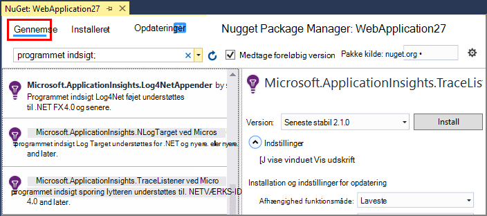
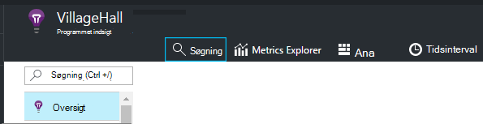
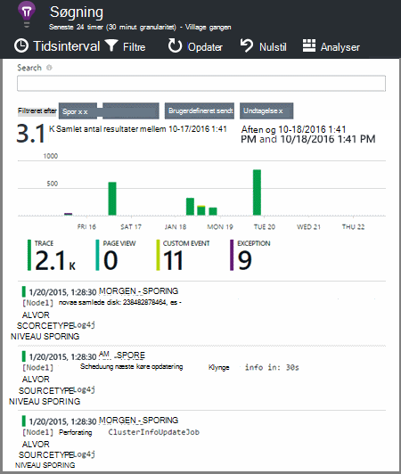

<properties 
    pageTitle="Udforske .NET spore logfiler i programmet indsigt" 
    description="Søge logfiler, der er oprettet med sporing, NLog eller Log4Net." 
    services="application-insights" 
    documentationCenter=".net"
    authors="alancameronwills" 
    manager="douge"/>

<tags 
    ms.service="application-insights" 
    ms.workload="tbd" 
    ms.tgt_pltfrm="ibiza" 
    ms.devlang="na" 
    ms.topic="article" 
    ms.date="07/21/2016" 
    ms.author="awills"/>
 
# <a name="explore-net-trace-logs-in-application-insights"></a>Udforske .NET spore logfiler i programmet indsigt  

Hvis du bruger NLog, log4Net eller System.Diagnostics.Trace til diagnosticering sporing af meddelelser i din ASP.NET-program, kan du få sendt til [Visual Studio programmet indsigt]logfilerne[start], hvor du kan udforske og søge i dem. Logfilerne flettes med de andre telemetri, der kommer fra dit program, så du kan identificere de sporinger, der er knyttet til vedligeholdelse hver brugeranmodning og koordinere dem med andre begivenheder og undtagelse rapporter.


> [AZURE.NOTE] Har du brug for modulet log capture? Det er en praktisk adapter til 3 tredjepart loggers, men hvis du ikke allerede bruger NLog, log4Net eller System.Diagnostics.Trace, kan du overveje at blot opkald [Programmet indsigt TrackTrace()](app-insights-api-custom-events-metrics.md#track-trace) direkte.


## <a name="install-logging-on-your-app"></a>Installere logger på din app

Installer din valgte logføring framework i projektet. Dette bør resultere i en indtastning i app.config eller web.config.

Hvis du bruger System.Diagnostics.Trace, skal du føje en post til web.config:

```XML

    <configuration>
     <system.diagnostics>
       <trace autoflush="false" indentsize="4">
         <listeners>
           <add name="myListener" 
             type="System.Diagnostics.TextWriterTraceListener" 
             initializeData="TextWriterOutput.log" />
           <remove name="Default" />
         </listeners>
       </trace>
     </system.diagnostics>
   </configuration>
```

## <a name="configure-application-insights-to-collect-logs"></a>Konfigurere programmet indsigt til indsamling af logfiler

Hvis du endnu ikke gjort, **[Tilføje programmet indsigt til projektet](app-insights-asp-net.md)** . Du får vist muligheden for at medtage log indsamler.

Eller **Konfigurere programmet indsigt** ved at højreklikke på dit projekt i Solution Explorer. Vælg indstillingen for at **konfigurere sporing af websteder**.

*Programmet indsigt menu eller log indsamler indstillingen ingen?* Fortsætte med [fejlfinding](#troubleshooting).


## <a name="manual-installation"></a>Manuel installation

Brug denne metode, hvis din projekttype ikke understøttes af programmet indsigt installationsprogram (for eksempel en Windows pc projekt). 

1. Hvis du planlægger at bruge log4Net eller NLog, kan du installere det i dit projekt. 
2. I Solution Explorer, skal du højreklikke på dit projekt, og vælg **Administrer NuGet pakker**.
3. Søg efter "Programmet indsigt"

    

4. Vælg den relevante pakke - en af:
  + Microsoft.ApplicationInsights.TraceListener (til hentning System.Diagnostics.Trace opkald)
  + Microsoft.ApplicationInsights.NLogTarget
  + Microsoft.ApplicationInsights.Log4NetAppender

Pakken NuGet installerer enheder som det er nødvendigt, og ændrer også web.config eller app.config.

## <a name="insert-diagnostic-log-calls"></a>Indsætte diagnosticeringsloggene opkald

Hvis du bruger System.Diagnostics.Trace, der ville være et typisk opkald:

    System.Diagnostics.Trace.TraceWarning("Slow response - database01");

Hvis du foretrækker log4net eller NLog:

    logger.Warn("Slow response - database01");


## <a name="using-the-trace-api-directly"></a>Brug af sporing API direkte

Du kan ringe til programmet indsigt sporet API direkte. Du kan bruge denne API logføring kort. 

Eksempel:

    var telemetry = new Microsoft.ApplicationInsights.TelemetryClient();
    telemetry.TrackTrace("Slow response - database01");

En fordel af TrackTrace er, at du kan anbringe relativt lange data i meddelelsen. Du kan for eksempel koder INDLÆG dataene der. 

Desuden kan du føje en prioritering til din meddelelse. Og som andre telemetri, kan du tilføje egenskabsværdier, som du kan bruge til at filtrere eller søge efter forskellige typer sporinger. Eksempel:


    var telemetry = new Microsoft.ApplicationInsights.TelemetryClient();
    telemetry.TrackTrace("Slow database response",
                   SeverityLevel.Warning,
                   new Dictionary<string,string> { {"database", db.ID} });

På denne måde kan du, i [Søg][diagnostic], til at filtrere nemt alle meddelelserne i en bestemt prioritering, der vedrører en bestemt database.

## <a name="explore-your-logs"></a>Udforske logfilerne

Køre din app, enten i fejlsikret tilstand eller installerer det direkte.

I din app oversigt blade i [portalen programmet indsigt][portal], Vælg [Søg][diagnostic].





Du kan for eksempel:

* Filtrere på log sporinger eller på elementer med bestemte egenskaber
* Undersøge et bestemt element i detaljer.
* Finde andre telemetri, der vedrører den samme brugeranmodning (det vil sige, med det samme OperationId) 
* Gemme konfigurationen af denne side som en favorit

> [AZURE.NOTE] **Udvalg.** Hvis dit program sender en stor mængde data, og du bruger programmet indsigt SDK til ASP.NET version 2.0.0-beta3 eller nyere, kan funktionen tilpasset udvalg betjene og send kun en procentdel af din telemetri. [Lær mere om udvalg.](app-insights-sampling.md)

## <a name="next-steps"></a>Næste trin

[Diagnosticere fejl og undtagelser i ASP.NET][exceptions]

[Få flere oplysninger om søgning][diagnostic].


## <a name="troubleshooting"></a>Fejlfinding i forbindelse med

### <a name="how-do-i-do-this-for-java"></a>Hvordan jeg gøre dette til Java?

Brug [Java log kort](app-insights-java-trace-logs.md).

### <a name="theres-no-application-insights-option-on-the-project-context-menu"></a>Der findes ingen programmet indsigt indstilling i menuen projekt kontekst

* Kontroller programmet indsigt værktøjer er installeret på computeren udvikling. Søg efter programmet indsigt værktøjer i Visual Studio-menuen værktøjer, filtypenavne og opdateringer. Hvis det ikke er i fanen installerede, Åbn fanen Online og installere den.
* Det kan være en type projekt, der ikke understøttes af programmet indsigt værktøjer. Bruge [manuel installation](#manual-installation).

### <a name="no-log-adapter-option-in-the-configuration-tool"></a>Indstillingen ingen log kortet i konfigurationsværktøjet

* Du skal installere logføring framework først.
* Hvis du bruger System.Diagnostics.Trace, skal du huske at [konfigureret det i `web.config` ](https://msdn.microsoft.com/library/system.diagnostics.eventlogtracelistener.aspx).
* Har du har den nyeste version af programmet indsigt værktøjer? Vælg **Extensions og opdateringer**i menuen Visual Studio **værktøjer** , og Åbn fanen **opdateringer** . Hvis programmet indsigt værktøjer, der findes, skal du klikke på for at opdatere den.


### <a name="emptykey"></a>Jeg får fejlen "Instrumentation nøgle må ikke være tom"

Ser ud til, du har installeret pakken logføring adapter Nuget uden at installere programmet indsigt.

I Solution Explorer, skal du højreklikke på `ApplicationInsights.config` , og vælg **Opdater programmet indsigt**. Du får vist en dialogboks, der inviterer dig til at logge på Azure og Opret enten et program indsigt ressource, eller brug et eksisterende dokument igen. Det skal løser problemet.

### <a name="i-can-see-traces-in-diagnostic-search-but-not-the-other-events"></a>Jeg kan se sporinger i diagnosticering søgning, men ikke på andre begivenheder

Nogle gange kan det tage et øjeblik, før alle begivenheder og anmodninger om at komme gennem en pipeline.

### <a name="limits"></a>Hvor meget data bevares?

Op til 500 begivenheder sekundet fra hvert program. Hændelser bevares til syv dage.

### <a name="im-not-seeing-some-of-the-log-entries-that-i-expect"></a>Jeg kan ikke se nogle af de logposter forventede

Hvis dit program sender en stor mængde data, og du bruger programmet indsigt SDK til ASP.NET version 2.0.0-beta3 eller nyere, kan funktionen tilpasset udvalg betjene og send kun en procentdel af din telemetri. [Lær mere om udvalg.](app-insights-sampling.md)

## <a name="add"></a>Næste trin

* [Konfigurere tilgængeligheden og svartid test][availability]
* [Fejlfinding i forbindelse med][qna]


<!--Link references-->

[availability]: app-insights-monitor-web-app-availability.md
[diagnostic]: app-insights-diagnostic-search.md
[exceptions]: app-insights-asp-net-exceptions.md
[portal]: https://portal.azure.com/
[qna]: app-insights-troubleshoot-faq.md
[start]: app-insights-overview.md

 
