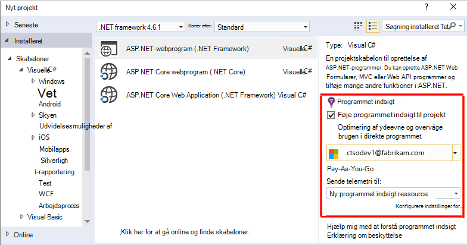
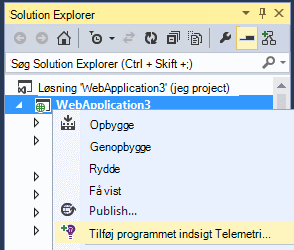
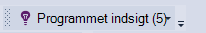
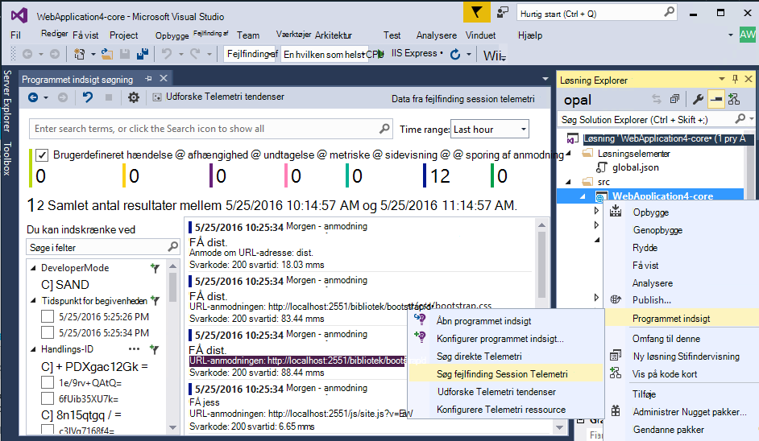
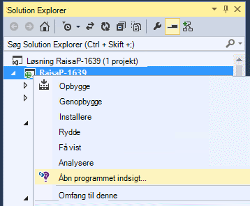
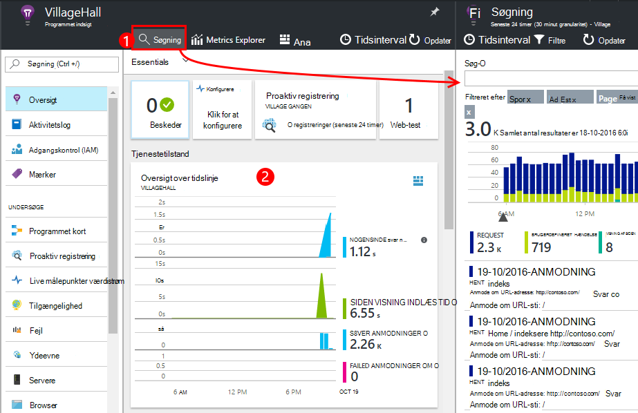
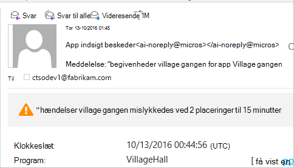
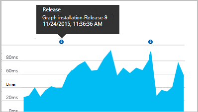
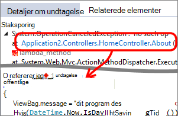
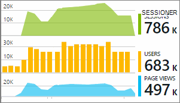

<properties 
    pageTitle="Konfigurere app Webanalyse til ASP.NET med programmet indsigt | Microsoft Azure" 
    description="Konfigurere ydeevne, tilgængelighed og brugsstatistik for webstedet ASP.NET hostet lokalt eller i Azure." 
    services="application-insights" 
    documentationCenter=".net"
    authors="NumberByColors" 
    manager="douge"/>

<tags 
    ms.service="application-insights" 
    ms.workload="tbd" 
    ms.tgt_pltfrm="ibiza" 
    ms.devlang="na" 
    ms.topic="get-started-article" 
    ms.date="10/13/2016" 
    ms.author="awills"/>


# <a name="set-up-application-insights-for-aspnet"></a>Konfigurere programmet indsigt til ASP.NET

[Visual Studio programmet indsigt](app-insights-overview.md) overvåger direkte programmet kan hjælpe dig med [at registrere og diagnosticere problemer med ydeevnen og undtagelser](app-insights-detect-triage-diagnose.md), og [se, hvordan din app bruges](app-insights-overview-usage.md).  Det fungerer for apps, der er hostet på din egen lokale IIS-servere eller skyen FOS samt Azure webapps.


## <a name="before-you-start"></a>Før du starter

Du har brug for:

* Visual Studio 2013 opdatering 3 eller nyere. Senere er bedre.
* Et abonnement på [Microsoft Azure](http://azure.com). Hvis dit team eller din organisation har et abonnement på Azure, kan ejeren føje dig til det, ved hjælp af din [Microsoft-konto](http://live.com). 

Der er alternativ artikler for at se på, hvis du er interesseret i at:

* [Instrumentering en web-app på kørselstidspunktet](app-insights-monitor-performance-live-website-now.md)
* [Azure-skytjenester](app-insights-cloudservices.md)

## <a name="ide"></a>1. Føj programmet indsigt SDK


### <a name="if-its-a-new-project"></a>Hvis det er et nyt projekt...

Kontrollér, at programmet indsigt er markeret, når du opretter et nyt projekt i Visual Studio. 





### <a name="-or-if-its-an-existing-project"></a>..., eller hvis det er et eksisterende projekt

Højreklik på projektet i Solution Explorer, og vælg **Tilføj programmet indsigt Telemetri** eller **Konfigurere programmet indsigt**.



* ASP.NET Core project? - [Skal du følge disse instruktioner for at løse et par kodelinjer](https://github.com/Microsoft/ApplicationInsights-aspnetcore/wiki/Getting-Started#add-application-insights-instrumentation-code-to-startupcs). 


## <a name="run"></a>2. Kør din app

Kør programmet med F5, og prøv det: åbne forskellige sider for at generere nogle telemetri.

I Visual Studio, skal se du en optælling af de hændelser, der er blevet gemt. 



## <a name="3-see-your-telemetry"></a>3. se din telemetri...

### <a name="-in-visual-studio"></a>… i Visual Studio

Åbn vinduet programmet indsigt i Visual Studio: enten klikke på knappen programmet viden, eller Højreklik på dit projekt i Solution Explorer:



Denne visning viser telemetri, der er oprettet i serversiden af din app. Eksperimentere med filtrene, og klik på en hvilken som helst begivenhed for at få vist flere detaljer.

[Få mere at vide om programmet indsigt værktøjer i Visual Studio](app-insights-visual-studio.md).

<a name="monitor"></a> 
### <a name="-in-the-portal"></a>… i portalen

Du kan også se telemetri på portalen programmet indsigt web, medmindre du vælger *Installere SDK kun* . 

Portalen har flere diagrammer, analytisk værktøjer og dashboards end Visual Studio. 


Åbn dit program indsigt ressource i [Azure-portalen](https://portal.azure.com/).



På portalen åbner på en visning af telemetri fra din app:

* Den første telemetri vises i [Live målepunkter Stream](app-insights-metrics-explorer.md#live-metrics-stream).
* Individuelle hændelser vises i **søgning** (1). Data kan tage et par minutter skal vises. Klik på en hvilken som helst begivenhed for at kunne se dens egenskaber. 
* Sammenlagt målepunkter vises i diagrammer (2). Det kan tage et minut eller to data vises her. Klik på et diagram for at åbne en blade med mere detaljeret.

[Få mere at vide mere om at bruge programmet indsigt i portalen Azure](app-insights-dashboards.md).

## <a name="4-publish-your-app"></a>4. publicere din app

Udgive din app til din IIS-server eller til Azure. Se [Live målepunkter Stream](app-insights-metrics-explorer.md#live-metrics-stream) at sikre, at alt kørende.

Du får vist din telemetri i portalen programmet viden, hvor du kan overvåge målepunkter, søge din telemetri og konfigurere [dashboards](app-insights-dashboards.md)at opbygge. Du kan også bruge de effektive [analyser forespørgsel sprog](app-insights-analytics.md) til at analysere brugen og ydeevne eller søge efter bestemte hændelser. 

Du kan også fortsætte med at analysere din telemetri i [Visual Studio](app-insights-visual-studio.md) med funktioner som diagnosticering Søg og [tendenser](app-insights-visual-studio-trends.md).

> [AZURE.NOTE] Hvis din app sender nok telemetri til at løse, [throttling begrænsninger](app-insights-pricing.md#limits-summary), skifter automatisk [udvalg](app-insights-sampling.md) . Stikprøver, hvor der reducerer antallet af telemetri, der sendes fra din app, og samtidig bevare forbundne data til diagnosticering.


##<a name="land"></a>Hvad 'Tilføj programmet indsigt'?

Programmet indsigt sender telemetri fra din app til portalen programmet indsigt (som er hostet i Microsoft Azure):


Så kommandoen har tre ting:

1. Føje programmet indsigt Web SDK NuGet pakken til projektet. Se den i Visual Studio, højreklik på dit projekt, og vælg Administrer NuGet pakker.
2. Oprette en ressource programmet indsigt i [portalen Azure](https://portal.azure.com/). Dette er, hvor du kan se dine data. Det henter *instrumentation nøgle,* som identificerer ressourcen.
3. Indsætter nøglen instrumentation i `ApplicationInsights.config`, så SDK kan sende telemetri til portalen.

Hvis du vil, kan du gøre disse trin manuelt for [ASP.NET 4](app-insights-windows-services.md) eller [ASP.NET Core](https://github.com/Microsoft/ApplicationInsights-aspnetcore/wiki/Getting-Started).

### <a name="to-upgrade-to-future-sdk-versions"></a>At opgradere til fremtidige versioner af SDK

Åbn NuGet pakke manager igen for at opgradere til en [ny version af SDK](https://github.com/Microsoft/ApplicationInsights-dotnet-server/releases), og filtrere efter installerede pakker. Vælg Microsoft.ApplicationInsights.Web og vælg opgraderingen.

Hvis du har foretaget eventuelle tilpasninger ApplicationInsights.config, kan du gemme en kopi af filen, før du opgraderer, og bagefter flette dine ændringer til den nye version.

## <a name="add-more-telemetry"></a>Tilføje flere telemetri

### <a name="web-pages-and-single-page-apps"></a>Websider og enkeltsidet apps

1. [Tilføj JavaScript-kodestykket](app-insights-javascript.md) på dine websider til lys browseren for og brugen blade med data om sidevisninger, indlæsningstider, browser undtagelser, AJAX opkald ydeevne på bruger- og session tæller.
2. [Kode brugerdefinerede hændelser](app-insights-api-custom-events-metrics.md) , der skal Tæl, klokkeslæt eller måling brugerhandlinger.

### <a name="dependencies-exceptions-and-performance-counters"></a>Afhængigheder, undtagelser og tællere i ydeevne

[Installere Status skærm](app-insights-monitor-performance-live-website-now.md) på hver af dine server maskiner, for at få yderligere telemetri om din app. Dette er, hvad du får:

* [Tællere i ydeevne](app-insights-performance-counters.md) - 
CPU, hukommelse, disk og andre tællere i ydeevne, om din app. 
* [Undtagelser](app-insights-asp-net-exceptions.md) - mere detaljeret telemetri for nogle undtagelser.
* [Afhængigheder](app-insights-asp-net-dependencies.md) - opkald til REST-API eller SQL tjenester. Finde ud af, om langsom svar ved eksterne komponenter forårsager problemer med ydeevnen i din app. (Hvis din app kører på .NET 4.6, behøver du Status skærm til at få denne telemetri.)

### <a name="diagnostic-code"></a>Diagnostiske kode

Har du problemer? Hvis du vil indsætte kode i din app til at hjælpe med at diagnosticere det, har du forskellige valgmuligheder:

* [Capture log sporinger](app-insights-asp-net-trace-logs.md): Hvis du allerede bruger Log4N, NLog eller System.Diagnostics.Trace til at logge sporing begivenheder og derefter output kan sendes til programmet viden, så du kan justere med anmodninger, søge i den og analysere den. 
* [Brugerdefinerede hændelser og målepunkter](app-insights-api-custom-events-metrics.md): Brug TrackEvent() og TrackMetric() i server eller webstedskode.
* [Tag telemetri med yderligere egenskaber](app-insights-api-filtering-sampling.md#add-properties)

Brug [Søg](app-insights-diagnostic-search.md) til at finde og koordinere bestemte begivenheder og [analyse](app-insights-analytics.md) til at udføre mere avancerede forespørgsler.

## <a name="alerts"></a>Beskeder

Vær først gerne vide, hvis din app problemer. (Ikke vente, indtil brugerne fortælle dig!) 

* [Opret web prøver](app-insights-monitor-web-app-availability.md) at sikre, at webstedet kan ses på internettet.
* [Proaktiv diagnosticering](app-insights-proactive-diagnostics.md) køres automatisk (Hvis din app har et bestemt minimum af trafik). Du behøver ikke at gøre noget for at konfigurere dem. De fortælle dig, hvis din app har en usædvanlige antal mislykkede anmodninger.
* [Angive metriske beskeder](app-insights-alerts.md) til at advare dig, hvis en metrikværdi krydser en grænseværdi. Du kan angive dem på brugerdefinerede målepunkter du koden i din app.

Som standard sendes påmindelser til ejeren af Azure-abonnement. 



## <a name="version-and-release-tracking"></a>Version og udgave registrering

### <a name="track-application-version"></a>Registrer programmet version

Sørg for, at `buildinfo.config` genereres af MSBuild processen. Tilføj i filen som indeholder .csproj:  

```XML

    <PropertyGroup>
      <GenerateBuildInfoConfigFile>true</GenerateBuildInfoConfigFile>    <IncludeServerNameInBuildInfo>true</IncludeServerNameInBuildInfo>
    </PropertyGroup> 
```

Når det er build-oplysninger, føjes modulet programmet indsigt web automatisk **programmet version** som en egenskab til hver vare telemetri. Som gør det muligt at filtrere efter version, når du udfører [diagnosticering søgninger](app-insights-diagnostic-search.md) , eller når [udforske målepunkter](app-insights-metrics-explorer.md). 

Bemærk imidlertid, der oprettes versionsnummeret build kun ved MS Build ikke ved udvikler Opret i Visual Studio.

### <a name="release-annotations"></a>Slip anmærkninger

Hvis du bruger Visual Studio Team Services, kan du [få en anmærkning markør](app-insights-annotations.md) føjet til dine diagrammer, når du slipper en ny version.




## <a name="next-steps"></a>Næste trin

| | 
|---|---
|**[Arbejde med programmet indsigt i Visual Studio](app-insights-visual-studio.md)**<br/>Fejlfinding med telemetri, diagnosticering søge efter, detaljeadgang til kode.|
|**[Arbejde med portalen programmet indsigt](app-insights-dashboards.md)**<br/>Dashboards, effektive diagnosticerings- og analytisk værktøjer, beskeder, en direkte afhængighed kort over dine programmer og telemetri eksportere. |
|**[Tilføje flere data](app-insights-asp-net-more.md)**<br/>Overvåge brugen, tilgængelighed, afhængigheder, undtagelser. Integrere sporinger fra logføring strukturer. Skrive brugerdefinerede telemetri. | 


