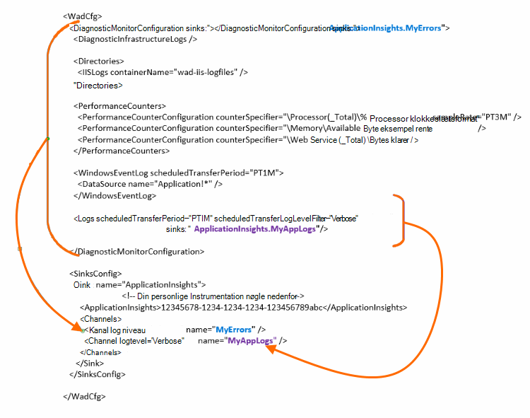

<properties
    pageTitle="Send logge til diagnosticering til Azure til programmet indsigt"
    description="Konfigurere oplysninger om diagnosticeringslogfiler Azure Cloud Services, som sendes til portalen programmet indsigt."
    services="application-insights"
    documentationCenter=".net"
    authors="sbtron"
    manager="douge"/>

<tags
    ms.service="application-insights"
    ms.workload="tbd"
    ms.tgt_pltfrm="ibiza"
    ms.devlang="na"
    ms.topic="article"
    ms.date="11/17/2015"
    ms.author="awills"/>

# <a name="configure-azure-diagnostic-logging-to-application-insights"></a>Konfigurere logføring af diagnostik til Azure til programmet indsigt

Når du konfigurerer et Cloud Services-projekt eller en virtuel maskine i Microsoft Azure, [Azure kan generere en diagnosticeringsloggene](../vs-azure-tools-diagnostics-for-cloud-services-and-virtual-machines.md). Du kan have dette sendt programmet viden, så du kan analysere dem sammen med diagnostic for og brugen telemetri, der sendes fra App af programmet indsigt SDK. Azure loggen indeholder begivenheder for administration af app som start, stop, går ned, såvel som tællere i ydeevne. Loggen indeholder også opkald i appen til System.Diagnostics.Trace.

I denne artikel beskrives konfigurationen af diagnosticering hentningen detaljeret.

Du skal bruge Azure SDK 2,8 installeret i Visual Studio.

## <a name="get-an-application-insights-resource"></a>Få en programmet indsigt ressource

Til den bedste oplevelse, [tilføje programmet indsigt SDK til de enkelte roller af din Cloud Services-app](app-insights-cloudservices.md)eller [til uanset hvilken app du kører i din VM](app-insights-overview.md). Du kan derefter sende diagnosticering dataene til at analysere og vises den samme ressource programmet indsigt.

Du kan også hvis du ikke vil bruge i SDK - kan eksempelvis hvis appen er allerede live - du kun [oprette en ny programmet indsigt ressource](app-insights-create-new-resource.md) i portalen Azure. Vælg **Azure diagnosticering** som programtypen.


## <a name="send-azure-diagnostics-to-application-insights"></a>Sende Azure diagnosticering til programmet indsigt

Hvis du er muligt at opdatere projektet app, derefter i Visual Studio markere hver rolle, vælge dens egenskaber, og vælg **Send diagnosticering til programmet indsigt**i fanen konfiguration.

Hvis din app er allerede direkte, kan du bruge Visual Studio Server Explorer eller Cloud Services Stifinder til at åbne egenskaberne for appen. Vælg **Send diagnosticering til programmet indsigt**.

I begge tilfælde bliver du bedt om flere oplysninger om programmet indsigt ressourcen du har oprettet.

[Få mere at vide om konfiguration af programmet indsigt til en Cloud Services-app](app-insights-cloudservices.md).

## <a name="configuring-the-azure-diagnostics-adapter"></a>Konfiguration af kortet Azure diagnosticering

Skrivebeskyttet på hvis du vil markere delene af den logfil, du sender til programmet indsigt. Som standard alt er sendt, herunder: Microsoft Azure arrangementer tællere i ydeevne; spore opkald fra app til System.Diagnostics.Trace.

Azure diagnosticering gemmer dine data til Azure-lager tabeller. Dog kan du også pipe alle eller et undersæt af data til programmet indsigt ved at konfigurere "sinks" og "kanaler" i konfigurationen, når du bruger Azure diagnosticering lokalnummer 1.5 eller nyere.

### <a name="configure-application-insights-as-a-sink"></a>Konfigurere programmet indsigt som en Sink

Når du bruger egenskaberne rolle til at angive "Send data til programmet indsigt", i Azure SDK (2,8 eller nyere) tilføjer en `<SinksConfig>` elementet til den offentlige [Azure diagnosticering konfigurationsfil](https://msdn.microsoft.com/library/azure/dn782207.aspx) af rollen.

`<SinksConfig>`definerer yderligere sink hvor Azure diagnosticering data kan sendes.  Et eksempel `SinksConfig` ser sådan ud:

```xml

    <SinksConfig>
     <Sink name="ApplicationInsights">
      <ApplicationInsights>{Insert InstrumentationKey}</ApplicationInsights>
      <Channels>
        <Channel logLevel="Error" name="MyTopDiagData"  />
        <Channel logLevel="Verbose" name="MyLogData"  />
      </Channels>
     </Sink>
    </SinksConfig>

```

Den `ApplicationInsights` element angiver tasten instrumentation som identificerer programmet indsigt ressourcen, sendes Azure diagnosticering dataene. Når du vælger ressourcen, den udfyldes automatisk baseret på den `APPINSIGHTS_INSTRUMENTATIONKEY` tjenestekonfiguration. (Få tasten Essentials-rullemenuen på ressourcen, hvis du vil angive den manuelt,).

`Channels`Definer de data, som sendes til sink. Kanalen fungerer som et filter. Den `loglevel` attribut kan du angive den logføringsniveau, som sender kanalen. Værdier er tilgængelige: `{Verbose, Information, Warning, Error, Critical}`.

### <a name="send-data-to-the-sink"></a>Sende data til sink

Send data til programmet indsigt synkronisere ved at tilføje attributten dræn under noden DiagnosticMonitorConfiguration. Tilføjelse af dræn elementet til de enkelte noder angiver, at du vil data, der indsamles fra denne node og en node under det skal sendes til sink angivet.

Standard oprettet af Azure SDK er for eksempel til at sende alle Azure diagnosticering data:

```xml

    <DiagnosticMonitorConfiguration overallQuotaInMB="4096" sinks="ApplicationInsights">
```

Men hvis du vil sende kun fejllogge, kvalificere sink navn med et navn:

```xml

    <DiagnosticMonitorConfiguration overallQuotaInMB="4096" sinks="ApplicationInsights.MyTopDiagdata">
```

Bemærk, at vi bruger navnet på Sink, som vi definerede, sammen med navnet på en kanal, som vi definerede ovenfor.

Hvis du kun ville sende detaljeret programmet logfiler til programmet indsigt og derefter skal du tilføje attributten dræn til den `Logs` node.

```xml

    <Logs scheduledTransferPeriod="PT1M" scheduledTransferLogLevelFilter="Verbose" sinks="ApplicationInsights.MyLogData"/>
```

Du kan også indeholde flere dræn i sektionen konfiguration på forskellige niveauer i hierarkiet. I dette tilfælde sink angivet på øverste niveau i hierarkiet fungerer som en global indstilling og den, der er angivet på enkelt element element fungerer som en tilsidesættelse til den pågældende global indstilling.

Her er en komplet eksempel på den offentlige konfigurationsfil, der sender alle fejl til programmet indsigt (angivet på den `DiagnosticMonitorConfiguration` node) og desuden kontrolniveau logfører for loggene program (angivet på den `Logs` node).

```xml

    <WadCfg>
     <DiagnosticMonitorConfiguration overallQuotaInMB="4096"
       sinks="ApplicationInsights.MyTopDiagData"> <!-- All info below sent to this channel -->
      <DiagnosticInfrastructureLogs />
      <PerformanceCounters>
        <PerformanceCounterConfiguration counterSpecifier="\Processor(_Total)\% Processor Time" sampleRate="PT3M" sinks="ApplicationInsights.MyLogData/>
        <PerformanceCounterConfiguration counterSpecifier="\Memory\Available MBytes" sampleRate="PT3M" />
        <PerformanceCounterConfiguration counterSpecifier="\Web Service(_Total)\Bytes Total/Sec" sampleRate="PT3M" />
      </PerformanceCounters>
      <WindowsEventLog scheduledTransferPeriod="PT1M">
        <DataSource name="Application!*" />
      </WindowsEventLog>
      <Logs scheduledTransferPeriod="PT1M" scheduledTransferLogLevelFilter="Verbose"
            sinks="ApplicationInsights.MyLogData"/>
       <!-- This specific info sent to this channel -->
     </DiagnosticMonitorConfiguration>

     <SinksConfig>
      <Sink name="ApplicationInsights">
        <ApplicationInsights>{Insert InstrumentationKey}</ApplicationInsights>
        <Channels>
          <Channel logLevel="Error" name="MyTopDiagData"  />
          <Channel logLevel="Verbose" name="MyLogData"  />
        </Channels>
      </Sink>
     </SinksConfig>
    </WadCfg>
```



Der er visse begrænsninger skal være opmærksom på med denne funktion:

* Kanaler er kun beregnet til at arbejde med logtype og ikke tællere i ydeevne. Hvis du angiver en kanal med en ydeevne tæller element, vil den blive ignoreret.
* Logføringsniveau for en kanal må ikke overstige logføringsniveau til hvad der indsamles af Azure diagnosticering. For eksempel: Du kan ikke indsamle programmets logfil fejl i elementet logfiler og forsøger at sende detaljeret logfiler til programmet indsigt Synkroniser. Attributten scheduledTransferLogLevelFilter skal altid opkræve lig eller flere logfiler end loggene du forsøger at sende til en sink.
* Du kan ikke sende blob data der indsamles af Azure diagnosticering lokalnummer til programmet indsigt. For eksempel angivet noget under noden mapper. For at gå ned gemmer faktisk nedbrud dumpet stadig sendes til blob storage og kun en meddelelse, der blev oprettet nedbrud dumpet sendes til programmet indsigt.

## <a name="related-topics"></a>Relaterede emner

* [Overvågning Azure Cloud Services med programmet indsigt](app-insights-cloudservices.md)
* [Bruge PowerShell til at sende Azure diagnosticering til programmet indsigt](app-insights-powershell-azure-diagnostics.md)
* [Azure diagnosticering konfigurationsfil](https://msdn.microsoft.com/library/azure/dn782207.aspx)
