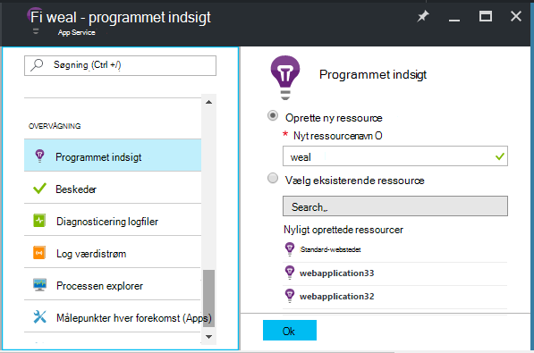
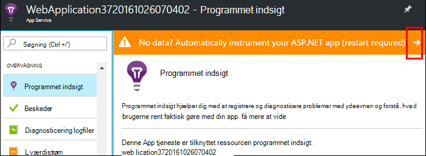
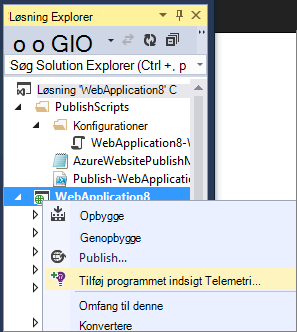
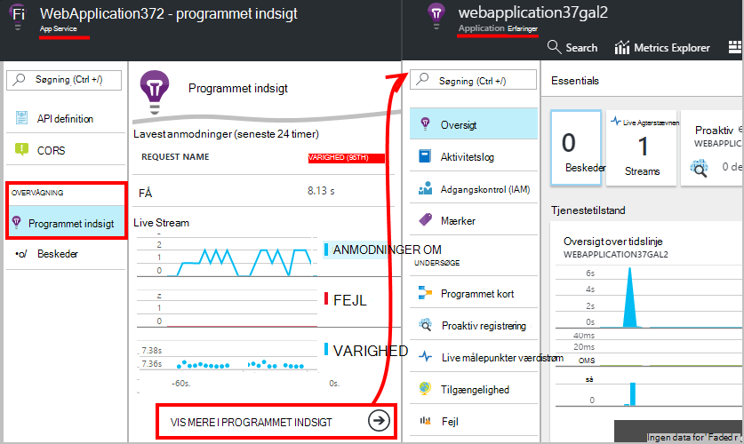
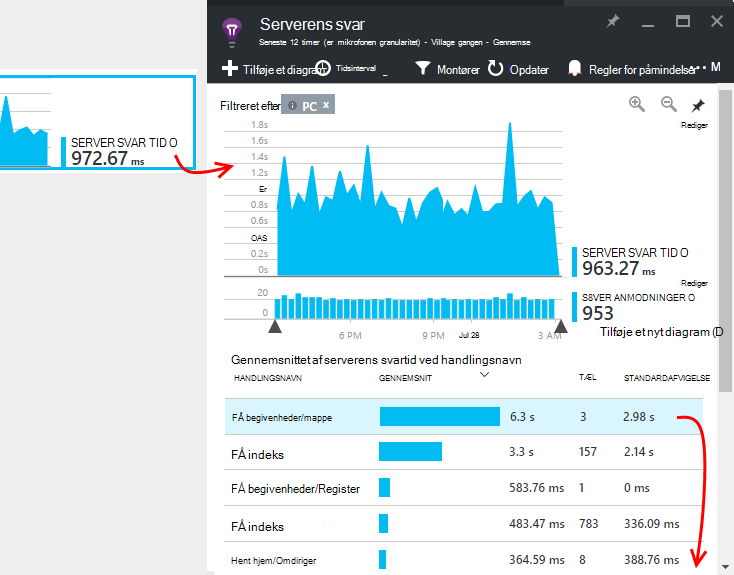
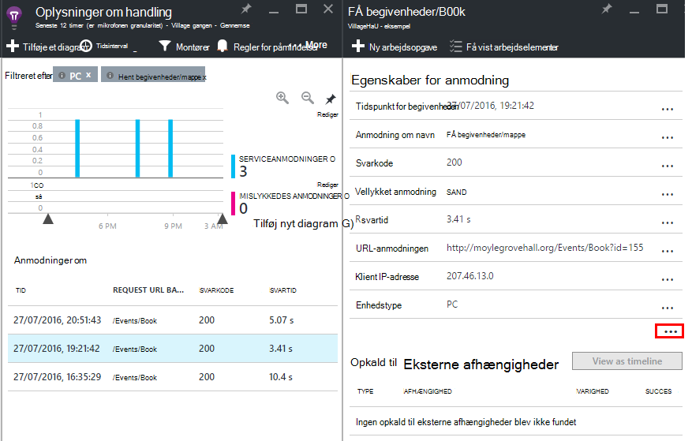

<properties
    pageTitle="Overvåge Azure web app ydeevne | Microsoft Azure"
    description="Programmet overvågning af ydeevnen for Azure webapps. Diagrammet Indlæs og svartid, oplysninger om objektafhængigheder og angive beskeder på ydeevne."
    services="application-insights"
    documentationCenter=".net"
    authors="alancameronwills"
    manager="douge"/>

<tags
    ms.service="azure-portal"
    ms.workload="na"
    ms.tgt_pltfrm="na"
    ms.devlang="na"
    ms.topic="article"
    ms.date="10/24/2016"
    ms.author="awills"/>

# Overvåge ydeevnen i Azure web app

[Azure Portal](https://portal.azure.com) kan du konfigurere programmet overvågning for dine [Azure webapps](../app-service-web/app-service-web-overview.md). [Visual Studio programmet indsigt](app-insights-overview.md) instrumenter din app for at sende telemetri om aktiviteterne til tjenesten programmet viden, hvor den er gemt og analysere. Metriske diagrammer og søgeværktøjer kan der skal bruges, til at diagnosticere problemer, forbedre ydeevnen og vurdere brugen.

## Kørselstid, eller Opret tid

Du kan konfigurere overvågning af instrumentering app på en af to måder:

* **Runtime-** – du kan vælge en ydeevne, overvågning lokalnummer, når din online er allerede direkte. Det er ikke nødvendigt at genopbygge eller geninstallere din app. Du får et standardsæt af pakker, overvåge svar gange, succes satser, undtagelser, afhængigheder osv. 
 
* **Opbygge tid** - du kan installere en pakke i din app er under udvikling. Denne indstilling er mere alsidige. Ud over de samme standard pakker, kan du skrive kode til at tilpasse telemetri eller til at sende din egen telemetri. Du kan logge bestemte aktiviteter eller post begivenheder efter semantik af din app-domæne. 

## Køre tid instrumentation med programmet indsigt

Hvis du kører allerede en web-app i Azure, du allerede får nogle overvågning: anmodningen og fejl. Tilføj programmet indsigt til at få mere som svar gange, overvågning af opkald til afhængigheder, smart registrering og effektive analyser forespørgsel sprog. 

1. **Vælg programmet indsigt** i kontrolpanelet i Azure for din online.

    

 * Vælg for at oprette en ny ressource, medmindre du allerede har oprettet en programmet indsigt ressourcen for denne app en anden rute.

2. **Instrument din online** efter program indsigt er blevet installeret. 

    

3. **Overvåge din app**.  [Expore dataene](#explore-the-data).

Senere, kan du oprette og geninstaller app med programmet viden, hvis du vil.

*Hvordan jeg fjerne programmet indsigt eller skifte til at sende til en anden ressource?*

* Åbn bladet web app kontrolelement i Azure, og Åbn **udvidelser**under udviklingsværktøjer. Slette filtypenavnet programmet indsigt. Derefter under overvågnings, vælg programmet indsigt og Opret eller Vælg den ønskede ressource.

## Opbygge app med programmet indsigt

Programmet indsigt kan give mere detaljeret telemetri ved at installere en SDK i din app. Du kan bl.a indsamling spore logfiler, [skrive brugerdefinerede telemetri](../application-insights/app-insights-api-custom-events-metrics.md), og få mere detaljerede undtagelse rapporter.

1. **I Visual Studio** (2013 opdatering 2 eller nyere), føje programmet indsigt SDK til projektet.

    

    Hvis du bliver bedt om at logge på, kan du bruge legitimationsoplysningerne for din Azure-konto.

    Handlingen har to effekter:

 1. Opretter en ressource programmet indsigt i Azure, hvor telemetri gemmes, analysere og vises.
 2. Tilføjer pakken programmet indsigt NuGet i din kode, og konfigurerer det til at sende telemetri til Azure ressourcen.

2. **Test telemetri** ved at køre appen på computeren udvikling (F5).

3. **Publicer appen** til Azure i den sædvanlige måde. 

*Hvordan skifter jeg mellem til at sende til en anden ressource programmet indsigt?*

* Højreklik på projektet i Visual Studio, skal du vælge **programmet indsigt > Konfigurer** , og vælg den ønskede ressource. Du får mulighed for at oprette en ny ressource. Genopbygge og geninstaller.

## Udforske data

1. På bladet programmet indsigt i dit web app i Kontrolpanel, du ser Live statistik, som viser anmodninger om og fejl i et sekund eller to af dem der foregår. Det er praktisk visning, når du genudgive din app – kan du se problemer med det samme.

2. Klik dig gennem hele programmet indsigt ressourcen.

    
    

    Du kan også gå der enten direkte fra Azure ressource navigation.

2. Klik dig gennem et diagram til at få flere oplysninger:

    

    Du kan [tilpasse målepunkter blade](../application-insights/app-insights-metrics-explorer.md).

3. Klik dig gennem kortet yderligere, se individuelle hændelser og deres egenskaber:

    

    Bemærk de "..." link for at åbne alle egenskaber.

    Du kan [tilpasse søgninger](../application-insights/app-insights-diagnostic-search.md).

Brug [Analytics forespørgsel sprog](../application-insights/app-insights-analytics-tour.md)for mere effektive søgninger over din telemetri.

## Næste trin

* [Aktivere Azure diagnosticering](app-insights-azure-diagnostics.md) skal sendes til programmet indsigt.
* [Overvåge tjenesten sundhed målepunkter](../monitoring-and-diagnostics/insights-how-to-customize-monitoring.md) at sikre, at din tjeneste er tilgængelig og svarede.
* [Modtag beskeder om meddelelser](../monitoring-and-diagnostics/insights-receive-alert-notifications.md) , når funktionsdygtige begivenheder sker eller målepunkter på tværs af en tærskelværdi.
* Bruge [Programmet indsigt til JavaScript-apps og websider](app-insights-web-track-usage.md) til at få klienten telemetri fra de browsere, der åbner en webside.
* [Konfigurere tilgængeligheden web tester](app-insights-monitor-web-app-availability.md) du have besked, hvis webstedet er nede.
