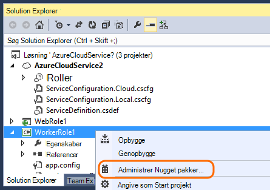

<properties
   pageTitle="Programmet indsigt til Azure Cloud Services"
   description="Overvåge dine internettet og arbejder roller effektivt med programmet indsigt"
   services="application-insights"
   documentationCenter=""
   authors="soubhagyadash"
   manager="douge"
   editor="alancameronwills"/>

<tags
   ms.service="application-insights"
   ms.devlang="na"
   ms.tgt_pltfrm="ibiza"
   ms.topic="article"
   ms.workload="tbd"
   ms.date="03/02/2016"
   ms.author="sdash"/>

# <a name="application-insights-for-azure-cloud-services"></a>Programmet indsigt til Azure Cloud Services


*Programmet indsigt er i Vis udskrift*

[Microsoft Azure Cloud service apps](https://azure.microsoft.com/services/cloud-services/) kan kontrolleres ved hjælp af [Visual Studio programmet indsigt] [ start] for tilgængelighed, ydeevne, mislykkede forsøg og brug. Med den feedback, du får om ydeevne og effektivitet af din app vilde, kan du foretage dig informeret valg om retningen af designet i hver udviklingslivscyklus.


Du skal have et abonnement med [Microsoft Azure](http://azure.com). Logge på med en Microsoft-konto, som du muligvis nødt til Windows, XBox Live eller andre Microsofts skytjenester. 


#### <a name="sample-application-instrumented-with-application-insights"></a>Northwind udstyret med programmet indsigt

Se nærmere på [Northwind](https://github.com/Microsoft/ApplicationInsights-Home/tree/master/Samples/AzureEmailService) , programmet indsigt er føjet til en skybaseret tjeneste med to arbejder roller Azure som vært. 

Hvad følger fortæller dig, hvordan du tilpasse dit eget skyen service projekt på samme måde.

## <a name="create-an-application-insights-resource-for-each-role"></a>Oprette en programmet indsigt ressource for hver rolle

En programmet indsigt ressource er, hvor dine telemetridata, analysere og vises.  

1.  [Azure portal][portal], oprette en ny programmet indsigt ressource. Vælg ASP.NET-app til programtype. 

    

2.  Tage en kopi af tasten Instrumentation. Du skal bruge denne indstilling for kort tid at konfigurere SDK.

    


Det er normalt [bedst at oprette en separat ressourcen for dataene fra hver internettet og arbejder rolle](app-insights-separate-resources.md). 

Som et alternativ kan du sende data fra alle roller til kun én ressource, men du kan angive en [standardegenskab] [ apidefaults] så du kan filtrere eller gruppere resultatet fra hver rolle.

## <a name="sdk"></a>Installere SDK i hvert projekt


1. Rediger NuGet pakker skyen app projektets i Visual Studio.

    


2. Føje [Programmet indsigt til Web](http://www.nuget.org/packages/Microsoft.ApplicationInsights.Web) NuGet pakken for web roller. Denne version af SDK indeholder moduler, tilføjer serverkontekst som rolleoplysninger. Bruge [Programmet indsigt for Windows Servers](https://www.nuget.org/packages/Microsoft.ApplicationInsights.WindowsServer/)for arbejder roller.

    


3. Konfigurere SDK for at sende data til programmet indsigt ressourcen.

    Indstille nøglen instrumentation som en indstilling i filen `ServiceConfiguration.Cloud.cscfg`. ([Eksempelkode](https://github.com/Microsoft/ApplicationInsights-Home/blob/master/Samples/AzureEmailService/AzureEmailService/ServiceConfiguration.Cloud.cscfg)).
 
    ```XML
     <Role name="WorkerRoleA"> 
      <Setting name="APPINSIGHTS_INSTRUMENTATIONKEY" value="YOUR IKEY" /> 
     </Role>
    ```
 
    Indstille nøglen instrumentation fra konfigurationsindstillingen i en passende Start funktion:

    ```C#
     TelemetryConfiguration.Active.InstrumentationKey = RoleEnvironment.GetConfigurationSettingValue("APPINSIGHTS_INSTRUMENTATIONKEY");
    ```

    Bemærk, det samme navn `APPINSIGHTS_INSTRUMENTATIONKEY` af konfigurationen vil blive brugt indstilling af Azure diagnosticering rapportering. 


    Gøre dette for hver rolle i programmet. Se eksemplerne:
 
 * [Web rolle](https://github.com/Microsoft/ApplicationInsights-Home/blob/master/Samples/AzureEmailService/MvcWebRole/Global.asax.cs#L27)
 * [Arbejder rolle](https://github.com/Microsoft/ApplicationInsights-Home/blob/master/Samples/AzureEmailService/WorkerRoleA/WorkerRoleA.cs#L232)
 * [For websider](https://github.com/Microsoft/ApplicationInsights-Home/blob/master/Samples/AzureEmailService/MvcWebRole/Views/Shared/_Layout.cshtml#L13)   

4. Angive filen ApplicationInsights.config altid skal kopieres til outputmappen. 

    (I .config-filen, får du vist meddelelser, hvor du bliver spurgt placere tasten instrumentation der. Til skyen programmer er det imidlertid bedre til at angive den fra filen .cscfg. Dette sikrer, at rollen identificeres korrekt i portalen.)


#### <a name="run-and-publish-the-app"></a>Kør og publicere appen

Kør din app, og log på Azure. Åbn i programmet indsigt ressourcer, du har oprettet, og du får vist individuelle datapunkter, der vises i [Søg](app-insights-diagnostic-search.md), og aggregerede data i [Metrisk Explorer](app-insights-metrics-explorer.md). 

Tilføje flere telemetri - finder du i afsnittene herunder - og derefter publicere din app for at få live diagnostic for og brugen af feedback. 


#### <a name="no-data"></a>Ingen data?

* Åbne [søgning] [ diagnostic] felt for at få vist de enkelte hændelser.
* Bruge programmet, åbne forskellige sider, så det genererer nogle telemetri.
* Vent et par sekunder, og klik på Opdater.
* Se [fejlfinding af][qna].


## <a name="more-telemetry"></a>Flere telemetri

I nedenstående afsnit viser, hvordan du få yderligere telemetri fra forskellige aspekter af programmet.


## <a name="track-requests-from-worker-roles"></a>Registrer anmodninger fra arbejder roller

I web roller indsamler modulet anmodninger automatisk data om HTTP-anmodninger. Se [eksempel MVCWebRole](https://github.com/Microsoft/ApplicationInsights-Home/tree/master/Samples/AzureEmailService/MvcWebRole) eksempler på, hvordan du kan tilsidesætte standardfunktionsmåden af websteder. 

Du kan hente ydeevnen for opkald til arbejder roller ved at spore dem på samme måde som HTTP-anmodninger. I programmet indsigt måler telemetri typen anmodning en måleenhed navngivet server side arbejde, der kan være blevet afbrudt og kan uafhængigt lykkes eller mislykkes. Mens HTTP-anmodninger er hentet automatisk af SDK, kan du indsætte din egen programkode for at spore anmodninger arbejder roller.

Se de to stikprøve arbejder roller, der er udstyret anmodninger om statusrapporter: [WorkerRoleA](https://github.com/Microsoft/ApplicationInsights-Home/tree/master/Samples/AzureEmailService/WorkerRoleA) og [WorkerRoleB](https://github.com/Microsoft/ApplicationInsights-Home/tree/master/Samples/AzureEmailService/WorkerRoleB)

## <a name="azure-diagnostics"></a>Azure diagnosticering

[Azure diagnosticering](../vs-azure-tools-diagnostics-for-cloud-services-and-virtual-machines.md) data omfatter rolle management begivenheder, tællere i ydeevne og logge af programmet. Du kan have disse sendt til programmet indsigt, så du kan se dem sammen med resten af din telemetri gør det nemmere at diagnosticere problemer.

Azure diagnosticering er særligt nyttige, hvis en rolle mislykkes uventet, eller ikke kan startes.

1. Højreklik på rollen (ikke projektet!) for at åbne dens egenskaber, og vælg **Aktivér diagnosticering**, **sende diagnosticering til programmet indsigt**.

    

    **Eller hvis din app er allerede publiceret og kører**, Åbn af Server Explorer eller skyen Explorer, højreklik på din app, og vælg den samme indstilling.

3.  Vælg den samme ressource programmet indsigt som dine andre telemetri.

    Hvis du vil, kan du angive en anden ressource i anden tjeneste konfigurationer (skyen, lokalt) for at beskytte udvikling dataene adskilt fra dynamiske data.

3. Du kan også [udelade nogle af de Azure diagnosticering](app-insights-azure-diagnostics.md) , du vil videresendes til programmet indsigt. Standard er alt.

### <a name="view-azure-diagnostic-events"></a>Få vist Azure diagnosticering hændelser

Hvor du kan finde diagnosticering:

* Tællere i ydeevne vises som brugerdefineret målepunkter. 
* Windows-hændelseslogge vises som sporinger og brugerdefinerede begivenheder.
* Program logfiler, ETW logfiler og en hvilken som helst diagnosticering infrastruktur logfiler vises som sporinger.

Åbn [Målepunkter Explorer](app-insights-metrics-explorer.md) for at få vist tællere i ydeevne og optællinger for de hændelser, og Tilføj et nyt diagram:


Brug [Søg](app-insights-diagnostic-search.md) til at søge på tværs af forskellige sporing loggene sendes af Azure diagnosticering. For eksempel, hvis du har en unhanded undtagelse i en rolle som forårsagede rollen for at gå ned og Papirkurv, oplysningerne skal vises i programmet kanal af Windows-hændelseslog. Du kan bruge søgefunktionen til at se på Windows-hændelsesloggen fejlen og få fuld Stakspor for de undtagelser, så du kan finde den egentlige årsag problemet.


## <a name="app-diagnostics"></a>App diagnosticering

Azure diagnosticering medtager automatisk logposter, som din app genererer ved hjælp af System.Diagnostics.Trace. 

Men hvis du allerede bruger Log4N eller NLog strukturer, kan du også [tage deres log sporinger][netlogs].

[Spore brugerdefinerede hændelser og målepunkter] [ api] i klienten server og/eller mere at vide om programmets ydeevne og brugen.

## <a name="dependencies"></a>Afhængigheder

Programmet indsigt SDK kan rapportere opkald, der gør din app til eksterne afhængigheder som REST API'er og SQL-servere. Dette kan du se, om en bestemt afhængighed skyld i langsom svar eller mislykkede forsøg.

Hvis dit program bruger .NET framework 4.6 eller nyere, behøver du ikke gør noget andet. 

Ellers skal du konfigurere rollen web/arbejder med [Programmet indsigt Agent](app-insights-monitor-performance-live-website-now.md) også kendt som "Status skærm".

For at bruge programmet indsigt Agent med dine web/arbejder roller:

* Føje mappen [AppInsightsAgent](https://github.com/Microsoft/ApplicationInsights-Home/tree/master/Samples/AzureEmailService/WorkerRoleA/AppInsightsAgent) og de to filer i den til dine web/arbejder rolle projekter. Sørg for at angive deres build egenskaber, så de altid er kopieret til outputmappen. Disse filer installere agenten.
* Tilføj opgave startside til filen CSDEF som vist [her](https://github.com/Microsoft/ApplicationInsights-Home/tree/master/Samples/AzureEmailService/AzureEmailService/ServiceDefinition.csdef#L18).
* Bemærk: *Arbejder roller* kræver tre miljøvariabler som vist [her](https://github.com/Microsoft/ApplicationInsights-Home/tree/master/Samples/AzureEmailService/AzureEmailService/ServiceDefinition.csdef#L44). Dette er ikke påkrævet for web roller.

### <a name="dependency-reports"></a>Afhængighed af rapporter

Her er et eksempel på, hvad du ser på portalen programmet indsigt:

* Omfattende diagnosticering med automatisk forbundne anmodninger og afhængigheder:

    

* Ydeevnen af rollen web med oplysninger om objektafhængigheder:

    

* Her er et skærmbillede på anmodninger og oplysninger om afhængighed for en kollega rolle:

    

## <a name="exceptions"></a>Undtagelser

Se [Overvågning undtagelser i programmet indsigt](app-insights-asp-net-exceptions.md) for oplysninger om hvordan du kan indsamle ikke-afviklet undtagelser fra forskellige web application typer.

Eksempel web rolle har MVC5 og Web API 2. Ikke-afviklet undtagelser fra 2 hentes med følgende:

* [AiHandleErrorAttribute](https://github.com/Microsoft/ApplicationInsights-Home/blob/master/Samples/AzureEmailService/MvcWebRole/Telemetry/AiHandleErrorAttribute.cs) konfigurere [her](https://github.com/Microsoft/ApplicationInsights-Home/blob/master/Samples/AzureEmailService/MvcWebRole/App_Start/FilterConfig.cs#L12) ved MVC5 enheder
* [AiWebApiExceptionLogger](https://github.com/Microsoft/ApplicationInsights-Home/blob/master/Samples/AzureEmailService/MvcWebRole/Telemetry/AiWebApiExceptionLogger.cs) konfigurere [her](https://github.com/Microsoft/ApplicationInsights-Home/blob/master/Samples/AzureEmailService/MvcWebRole/App_Start/WebApiConfig.cs#L25) ved Web API 2 enheder

Arbejder roller er der to måder til at registrere undtagelser.

* TrackException(ex)
* Hvis du har tilføjet programmet indsigt sporing lytteren NuGet pakke, kan du bruge System.Diagnostics.Trace til at logge undtagelser. [Eksempel på en kode.](https://github.com/Microsoft/ApplicationInsights-Home/blob/master/Samples/AzureEmailService/WorkerRoleA/WorkerRoleA.cs#L107)

## <a name="performance-counters"></a>Tællere i ydeevne

Følgende tællere indsamles som standard:

    * \Process(??APP_WIN32_PROC??)\% processortid
    * \Memory\Available byte
    * \.Nettooversigt CLR Exceptions(??APP_CLR_PROC??)\# af Exceps udløst / sek.
    * \Process (??. APP_WIN32_PROC??) \Private byte
    * \Process (??. APP_WIN32_PROC??) \IO data byte/sekund
    * \Processor(_Total)\% processortid

Desuden indsamles følgende også for web roller:

    * \ASP.NET programmer (??. APP_W3SVC_PROC??) \Requests/sec    
    * \ASP.NET programmer (??. APP_W3SVC_PROC??) \Request kørselstid
    * \ASP.NET programmer (??. APP_W3SVC_PROC??) \Requests i programmet kø

Du kan angive yderligere brugerdefineret eller andre windows ydeevne tællere som vist [her](https://github.com/Microsoft/ApplicationInsights-Home/blob/master/Samples/AzureEmailService/WorkerRoleA/ApplicationInsights.config#L14)

  

## <a name="correlated-telemetry-for-worker-roles"></a>Forbundne Telemetri for arbejder roller

Det er en omfattende diagnosticering oplevelse, når du kan se, hvad ført til en anmodning om mislykkedes eller høj ventetid. Med web roller konfigurerer i SDK automatisk korrelation mellem relaterede telemetri. Du kan bruge ved initialisering af en brugerdefineret telemetri til at angive en fælles Operation.Id kontekst attribut for alle telemetri dette for arbejder roller. Dette gør det muligt at se, om problemet ventetid/fejl opstod på grund af en afhængighed eller din kode, overblik! 

Her er, hvordan:

* Angive korrelations-id'et til et CallContext som vist [her](https://github.com/Microsoft/ApplicationInsights-Home/blob/master/Samples/AzureEmailService/WorkerRoleA/WorkerRoleA.cs#L36). I dette tilfælde bruger vi anmode om ID'ET som korrelations-id'et
* Tilføje en brugerdefineret TelemetryInitializer implementering, der angiver Operation.Id til correlationId angive ovenfor. Vist her: [ItemCorrelationTelemetryInitializer](https://github.com/Microsoft/ApplicationInsights-Home/blob/master/Samples/AzureEmailService/WorkerRoleA/Telemetry/ItemCorrelationTelemetryInitializer.cs#L13)
* Tilføje brugerdefinerede telemetri initialisering. Du kan gøre det i filen ApplicationInsights.config eller i programkode som vist [her](https://github.com/Microsoft/ApplicationInsights-Home/blob/master/Samples/AzureEmailService/WorkerRoleA/WorkerRoleA.cs#L233)

Det var det! Oplevelser med portalen er allerede wired kan hjælpe dig med at se alle de tilknyttede telemetri overblik:


## <a name="client-telemetry"></a>Klient telemetri

[Føje JavaScript SDK til dine websider] [ client] at få browserbaserede telemetri såsom siden visning tæller, sideindlæsningstider, script undtagelser og give dig med at skrive brugerdefinerede telemetri i dine siden scripts.

## <a name="availability-tests"></a>Tilgængelighed test

[Konfigurere web test] [ availability] at sikre, at dit program forbliver direkte og svarede.


## <a name="example"></a>Eksempel

[Eksemplet](https://github.com/Microsoft/ApplicationInsights-Home/tree/master/Samples/AzureEmailService) overvåger en tjeneste, der indeholder en web rolle og to arbejder roller.

## <a name="exception-method-not-found-on-running-in-azure-cloud-services"></a>Undtagelse "metoden blev ikke fundet" på kører i Azure Cloud Services

Du opretter til .NET 4.6? 4.6 understøttes ikke automatisk i Azure Cloud Services roller. [Installere 4.6 på hver rolle](../cloud-services/cloud-services-dotnet-install-dotnet.md) , før du kører din app.

## <a name="related-topics"></a>Relaterede emner

* [Konfigurere sende Azure diagnosticering til programmet indsigt](app-insights-azure-diagnostics.md)
* [Bruge PowerShell til at sende Azure diagnosticering til programmet indsigt](app-insights-powershell-azure-diagnostics.md)


[api]: app-insights-api-custom-events-metrics.md
[apidefaults]: app-insights-api-custom-events-metrics.md#default-properties
[apidynamicikey]: app-insights-separate-resources.md#dynamic-ikey
[availability]: app-insights-monitor-web-app-availability.md
[azure]: app-insights-azure.md
[client]: app-insights-javascript.md
[diagnostic]: app-insights-diagnostic-search.md
[netlogs]: app-insights-asp-net-trace-logs.md
[portal]: http://portal.azure.com/
[qna]: app-insights-troubleshoot-faq.md
[redfield]: app-insights-monitor-performance-live-website-now.md
[start]: app-insights-overview.md 
