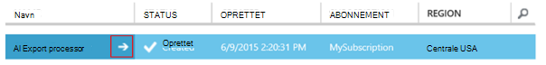
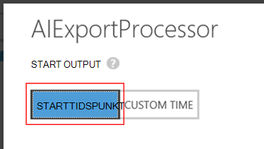

<properties 
    pageTitle="Gennemgang: eksportere telemetri til SQL-Database fra programmet indsigt" 
    description="Eksportere løbende programmet indsigt data til SQL ved hjælp af Stream analyser." 
    services="application-insights" 
    documentationCenter=""
    authors="noamben" 
    manager="douge"/>

<tags 
    ms.service="application-insights" 
    ms.workload="tbd" 
    ms.tgt_pltfrm="ibiza" 
    ms.devlang="na" 
    ms.topic="article" 
    ms.date="03/06/2015" 
    ms.author="awills"/>
 
# <a name="walkthrough-export-to-sql-from-application-insights-using-stream-analytics"></a>Gennemgang: Eksportere til SQL fra programmet indsigt ved hjælp af Stream Analytics

Denne artikel beskrives, hvordan du flytter dine telemetridata fra [Visual Studio programmet indsigt] [ start] i en Azure SQL-database ved hjælp af [Fortløbende eksportere] [ export] og [Azure Stream analyser](https://azure.microsoft.com/services/stream-analytics/). 

Kontinuert Eksportér flyttes din telemetridata til Azure-lager i JSON-format. Vi Fortolk JSON objekterne ved hjælp af Azure Stream analyser og oprette rækker i en databasetabel.

(Mere generelt fortløbende eksportere er den måde at gøre din egen analyse af telemetri dine apps sende til programmet indsigt. Du kan tilpasse denne kodeeksempel for at udføre andre ting med den eksporterede telemetri som aggregering af data.)

Vi begynder med den antagelse, at du allerede har den ønskede til at overvåge app.


Vi skal bruge siden visningsdata i dette eksempel, men det samme mønster kan nemt udvides til andre datatyper som brugerdefinerede hændelser og undtagelser. 


## <a name="add-application-insights-to-your-application"></a>Tilføje programmet indsigt i dit program


At komme i gang:

1. [Konfigurere programmet indsigt til dine websider](app-insights-javascript.md). 

    (I dette eksempel du fokuserer vi på at behandle side få vist data fra klient-browser, men du kan også konfigurere programmet indsigt til serversiden af din [Java](app-insights-java-get-started.md) eller [ASP.NET](app-insights-asp-net.md) app og processen anmodningen, afhængighed og andre server telemetri).


5. Udgive din app, og se telemetridata, der vises i dit program indsigt ressource.


## <a name="create-storage-in-azure"></a>Oprette lagerplads i Azure

Kontinuert eksport udskriver altid data til en Azure-lager-konto, så du skal oprette opbevaring først.

1. Oprette et lager konto i dit abonnement på [Azure portal][portal].

    

2. Oprette en objektbeholder

    

3. Kopiere hurtigtast lagerplads

    Du skal bruge den snart til konfiguration af input til stream analytics-tjenesten.

    

## <a name="start-continuous-export-to-azure-storage"></a>Start fortløbende Eksportér til Azure-lager

1. Find den programmet indsigt ressource, du har oprettet for dit program i Azure-portalen.

    

2. Oprette en fortløbende eksport.

    


    Vælg kontoen lagerplads du har oprettet tidligere:

    
    
    Angive typerne begivenhed, du vil have vist:

    


3. Lade nogle data point, der kræves. Sidde tilbage og lade folk bruge dit program til et stykke tid. Telemetri kommer, og du får vist statistiske diagrammer i [metriske explorer](app-insights-metrics-explorer.md) og enkelte hændelser i [diagnosticering Søg](app-insights-diagnostic-search.md). 

    Og også eksportere dataene til din lagerplads. 

4. Undersøg de eksporterede data, enten i portalen - Vælg **Gennemse**, vælge din lagerplads konto, og klik derefter **beholdere** - eller i Visual Studio. I Visual Studio, skal du vælge **få vist / skyen Explorer**, og Åbn Azure / lagerplads. (Hvis du ikke har denne indstilling i menuen, skal du installere Azure SDK: dialogboksen nyt projekt og åbne Visual C# / skyen / hente Microsoft Azure SDK til .NET.)

    

    Skal du notere den almindelige del af det stinavn, der er afledt navn og instrumentation programtasten. 

Hændelserne, der skrives til blob-filer i JSON-format. De enkelte filer kan indeholde et eller flere begivenheder. Så vil vi gerne læse begivenhed data og filtrere de felter, vi vil. Der er mange forskellige måder, som vi kunne gøre med dataene, men vores plan i dag er at bruge Stream Analytics til at flytte dataene til en SQL-database. Der gør det nemt at køre mange interessante forespørgsler.

## <a name="create-an-azure-sql-database"></a>Oprette en Azure SQL-Database

Igen fra dit abonnement i [Azure portalen][portal], oprette databasen (og en ny server, medmindre du har allerede en), du vil skrive dataene.


Kontrollér, at databaseserveren tillader adgang til Azure tjenester:


## <a name="create-a-table-in-azure-sql-db"></a>Oprette en tabel i Azure SQL DB

Oprette forbindelse til den database, der er oprettet i det forrige afsnit med din foretrukne administrationsværktøjer. I denne gennemgang vil vi bruge [Værktøjer til administration af SQL Server](https://msdn.microsoft.com/ms174173.aspx) (SSMS).


Oprette en ny forespørgsel, og udføre følgende T-SQL:

```SQL

CREATE TABLE [dbo].[PageViewsTable](
    [pageName] [nvarchar](max) NOT NULL,
    [viewCount] [int] NOT NULL,
    [url] [nvarchar](max) NULL,
    [urlDataPort] [int] NULL,
    [urlDataprotocol] [nvarchar](50) NULL,
    [urlDataHost] [nvarchar](50) NULL,
    [urlDataBase] [nvarchar](50) NULL,
    [urlDataHashTag] [nvarchar](max) NULL,
    [eventTime] [datetime] NOT NULL,
    [isSynthetic] [nvarchar](50) NULL,
    [deviceId] [nvarchar](50) NULL,
    [deviceType] [nvarchar](50) NULL,
    [os] [nvarchar](50) NULL,
    [osVersion] [nvarchar](50) NULL,
    [locale] [nvarchar](50) NULL,
    [userAgent] [nvarchar](max) NULL,
    [browser] [nvarchar](50) NULL,
    [browserVersion] [nvarchar](50) NULL,
    [screenResolution] [nvarchar](50) NULL,
    [sessionId] [nvarchar](max) NULL,
    [sessionIsFirst] [nvarchar](50) NULL,
    [clientIp] [nvarchar](50) NULL,
    [continent] [nvarchar](50) NULL,
    [country] [nvarchar](50) NULL,
    [province] [nvarchar](50) NULL,
    [city] [nvarchar](50) NULL
)

CREATE CLUSTERED INDEX [pvTblIdx] ON [dbo].[PageViewsTable]
(
    [eventTime] ASC
)WITH (PAD_INDEX = OFF, STATISTICS_NORECOMPUTE = OFF, SORT_IN_TEMPDB = OFF, DROP_EXISTING = OFF, ONLINE = OFF, ALLOW_ROW_LOCKS = ON, ALLOW_PAGE_LOCKS = ON)

```


I dette eksempel bruger vi data fra sidevisninger. For at se andre tilgængelige data, undersøge din JSON output, og se [eksportere datamodel](app-insights-export-data-model.md).

## <a name="create-an-azure-stream-analytics-instance"></a>Oprette en Azure Stream Analytics-forekomst

Vælg tjenesten, Azure Stream Analytics [Klassisk Azure-portalen](https://manage.windowsazure.com/), og Opret et nyt Stream Analytics-job:


Når den nye sag er oprettet, skal du udvide detaljerne:



#### <a name="set-blob-location"></a>Angiv blob placering

Indstille den til at gøre dette fra din fortløbende eksportere blob:


Nu skal du den primærnøgle adgang fra din lagerplads-konto, som du tidligere har angivet. Angive dette som Kontonøgle lagerplads.


#### <a name="set-path-prefix-pattern"></a>Sæt stien præfiksmønster 


Sørg for at angive datoformatet til **Åååå-MM-DD** (med **stiplet**).

Sti præfiks mønster Angiver, hvordan Stream Analytics finder input filerne i opbevaring. Du skal angive den skal svare til hvordan fortløbende eksportere gemmer dataene. Angiv det sådan ud:

    webapplication27_12345678123412341234123456789abcdef0/PageViews/{date}/{time}

I dette eksempel:

* `webapplication27`er navnet på ressourcen, programmet viden, **alle skrevet med små bogstaver**. 
* `1234...`er instrumentation nøglen for det program indsigt ressource **med stiplet fjernet**. 
* `PageViews`er typen data, som vi vil analysere. De tilgængelige typer afhænger af det filter, du angiver i fortløbende eksportere. Undersøg de eksporterede data for at få vist andre muligheder, og se [eksportere datamodel](app-insights-export-data-model.md).
* `/{date}/{time}`skrives et mønster direkte.

Åbn Essentials på dens Overview for at få navn og iKey af dit program indsigt ressource skal, eller Åbn indstillinger.

#### <a name="finish-initial-setup"></a>Udfør indledende installation

Bekræfte serialiseringsformatet:


Lukke guiden, og vent for at afslutte installationsprogrammet.

>[AZURE.TIP] Bruge funktionen eksempel til at kontrollere, at du har oprettet input stien korrekt. Hvis det ikke lykkes: Kontrollér, at der er data i lagerplads for det eksempel tidsinterval, du vælger. Redigere definitionen af input, og Markér angivne lagerplads firma, sti præfiks og datoformat korrekt.

## <a name="set-query"></a>Angiv forespørgsel

Åbn sektionen forespørgsel:


Erstat standardforespørgslen med:

```SQL

    SELECT flat.ArrayValue.name as pageName
    , flat.ArrayValue.count as viewCount
    , flat.ArrayValue.url as url
    , flat.ArrayValue.urlData.port as urlDataPort
    , flat.ArrayValue.urlData.protocol as urlDataprotocol
    , flat.ArrayValue.urlData.host as urlDataHost
    , flat.ArrayValue.urlData.base as urlDataBase
    , flat.ArrayValue.urlData.hashTag as urlDataHashTag
      ,A.context.data.eventTime as eventTime
      ,A.context.data.isSynthetic as isSynthetic
      ,A.context.device.id as deviceId
      ,A.context.device.type as deviceType
      ,A.context.device.os as os
      ,A.context.device.osVersion as osVersion
      ,A.context.device.locale as locale
      ,A.context.device.userAgent as userAgent
      ,A.context.device.browser as browser
      ,A.context.device.browserVersion as browserVersion
      ,A.context.device.screenResolution.value as screenResolution
      ,A.context.session.id as sessionId
      ,A.context.session.isFirst as sessionIsFirst
      ,A.context.location.clientip as clientIp
      ,A.context.location.continent as continent
      ,A.context.location.country as country
      ,A.context.location.province as province
      ,A.context.location.city as city
    INTO
      AIOutput
    FROM AIinput A
    CROSS APPLY GetElements(A.[view]) as flat


```

Bemærk, at de første par egenskaber er specifikke for siden visningsdata. Eksport af andre telemetri typer har forskellige egenskaber. Se den [detaljerede datamodel reference til de egenskabstyper af og værdier.](app-insights-export-data-model.md)

## <a name="set-up-output-to-database"></a>Konfigurere output til database

Vælg SQL som output.


Angiv SQL-databasen.


Luk guiden, og vent på en meddelelse, der er angivet output.

## <a name="start-processing"></a>Starte behandling

Starte jobbet fra handlingslinjen:


Du kan vælge, om du vil starte behandling af data fra nu, eller hvis du vil starte med tidligere data. Disse er nyttigt, hvis du har haft fortløbende eksportere allerede kører i et stykke tid.




Gå tilbage til SQL Server-administrationsværktøjer efter et par minutter, og se de data, der flyder i. For eksempel bruge en forespørgsel som dette:

    SELECT TOP 100 *
    FROM [dbo].[PageViewsTable]


## <a name="related-articles"></a>Relaterede artikler

* [Eksportere til SQL ved hjælp af en kollega rolle](app-insights-code-sample-export-telemetry-sql-database.md)
* [Eksportere til PowerBI ved hjælp af Stream Analytics](app-insights-export-power-bi.md)
* [Detaljerede data model reference til de egenskabstyper af og værdier.](app-insights-export-data-model.md)
* [Kontinuert Eksportér i programmet indsigt](app-insights-export-telemetry.md)
* [Programmet indsigt](https://azure.microsoft.com/services/application-insights/)

<!--Link references-->

[diagnostic]: app-insights-diagnostic-search.md
[export]: app-insights-export-telemetry.md
[metrics]: app-insights-metrics-explorer.md
[portal]: http://portal.azure.com/
[start]: app-insights-overview.md

 