<properties 
    pageTitle="Eksempel på kode: analysere data, der er eksporteret fra programmet indsigt" 
    description="Kode din egen analyse af telemetri i programmet indsigt ved hjælp af eksportfunktionen fortløbende. Gem data til SQL." 
    services="application-insights" 
    documentationCenter=""
    authors="mazharmicrosoft" 
    manager="douge"/>

<tags 
    ms.service="application-insights" 
    ms.workload="tbd" 
    ms.tgt_pltfrm="ibiza" 
    ms.devlang="na" 
    ms.topic="article" 
    ms.date="01/05/2016" 
    ms.author="awills"/>
 
# Eksempel på kode: analysere data, der er eksporteret fra programmet indsigt

I denne artikel viser, hvordan til at behandle JSON-data, der er eksporteret fra programmet indsigt. Som eksempel skal vi skrive programkode for at flytte dine telemetridata fra [Visual Studio programmet indsigt] [ start] i en Azure SQL-database ved hjælp af [Fortløbende eksportere][export]. (Du kan også opnå denne [ved hjælp af Stream Analytics](app-insights-code-sample-export-sql-stream-analytics.md), men her vores mål er at få vist kode). 

Kontinuert Eksportér flyttes din telemetri til Azure-lager i JSON-formatet, så vi kan skrive kode for at analysere JSON-objekter og oprette rækker i en databasetabel.

Mere generelt er fortløbende eksportere den måde at gøre din egen analyse af telemetri dine apps sende til programmet indsigt. Du kan tilpasse denne kodeeksempel for at udføre andre ting med den eksporterede telemetri.

Vi begynder med den antagelse, at du allerede har den ønskede til at overvåge app.

## Tilføje programmet indsigt SDK

Til at overvåge dine programmet på computeren, kan du [tilføje et program indsigt SDK] [ start] i dit program. Der er forskellige SDK'er og hjælper værktøjer til forskellige platforme, IDEs og sprog. Du kan overvåge websider, Java eller ASP.NET-Webserverne og mobilenheder på flere typer. Alle SDK'er sende telemetri til [programmet indsigt portal][portal], hvor du kan bruge vores effektive analyser og værktøjer til diagnosticering og eksportere dataene til-lager.

At komme i gang:

1. Få en [konto i Microsoft Azure](https://azure.microsoft.com/pricing/).
2. [Azure portal][portal], Tilføj en ny programmet indsigt ressource for din app:

    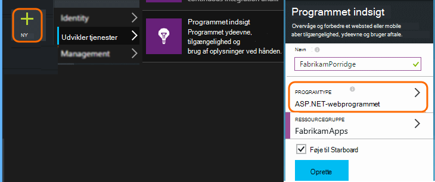

    (Din app typen og -abonnement kan være forskellige).
3. Åbn Hurtig Start til at finde for at konfigurere SDK til din app.

    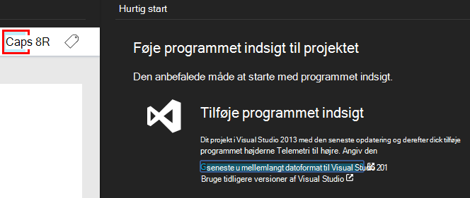

    Hvis din app typen ikke er angivet, se nærmere på [Introduktion] [ start] side.

4. I dette eksempel vi overvågning en web-app, så vi kan bruge værktøjerne Azure i Visual Studio til at installere SDK. Vi se den navnet på vores program indsigt ressource:

    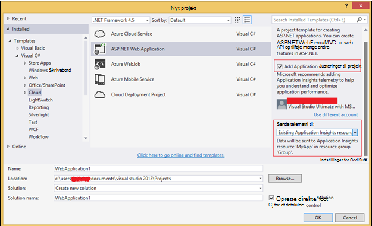

## Oprette lagerplads i Azure

Data fra programmet indsigt eksporteres altid til en Azure-lager konto i JSON-formatet. Den kommer fra denne lagerplads, at din kode læser dataene.

1. Oprette en "klassisk" lagerplads konto i dit abonnement på [Azure portal][portal].

    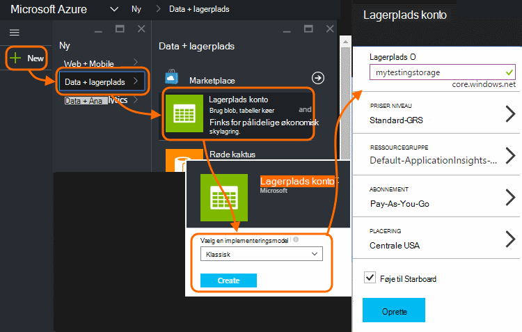

2. Oprette en objektbeholder

    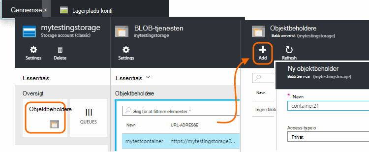

## Start fortløbende Eksportér til Azure-lager

1. Find den programmet indsigt ressource, du har oprettet for dit program i Azure-portalen.

    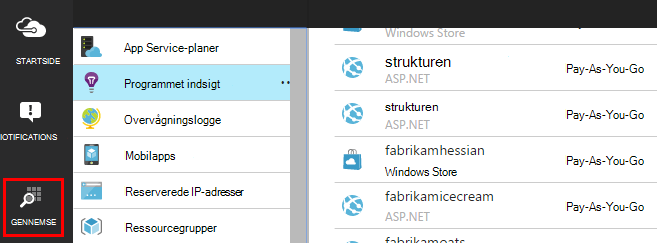

2. Oprette en fortløbende eksport.

    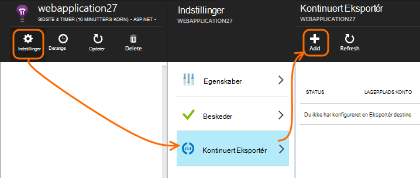

    Vælg kontoen lagerplads du har oprettet tidligere:

    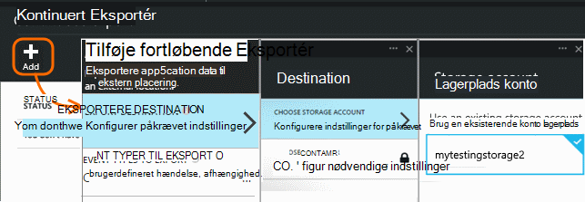
    
    Angive typerne begivenhed, du vil have vist:

    

3. Lade nogle data point, der kræves. Sidde tilbage og lade folk bruge dit program til et stykke tid. Telemetri kommer, og du får vist statistiske diagrammer i [metriske explorer](app-insights-metrics-explorer.md) og enkelte hændelser i [diagnosticering Søg](app-insights-diagnostic-search.md). 

    Og også eksportere dataene til din lagerplads. 

4. Undersøg de eksporterede data. I Visual Studio, skal du vælge **få vist / skyen Explorer**, og Åbn Azure / lagerplads. (Hvis du ikke har denne indstilling i menuen, skal du installere Azure SDK: dialogboksen nyt projekt og åbne Visual C# / skyen / hente Microsoft Azure SDK til .NET.)

    

    Skal du notere den almindelige del af det stinavn, der er afledt navn og instrumentation programtasten. 

Hændelserne, der skrives til blob-filer i JSON-format. De enkelte filer kan indeholde et eller flere begivenheder. Så vil vi gerne læse begivenhed data og filtrere de felter, vi vil. Der er mange forskellige måder, som vi kunne gøre med dataene, men i dag er vores plan til at skrive kode for at flytte data til en SQL-database. Der gør det nemt at køre mange interessante forespørgsler.

## Oprette en Azure SQL-Database

I dette eksempel skal vi skrive programkode for at overføre data til en database.

Igen fra dit abonnement i [Azure portalen][portal], oprette databasen (og en ny server, medmindre du har allerede en), du vil skrive dataene.

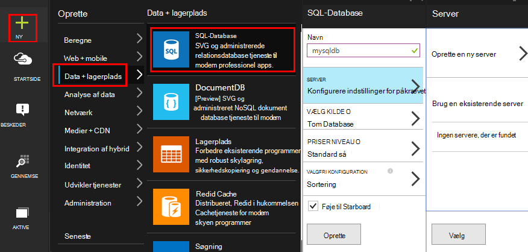

Kontrollér, at databaseserveren tillader adgang til Azure tjenester:

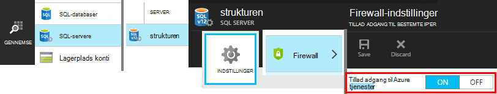

## Oprette en kollega rolle 

Nu kan på sidste vi skrive [kode](https://sesitai.codeplex.com/) for at analysere JSON i de eksporterede BLOB og oprette poster i databasen. Da Eksportér store og databasen er både i Azure, får vi køre koden i en Azure arbejder rolle.

Denne kode henter automatisk uanset egenskaber er til stede i JSON. Beskrivelser af egenskaberne, kan du se [eksportere datamodel](app-insights-export-data-model.md).

#### Oprette arbejder rolle projekt

Oprette et nyt projekt for rollen arbejder i Visual Studio:

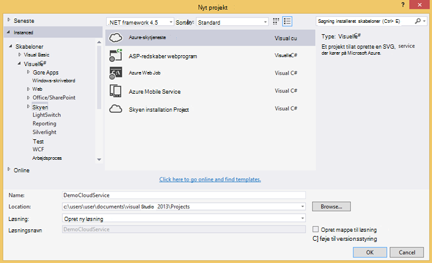

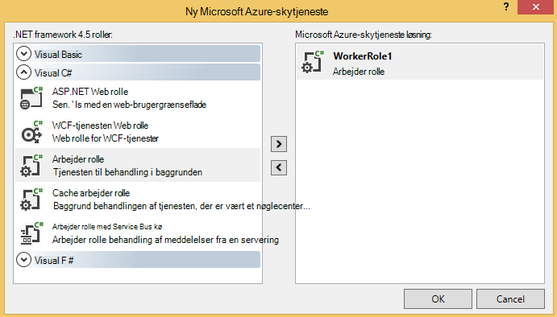

#### Oprette forbindelse til kontoen lagerplads

Få vist forbindelsesstrengen fra kontoen lagerplads i Azure:

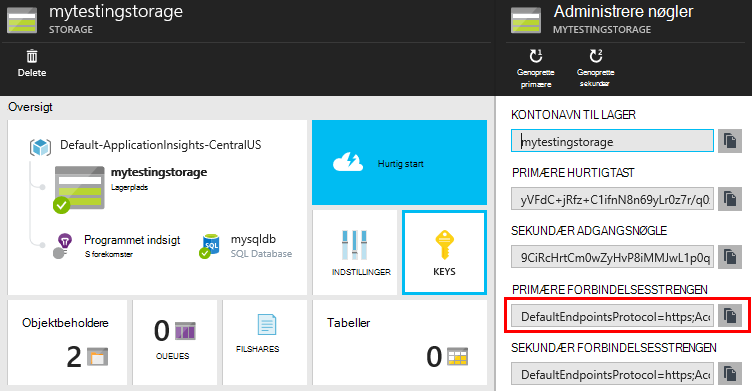

I Visual Studio, skal du konfigurere arbejder rolle indstillinger med forbindelsesstrengen lagerplads konto:

#### Pakker

I Solution Explorer, skal du højreklikke på projektet arbejder rolle og vælge Administrer NuGet pakker.
Søge efter og installere disse pakker: 

 * EntityFramework 6.1.2 eller senere – vi bruger dette til at generere DB tabel skemaet på farten, baseret på indholdet af JSON BLOB.
 * JsonFx - skal vi bruge dette til udjævne JSON til egenskaber for C#-klasse.

Brug dette værktøj til at generere C#-klasse af vores enkelt JSON-dokument. Det kræver nogle mindre ændringer som udjævne JSON matrixer til enkelt C# egenskab i slå enkelt kolonne i DB tabel (ex. urlData_port) 

 * [JSON C# klasse generator](http://jsonclassgenerator.codeplex.com/)

## Kode 

Du kan anbringe denne kode i `WorkerRole.cs`.

#### Importerer

    using Microsoft.WindowsAzure.Storage;

    using Microsoft.WindowsAzure.Storage.Blob;

#### Hente forbindelsesstrengen lagerplads

    private static string GetConnectionString()
    {
      return Microsoft.WindowsAzure.CloudConfigurationManager.GetSetting("StorageConnectionString");
    }

#### Køre arbejderen med jævne mellemrum

Erstatte den eksisterende køre metode, og vælg det interval, du foretrækker. Det skal være mindst en time, fordi eksportfunktionen afsluttes ét JSON objekt i en time.

    public override void Run()
    {
      Trace.TraceInformation("WorkerRole1 is running");

      while (true)
      {
        Trace.WriteLine("Sleeping", "Information");

        Thread.Sleep(86400000); //86400000=24 hours //1 hour=3600000
                
        Trace.WriteLine("Awake", "Information");

        ImportBlobtoDB();
      }
    }

#### Indsætte de enkelte JSON objekter som en tabelrække

    public void ImportBlobtoDB()
    {
      try
      {
        CloudStorageAccount account = CloudStorageAccount.Parse(GetConnectionString());

        var blobClient = account.CreateCloudBlobClient();
        var container = blobClient.GetContainerReference(FilterContainer);

        foreach (CloudBlobDirectory directory in container.ListBlobs())//Parent directory
        {
          foreach (CloudBlobDirectory subDirectory in directory.ListBlobs())//PageViewPerformance
          {
            foreach (CloudBlobDirectory dir in subDirectory.ListBlobs())//2015-01-31
            {
              foreach (CloudBlobDirectory subdir in dir.ListBlobs())//22
              {
                foreach (IListBlobItem item in subdir.ListBlobs())//3IAwm6u3-0.blob
                {
                  itemname = item.Uri.ToString();
                  ParseEachBlob(container, item);
                  AuditBlob(container, directory, subDirectory, dir, subdir, item);
                } //item loop
              } //subdir loop
            } //dir loop
          } //subDirectory loop
        } //directory loop
      }
      catch (Exception ex)
      {
        //handle exception
      }
    }

#### Fortolke hver blob

    private void ParseEachBlob(CloudBlobContainer container, IListBlobItem item)
    {
      try
      {
        var blob = container.GetBlockBlobReference(item.Parent.Prefix + item.Uri.Segments.Last());
    
        string json;
    
        using (var memoryStream = new MemoryStream())
        {
          blob.DownloadToStream(memoryStream);
          json = System.Text.Encoding.UTF8.GetString(memoryStream.ToArray());
    
          IEnumerable<string> entities = json.Split('\n').Where(s => !string.IsNullOrWhiteSpace(s));
    
          recCount = entities.Count();
          failureCount = 0; //resetting failure count
    
          foreach (var entity in entities)
          {
            var reader = new JsonFx.Json.JsonReader();
            dynamic output = reader.Read(entity);
    
            Dictionary<string, object> dict = new Dictionary<string, object>();
    
            GenerateDictionary((System.Dynamic.ExpandoObject)output, dict, "");
    
            switch (FilterType)
            {
              case "PageViewPerformance":
    
              if (dict.ContainsKey("clientPerformance"))
                {
                  GenerateDictionary(((System.Dynamic.ExpandoObject[])dict["clientPerformance"])[0], dict, "");
                }
    
              if (dict.ContainsKey("context_custom_dimensions"))
              {
                if (dict["context_custom_dimensions"].GetType() == typeof(System.Dynamic.ExpandoObject[]))
                {
                  GenerateDictionary(((System.Dynamic.ExpandoObject[])dict["context_custom_dimensions"])[0], dict, "");
                }
              }
    
            PageViewPerformance objPageViewPerformance = (PageViewPerformance)GetObject(dict);
    
            try
            {
              using (var db = new TelemetryContext())
              {
                db.PageViewPerformanceContext.Add(objPageViewPerformance);
                db.SaveChanges();
              }
            }
            catch (Exception ex)
            {
              failureCount++;
            }
            break;
    
            default:
            break;
          }
        }
      }
    }
    catch (Exception ex)
    {
      //handle exception 
    }
    }

#### Forberede en ordbog for hvert JSON-dokument

    private void GenerateDictionary(System.Dynamic.ExpandoObject output, Dictionary<string, object> dict, string parent)
        {
            try
            {
                foreach (var v in output)
                {
                    string key = parent + v.Key;
                    object o = v.Value;

                    if (o.GetType() == typeof(System.Dynamic.ExpandoObject))
                    {
                        GenerateDictionary((System.Dynamic.ExpandoObject)o, dict, key + "_");
                    }
                    else
                    {
                        if (!dict.ContainsKey(key))
                        {
                            dict.Add(key, o);
                        }
                    }
                }
            }
            catch (Exception ex)
            {
            //handle exception 
            }
        }

#### Cast JSON dokumentet i C# telemetri-objektegenskaber på klasse

     public object GetObject(IDictionary<string, object> d)
        {
            PropertyInfo[] props = null;
            object res = null;

            try
            {
                switch (FilterType)
                {
                    case "PageViewPerformance":

                        props = typeof(PageViewPerformance).GetProperties();
                        res = Activator.CreateInstance<PageViewPerformance>();
                        break;

                    default:
                        break;
                }

                for (int i = 0; i < props.Length; i++)
                {
                    if (props[i].CanWrite && d.ContainsKey(props[i].Name))
                    {
                        props[i].SetValue(res, d[props[i].Name], null);
                    }
                }
            }
            catch (Exception ex)
            {
            //handle exception 
            }

            return res;
        }

#### PageViewPerformance klassefil, der genereres af JSON dokument

    public class PageViewPerformance
    {
        [DatabaseGenerated(DatabaseGeneratedOption.Identity)]
        public Guid Id { get; set; }

        public string url { get; set; }

        public int urlData_port { get; set; }

        public string urlData_protocol { get; set; }

        public string urlData_host { get; set; }

        public string urlData_base { get; set; }

        public string urlData_hashTag { get; set; }

        public double total_value { get; set; }

        public double networkConnection_value { get; set; }

        public double sendRequest_value { get; set; }

        public double receiveRequest_value { get; set; }

        public double clientProcess_value { get; set; }

        public string name { get; set; }

        public string internal_data_id { get; set; }

        public string internal_data_documentVersion { get; set; }

        public DateTime? context_data_eventTime { get; set; }

        public string context_device_id { get; set; }

        public string context_device_type { get; set; }

        public string context_device_os { get; set; }

        public string context_device_osVersion { get; set; }

        public string context_device_locale { get; set; }

        public string context_device_userAgent { get; set; }

        public string context_device_browser { get; set; }

        public string context_device_browserVersion { get; set; }

        public string context_device_screenResolution_value { get; set; }

        public string context_user_anonId { get; set; }

        public string context_user_anonAcquisitionDate { get; set; }

        public string context_user_authAcquisitionDate { get; set; }

        public string context_user_accountAcquisitionDate { get; set; }

        public string context_session_id { get; set; }

        public bool context_session_isFirst { get; set; }

        public string context_operation_id { get; set; }

        public double context_location_point_lat { get; set; }

        public double context_location_point_lon { get; set; }

        public string context_location_clientip { get; set; }

        public string context_location_continent { get; set; }

        public string context_location_country { get; set; }

        public string context_location_province { get; set; }

        public string context_location_city { get; set; }
    }

#### DBcontext for SQL interaktion ved enhed Framework

    public class TelemetryContext : DbContext
    {
        public DbSet<PageViewPerformance> PageViewPerformanceContext { get; set; }
        public TelemetryContext()
            : base("name=TelemetryContext")
        {
        }
    }

Tilføje din DB forbindelsesstreng med navnet `TelemetryContext` i `app.config`.

## Skemaet (kun)

Dette er skemaet for den tabel, der skal oprettes til PageView.

> [AZURE.NOTE] Du behøver at køre dette script. Attributterne i JSON bestemmer, hvilke kolonner i tabellen.

    CREATE TABLE [dbo].[PageViewPerformances](
    [Id] [uniqueidentifier] NOT NULL,
    [url] [nvarchar](max) NULL,
    [urlData_port] [int] NOT NULL,
    [urlData_protocol] [nvarchar](max) NULL,
    [urlData_host] [nvarchar](max) NULL,
    [urlData_base] [nvarchar](max) NULL,
    [urlData_hashTag] [nvarchar](max) NULL,
    [total_value] [float] NOT NULL,
    [networkConnection_value] [float] NOT NULL,
    [sendRequest_value] [float] NOT NULL,
    [receiveRequest_value] [float] NOT NULL,
    [clientProcess_value] [float] NOT NULL,
    [name] [nvarchar](max) NULL,
    [User] [nvarchar](max) NULL,
    [internal_data_id] [nvarchar](max) NULL,
    [internal_data_documentVersion] [nvarchar](max) NULL,
    [context_data_eventTime] [datetime] NULL,
    [context_device_id] [nvarchar](max) NULL,
    [context_device_type] [nvarchar](max) NULL,
    [context_device_os] [nvarchar](max) NULL,
    [context_device_osVersion] [nvarchar](max) NULL,
    [context_device_locale] [nvarchar](max) NULL,
    [context_device_userAgent] [nvarchar](max) NULL,
    [context_device_browser] [nvarchar](max) NULL,
    [context_device_browserVersion] [nvarchar](max) NULL,
    [context_device_screenResolution_value] [nvarchar](max) NULL,
    [context_user_anonId] [nvarchar](max) NULL,
    [context_user_anonAcquisitionDate] [nvarchar](max) NULL,
    [context_user_authAcquisitionDate] [nvarchar](max) NULL,
    [context_user_accountAcquisitionDate] [nvarchar](max) NULL,
    [context_session_id] [nvarchar](max) NULL,
    [context_session_isFirst] [bit] NOT NULL,
    [context_operation_id] [nvarchar](max) NULL,
    [context_location_point_lat] [float] NOT NULL,
    [context_location_point_lon] [float] NOT NULL,
    [context_location_clientip] [nvarchar](max) NULL,
    [context_location_continent] [nvarchar](max) NULL,
    [context_location_country] [nvarchar](max) NULL,
    [context_location_province] [nvarchar](max) NULL,
    [context_location_city] [nvarchar](max) NULL,
    CONSTRAINT [PK_dbo.PageViewPerformances] PRIMARY KEY CLUSTERED 
    (
     [Id] ASC
    )WITH (PAD_INDEX = OFF, STATISTICS_NORECOMPUTE = OFF, IGNORE_DUP_KEY = OFF, ALLOW_ROW_LOCKS = ON, ALLOW_PAGE_LOCKS = ON) ON [PRIMARY]
    ) ON [PRIMARY] TEXTIMAGE_ON [PRIMARY]

    GO

    ALTER TABLE [dbo].[PageViewPerformances] ADD  DEFAULT (newsequentialid()) FOR [Id]
    GO

For at få vist i dette eksempel i aktion, [hente](https://sesitai.codeplex.com/) koden udført arbejde skal du ændre den `app.config` indstillinger og udgive rollen arbejder på Azure.

## Relaterede artikler

* [Eksportere til SQL ved hjælp af en kollega rolle](app-insights-code-sample-export-telemetry-sql-database.md)
* [Kontinuert Eksportér i programmet indsigt](app-insights-export-telemetry.md)
* [Programmet indsigt](https://azure.microsoft.com/services/application-insights/)
* [Eksportere datamodel](app-insights-export-data-model.md)
* [Flere eksempler og gennemgange](app-insights-code-samples.md)

<!--Link references-->

[diagnostic]: app-insights-diagnostic-search.md
[export]: app-insights-export-telemetry.md
[metrics]: app-insights-metrics-explorer.md
[portal]: http://portal.azure.com/
[start]: app-insights-overview.md

 
