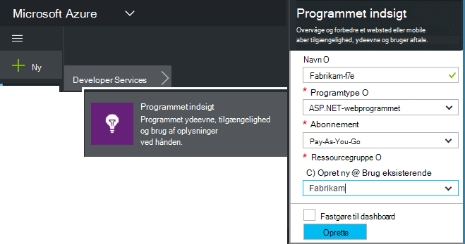
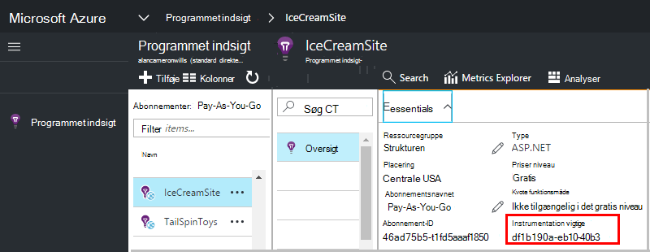

<properties 
    pageTitle="Oprette en ny programmet indsigt ressource | Microsoft Azure" 
    description="Konfigurere programmet indsigt overvågning for et nyt live program. Webbaseret tilgang." 
    services="application-insights" 
    documentationCenter=""
    authors="alancameronwills" 
    manager="douge"/>

<tags 
    ms.service="application-insights" 
    ms.workload="tbd" 
    ms.tgt_pltfrm="ibiza" 
    ms.devlang="na" 
    ms.topic="article" 
    ms.date="08/26/2016" 
    ms.author="awills"/>

# Oprette en programmet indsigt ressource

Visual Studio programmet indsigt viser data om dit program i en Microsoft Azure *ressource*. Oprette en ny ressource derfor er en del af [konfigurationen af programmet indsigt til at overvåge et nyt program][start]. Dette kan gøres automatisk ved IDE-enheden i mange situationer, og det er den anbefalede måde, hvor den er tilgængelig. Men i nogle tilfælde kan du oprette en ressource manuelt.

Når du har oprettet ressourcen, kan du få instrumentation nøglen og bruge den til at konfigurere SDK i programmet. Dette sender telemetri til ressourcen.

## Tilmelde dig til Microsoft Azure

Hvis du ikke allerede har en [Microsoft-konto, få én nu](http://live.com). (Hvis du bruger tjenester som Outlook.com, OneDrive, Windows Phone eller XBox Live, du allerede har en Microsoft-konto.)

Du skal også et abonnement på [Microsoft Azure](http://azure.com). Hvis dit team eller din organisation har et abonnement på Azure, kan ejeren føje dig til det, ved hjælp af dit Windows Live-ID.

Eller du kan oprette et nyt abonnement. Den gratis konto kan du prøve alt i Azure. Når prøveperioden udløber, kan du finde det overkommelige abonnement relevante, som du ikke kan betale gratis tjenester. 

Når du har adgang til et abonnement, logge på programmet indsigt på [http://portal.azure.com](https://portal.azure.com), og bruger dit Live ID til logon.

## Oprette en programmet indsigt ressource
  

Tilføj en ressource programmet indsigt i [portal.azure.com](https://portal.azure.com):

* **Programtype** påvirker, hvad du ser på bladet oversigt og de egenskaber, der er tilgængelige i [metriske explorer][metrics]. Hvis du ikke kan se din type app, skal du vælge ASP.NET.
* **Ressourcegruppe** er en praktisk til at administrere egenskaber som adgangskontrol. Hvis du allerede har oprettet andre Azure ressourcer, kan du vælge at placere denne nye ressource i den samme gruppe.
* **Abonnementet** er betalingskontoen i Azure.
* **Placeringen** er, hvor vi bevare dataene. I øjeblikket er ændres det ikke.
* **Føj til startboard** indsætter et hurtig adgang felt for din ressource på startsiden for Azure. Anbefales.

Når din app er blevet oprettet, åbnes en ny blade. Dette er, hvor du kan se ydeevne og data om brug af om din app. 

For at få tilbage til den næste gang du logge på Azure, se for din app Hurtig start felt på start tavle (startskærm). Eller klik på Gennemse for at finde den.

## Kopiere instrumentation nøglen

Tasten instrumentation identificerer den ressource, du har oprettet. Du skal bruge den til at give i SDK.

## Installere SDK i din app

Installere programmet indsigt SDK i din app. Dette trin er meget afhænger af typen dit program. 

Brug tasten instrumentation til at konfigurere [SDK, som du har installeret i dit program][start].

SDK indeholder standard moduler, sender telemetri uden at du behøver at skrive en kode. Spore brugerhandlinger eller diagnosticere problemer mere detaljeret, [bruger API'EN] [ api] til at sende din egen telemetri.

## Se telemetridata

Luk bladet Hurtig start for at vende tilbage til dit program blade i portalen Azure.

Klik på feltet Søg for at få vist [Diagnosticering Søg][diagnostic], hvor de første hændelser vises. 

Klik på Opdater efter et par sekunder, hvis du forventer flere data.

## Automatisk oprettelse af en ressource

Du kan oprette en [PowerShell-script](app-insights-powershell-script-create-resource.md) for at oprette en ressource automatisk.

## Næste trin

* [Oprette et dashboard](app-insights-dashboards.md)
* [Diagnosticering søgning](app-insights-diagnostic-search.md)
* [Udforske målepunkter](app-insights-metrics-explorer.md)
* [Skrive Analytics-forespørgsler](app-insights-analytics.md)

<!--Link references-->

[api]: app-insights-api-custom-events-metrics.md
[diagnostic]: app-insights-diagnostic-search.md
[metrics]: app-insights-metrics-explorer.md
[start]: app-insights-overview.md

 