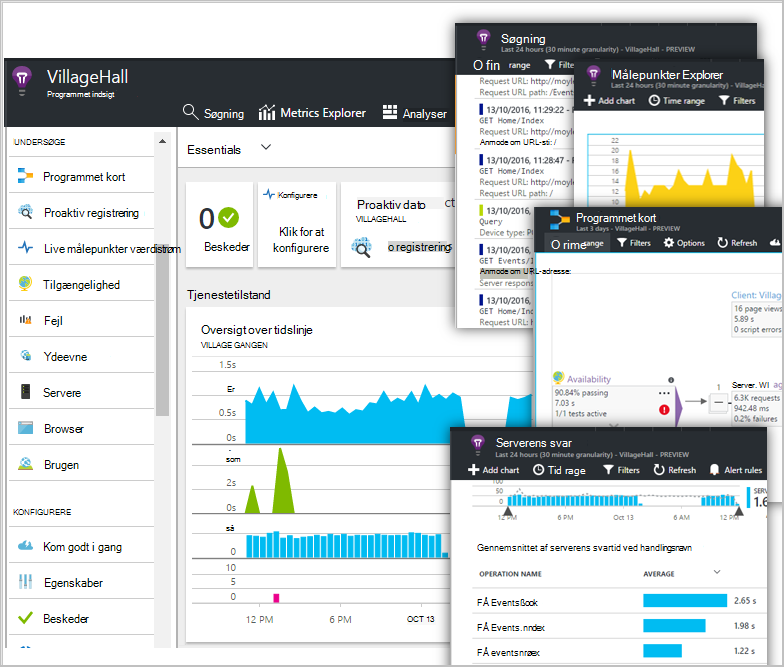

<properties
    pageTitle="Dashboards og navigation i portalen programmet indsigt | Microsoft Azure"
    description="Oprette visninger af dine vigtige APM diagrammer og forespørgsler."
    services="application-insights"
    documentationCenter=""
    authors="alancameronwills"
    manager="douge"/>

<tags
    ms.service="application-insights"
    ms.workload="tbd"
    ms.tgt_pltfrm="ibiza"
    ms.devlang="multiple"
    ms.topic="article" 
    ms.date="10/18/2016"
    ms.author="awills"/>

# Navigation og Dashboards i portalen programmet indsigt

Når du har [oprettet programmet indsigt i dit projekt](app-insights-overview.md), vises telemetridata om ydeevne og brug af din app i dit projekts programmet indsigt ressource i [Azure-portalen](https://portal.azure.com).

## Finde din telemetri

Log på [Azure-portalen](https://portal.azure.com) , og gå til programmet indsigt ressourcen, du har oprettet for din app.

Oversigt over blade (side) for din app viser en oversigt over de vigtigste diagnosticering målepunkter af din app, og er en gateway til de andre funktioner i portalen.

Du kan tilpasse en af de andre diagrammer og fastgøre dem til et dashboard. På den måde, du kan samle de vigtigste diagrammer fra forskellige apps.

## Dashboards

Det første du ser, når du logger på [Microsoft Azure-portalen](https://portal.azure.com) er et dashboard. Her kan du samle de diagrammer, der er vigtigst for dig på tværs af alle dine Azure ressourcer, herunder telemetri fra [Visual Studio programmet indsigt](app-insights-overview.md).
 

1. **Naviger til bestemte ressourcer** som din app i programmet indsigt: bruge panelet til venstre.
2. **Gå tilbage til det aktuelle dashboard**eller skifte til andre seneste visninger: Brug den rullemenuen i øverste venstre hjørne.
3. **Skift dashboards**: Brug den rullemenuen på overskriften dashboard
4. **Opret, Rediger og del dashboards** på værktøjslinjen dashboard.
5. **Redigere dashboardet**: Hold markøren over et felt og derefter bruge den øverste bjælke til at flytte, tilpasse eller fjerne den.

## Føje til et dashboard

Når du kigger på en blade eller et sæt af diagrammer, der er særligt interessant, kan du fastgøre en kopi af filen til dashboard. Du får vist den næste gang du vender tilbage der.

1. Fastgør diagram til dashboard. En kopi af diagrammet vises på dashboardet.
2. Fastgøre bladet hele til dashboard - det vises på dashboardet til som et felt, som du kan klikke gennem.
3. Klik på det øverste venstre hjørne at vende tilbage til det aktuelle dashboard. Derefter kan du bruge den rullemenuen at vende tilbage til den aktuelle visning.

Bemærk, at diagrammer er inddelt i felter: et felt kan indeholde mere end ét diagram. Du fastgøre hele feltet til dashboard.

### Fastgøre en forespørgsel i Analytics

Du kan også [fastgøre Analytics](app-insights-analytics-using.md#pin-to-dashboard) diagrammer til et [delt](#share-dashboards-with-your-team) dashboard. Dette giver dig mulighed at tilføje diagrammer på en vilkårlig forespørgsel sammen med den almindelige målepunkter. (Der er et gebyr for denne funktion).

## Justere et felt på dashboardet

Når der er et felt på dashboardet til, kan du justere den.

1. Føje et diagram til feltet. 
2. Angive metrisk, Gruppér efter dimension og typografien (tabel, graf) i et diagram.
3. Træk hen over et diagram for at zoome ind; Klik på knappen Fortryd for at nulstille timespan indstille filteregenskaber for diagrammerne i feltet.
4. Indstil feltet Titel.

Felter, der er fastgjort fra metriske explorer blade har flere redigeringsindstillinger end felter fastgjort fra en oversigt over blade.

Det oprindelige felt, du fastgjort påvirkes ikke af ændringerne.

## Skifte mellem dashboards

Du kan gemme mere end én dashboard og skifte mellem dem. Når du Fastgør et diagram eller blade, bliver de føjet til den aktuelle dashboard.

For eksempel kan du har et dashboard til visning af fuld skærm i team rum og en anden for generel udvikling.

På dashboardet til en blade vises som et felt: Klik på det for at gå til bladet. Et diagram kopieres diagrammet i den oprindelige placering.

## Dele dashboards

Når du har oprettet et dashboard, kan du dele den med andre brugere.

Få mere at vide om [roller og adgangskontrol](app-insights-resources-roles-access-control.md).

## App navigation

Oversigt over blade er gatewayen til flere oplysninger om din app.

* **Et diagram eller side om side** - Klik på en side om side eller i et diagram for at få vist flere detaljer om det viser den.

### Oversigt over blade knapper

* [**Målepunkter Explorer**](app-insights-metrics-explorer.md) - Opret din egen diagrammer af ydeevnen for og brugen.
* [**Søgning**](app-insights-diagnostic-search.md) – undersøge bestemte forekomster af begivenheder som anmodninger, undtagelser, eller log sporinger.
* [**Analytics**](app-insights-analytics.md) - effektive forespørgsler over din telemetri.
* **Tidsinterval** - justere det område, der vises i alle diagrammer på bladet.
* **Slette** - Slet programmet indsigt ressourcen for denne app. Også skal du fjerne programmet indsigt-pakker fra din app-kode eller redigere [instrumentation nøgle](app-insights-create-new-resource.md#copy-the-instrumentation-key) i din app til at dirigere telemetri til en anden ressource programmet indsigt.

### Under fanen Essentials

* [Instrumentation nøgle](app-insights-create-new-resource.md#copy-the-instrumentation-key) – identificerer denne app ressource. 
* Priser - gøre funktioner tilgængelige og angive lydstyrken bogstaver.

### Navigationslinjen App

* **Oversigt** - gå tilbage til bladet app oversigt.
* **Aktivitetslog** - beskeder og Azure administrative hændelser.
* [**Adgangskontrol**](app-insights-resources-roles-access-control.md) – giver adgang til teammedlemmer og andre.
* [**Mærker**](../resource-group-using-tags.md) - Brug mærker til at gruppere din app med andre.

UNDERSØGE

* [**Programmet kort**](app-insights-app-map.md) - aktive tilknytning, der viser komponenterne i dit program udledt fra oplysninger om objektafhængigheder.
* [**Proaktiv diagnosticering**](app-insights-proactive-diagnostics.md) - Gennemse seneste ydeevne beskeder.
* [**Live Stream**](app-insights-metrics-explorer.md#live-stream) - en fast antal næsten øjeblikkeligt statistik, nyttig, når du installerer et nyt build eller fejlfinding.
* [**Tilgængelighed / Web test**](app-insights-monitor-web-app-availability.md) -sende almindelige anmodninger til din online fra rundt om world.* 
* [**Fejl, ydeevne**](app-insights-web-monitor-performance.md) - undtagelser, manglende satser og svar klokkeslæt for anmodninger om til din app og for anmodninger fra din app til [afhængigheder](app-insights-asp-net-dependencies.md).
* [**Performance**](app-insights-web-monitor-performance.md) - svartid, afhængighed svar klokkeslæt. 
* [Servere](app-insights-web-monitor-performance.md) – tællere i ydeevne. Tilgængelig, hvis du [installerer Status skærm](app-insights-monitor-performance-live-website-now.md).

* **Browser** - sidevisning og AJAX ydeevne. Tilgængelig, hvis du [instrumentere dine websider](app-insights-javascript.md).
* **Brugen** - siden visning, bruger og session tæller. Tilgængelig, hvis du [instrumentere dine websider](app-insights-javascript.md).

KONFIGURERE

* **Introduktion** - indbygget selvstudium.
* **Egenskaber** - instrumentation nøgle, abonnement og ressource-id.
* [Beskeder](app-insights-alerts.md) - metriske beskeder om konfiguration.
* [Fortløbende eksportere](app-insights-export-telemetry.md) – konfigurere eksport af telemetri til Azure-lager.
* [Test af ydeevne](app-insights-monitor-web-app-availability.md#performance-tests) – oprette en korte belastning på dit websted.
* [Kvote og priser](app-insights-pricing.md) og [indtagelse udvalg](app-insights-sampling.md).
* **API-adgang** - oprette [Slip anmærkninger](app-insights-annotations.md) og API'EN Data Access.
* [**Arbejde elementer**](app-insights-diagnostic-search.md#create-work-item) – oprette forbindelse til en sporing system, så du kan oprette fejl under undersøge telemetri.

INDSTILLINGER

* [**Låse**](..\resource-group-lock-resources.md) - låse Azure ressourcer
* [**Automatiseringsscript**](app-insights-powershell.md) - eksportere en definition af Azure ressourcen, så du kan bruge den som en skabelon til at oprette nye ressourcer.

SUPPORT

* **Anmodning om support** - kræver et betalt abonnement. Se også [få hjælp](app-insights-get-dev-support.md).

## Hvad skal der ske nu?

||
|---|---
|[Målepunkter explorer](app-insights-metrics-explorer.md) Filtrer og segmentet målepunkter|
|[Diagnosticering søgning](app-insights-diagnostic-search.md) Finde og undersøge begivenheder relaterede begivenheder og oprette fejl |
|[Analyser](app-insights-analytics.md) Effektiv forespørgselssprog| 

