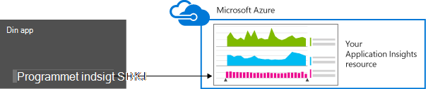
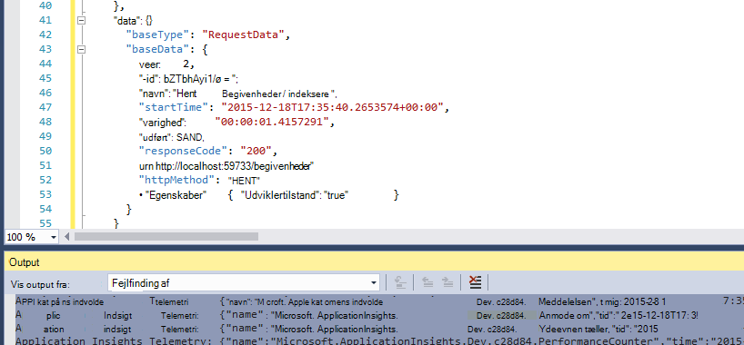
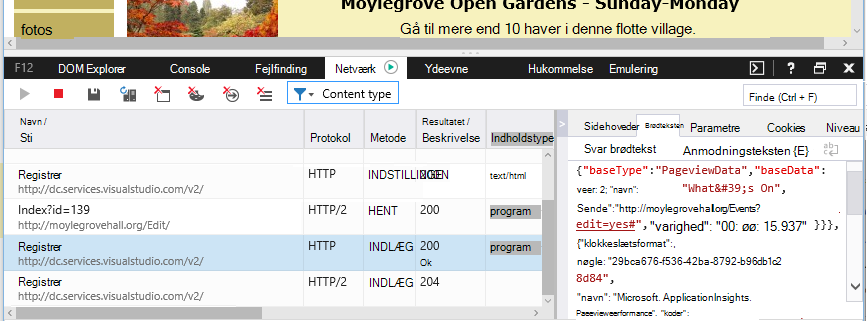

<properties 
    pageTitle="Dataopbevaring og lager i programmet indsigt" 
    description="Politikerklæringen opbevaring og beskyttelse af personlige oplysninger" 
    services="application-insights" 
    documentationCenter=""
    authors="alancameronwills" 
    manager="douge"/>

<tags 
    ms.service="application-insights" 
    ms.workload="tbd" 
    ms.tgt_pltfrm="ibiza" 
    ms.devlang="na" 
    ms.topic="article" 
    ms.date="05/17/2016" 
    ms.author="awills"/>

# Dataindsamling, opbevaring og lagring i programmet indsigt 

*Programmet indsigt er i Vis udskrift.*

Når du installerer [Visual Studio programmet indsigt] [ start] SDK i din app, sender programmet telemetri om din app til skyen. Naturligvis gerne ansvarlig udviklere vil vide præcis hvilke data der sendes, hvad sker der med dataene, og hvordan de kan bevare kontrollen over den. Især kunne følsomme oplysninger sendes, hvor er den lagrede, og hvor sikkert er det? 

Første, det korte svar:

* De almindelige telemetri moduler, der kører "ikke feltet" er sandsynlighed for, at sende følsomme data til tjenesten. Telemetri drejer sig indlæsning, ydeevne og brugen målepunkter, undtagelse rapporter og andre diagnosticering data. De primære brugerdata synlige i diagnosticering rapporter er URL-adresser; men din app ikke bør under alle omstændigheder placerer følsomme data i almindelig tekst i en URL-adresse.
* Du kan skrive programkode, der sender yderligere brugerdefinerede telemetri kan hjælpe dig med diagnosticering og overvåge brugen. (Denne udvidelsesmuligheder af er en god funktion i programmet indsigt). Det ville være muligt ved en fejl, du kan skrive denne kode, så den indeholder personlige og andre følsomme data. Hvis dit program fungerer med sådanne data, skal du anvende stærke Gennemse processer til alle den kode, du skriver.
* Mens du udvikler og tester din app, er det nemt at undersøge, hvad der sendes af SDK. Data, der vises i de fejlfinding output vinduer i IDE og browser. 
* Dataene opbevares i [Microsoft Azure](http://azure.com) -servere i USA. (Men din app kan køre et vilkårligt sted). Azure har [stærke sikkerhed behandler og opfylder et bredt udvalg af overholdelse af standarder](https://azure.microsoft.com/support/trust-center/). Kun dig og dit udpegede team har adgang til dine data. Microsofts medarbejdere kan har begrænset adgang til det kun under bestemte begrænset omstændigheder med din viden. Det er krypteret under overførsel, selvom de ikke er i serverne.

Resten af denne artikel beskrives mere fuldt ud i disse svar. Det er udviklet til at være uafhængige, så du kan vise det til kollegaer, der ikke er en del af teamet øjeblikkelig.

## Hvad er programmet indsigt?

[Visual Studio programmet indsigt] [ start] er en tjeneste, der leveres af Microsoft, der hjælper dig med at forbedre ydeevnen og brugervenligheden programmets direkte. Det overvåger dit program hele tiden den kører, både under testen, og når du har publiceret eller installeret den. Programmet indsigt opretter diagrammer og tabeller, der viser dig, for eksempel, hvilke tider af dagen du får de fleste brugere, hvordan svarede appen er, og hvor godt det leveres af alle eksterne enheder, som den afhænger. Hvis der er går ned, fejl eller problemer med ydeevnen, kan du søge i telemetridata detaljerede oplysninger om at diagnosticere årsagen. Og tjenesten sender dig mails Hvis der er ændringer i tilgængelighed og ydeevnen af din app.

Hvis du vil have denne funktionalitet, du har installeret et program indsigt SDK i dit program, som bliver en del af dens kode. Når din app kører, i SDK overvåger driften og sender telemetri til tjenesten programmet indsigt. Dette er en skybaseret tjeneste, der er hostet af [Microsoft Azure](http://azure.com). (Men programmet indsigt fungerer for alle programmer, ikke kun dem, der er hostet i Azure).

Tjenesten programmet indsigt gemmer og analyserer telemetri. For at se analysen eller søgning i via den lagrede telemetri skal du logge på din Azure-konto og Åbn ressourcen, programmet indsigt for dit program. Du kan også dele adgang til data med andre medlemmer af teamet eller med angivne Azure abonnenter.

Du kan have data, der er eksporteret fra tjenesten programmet viden, for eksempel til en database eller til eksterne funktioner. Du kan angive hvert værktøj med en speciel nøgle, får du fra tjenesten. Tasten kan tilbagekaldes, hvis det er nødvendigt. 

Programmet indsigt SDK'er er tilgængelige for et område af programmet typer: web tjenester, der findes i din egen J2EE eller ASP.NET-servere eller i Azure; Web klienter – det vil sige, den kode, der kører på en webside skrivebords-apps og tjenesteydelser enhed apps som Windows Phone, iOS og Android. De alle sende telemetri til den samme tjeneste.

## Hvilke data indsamler det?

### Hvordan er dataene, der indsamles?

Der er tre datakilder:

* SDK, som du integrerer med din app [er under udvikling](app-insights-asp-net.md) eller [på kørselstidspunktet](app-insights-monitor-performance-live-website-now.md). Der findes forskellige SDK'er for programmet på forskellige typer. Der er også en [SDK til websider](app-insights-javascript.md), der indlæser ind i den slutbrugerens browser sammen med siden.

 * Hver SDK indeholder et antal [moduler](app-insights-configuration-with-applicationinsights-config.md), bruge forskellige teknikker til at samle forskellige typer telemetri.
 * Hvis du har installeret SDK er under udvikling, kan du bruge dens API til at sende din egen telemetri, ud over de almindelige moduler. Denne brugerdefinerede telemetri kan medtage alle data, du vil sende.
* I nogle webservere er der også supportmedarbejdere, der kører sammen med app, og send telemetri om CPU, hukommelse og netværk ibrugtagning. Azure FOS, Docker værter og [J2EE servere](app-insights-java-agent.md) kan for eksempel har disse aktører.
* [Tilgængelighed test](app-insights-monitor-web-app-availability.md) er processer kører af Microsoft, som sender anmodninger til din online med jævne mellemrum. Resultaterne er sendt til tjenesten programmet indsigt.

### Hvilke typer data indsamles?

De vigtigste kategorier er:

* [Web server telemetri](app-insights-asp-net.md) - HTTP-anmodninger.  URI, tid at behandle anmodningen, svarkode, klienten IP-adresse. Session-id.
* [Websider](app-insights-javascript.md) - side, bruger og session tæller. Sideindlæsningstider. Undtagelser. AJAX opkald.
* Ydeevnen tællere - hukommelse, CPU EY, netværk ibrugtagning.
* Klient- og kontekst - OS landestandard enhedstype, browser, og skærmopløsning.
* [Undtagelser](app-insights-asp-net-exceptions.md) og går ned - **stak gemmer**, opbygge-id, CPU type. 
* [Afhængigheder](app-insights-asp-net-dependencies.md) - opkald til eksterne tjenester som RESTEN, SQL, AJAX. URI eller forbindelse streng, varighed, succes, kommandoen.
* [Tilgængelighed test](app-insights-monitor-web-app-availability.md) - varigheden af test og trin, svar.
* [Spore logfiler](app-insights-search-diagnostic-logs.md) og [brugerdefinerede telemetri](app-insights-api-custom-events-metrics.md) - **noget du kode ind i dine logfiler eller telemetri**.

[Mere detaljeret](#data-sent-by-application-insights).

## Hvordan kan jeg kontrollere, hvad der indsamles?

Hvis du udvikler appen med Visual Studio, skal køre appen i fejlsikret tilstand (F5). Telemetri vises i vinduet Output. Derfra kan du kopiere det og formatere dem som JSON til nem inspektion. 

Der er også en mere læsevenlig visning i vinduet diagnosticering.

Åbn din fejlfinding browservindue til websider.

### Kan jeg skrive programkode for at filtrere på telemetri, før den er sendt?

Dette ville være muligt ved at skrive en [telemetri processor plug-in'en](app-insights-api-filtering-sampling.md).

## Hvor lang tid der dataene bevares? 

Rækkedata punkter (det vil sige, elementer, som du kan kontrollere i diagnosticering Søg), bevares for 7 dage. Hvis du vil bevare dataene, der er længere end, der skal kan du bruge [fortløbende Eksportér](app-insights-export-telemetry.md) for at kopiere den til en lagerplads konto.

Aggregerede data (det vil sige, tæller, gennemsnit og andre statistiske data, du ser i metrisk Explorer) bevares på en korn, 1 minut i 30 dage, og 1 time eller 1 dag (afhængigt af typen) i mindst 90 dage.

## Hvem kan få adgang til dataene?

Data, der er synlige for dig og, hvis du har en firmakonto, dine teammedlemmer. 

Det kan eksporteres som du og dine teammedlemmer og kan kopieres til andre placeringer og overføres til andre personer.

#### Hvad gør Microsoft med oplysningerne om min app sender til programmet indsigt?

Microsoft bruger dataene kun for at give dig tjenesten.

## Hvor er dataene, der afholdes? 

* I USA. 

#### Kan det være lagret et andet sted, for eksempel i Europa? 

* Ikke på nuværende tidspunkt. 

#### Betyder, min app der skal være placeret i USA?

* Nej. Programmet kan køre hvor som helst, i din egen lokale hosts eller i skyen.

## Hvor sikkert er mine data?  

Programmet indsigt er en Azure Service i Vis udskrift. Mens vi arbejder sammen med at beskytte dine data i de politikker, der er beskrevet i [Azure sikkerhed, beskyttelse af personlige oplysninger, og overholdelse hvidbog](http://go.microsoft.com/fwlink/?linkid=392408)i Vis udskrift.

Data, der er gemt i Microsoft Azure-servere. For konti i portalen Azure er kontoens begrænsninger, der beskrevet i [Azure sikkerhed, beskyttelse af personlige oplysninger, og overholdelse af dokumentet](http://go.microsoft.com/fwlink/?linkid=392408). [Visual Studio Team Services-databeskyttelse](http://download.microsoft.com/download/8/E/E/8EE6A61C-44C2-4F81-B870-A267F1DF978C/MicrosoftVisualStudioOnlineDataProtection.pdf) dokumentet gælder for konti i Visual Studio Team Services-portalen. 

Adgang til dine data af Microsoft personale er begrænset. Vi adgang til dine data kun med din tilladelse, og hvis der er nødvendige for at understøtte din brug af programmet indsigt. 

Data i aggregat på tværs af alle vores kunders programmer (som data satser og gennemsnitlige størrelse af sporinger) bruges til at forbedre programmet indsigt.

#### Kan en anden persons telemetri forstyrre dataene programmet indsigt?

De kan sende yderligere telemetri til din konto ved hjælp af tasten instrumentation, som kan findes i koden for dine websider. Med nok yderligere data, vil din målepunkter ikke korrekt repræsenterer din app ydeevne og brugen.

Hvis du dele kode med andre projekter, skal du huske at fjerne produktnøglen instrumentation.

## Er dataene krypteret? 

Ikke i servere på nuværende tidspunkt.

Alle data er krypteret, når det flytter mellem datacentre.

#### Er dataene krypteret under overførsel fra mit program til programmet indsigt servere?

Ja, vi bruge https til at sende data til portalen fra næsten alle SDK'er, herunder-servere, enheder og HTTPS websider. Den eneste undtagelse er data, der sendes fra almindelig HTTP websider. 

## Personlige oplysninger

#### Kunne personligt Identifiable oplysninger (PII) sendes til programmet indsigt? 

Ja, det er muligt. 

Som generelle retningslinjer:

* De fleste standard telemetri (det vil sige, telemetri sendt uden at du skriver en hvilken som helst kode) omfatter ikke eksplicit PII. Det kan dog være muligt at identificere personer ud fra afledning i en samling af begivenheder.
* Undtagelse og sporing meddelelser kan indeholde PII
* Brugerdefinerede telemetri – det vil sige, opkald som TrackEvent, du skriver i kode ved hjælp af API eller log sporinger - kan indeholde data du vælger.

Tabellen i slutningen af dette dokument indeholder mere detaljerede beskrivelser af de data, der indsamles.

#### Kan jeg ansvarlig for at overholde love og bestemmelser med hensyn til PII?

Ja. Det er dit ansvar at sikre, at indsamling og anvendelse af dataene i overensstemmelse med love og bestemmelser og med for Microsoft Online Services.

Du skal oplyse kunderne korrekt om de data, der indsamles af programmet, og hvordan data, der skal bruges.

#### Slår Mine brugere fra programmet indsigt?

Ikke direkte. Vi giver ikke nogen en parameter, der kan fungere dine brugere at deaktivere programmet indsigt.

Du kan dog implementere en sådan funktion i dit program. Alle SDK'er omfatter en API-indstilling, markeres, deaktiveres telemetri af websteder. 

#### Mit program er blevet indsamling af følsomme oplysninger. Kan programmet indsigt flytte skydekontrollen disse data så det ikke bevares?

Programmet indsigt ikke filtrere eller slette dine data. Du skal administrere dataene korrekt og undgå at sende disse oplysninger til programmet indsigt.

## Data, der sendes af programmet indsigt

SDK'er varierer mellem platforme, og der er flere forskellige komponenter, som du kan installere. (Refererer til [programmet indsigt - Introduktion][start].) Hver komponent sender forskellige data.

#### Klasser af data, der sendes i forskellige scenarier

Din handling  | Dataklasser indsamles (se næste tabel)
---|---
[Føje programmet indsigt SDK til et .NET webprojekt][greenbrown] | ServerContext Udledes Performance tællere Anmodninger om **Undtagelser** Session brugere
[Installere Status skærm på IIS][redfield]|Afhængigheder ServerContext Udledes Performance tællere
[Føje programmet indsigt SDK til en Java WebApp][java]|ServerContext Udledes Anmode om Session brugere
[Føje JavaScript SDK til webside][client]|ClientContext  Udledes Siden ClientPerf AJAX
[Angive standardegenskaber][apiproperties]|**Egenskaber for** alle standardfarver og brugerdefinerede hændelser
[Ringe til TrackMetric][api]|Numeriske værdier **Egenskaber**
[Ringe til Registrer *][api]|Navn på denne begivenhed **Egenskaber**
[Ringe til TrackException][api]|**Undtagelser** Stak **Egenskaber**
SDK kan ikke indsamle data. Eksempel:   -kan ikke få adgang til performance tællere  -undtagelse i telemetri initialisering | SDK diagnosticering
 

For [SDK'er til andre platforme][platforms], se deres dokumenter.

#### Klasser af indsamlede data

Indsamlede data klasse | Omfatter (ikke en omfattende liste) 
---|---
**Egenskaber**|**Data - afhænger af din kode**
DeviceContext |-Id, IP-adresse, landestandard, enhedsmodel, netværk, netværkstype, OEM-navn, skærmopløsning, rolle forekomst, rollenavn, enhedstype
ClientContext |OS, landestandard, sprog, netværk og vinduet opløsning
Session | Session-id
ServerContext |Computernavn, landestandard, OS, enhed, brugersession, brugerkontekst, handling 
Udledes |geografisk placering fra IP-adresse, tidsstempel, OS, browser
Målepunkter | Metriske navn og værdi
Begivenheder | Navn på denne begivenhed og værdi
PageViews | URL-adresse og siden navn eller kaldenavn
Klient performance | URL-adressen/sidenavn, browser indlæsningstiden
AJAX | HTTP-opkald fra en webside til server
Anmodninger om |URL-adresse, varighed, svarkode
Afhængigheder|Type (SQL, HTTP,...), forbindelsesstreng eller URI, Synkroniser/asynkron, varighed, succes, SQL-sætning (med Status skærm)
**Undtagelser** | Type, **meddelelse**, stak af kald, kilde fil- og linje tal, tråd-id
Går ned | Proces-id, id for overordnet proces, nedbrud tråd-id. programrettelse, -id, build;  Undtagelsestype, adresse, eller anden grund; sløret symboler og registre, binær start- og adresser, binært navn og stien, cpu type
Sporing | **Meddelelse** og alvor niveau
Performance tællere | Processortid tilgængelig hukommelse anmodning rente, undtagelse rente, proces private byte, læse / skrivehastighed, og varighed af anmodning, anmode om længde kø
Tilgængelighed | Web test svarkode, varigheden af hver trin test, test navn, tidsstempel, succes, svartid, test placering
SDK diagnosticering | Sporing meddelelse eller en undtagelse 

Du kan [skifte fra nogle af dataene ved redigering ApplicationInsights.config][config]

## Kredit

Dette produkt indeholder GeoLite2 data, der er oprettet af MaxMind, fra [http://www.maxmind.com](http://www.maxmind.com).

## Videoer

#### Introduktion

> [AZURE.VIDEO application-insights-introduction]

#### Komme i gang

> [AZURE.VIDEO getting-started-with-application-insights]

<!--Link references-->

[api]: app-insights-api-custom-events-metrics.md
[apiproperties]: app-insights-api-custom-events-metrics.md#properties
[client]: app-insights-javascript.md
[config]: app-insights-configuration-with-applicationinsights-config.md
[greenbrown]: app-insights-asp-net.md
[java]: app-insights-java-get-started.md
[platforms]: app-insights-platforms.md
[pricing]: http://azure.microsoft.com/pricing/details/application-insights/
[redfield]: app-insights-monitor-performance-live-website-now.md
[start]: app-insights-overview.md

 