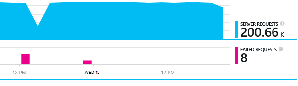

<properties 
    pageTitle="Diagnosticere problemer med afhængigheder i programmet indsigt" 
    description="Finde fejl og langsom ydeevne, der er forårsaget af afhængigheder" 
    services="application-insights" 
    documentationCenter=""
    authors="alancameronwills" 
    manager="douge"/>

<tags 
    ms.service="application-insights" 
    ms.workload="tbd" 
    ms.tgt_pltfrm="ibiza" 
    ms.devlang="na" 
    ms.topic="article" 
    ms.date="05/12/2016" 
    ms.author="awills"/>
 
# <a name="diagnosing-issues-with-dependencies-in-application-insights"></a>Diagnosticere problemer med afhængigheder i programmet indsigt


En *afhængighed* er en ekstern komponent, der kaldes af din app. Det er normalt en tjeneste, der kaldes ved hjælp af HTTP, eller en database eller et filsystem. Eller i dit webside script, kan det være en AJAX opkald tilbage til serveren. I Visual Studio programmet viden, kan du nemt se, hvor længe dit program venter afhængigheder, og hvor ofte en afhængighed kaldet mislykkes.

## <a name="where-you-can-use-it"></a>Hvor du kan bruge den

Af feltet er afhængighed overvågning tilgængelige for øjeblikket til:

* ASP.NET webapps og tjenester, der kører på en IIS-server eller på Azure
* [Java webapps](app-insights-java-agent.md)
* [Websider](https://azure.microsoft.com/blog/ajax-collection-in-application-insights/)

Du kan skrive din egen skærm ved hjælp af [TrackDependency API](app-insights-api-custom-events-metrics.md#track-dependency)til andre typer, som enhed apps.

Out box afhængighed skærmen rapporterer aktuelt opkald til disse typer afhængigheder:

* ASP.NET
 * SQL-databaser
 * ASP.NET web og WCF-tjenester, der bruger HTTP-baseret bindinger
 * Lokal eller ekstern HTTP-opkald
 * Azure DocumentDb, tabel, blob-lager og kø
* Java
 * Opkald til en database via en [JDBC](http://docs.oracle.com/javase/7/docs/technotes/guides/jdbc/) driver, som MySQL, SQL Server, PostgreSQL eller SQLite.
* Websider
 * [AJAX opkald](app-insights-javascript.md)

Igen, kan du skrive din egen SDK opkald til at overvåge andre afhængigheder.

## <a name="to-set-up-dependency-monitoring"></a>Konfigurere overvågning af afhængighed

Installer den relevante agent til host-serveren.

Platform | Installere
---|---
IIS-Server | Enten [installere Status skærm på din server](app-insights-monitor-performance-live-website-now.md) eller [opgradere dit program til .NET framework 4.6 eller nyere](http://go.microsoft.com/fwlink/?LinkId=528259) og installere [Programmet indsigt SDK](app-insights-asp-net.md) i din app.
Azure WebApp | [Programmet indsigt lokalnummer](app-insights-azure-web-apps.md)
Java webserver | [Java webapps](app-insights-java-agent.md)
Websider | [JavaScript-skærm](app-insights-javascript.md) (Ingen yderligere konfiguration ud over webside overvågning)
Azure-skytjeneste |  [Brug Start opgave](app-insights-cloudservices.md#dependencies) eller [installere .NET framework 4.6 +](../cloud-services/cloud-services-dotnet-install-dotnet.md)  

Overvågning af Status for IIS-servere er ikke nødvendigt at genopbygge kildeprojektet med programmet indsigt SDK. 

## <a name="application-map"></a>Programmet kort

Programmet kort fungerer som et visuelt hjælpemiddel til opdager afhængigheder mellem komponenterne i dit program. 


Fra felterne, kan du navigere til relevante afhængighed og andre diagrammer.

Klik på den lille [x] for at skjule et undertræ.

Fastgøre kortet til [dashboard](app-insights-dashboards.md), hvor det vil være fuldt funktionelle.

[Få mere at vide](app-insights-app-map.md).

## <a name="diagnosis"></a>Diagnosticere afhængighed problemer med ydeevnen i web-serveren

At vurdere ydeevnen for anmodninger på din server:


Rul ned til Kig på gitter af anmodninger om:


Den øverste, der tager meget lang tid. Lad os se, hvis vi kan finde ud af, hvor den tid.

Klik på rækken for at få vist individuel anmodning hændelser:


Klik på en hvilken som helst længerevarende forekomst for at undersøge det yderligere.

> [AZURE.NOTE] Rul ned lidt at vælge en forekomst. Ventetid i pipeline kan betyde, at dataene til de øverste forekomster er ufuldstændig.

Rul ned til de ekstern afhængighed-opkald, der er relateret til denne anmodning:


Det ser ud som de fleste af de tid vedligeholdelse anmodningen blev brugt i et opkald til en lokal tjeneste. 

Markér rækken til at få flere oplysninger:


Detaljerne indeholder tilstrækkelige oplysninger til at undersøge problemet.


## <a name="failures"></a>Fejl

Hvis der er mislykkede anmodninger skal du klikke på diagrammet.



Klik dig gennem en anmodning om type og anmodning om forekomst, til at finde et mislykkedes opkald til en ekstern afhængighed.


## <a name="custom-dependency-tracking"></a>Brugerdefineret afhængighed registrering

Afhængighed til sporing af standardmodul opdager automatisk eksterne afhængigheder som databaser og REST API'er. Men ønsker du måske nogle yderligere komponenter skal behandles på samme måde. 

Du kan skrive programkode, der sender oplysninger om afhængighed, ved hjælp af den samme [TrackDependency API](app-insights-api-custom-events-metrics.md#track-dependency) , der bruges af de almindelige moduler.

Hvis du opretter din kode med en samling, som du ikke selv har skrevet dig selv, kan du samtidig alle opkald til det, at finde ud af hvilke bidrag til din svar tid. Hvis disse data, der vises i afhængighed diagrammerne i programmet viden, skal du sende det via `TrackDependency`.

```C#

            var success = false;
            var startTime = DateTime.UtcNow;
            var timer = System.Diagnostics.Stopwatch.StartNew();
            try
            {
                success = dependency.Call();
            }
            finally
            {
                timer.Stop();
                telemetry.TrackDependency("myDependency", "myCall", startTime, timer.Elapsed, success);
            }
```

Hvis du vil skifte fra modulet standard afhængighed sporing, skal du fjerne referencen til DependencyTrackingTelemetryModule i [ApplicationInsights.config](app-insights-configuration-with-applicationinsights-config.md).


## <a name="ajax"></a>AJAX

Se [dine websider](app-insights-javascript.md).


 