<properties
    pageTitle="Registrere, prioritere, diagnosticere"
    description="Analysere går ned og registrere og diagnosticere problemer med ydeevnen i dine programmer"
    authors="alancameronwills"
    services="application-insights"
    documentationCenter=""
    manager="douge"/>

<tags
    ms.service="application-insights"
    ms.workload="tbd"
    ms.tgt_pltfrm="ibiza"
    ms.devlang="na"
    ms.topic="article" 
    ms.date="11/06/2015"
    ms.author="awills"/>

# Registrere, prioritere og diagnosticere med programmet indsigt

*Programmet indsigt er i Vis udskrift.*

Programmet indsigt kan du finde ud af, hvordan din app klarer sig og anvendes, når det er direkte. Og hvis der er et problem, den giver besked om det, kan du vurdere virkningen og hjælper med at du bestemme årsagen.

Her er en konto fra en gruppe, der udvikler webprogrammer:

* *"Et par dage siden, vi installeret en"mindre"programrettelse. Vi kunne ikke køre generelle test bestået, men desværre nogle uventet ændring har flettet ind i dataene, forårsager inkompatibilitet mellem forside og bagside ender. Med det samme, server undtagelser blev større vores besked udløses, og vi har foretaget opmærksom på situationen. Nogle få klik væk på portalen programmet viden, har vi nok oplysninger fra undtagelse callstacks til at indskrænke problemet. Vi rulles tilbage med det samme og begrænset på skader. Programmet indsigt har foretaget denne del af devops, flytte, meget nemt og brugbare."*

Lad os se, hvordan et typisk web development team bruger programmet indsigt til at overvåge ydeevnen. Vi skal følge teamet i Fabrikam Bank, der udvikler online bank systemet (OBS).

Teamet arbejder på en cyklus således:

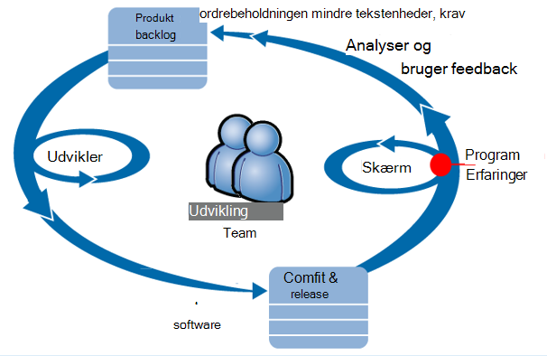

Krav til feed i deres udvikling ordrebeholdningen (liste over opgaver). De fungerer kort sagt spurter, hvor ofte leverer arbejde software – som regel i form af forbedringer og udvidelser til det eksisterende program. Appen direkte er ofte opdateret med nye funktioner. Selvom det er direkte, overvåger teamet den til ydeevne og brugen ved hjælp af programmet indsigt. Denne analyse feeds i deres udvikling ordrebeholdningen igen.

Teamet bruger programmet indsigt til at overvåge direkte webprogrammet tæt til:
* Ydeevne. De ønsker at forstå, hvordan svar gange varierer i forhold til anmodning om Tæl; hvor meget CPU, netværk, disk og andre ressourcer bliver brugt; og hvor flaskehalse er.
* Mislykkede forsøg. Hvis der er undtagelser eller mislykkede anmodninger, eller hvis en ydeevne tæller går uden for dets tryg interval, teamet skal kende hurtigt, så de kan udføre handlinger.
* Brug af. Når en ny funktion frigives, vil gruppen, i hvilken grad de anvendes, og om brugere har problemer med den.

Lad os fokusere på feedback en del af cyklussen:

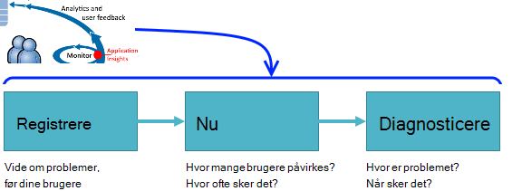

## Registrere dårlig tilgængelighed

Marcela Markova er en erfaren udvikler OBS teammedlemmer og tager kundeemner på overvågning af ydeevnen online. Hun konfigurerer adskillige [web test][availability]:

* En URL-adressen enkelt test for den primære landingsside for appen, http://fabrikambank.com/onlinebanking/. Hun angiver kriterier for HTTP kode 200 og teksten 'Velkommen!'. Hvis testen ikke lykkes, er der noget galt alvorligt med netværket eller servere eller måske et problem med installationen. (Eller en person er blevet ændret siden Velkommen! meddelelse på siden uden at lade sin vide).

* En dybere flere trin test, der logger på og får en løbende konto med en oversigt over, markere et par vigtige oplysninger på hver side. Denne test kontrollerer, at linket til konti databasen fungerer. Hun bruger en opdigtet kunde-id: nogle af dem vedligeholdes til testformål.

Med disse test af konfigurere, er Marcela sikker på, at teamet kan hurtigt at vide om en hvilken som helst afbrydelse.  

Fejl vises som rød prikker på web test diagrammet:

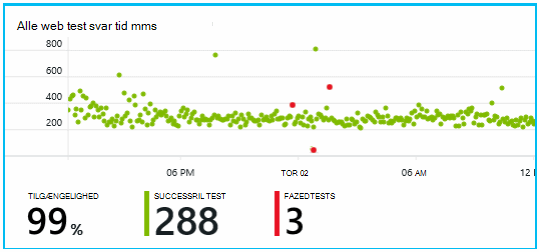

Men vigtigere, en besked om eventuelle fejl blive sendt til udvikling produktteamet. På denne måde, de få kendskab til den, før næsten alle kunderne.

## Overvåge ydeevnen målepunkter

På oversigtssiden i programmet viden, der er et diagram, der viser en række [vigtige mål][perf].

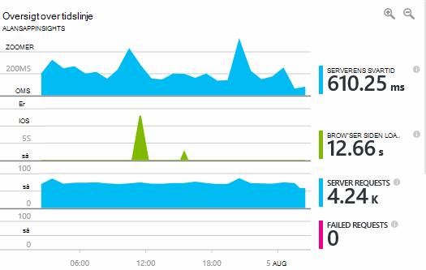

Browser siden indlæsningstiden er udledt fra telemetri sendes direkte fra dine websider. Serverens svartid, server anmodning om antal og antal mislykkede anmodninger alle målt i web-serveren og sendes til programmet indsigt derfra.

Marcela er en smule bekymre sig om på server svar graf, som viser den gennemsnitlige tid mellem, når serveren modtager en HTTP-anmodning fra en brugers browser, og når den returnerer svaret. Det er ikke usædvanlige at se en variation i dette diagram, som varierende belastning på systemet. Men i dette tilfælde, der synes at være en korrelation mellem små vokser i antallet af anmodninger, og stor stiger i feltet svartid. Der kan skyldes, at systemet fungerer kun på dets begrænsninger. 

Hun åbner servere diagrammer:

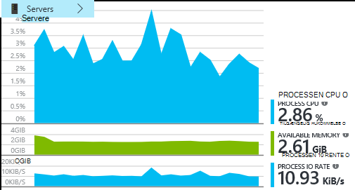

Der synes at være intet tegn på ressource begrænsning der, så måske ujævnheder på server svar diagrammer er bare en coincidence.

## Beskeder

Hun vil dog holde øje med svar gange. Hvis de går for høj, vil hun kende det med det samme.

Så hun angiver en [beskeder][metrics], for svar tidspunkter, der er større end en grænseværdi for typisk. Resultatet er hendes KONFIDENSINTERVAL, som hun kan se om det, hvis svar gange er langsom.

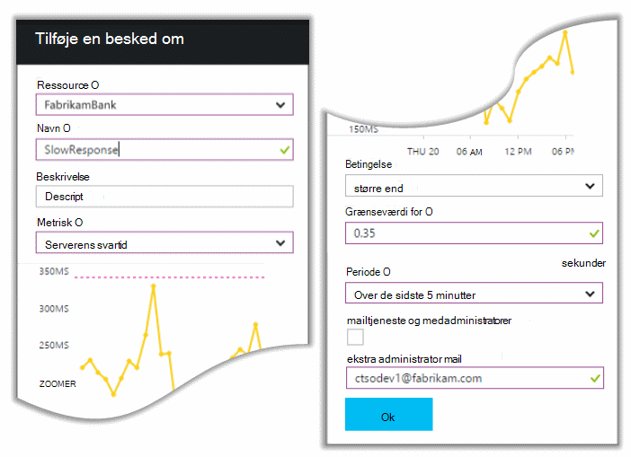

Påmindelser kan angives på en lang række andre målepunkter. Du kan eksempelvis modtage mails, hvis antallet undtagelse bliver høj, eller den tilgængelige hukommelse går lav, eller hvis der ikke er en spidsbelastning i klient-anmodninger.

## Proaktiv diagnosticering beskeder

Næste dag, en e-mail med påmindelse kommer fra programmet indsigt. Men når hun åbner det, hun finder ikke svar tid beskeden, hun har angivet. I stedet fortæller den hun er der oprettet en pludselig stigning i mislykkede anmodninger – det vil sige, forespørgsler, der er returneret fejlkoder på 500 eller derover.

Mislykkede forespørgsler er, hvor brugere har set fejlen - oftest efter en undtagelse udløst i koden. Måske vises en meddelelse siger "Vi beklager vi ikke kunne opdatere dine oplysninger lige nu" eller på absolutte uønskede værste, lagring af en stak på brugerens skærm fra web-serveren.

Denne besked er en overraskelse, fordi den sidste gang, hun har set det, mislykkede anmodninger antallet var encouragingly lav. Der er et lille antal mislykkede forsøg på at forventes i en optaget-server. 

Det var også lidt af en overraskelse for hende da hun ikke havde til at konfigurere denne besked. Faktisk leveres proaktiv diagnosticering automatisk med programmet indsigt. Den automatisk tilpasses til din app normalt manglende mønster og "bliver brugt til at" fejl på en bestemt side eller høj belastning eller sammenkædet med andre målepunkter. Det opretter alarmen kun, hvis der er en stigning over hvad det drejer sig om forvente.

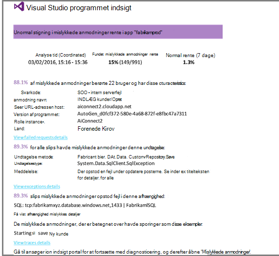

Dette er en praktisk mail. Det hæve ikke bare en alarm den understøtter mange af de nu og diagnosticering arbejde for.

Det viser, hvor mange kunder påvirkes, og hvilke websider eller handlinger. Marcela kan beslutte, om hun har brug at få hele teamet arbejder på dette som en fire analysér, eller om den kan ignoreres indtil næste uge.

E-mailen også viser, at en bestemt undtagelse opstod og - lige mere interessant -, fejlen er knyttet til mislykkedes opkald til en bestemt database. Det forklarer, hvorfor fejlen pludselig blev vist, selvom Marcela's team ikke er installeret nogen opdateringer for nylig. 

Hun pinger lederen for gruppen, database. Ja, de har udgivet en programrettelse i den seneste halv time; og UPS, måske der muligvis har været en mindre skemaændring...

Så er problemet på måde at blive fast, lige før ved at undersøge logfiler og inden for 15 minutter af filen med. Dog klikker Marcela på linket for at åbne programmet indsigt. Det åbnes direkte til en mislykket anmodning, og hun kan se mislykkedes databasen opkald på den tilknyttede liste over afhængighed opkald. 

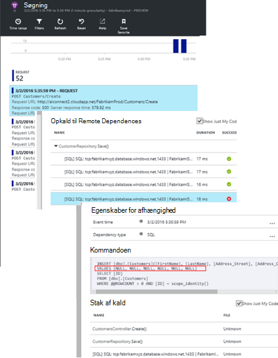

## Registrering af undtagelser

Med et lille stykke af konfigurationen rapporteres [undtagelser](app-insights-asp-net-exceptions.md) til programmet indsigt automatisk. De kan også hentes eksplicit ved at indsætte opkald til [TrackException()](app-insights-api-custom-events-metrics.md#track-exception) i koden:  

    var telemetry = new TelemetryClient();
    ...
    try
    { ...
    }
    catch (Exception ex)
    {
       // Set up some properties:
       var properties = new Dictionary <string, string>
         {{"Game", currentGame.Name}};

       var measurements = new Dictionary <string, double>
         {{"Users", currentGame.Users.Count}};

       // Send the exception telemetry:
       telemetry.TrackException(ex, properties, measurements);
    }

Fabrikam Bank teamet har udviklet altid udsendelse af telemetri på en undtagelse, medmindre der er en indlysende gendannelse.  

Faktisk deres strategi er endnu bredere end: de sender telemetri i alle tilfælde, hvor kunden er frustreret i hvad de helst ville gøre, om den svarer til en undtagelse i koden, eller ej. F.eks., hvis systemet eksterne mellem bank filoverførsel returnerer meddelelsen "ikke kan gennemføre denne transaktion" for en funktionel eller anden grund (ingen fejl kunden) spore derefter de pågældende begivenhed.

    var successCode = AttemptTransfer(transferAmount, ...);
    if (successCode < 0)
    {
       var properties = new Dictionary <string, string>
            {{ "Code", returnCode, ... }};
       var measurements = new Dictionary <string, double>
         {{"Value", transferAmount}};
       telemetry.TrackEvent("transfer failed", properties, measurements);
    }

TrackException bruges til at rapportere undtagelser, fordi den sender en kopi af stablen; TrackEvent bruges til at rapportere andre begivenheder. Du kan knytte en hvilken som helst egenskaber, der kan være nyttige i diagnosticering.

Undtagelser og de hændelser, der vises i [Diagnosticering Søg] [ diagnostic] blade. Du kan få dem til at se de ekstra egenskaber og stable sporing.

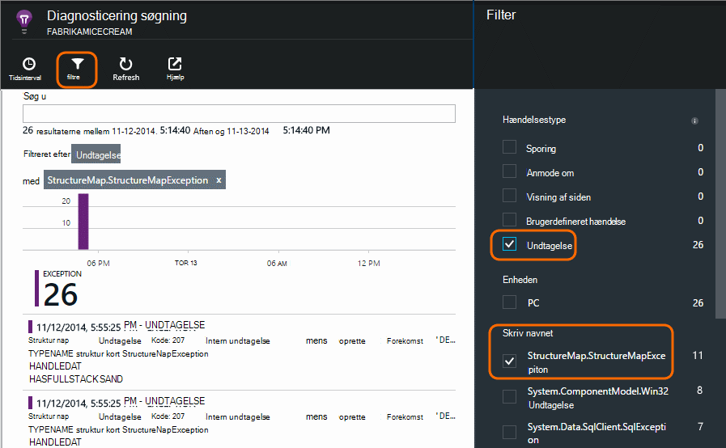

## Overvåge brugeraktivitet

Når svartid er ensartet god, og der er nogle undtagelser, kan Udviklingscenter teamet synes om, hvordan du kan forbedre brugernes oplevelse, og hvordan du opfordre flere brugere at opnå de ønskede mål.

For eksempel en typisk bruger rejse gennem webstedet har en Ryd tragt: mange kunder se på satserne for forskellige typer lån; Nogle af dem Udfyld formularen tilbud; og for dem, der får et tilbud, nogle Fortsæt, og fjern lånet.

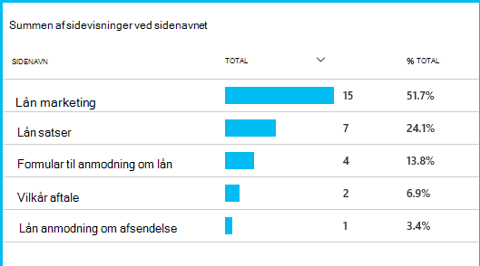

Ved at overveje, hvor det største antal kunder slippe, kan virksomheden arbejde, hvordan du kan få flere brugere gennem til bunden af salgskanal. I nogle tilfælde kan være en bruger oplevelse (UX) fejl – for eksempel knappen "Næste" er svære at finde eller instruktionerne ikke indlysende. Der er mere sandsynligt vigtigere business årsager til udfald: måske lån satserne er for stor.

Uanset grundene, data, der hjælper med at arbejde ud af, hvad brugerne laver teamet. Flere sporing opkald kan indsættes for at arbejde flere detaljer. TrackEvent() kan bruges til at tælle brugerhandlinger, fra detaljeret af individuelle knappen klik at betydeligt resultater som betaler ydelse på et lån.

Teamet få bruges til at få oplysninger om brugeraktivitet. I dag, når de opretter en ny funktion, er de fungerer ud af, hvordan de får feedback om brugen. De Designer sporing opkald til funktionen fra starten. De kan bruge feedbacken til at forbedre funktionen i hver udviklingscyklus.

## Proaktiv overvågning  

Marcela sidde ikke bare omkring venter på beskeder. Når alle geninstallation hun tager nærmere på [svar gange] [ perf] -både den overordnede figur og tabellen med lavest anmodninger samt undtagelse tæller.  

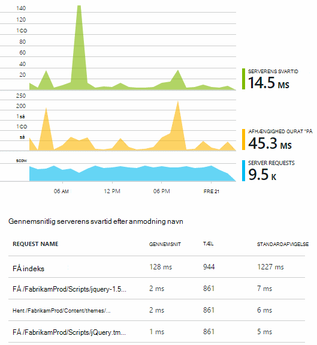

Hun kan vurdere ydeevne effekten af hver installation typisk sammenligne hver uge med sidst. Hvis der er en pludselig forværres, hæver hun, med de relevante udviklere.

## Nu

Nu - vurdering af alvorlighed og omfanget af et problem - er det første trin efter registrering. Bør vi kalder ud teamet ved midnat? Eller kan det være venstre indtil næste praktisk mellemrummet i ordrebeholdningen? Der er nogle vigtige spørgsmål i nu.

Hvor meget sker det? Diagrammer under bladet oversigt give nogle perspektiv til et problem. For eksempel genereres programmet Fabrikam fire web test beskeder én NAT.. Man kigger på diagrammet i i morgen, kan teamet se, at der opstod faktisk nogle røde prikker, hvis stadig de fleste af testene, der var grøn. Analysere i diagrammet tilgængelighed, var den klart, at alle disse periodiske problemer er fra en test placering. Dette er et problem påvirker kun én rute tydeligt og vil sandsynligvis rydde selve.  

Derimod er en dramatisk og stabil stigning i graph undtagelse tæller eller svar gange tydeligt noget til går i panik om.

En nyttig nu uønskede e-mail er prøve det selv. Hvis du støder på det samme problem, kender du det er et reelt tal.

Hvilke brøkdel af brugere påvirkes? For at få et grov svar skal du dividere den manglende rente med session antallet.

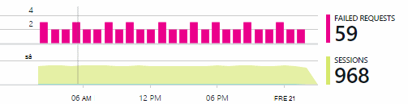

Sammenligne tabellen med lavest svarer anmodninger med brugen hyppigheden for hver side i forbindelse med langsom svar.

Hvordan vigtige er det blokerede scenario? Hvis dette er et tværfunktionelt problem blokering af en bestemt bruger historie, betyder det noget meget? Hvis kunder ikke kan betale deres fakturaer, er alvorlige; Hvis de ikke kan ændre deres skærmen farve præferencer, kan måske den vente. Oplysninger om begivenheden eller undtagelse eller identitet på siden langsom fortæller dig, hvor kunder har problemer.

## Diagnosticering

Diagnosticering er ikke helt den samme som fejlfinding. Inden du starter sporing gennem koden, du skal have en grov ide om, hvorfor, hvor og hvornår problemet bliver til virkelighed.

**Når sker det?** Historiske visningen i begivenhed og metrisk diagrammer gør det nemt at koordinere effekter med mulige årsager. Hvis der er forbigående spidser i svar klokkeslæt eller undtagelse satser, se anmodning antallet: Hvis den spidser ad gangen og derefter ligner et ressourceproblem med. Har du brug for at tildele flere CPU eller hukommelse? Eller er det en afhængighed, der ikke kan administrere afkrydsningsfeltet Indlæs?

**Er det os?**  Hvis du har en pludselig slip i ydeevnen for en bestemt type – f.eks når kunden ønsker et kontoudtog - anmodning, så er der mulighed for kan det være en ekstern undersystem i stedet for dit webprogram. Vælg afhængighed manglende rente og afhængighed varigheden satser målepunkter Stifinder, og sammenligne deres oversigter over de seneste par timer eller dage, som indeholder det problem, du har fundet. Hvis der korrelere ændringer, kan en ekstern undersystem være i blame.  

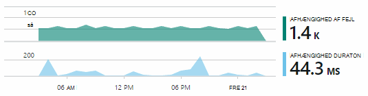

Nogle langsom afhængighed problemer er geolokalitet problemer. Fabrikam Bank bruger Azure virtuelle maskiner og har opdaget, at de havde ved et uheld placeret deres webserver og kontoserver i forskellige lande. En dramatisk forbedring blev hentet ind at overføre de.

**Hvad vi?** Hvis problemet ikke vises, skal være i en afhængighed, og hvis det ikke altid der, skyldes det formentlig en seneste ændring. Historiske perspektivet leveres af metriske og begivenhed diagrammer gør det nemt at koordinere pludselig ændringer med installationer. Indsnævrer søgningen efter problemet.

**Hvad sker der?** Nogle af de problemer forekommer kun sjældent og kan være svært at spore ved at teste offline. Alle kan vi er forsøger at registrere fejlen, når det opstår live. Du kan undersøge stak gemmer i undtagelse rapporter. Desuden kan du skrive sporing opkald med din foretrukne logføring framework eller med TrackTrace() eller TrackEvent().  

Fabrikam havde et forbigående problem med pengeoverførsler mellem konto, men kun i forbindelse med visse kontotyper. For bedre for at forstå Hvad sker der, indsættes de TrackTrace() opkald på vigtige punkter i den kode, vedhæfte kontotypen som en egenskab til hver opkald. Der gør det nemt at filtrere sporinger i diagnosticering Søg. De også vedhæftet parameterværdier som egenskaber og målinger til at spore kald.

## Håndtere det.

Når du har diagnosticeret problemet, kan du foretage en plan for at løse problemet. Du skal muligvis annullere en seneste ændring, eller måske du kun kan gå videre og løse problemet. Når fix er færdig, fortæller programmet indsigt dig, om du lykkedes.  

Fabrikam bankens udviklingsteam tage en mere struktureret fremgangsmåde til performance-måling end de bruges til at, før de bruges programmet indsigt.

* De angive ydeevne mål med hensyn til bestemte mål programmet indsigt oversigt på siden.

* De Designer målinger af ydeevne i programmet fra starten, som den målepunkter, måle bruger forløbet gennem 'skorstene'.  

## Brugen

Programmet indsigt kan også bruges til at få mere at vide, hvad brugerne gøre med en app. Når den kører hurtigere, vil teamet gerne vide hvilke funktioner er de mest populære, hvad brugere kan lide eller har problemer med, og hvor ofte de kommer tilbage. Der kan hjælpe dem med at prioritere deres kommende arbejde. Og de kan planlægger at måle succes for hver funktion som en del af udviklingscyklus. [Læs mere][usage].

## Dine programmer

Så er, hvordan et team Brug programmet indsigt ikke kun til at løse individuelle problemer, men at forbedre deres udviklingslivscyklus. Jeg håber, at det har givet dig nogle ideer til, hvordan programmet indsigt kan hjælpe dig med at forbedre ydeevnen for dine egne programmer.

## Video

[AZURE.VIDEO performance-monitoring-application-insights]

<!--Link references-->

[api]: app-insights-api-custom-events-metrics.md
[availability]: app-insights-monitor-web-app-availability.md
[diagnostic]: app-insights-diagnostic-search.md
[metrics]: app-insights-metrics-explorer.md
[perf]: app-insights-web-monitor-performance.md
[usage]: app-insights-web-track-usage.md
 
