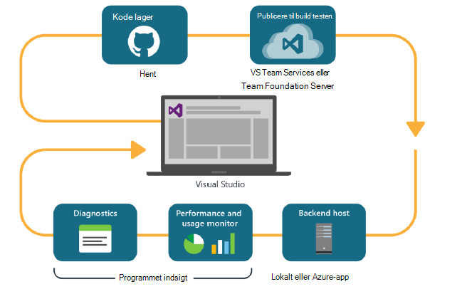

<properties
    pageTitle="Udvikler Analytics"
    description="DevOps med Visual Studio, programmet indsigt og HockeyApp"
    authors="alancameronwills"
    services="application-insights"
    documentationCenter=""
    manager="douge"/>

<tags
    ms.service="application-insights"
    ms.workload="tbd"
    ms.tgt_pltfrm="ibiza"
    ms.devlang="na"
    ms.topic="article" 
    ms.date="05/18/2016"
    ms.author="awills"/>

# Udvikler Analytics med programmet indsigt og HockeyApp

*Programmet indsigt er i Vis udskrift.*

Mange projekter betjene en hurtig [DevOps](https://en.wikipedia.org/wiki/DevOps) cyklus. De opbygge og distribuere deres programmer, få feedback om hvordan udfører den, og hvad brugerne gøre med dem og derefter bruge denne viden til at planlægge yderligere udvikling skifter. 

Hvis du vil overvåge brugen og ydeevne, er det vigtigt at har telemetri fra programmet direkte og feedback fra brugerne selv. 

Mange systemer er opbygget fra flere komponenter: en webtjeneste, back end-processorer eller data butikker og klientsoftware kører i brugerens browser eller som en app i en mobiltelefon eller en anden enhed. Telemetri fra disse forskellige komponenter, der skal være sammenlagt.

Nogle versioner har begrænset distribution til udpegede testere; Vi har også organiseret flighting (test af nye funktioner med begrænset målgrupper) og A | B test (parallelle test af alternative Brugergrænsefladen).

Administrere salgsdistributioner og integration af overvågning over flere klienten og serveren komponenter er ikke en simpel opgave. Denne proces er en vigtig del af arkitekturen af programmet: Vi kan ikke oprette et system af dette venlig uden en gentagen udviklingscyklus og god overvågning værktøjer.

I denne artikel vil vi se på, hvordan de overvågning aspekter af devOps cyklus ind på med de øvrige dele af processen. 

Hvis du gerne vil se på en bestemt eksempel, er der [en interessant Casestudie](http://aka.ms/mydrivingdocs) , der har flere klient- og komponenter.

## En DevOps cyklus

Visual Studio og udvikler Analytics værktøjer tilbyder en godt integreret devOps oplevelse. Her er for eksempel en typisk cyklus for et webprogram (der kunne være Java, Node.js eller ASP.NET):

* En udvikler tjekker til kode lager, eller flettes ind i den primære gren. Lageret er ciffer i denne illustration, men det kan være [Team Foundation versionsstyring](https://www.visualstudio.com/docs/tfvc/overview)lige.
* Ændringerne udløse en build og de test. Tjenesten build kan være i [Visual Studio Team Services eller dens lokale modstykke, Team Foundation Server](https://www.visualstudio.com/docs/vsts-tfs-overview). 
* En vellykket build og enhedstest kan [udløse en automatisk installation](https://www.visualstudio.com/docs/release/author-release-definition/more-release-definition). Værten web app kan være enten din egen webserver eller Microsoft Azure. 
* Telemetri fra direkte app der sendes til [Programmet viden](app-insights-overview.md), både fra serveren og [fra klientbrowsere](app-insights-javascript.md). Der, kan du analysere ydeevnen af app for og brugen mønstrene. Hjælp til effektive [søgeværktøjer](app-insights-analytics.md) du diagnosticere eventuelle problemer. Kontrollér, at du vide om et problem, så snart den opstår [beskeder](app-insights-alerts.md) . 
* Dine næste udviklingscyklus besked ved dine analyser af direkte telemetri.

### Enhed og -apps

For enhed og -programmer på computeren er fordeling del af cyklussen lidt anderledes, fordi vi ikke bare overførsel til en eller to servere. I stedet kan en vellykket build og enhedstest [udløse overførsel til HockeyApp](https://support.hockeyapp.net/kb/third-party-bug-trackers-services-and-webhooks/how-to-use-hockeyapp-with-visual-studio-team-services-vsts-or-team-foundation-server-tfs). HockeyApp overvåger fordeling med dit team test brugere (eller til offentligheden, hvis du foretrækker det). 

HockeyApp indsamler også ydeevne og Brugsdata i formularerne for:

* Ordret bruger feedback med skærmbilleder
* Nedbrud rapporter
* Brugerdefinerede telemetri indkodet af dig.

DevOps cyklus udfyldes igen, når du foretager dine fremtidig udviklingsplaner på baggrund af feedback erfaringer.

## Konfiguration af udvikler Analytics

For hver komponent i dit program - mobile eller internettet eller computeren - er trinnene grundlæggende det samme. For mange typer app udfører Visual Studio automatisk nogle af disse trin.

1. Tilføje den relevante SDK til din app. Det er HockeyApp til enhed apps, og til webtjenester er det program indsigt. Hver har flere varianter for forskellige platforme. (Det er også muligt at bruge enten SDK til-programmer på computeren, men vi anbefaler HockeyApp.)
2. Registrere din app ved hjælp af programmet indsigt eller HockeyApp portal, afhængigt af den SDK, som du har brugt. Dette er hvor får du vist analyser fra din direkte app. Du får en instrumentation nøgle eller -ID, som du konfigurere til din app, så SDK ved, hvor du vil sende dens telemetri.
3. Tilføj brugerdefineret kode (efter behov) for at logge begivenheder eller statistik, kan hjælpe dig med diagnosticering eller til at analysere ydeevne eller brugen. Der er mange overvågning indbygget, så du ikke skal bruge denne på din første cyklus.
3. Til apps til enheder:
 * Overføre et fejlfinding build til HockeyApp. Derfra kan du distribuere den til en gruppe af testbrugere. Når du overfører efterfølgende opbygger, får besked om teamet.
 * Når du konfigurerer din fortløbende oprette service, oprette en definition af udgave, der bruger det plug-in'en trin til at overføre til HockeyApp.

### Analyser og Eksportér til HockeyApp telemetri

Du kan undersøge HockeyApp brugerdefineret og logge telemetri ved hjælp af de analyser og fortløbende eksportere funktioner i programmet indsigt ved [at konfigurere en bro](app-insights-hockeyapp-bridge-app.md).

## Næste trin
 
Her er den detaljerede vejledning for forskellige typer app:

* [ASP.NET WebApp](app-insights-asp-net.md) 
* [Java WebApp](app-insights-java-get-started.md)
* [Node.js online](https://github.com/Microsoft/ApplicationInsights-node.js)
* [iOS-app](https://support.hockeyapp.net/kb/client-integration-ios-mac-os-x-tvos/hockeyapp-for-ios)
* [Mac OS X-app](https://support.hockeyapp.net/kb/client-integration-ios-mac-os-x-tvos/hockeyapp-for-mac-os-x)
* [Android-appen](https://support.hockeyapp.net/kb/client-integration-android/hockeyapp-for-android-sdk)
* [Universal Windows-app](https://support.hockeyapp.net/kb/client-integration-windows-and-windows-phone/how-to-create-an-app-for-uwp)
* [Windows Phone 8 og 8.1 app](https://support.hockeyapp.net/kb/client-integration-windows-and-windows-phone/hockeyapp-for-windows-phone-silverlight-apps-80-and-81)
* [Præsentation af Windows Foundation app](https://support.hockeyapp.net/kb/client-integration-windows-and-windows-phone/hockeyapp-for-windows-wpf-apps)

