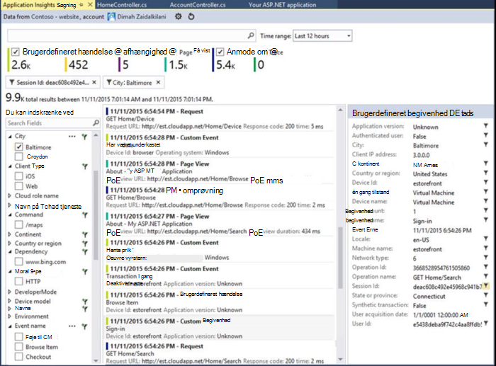

<properties 
    pageTitle="Ved hjælp af diagnosticering søgning | Microsoft Azure" 
    description="Søge og filtrere individuelle konkurrencer, anmodninger, og log sporinger." 
    services="application-insights" 
    documentationCenter=""
    authors="alancameronwills" 
    manager="douge"/>

<tags 
    ms.service="application-insights" 
    ms.workload="tbd" 
    ms.tgt_pltfrm="ibiza" 
    ms.devlang="na" 
    ms.topic="article" 
    ms.date="06/09/2016" 
    ms.author="awills"/>
 
# Ved hjælp af diagnosticering søgning i programmet indsigt

Diagnosticering søgning er en funktion i [Programmet indsigt] [ start] , at du bruger til at finde og udforske individuelle telemetri elementer som sidevisninger undtagelser, eller web anmodninger. Og du kan få vist, log sporinger og begivenheder, du har indkodet.

## Hvor kan du se diagnosticering søgning?

### På portalen Azure

Du kan åbne diagnosticering Søg eksplicit:

Det åbner også, når du klikker på gennem nogle diagrammer og gitter elementer. I dette tilfælde er dens filtre allerede angivet til at fokusere på typen element, du har valgt. 

Eksempelvis hvis dit program er en webtjeneste, viser bladet oversigt over et diagram over lydstyrken for anmodninger. Klik på den, og du får til en mere detaljeret diagram med en liste, der viser, hvor mange anmodninger om der er foretaget for hvert URL-adresse. Klik på en hvilken som helst række, og du får en liste over de enkelte anmodninger for denne URL-adresse:

Hoveddelen af diagnosticering søgning er en liste over telemetri elementer - anmodninger til serveren, siden visninger, brugerdefinerede hændelser, du har kodet osv. Øverst på listen er en oversigt over diagram, der viser antallet af hændelser over tid.

Hændelser, der typisk vises i diagnosticering søgning før de vises i metriske explorer. Selvom bladet opdaterer selve med intervaller, kan du klikke på Opdater, hvis du venter for en bestemt hændelse.

### I Visual Studio

Åbn vinduet Søg i Visual Studio:

Vinduet Søg har de samme funktioner som webportalen:

## Udvalg

Hvis din app genereres en masse telemetri (og du bruger ASP.NET SDK version 2.0.0-beta3 eller nyere), modulet tilpasset stikprøver, hvor der automatisk reducere lydstyrken, der sendes til portalen ved at sende en repræsentant brøkdel af begivenheder. Dog hændelser, der er relateret til den samme anmodning markeres eller ikke er markeret som en gruppe, så du kan navigere mellem relaterede begivenheder. 

[Få mere at vide om udvalg](app-insights-sampling.md).

## Undersøge individuelle elementer

Vælg en hvilken som helst telemetri elementet for at se nøglefelter og relaterede elementer. Hvis du vil se det samlede sæt af felter, skal du klikke på "...". 

Brug almindelig strenge (uden jokertegn) til at finde det samlede sæt af felter. De tilgængelige felter afhænger af typen telemetri.

## Oprette arbejdsopgave

Du kan oprette en fejl i Visual Studio Team Services med oplysninger fra en hvilken som helst telemetri element. 

Første gang du gør dette, bliver du bedt om at konfigurere et link til dit Team Services-kontoen og project.

(Du kan også finde bladet konfiguration under Indstillinger > arbejdselementer.)

## Filtrere typer begivenheder

Åbn bladet Filter, og vælg typerne begivenhed, du vil have vist. (Hvis du senere, du vil gendanne de filtre, som du har åbnet bladet, skal du klikke på Nulstil).

Typerne begivenhed er:

* **Sporing** - diagnosticeringslogfiler, herunder TrackTrace, log4Net, NLog og System.Diagnostic.Trace opkald.
* **Anmode om** – HTTP-anmodninger modtaget af din serverprogram, herunder sider, scripts, billeder, typografi filer og data. Disse hændelser bruges til at oprette anmodning og svar oversigt diagrammer.
* **Sidevisning** - Telemetri, der er sendt af webklienten bruges til at oprette siden view-rapporter. 
* **Custom Event** - Hvis du har indsat opkald til TrackEvent() i ordre for at [overvåge brugen][track], du kan søge efter dem her.
* **Undtagelse** - ikke-opfanget undtagelser i serveren og dem, du logger ved hjælp af TrackException().

## Filtrere efter egenskabsværdier

Du kan filtrere begivenheder på værdierne i deres egenskaber. De tilgængelige egenskaber afhænger af typerne begivenhed, du har valgt. 

Vælg eksempelvis ud af anmodninger om med en bestemt svarkode.

Vælge nogen værdier for en bestemt egenskab har den samme effekt som vælge alle værdier. den skifter fra filtrering på denne egenskab.

### Indsnævre søgningen

Bemærk, at der vises tæller til højre for filterværdier, hvor mange forekomster der er i det aktuelle filtrerede sæt. 

I dette eksempel har den Fjern, som den `Reports/Employees` anmode om resultater i fleste af 500 fejl:

Hvis du vil også se, hvilke andre begivenheder sker der i denne periode, kan du desuden se **Medtag begivenheder med udefineret egenskaber**.

## Fjerne bot og web test trafik

Anvende filteret **reelle eller korte trafik** , og Markér **reelt tal**.

Du kan også filtrere efter **kilden til korte trafik**.

## Undersøge individuelle forekomster

Føje med anmodning om navnet til sættet filter, og du kan derefter undersøge individuelle forekomster over den pågældende begivenhed.

Vis undtagelser, der er indtruffet mens anmodningen blev behandlet for anmodning om begivenheder oplysninger.

Klik dig gennem en undtagelse for at se dens detaljer, herunder staksporing.

## Finde hændelser med samme egenskab

Finde alle elementer med den samme egenskabsværdi:

## Søge efter metriske værdi

Få alle anmodninger om svartid > 5s.  Gange er repræsenteret i akser: 10 000 aksemærker = 1ms.

## Søge efter data

Du kan søge efter ord i en af egenskabsværdierne. Dette er især nyttig, hvis du har skrevet [brugerdefinerede hændelser] [ track] med egenskabsværdier. 

Du skal måske angiver et område, som søgninger over et kortere område er hurtigere. 

Søge efter ord, ikke understrenge. Vilkår er alfanumeriske strenge, herunder nogle tegnsætning som '.' og '_'. Eksempel:

ord|*ikke* matches af|men disse stemmer overens
---|---|---
HomeController.About|om privat|h\*om privat\*
IsLocal|lokale er \*lokale|ISL\* islocal i\*l\*
Ny forsinkelse|w d|ny forsinkelse n\* og d\*

Her er de søgeudtryk, kan du bruge:

På eksempelforespørgsel | Effekt 
---|---
sænke|Finde alle begivenheder i det datointerval, hvis felter indeholder ordet "langsomme"
database?|Svarer til database01, databaseAB... ? er ikke tilladt i starten af et søgeord.
database * |Svarer til databasen, database01, databaseNNNN  * er ikke tilladt i starten af et søgeord
Apple og bananer|Find hændelser, der indeholder begge ord. Bruge capital "og" ikke "og".
Apple eller bananer Apple bananer|Find hændelser, der indeholder et udtryk. Brug "Eller", ikke "eller". < /br/ > kort formular.
Apple ikke bananer Apple-bananer|Find hændelser, der indeholder et udtryk, men ikke på den anden. Kort form.
App * og bananer-(grape pear)|Logiske operatorer og fremkommet.
"Metrisk": 0 til 500 "Metrisk": 500 til * | Find hændelser, der indeholder det navngivne mål inden for værdiområdet.

## Gemme din søgning

Når du har angivet alle de ønskede filtre, kan du gemme søgningen som en favorit. Hvis du arbejder i en organisationskonto, kan du vælge, om du vil dele den med andre gruppemedlemmer.

Se søge igen, **Gå til bladet oversigt** og åbne favoritter:

Hvis du har gemt med Relative tidsinterval, har bladet igen åbnet de nyeste data. Hvis du har gemt med absolutte tidsinterval skal se du de samme data hver gang.

## Sende flere telemetri til programmet indsigt

Ud over den out box telemetri, der sendes af programmet indsigt SDK, kan du:

* Registrere log sporinger fra din foretrukne logføring framework i [.NET] [ netlogs] eller [Java][javalogs]. Denne betyder, at du kan søge i dine log sporinger og koordinere dem med sidevisninger, undtagelser og andre begivenheder. 
* [Skrive programkode] [ track] til at sende brugerdefinerede hændelser, sidevisninger og undtagelser. 

[Lær at sende logfiler og brugerdefinerede telemetri til programmet indsigt][trace].

## Q & A

### Hvor meget data bevares?

Op til 500 begivenheder sekundet fra hvert program. Hændelser bevares til syv dage.

### Hvordan kan jeg se INDLÆG data i min anmodninger til serveren?

Vi ikke kan logge INDLÆG data automatisk, men du kan bruge [TrackTrace eller log opkald][trace]. Placer INDLÆG data i parameteren meddelelse. Du kan ikke filtrere på meddelelsen, som du kan egenskaber, men størrelsesgrænsen er længere.

## Næste trin

* [Sende logfiler og brugerdefinerede telemetri til programmet indsigt][trace]
* [Konfigurere tilgængeligheden og svartid test][availability]
* [Fejlfinding i forbindelse med][qna]

<!--Link references-->

[availability]: app-insights-monitor-web-app-availability.md
[javalogs]: app-insights-java-trace-logs.md
[netlogs]: app-insights-asp-net-trace-logs.md
[qna]: app-insights-troubleshoot-faq.md
[start]: app-insights-overview.md
[trace]: app-insights-search-diagnostic-logs.md
[track]: app-insights-api-custom-events-metrics.md

 