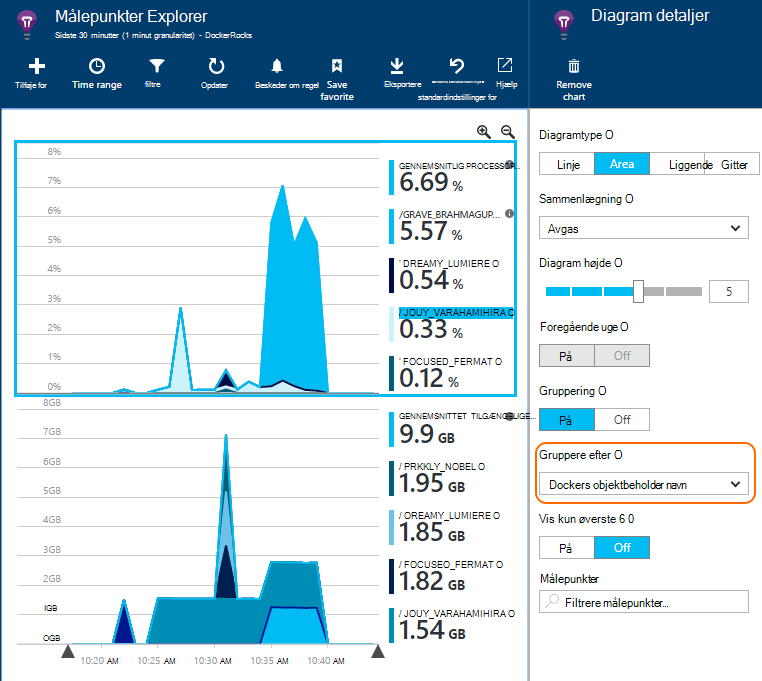

<properties 
    pageTitle="Overvåge Docker programmer i programmet indsigt" 
    description="Docker performance tællere, begivenheder og undtagelser kan ses på programmet viden, sammen med telemetri fra bulkvareenhed apps." 
    services="application-insights" 
    documentationCenter=""
    authors="alancameronwills" 
    manager="douge"/>

<tags 
    ms.service="application-insights" 
    ms.workload="tbd" 
    ms.tgt_pltfrm="ibiza" 
    ms.devlang="na" 
    ms.topic="article" 
    ms.date="12/01/2015" 
    ms.author="awills"/>
 
# <a name="monitor-docker-applications-in-application-insights"></a>Overvåge Docker programmer i programmet indsigt

Livscyklus begivenheder og tællere i ydeevne fra [Docker](https://www.docker.com/) beholdere kan indførsel på programmet indsigt. Installere [Programmet indsigt](app-insights-overview.md) billedet i en objektbeholder i din-vært, og det vises tællere i ydeevne, til værten for samt til de andre billeder.

Med Docker distribuerer du dine apps i lette beholdere komplet med alle afhængigheder. De kører på en hvilken som helst værtsmaskinen, der kører en Docker program.

Når du kører [programmet indsigt billede](https://hub.docker.com/r/microsoft/applicationinsights/) på værten Docker, får du vist disse fordele:

* Livscyklus telemetri om alle beholdere, der kører på værten - starte, stoppe og så videre.
* Tællere i ydeevne for alle beholdere. CPU, hukommelse, brug af netværket og mere.
* Hvis du har [installeret programmet indsigt SDK](app-insights-java-live.md) i de apps, der kører i beholdere, alle telemetri af disse apps har flere egenskaber, der identificerer objektbeholder og host maskinen. Hvis du har forekomster af en app, der kører i mere end én vært, skal du så for eksempel nemt kunne filtrere din app telemetri af vært.


## <a name="set-up-your-application-insights-resource"></a>Konfigurere dit program indsigt ressource

1. Log på [Microsoft Azure-portalen](https://azure.com) , og Åbn programmet indsigt ressourcen for din app eller [oprette en ny](app-insights-create-new-resource.md). 

    *Hvilken ressource skal jeg bruge?* Hvis de apps, du kører på din vært er udviklet af en anden, skal du skal til at [oprette en ny programmet indsigt ressource](app-insights-create-new-resource.md). Dette er, hvor du kan få vist og analysere på telemetri. (Vælg 'Anden' for typen app).

    Men hvis du udvikler Apps, derefter vi håber, du [tilføjede programmet indsigt SDK](app-insights-java-live.md) til hver af dem. Hvis de er alle virkelig komponenterne i et enkelt forretningsprogram, så du kan konfigurere dem til at sende telemetri til én ressource alle, og du skal bruge den samme ressource Docker livscyklus for og ydeevne dataene skal vises. 

    Et tredje scenarie er, at du har udviklet de fleste af apps, men du bruger separat ressourcer til at få vist deres telemetri. Det er tilfældet, du vil sandsynligvis vil også oprette en separat ressource for Docker dataene. 

2.  Tilføje feltet Docker: vælge **Tilføj side om side**skal du trække feltet Docker fra galleriet, og klik derefter på **udført**. 

    


3. Klik på rullelisten **Essentials** og kopiere tasten Instrumentation. Du skal bruge til at fortælle SDK hvor dens telemetri skal viderestilles til.


    

Hold pågældende browservinduet praktiske, som du vil vende tilbage til det snart at kigge på din telemetri.


## <a name="run-the-application-insights-monitor-on-your-host"></a>Køre programmet indsigt skærm på din vært
 
Nu hvor du har konfigureret et sted at få vist telemetri, kan du konfigurere den bulkvareenhed app, vil indsamle og sende den.

1.  Oprette forbindelse til din Docker vært. 
2.  Redigere din instrumentation nøgle til denne kommando, og derefter køre den:
 
    ```

    docker run -v /var/run/docker.sock:/docker.sock -d microsoft/applicationinsights ikey=000000-1111-2222-3333-444444444
    ```

Kun ét program indsigt billede er påkrævet per Docker host. Hvis dit program er installeret på flere Docker værter, Gentag derefter kommandoen i hver vært.

## <a name="update-your-app"></a>Opdatere din app

Hvis dit program er udstyret med [Programmet indsigt SDK til Java](app-insights-java-get-started.md), du tilføje følgende linje i filen ApplicationInsights.xml i projektet, under den `<TelemetryInitializers>` element:

```xml

    <Add type="com.microsoft.applicationinsights.extensibility.initializer.docker.DockerContextInitializer"/> 
```

Dette tilføjer Docker oplysninger som objektbeholder og host-id til hver telemetri element, der sendes fra din app.

## <a name="view-your-telemetry"></a>Få vist din telemetri

Gå tilbage til dit program indsigt ressource i portalen Azure.

Klik på feltet Docker.

Kort får du vist data, der er modtaget fra app Docker, især hvis du har andre beholdere, der kører på din Docker program.


Her er nogle af de visninger, kan du få.

### <a name="perf-counters-by-host-activity-by-image"></a>Performance tællere af vært, aktivitet efter billede


Klik på en hvilken som helst host eller billede navn for at få flere detaljer.


Hvis du vil tilpasse visningen, klikke på et diagram, gitteret overskrift, eller brug tilføje diagram. 

[Lær mere om målepunkter explorer](app-insights-metrics-explorer.md).

### <a name="docker-container-events"></a>Docker objektbeholder begivenheder


Hvis du vil undersøge enkelte hændelser, skal du klikke på [Søg](app-insights-diagnostic-search.md). Søgning og filtrering til at finde de hændelser, du vil. Klik på en hvilken som helst begivenhed for at få flere detaljer.
 
### <a name="exceptions-by-container-name"></a>Undtagelser efter objektbeholder navn
 


### <a name="docker-context-added-to-app-telemetry"></a>Docker kontekst blev føjet til app telemetri

Anmode om telemetri, der sendes fra programmet udstyret med AI SDK, forbedret med Docker kontekst:


Processortid og tilgængelig hukommelsesydelsestællere i ydeevne, forbedret og grupperet efter Docker objektbeholder navn:





## <a name="q--a"></a>Q & A

*Hvad giver programmet indsigt mig, som jeg ikke kan hentes fra Docker?*

* Detaljeret opdeling af tællere i ydeevne ved objektbeholder og billede.
* Integrere objektbeholder og app-data i et dashboard.
* [Eksportere telemetri](app-insights-export-telemetry.md) til yderligere analyse til en database, Power BI eller andre dashboard.

*Hvordan får jeg telemetri fra selve appen?*

* Installere programmet indsigt SDK i appen. Få mere at vide hvordan til: [Java webapps](app-insights-java-get-started.md), [Windows web apps](app-insights-asp-net.md).
