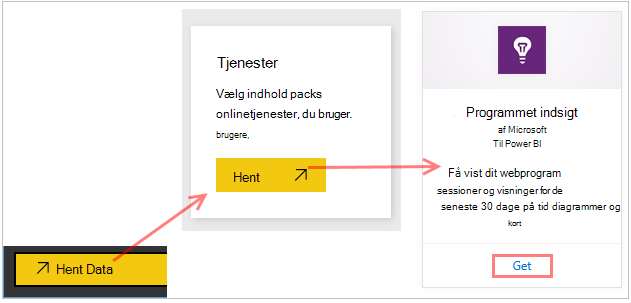
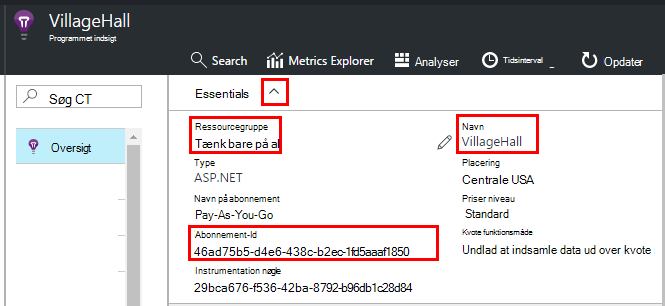
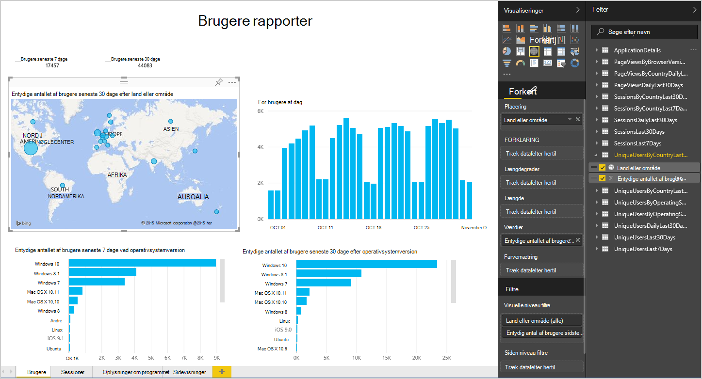
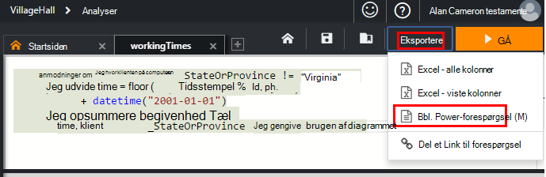
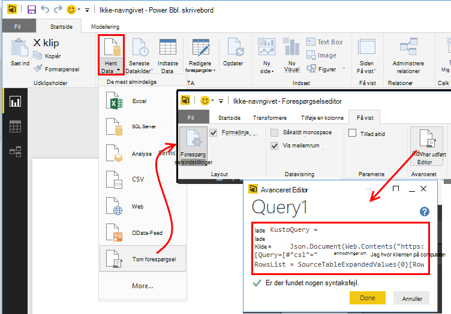
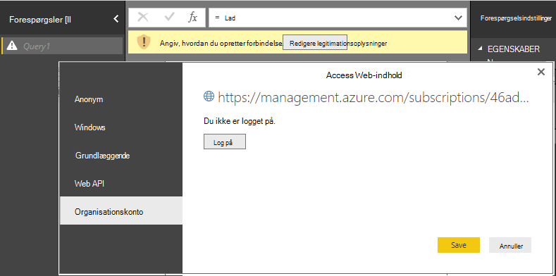
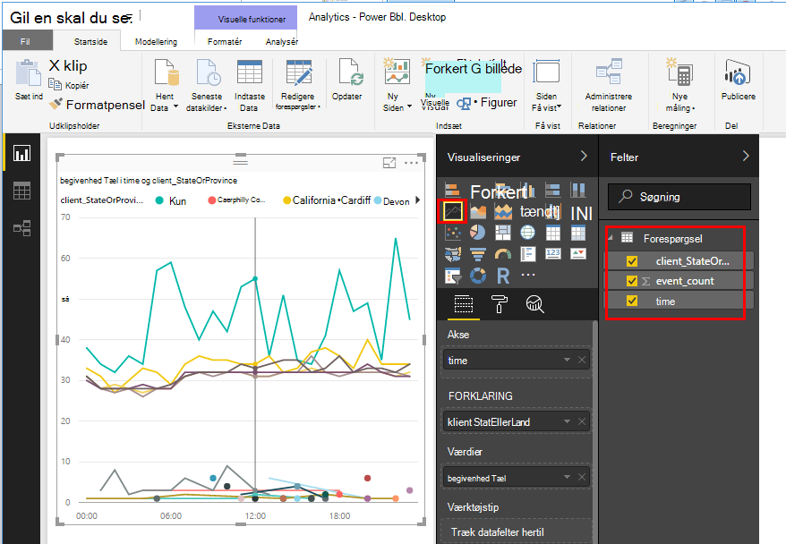
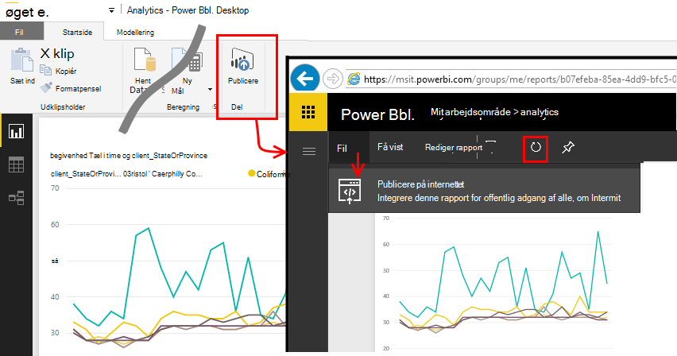

<properties 
    pageTitle="Eksportere til Power BI fra programmet indsigt | Microsoft Azure" 
    description="Analytics forespørgsler kan vises i Power BI." 
    services="application-insights" 
    documentationCenter=""
    authors="noamben" 
    manager="douge"/>

<tags 
    ms.service="application-insights" 
    ms.workload="tbd" 
    ms.tgt_pltfrm="ibiza" 
    ms.devlang="na" 
    ms.topic="article" 
    ms.date="10/18/2016" 
    ms.author="awills"/>

# Power BI-feedet fra programmet indsigt

[Power BI](http://www.powerbi.com/) er en pakke med business analytics-værktøjer, der hjælper dig med at analysere data og dele din indsigt. RTF dashboards er tilgængelige på alle enheder. Du kan kombinere data fra mange kilder, herunder Analytics forespørgsler fra [Visual Studio programmet indsigt](app-insights-overview.md).

Der er tre anbefalede metoder til at eksportere programmet indsigt data til Power BI. Du kan bruge dem enkeltvis eller sammen.

* [**Power BI-adapter**](#power-pi-adapter) - konfigurere et fuldført dashboard af telemetri fra din app. Sæt af diagrammer er foruddefineret, men du kan tilføje dine egne forespørgsler fra andre kilder.
* [**Eksportere Analytics forespørgsler**](#export-analytics-queries) - skrive en forespørgsel, du vil bruge analyser og eksportere den til Power BI. Du kan placere denne forespørgsel på et dashboard sammen med andre data.
* [**Uafbrudt Eksporter og Stream Analytics**](app-insights-export-stream-analytics.md) - dette kræver mere arbejde at konfigurere. Det er praktisk, hvis du vil bevare dataene i lange perioder. Ellers skal er de andre metoder anbefalet.

## Power BI-adapter

Denne metode opretter et fuldført dashboard af telemetri for dig. Det oprindelige datasæt er foruddefineret, men du kan føje flere data til den.

### Få kortet

1. Log på [Power BI](https://app.powerbi.com/).
2. Åbne **hente Data**, **tjenester**, **programmet indsigt**

    

3. Angiv oplysninger om dit program indsigt ressource.

    

4. Vent et minut eller to for dataene, der skal importeres.

    

Du kan redigere dashboardet til at kombinere programmet indsigt diagrammer med de andre kilder, og med Analytics forespørgsler. Der er en visualisering galleri, hvor du kan få flere diagrammer, og de enkelte diagrammer har en parametre, du kan angive.

Efter den første import dashboardet og rapporterne fortsætte med at opdatere dagligt. Du kan styre tidsplan for opdatering på datasættet.

## Eksportere Analytics forespørgsler

Dette kan du skrive en hvilken som helst Analytics-forespørgsel, du er tilfreds, og Eksportér, derefter til et Power BI-dashboard. (Du kan tilføje til dashboard, der er oprettet af kortet).

### Én gang: installere Power BI Desktop

For at importere din programmet indsigt forespørgsel skal bruge du desktop-versionen af Power BI. Men derefter du publicere den på internettet eller til dit Power BI skyen arbejdsområde. 

Installere [Power BI Desktop](https://powerbi.microsoft.com/en-us/desktop/).

### Eksportere en Analytics-forespørgsel

1. [Åbn analyser og skrive din forespørgsel](app-insights-analytics-tour.md).
2. Teste og justere forespørgslen, indtil du er tilfreds med resultatet.
3. I menuen **eksportere** skal du vælge **Power BI (M)**. Gem tekstfilen.

    
4. Vælg **Hent Data, tom forespørgsel** , og vælg derefter **Avancerede Query Editor**under **Vis** i forespørgselseditoren i Power BI Desktop.

    Indsæt scriptet eksporterede M sprog til avanceret Query Editor.

    

5. Du muligvis angive legitimationsoplysninger for at tillade, at få adgang til Azure Power BI. Brug 'organisationskonto' at logge på med din Microsoft-konto.

    

6. Vælg en visualisering af din forespørgsel, og Markér felterne for x-aksen, y-aksen og segmentering dimension.

    

7. Udgive din rapport til dit Power BI skyen arbejdsområde. Derfra kan du integrere en synkroniserede version i andre websider.

    
 
8. Opdatere rapporten manuelt med intervaller, eller konfigurere en planlagt opdatering på indstillingssiden.

## Om udvalg

Hvis dit program sender en stor mængde data, kan funktionen tilpasset udvalg betjene og send kun en procentdel af din telemetri. Den samme er sand, hvis du har angivet udvalg manuelt, i SDK eller på indtagelse. [Lær mere om udvalg.](app-insights-sampling.md)
 

## Næste trin

* [Power BI – få mere at vide](http://www.powerbi.com/learning/)
* [Analytics selvstudium](app-insights-analytics-tour.md)
