<properties 
    pageTitle="Bruge Stream Analytics til at behandle data, der er eksporteret fra programmet indsigt | Microsoft Azure" 
    description="Stream Analytics kan løbende transformere, filtrere og distribuere dataene du eksportere fra programmet indsigt." 
    services="application-insights" 
    documentationCenter=""
    authors="noamben" 
    manager="douge"/>

<tags 
    ms.service="application-insights" 
    ms.workload="tbd" 
    ms.tgt_pltfrm="ibiza" 
    ms.devlang="na" 
    ms.topic="article" 
    ms.date="10/18/2016" 
    ms.author="awills"/>

# <a name="use-stream-analytics-to-process-exported-data-from-application-insights"></a>Bruge Stream Analytics til at behandle eksporterede data fra programmet indsigt

[Azure Stream Analytics](https://azure.microsoft.com/services/stream-analytics/) er ideelt værktøj til at behandle data [eksporteres fra programmet indsigt](app-insights-export-telemetry.md). Stream Analytics kan trække data fra en lang række kilder. Det kan transformere og filtrere dataene, og sende det til en række forskellige dræn.

I dette eksempel skal vi oprette en adapter, der henter data fra programmet viden, omdøber behandler nogle af felterne og pipes i Power BI.

> [AZURE.WARNING] Der er meget bedre nemmere og [anbefalede måder til at vise programmet indsigt data i Power BI](app-insights-export-power-bi.md). Stien illustreret her er blot et eksempel til at illustrere Sådan behandles eksporterede data.

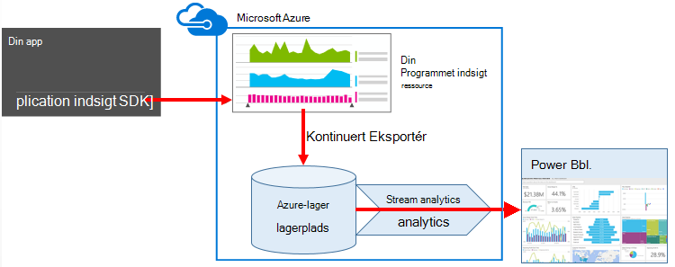


## <a name="create-storage-in-azure"></a>Oprette lagerplads i Azure

Kontinuert eksport udskriver altid data til en Azure-lager-konto, så du skal oprette opbevaring først.

1.  Oprette en "klassisk" lagerplads konto i dit abonnement på [Azure-portalen](https://portal.azure.com).

    

2. Oprette en objektbeholder

    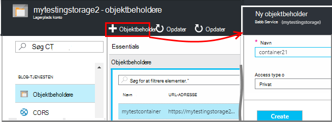

3. Kopiere hurtigtast lagerplads

    Du skal bruge den snart til konfiguration af input til stream analytics-tjenesten.

    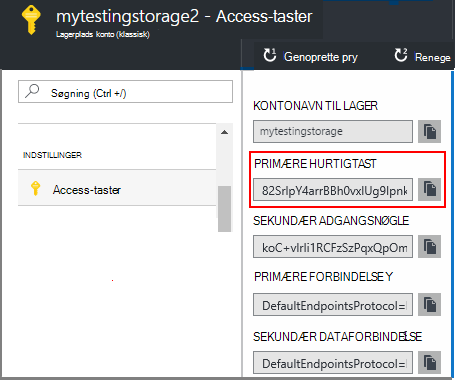

## <a name="start-continuous-export-to-azure-storage"></a>Start fortløbende Eksportér til Azure-lager

Flytter [fortløbende eksportere](app-insights-export-telemetry.md) data fra programmet indsigt i Azure-lager.

1. Find den programmet indsigt ressource, du har oprettet for dit program i Azure-portalen.

    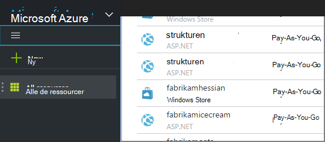

2. Oprette en fortløbende eksport.

    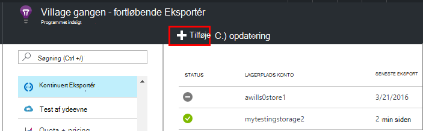


    Vælg kontoen lagerplads du har oprettet tidligere:

    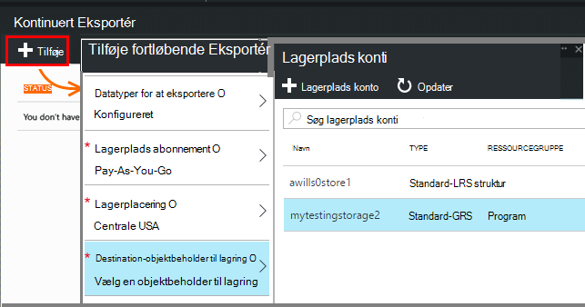
    
    Angive typerne begivenhed, du vil have vist:

    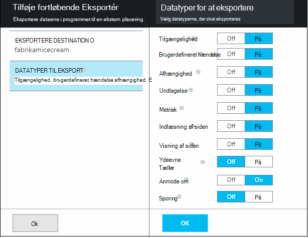

3. Lade nogle data point, der kræves. Sidde tilbage og lade folk bruge dit program til et stykke tid. Telemetri kommer, og du får vist statistiske diagrammer i [metriske explorer](app-insights-metrics-explorer.md) og enkelte hændelser i [diagnosticering Søg](app-insights-diagnostic-search.md). 

    Og også eksportere dataene til din lagerplads. 

4. Undersøg de eksporterede data. I Visual Studio, skal du vælge **få vist / skyen Explorer**, og Åbn Azure / lagerplads. (Hvis du ikke har denne indstilling i menuen, skal du installere Azure SDK: dialogboksen nyt projekt og åbne Visual C# / skyen / hente Microsoft Azure SDK til .NET.)

    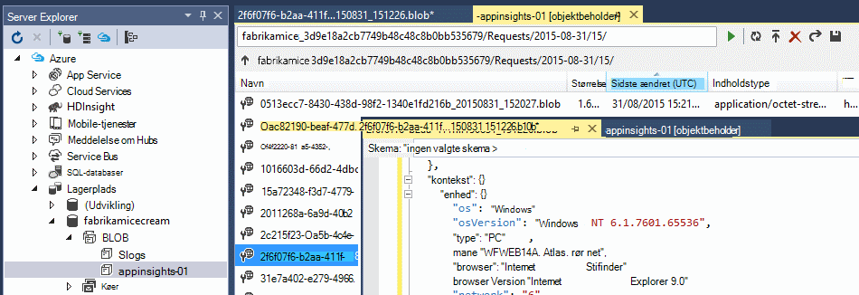

    Skal du notere den almindelige del af det stinavn, der er afledt navn og instrumentation programtasten. 

Hændelserne, der skrives til blob-filer i JSON-format. De enkelte filer kan indeholde et eller flere begivenheder. Så vil vi gerne læse begivenhed data og filtrere de felter, vi vil. Der er mange forskellige måder, som vi kunne gøre med dataene, men vores plan i dag er at bruge Stream Analytics til pipe data til Power BI.

## <a name="create-an-azure-stream-analytics-instance"></a>Oprette en Azure Stream Analytics-forekomst

Vælg tjenesten, Azure Stream Analytics [Klassisk Azure-portalen](https://manage.windowsazure.com/), og Opret et nyt Stream Analytics-job:


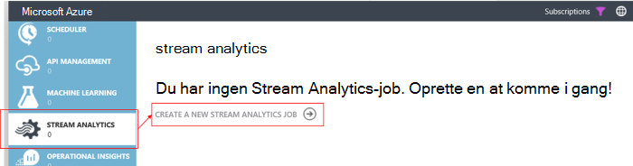


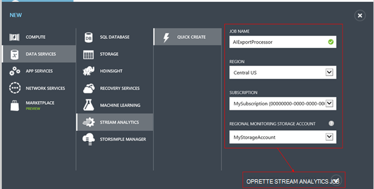

Når den nye sag er oprettet, skal du udvide detaljerne:

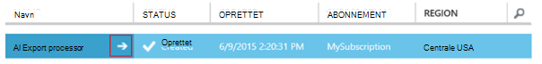


### <a name="set-blob-location"></a>Angiv blob placering

Indstille den til at gøre dette fra din fortløbende eksportere blob:

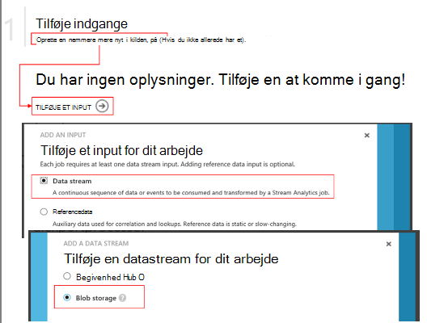

Nu skal du den primærnøgle adgang fra din lagerplads-konto, som du tidligere har angivet. Angive dette som Kontonøgle lagerplads.

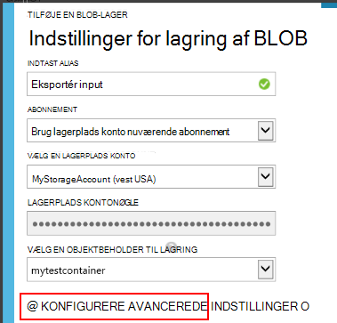

### <a name="set-path-prefix-pattern"></a>Sæt stien præfiksmønster 

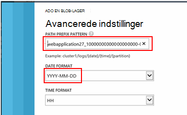


**Sørg for at angive datoformatet til åååå-MM-DD (med stiplet).**

Sti præfiks mønster Angiver, hvor Stream Analytics finder input filerne i opbevaring. Du skal angive den skal svare til hvordan fortløbende eksportere gemmer dataene. Angiv det sådan ud:

    webapplication27_12345678123412341234123456789abcdef0/PageViews/{date}/{time}

I dette eksempel:

* `webapplication27`er navnet på programmet indsigt ressource **alle små bogstaver**.
* `1234...`er tasten instrumentation programmet indsigt ressourcens **udelade stiplet**. 
* `PageViews`er typen data, du vil analysere. De tilgængelige typer afhænger af det filter, du angiver i fortløbende eksportere. Undersøg de eksporterede data for at få vist andre muligheder, og se [eksportere datamodel](app-insights-export-data-model.md).
* `/{date}/{time}`skrives et mønster direkte.

> [AZURE.NOTE] Undersøg lagerplads at sikre, at du får stien højre.

### <a name="finish-initial-setup"></a>Udfør indledende installation

Bekræfte serialiseringsformatet:

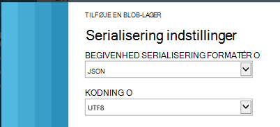

Lukke guiden, og vent for at afslutte installationsprogrammet.

> [AZURE.TIP] Bruge kommandoen eksempel til at hente nogle data. Hold det som en prøve at foretage fejlfinding af din forespørgsel.

## <a name="set-the-output"></a>Angive output

Vælg tingene nu, og Angiv output.

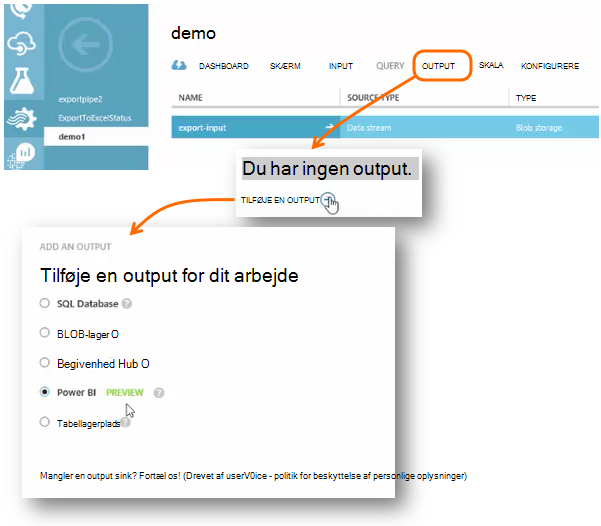

Angiv din **arbejds- eller skolekonto** for at godkende Stream analyse til at få adgang til din Power BI-ressource. Lager derefter et navn til output, og til destinationen Power BI-datasæt og tabel.

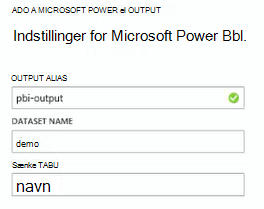

## <a name="set-the-query"></a>Angive forespørgslen

Forespørgslen styrer oversættelse fra input til at få vist.

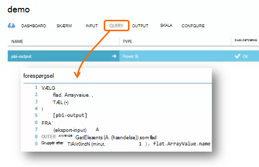


Bruge funktionen Test til at kontrollere, at du får den rigtige output. Give den eksempeldata, som du oprindeligt brugte fra siden input. 

### <a name="query-to-display-counts-of-events"></a>Forespørgsel for at få vist tæller antallet af hændelser

Indsæt denne forespørgsel:

```SQL

    SELECT
      flat.ArrayValue.name,
      count(*)
    INTO
      [pbi-output]
    FROM
      [export-input] A
    OUTER APPLY GetElements(A.[event]) as flat
    GROUP BY TumblingWindow(minute, 1), flat.ArrayValue.name
```

* Eksportér input er det alias, vi har givet til strømmen input
* pbi-output er output alias vi definerede
* Vi bruger [Ydre anvende GetElements](https://msdn.microsoft.com/library/azure/dn706229.aspx) , fordi navnet på begivenheden i en indlejret JSON-arrray. Vælg henter derefter navnet på begivenheden, sammen med en optælling af antallet af forekomster med dette navn i perioden. Delsætningen [Group By](https://msdn.microsoft.com/library/azure/dn835023.aspx) grupperer elementer i tidsperioder i 1 minut.


### <a name="query-to-display-metric-values"></a>Forespørgsel for at få vist metriske værdier


```SQL

    SELECT
      A.context.data.eventtime,
      avg(CASE WHEN flat.arrayvalue.myMetric.value IS NULL THEN 0 ELSE  flat.arrayvalue.myMetric.value END) as myValue
    INTO
      [pbi-output]
    FROM
      [export-input] A
    OUTER APPLY GetElements(A.context.custom.metrics) as flat
    GROUP BY TumblingWindow(minute, 1), A.context.data.eventtime

``` 

* Denne forespørgsel lagene til målepunkter telemetri at få begivenhed tid og den metriske værdi. Metriske værdier er i en matrix, så vi bruge ydre anvende GetElements skal udtrækkes rækker. "myMetric" er navnet på metrikværdien i dette tilfælde. 

### <a name="query-to-include-values-of-dimension-properties"></a>Forespørgsel for at medtage værdier for dimensionsegenskaber

```SQL

    WITH flat AS (
    SELECT
      MySource.context.data.eventTime as eventTime,
      InstanceId = MyDimension.ArrayValue.InstanceId.value,
      BusinessUnitId = MyDimension.ArrayValue.BusinessUnitId.value
    FROM MySource
    OUTER APPLY GetArrayElements(MySource.context.custom.dimensions) MyDimension
    )
    SELECT
     eventTime,
     InstanceId,
     BusinessUnitId
    INTO AIOutput
    FROM flat

```

* Denne forespørgsel indeholder værdierne i egenskaberne dimension uden afhængigt af en bestemt dimension er en fast Index i matrixen dimension.

## <a name="run-the-job"></a>Kørsel

Du kan vælge en dato i fortiden starte jobbet fra. 

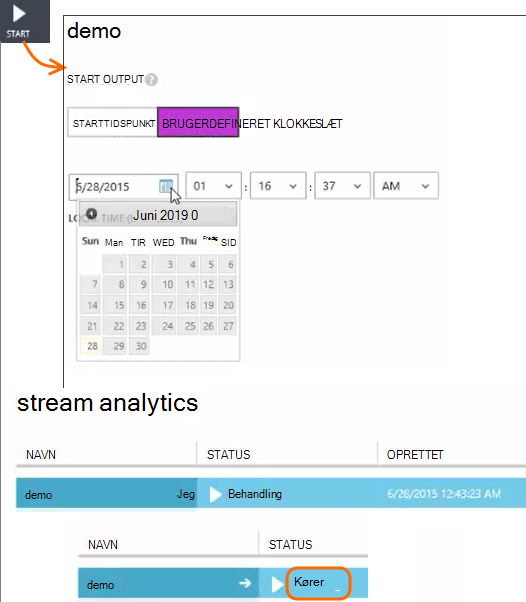

Vent, indtil jobbet kører.

## <a name="see-results-in-power-bi"></a>Få vist resultater i Power BI

> [AZURE.WARNING] Der er meget bedre nemmere og [anbefalede måder til at vise programmet indsigt data i Power BI](app-insights-export-power-bi.md). Stien illustreret her er blot et eksempel til at illustrere Sådan behandles eksporterede data.

Åbn Power BI med dit arbejde eller skolekonto, og vælg datasæt og tabel, du har angivet som output fra Stream Analytics jobbet.

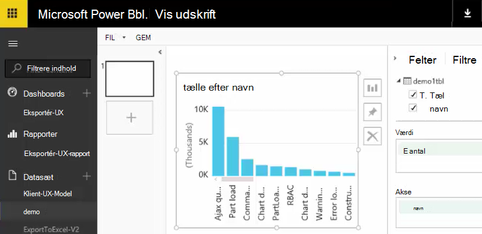

Nu kan du bruge dette dataset i rapporter og dashboards i [Power BI](https://powerbi.microsoft.com).


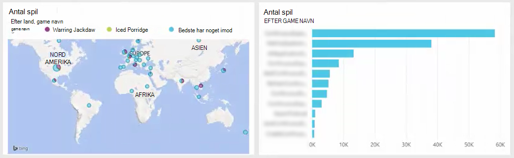


## <a name="no-data"></a>Ingen data?

* Kontrollér, du [angive datoformatet](#set-path-prefix-pattern) korrekt til åååå-MM-DD (med stiplet).


## <a name="video"></a>Video

Noam Ben Zeev viser, hvordan du behandle eksporterede data ved hjælp af Stream analyser.

> [AZURE.VIDEO export-to-power-bi-from-application-insights]

## <a name="next-steps"></a>Næste trin

* [Kontinuert Eksportér](app-insights-export-telemetry.md)
* [Detaljerede data model reference til de egenskabstyper af og værdier.](app-insights-export-data-model.md)
* [Programmet indsigt](app-insights-overview.md)
* [Flere eksempler og gennemgange](app-insights-code-samples.md)
 
