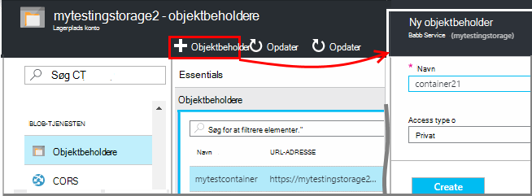
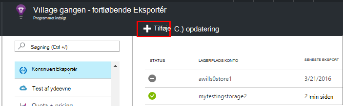
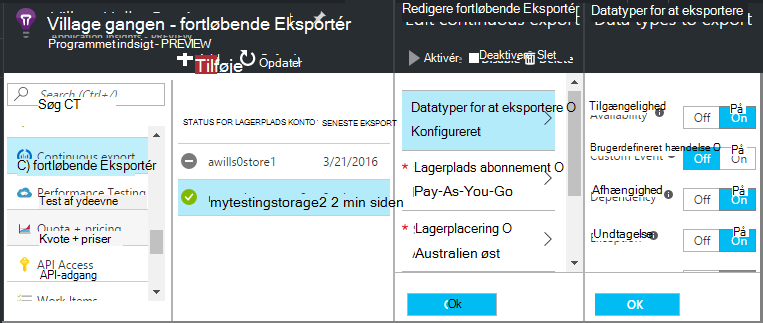
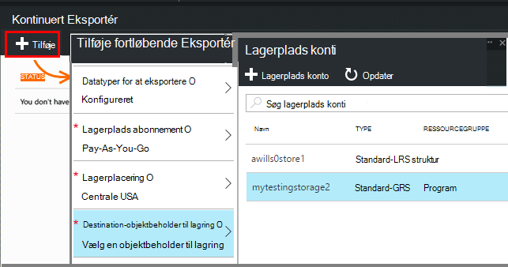
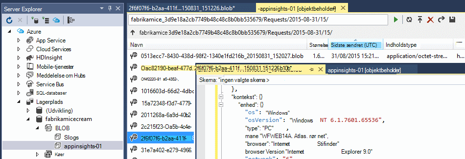
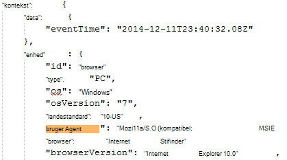
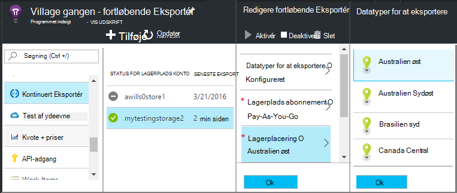

<properties 
    pageTitle="Kontinuert eksport af telemetri fra programmet indsigt | Microsoft Azure" 
    description="Eksportere diagnostic og anvendelsesdata til lageret i Microsoft Azure, og hente den derfra." 
    services="application-insights" 
    documentationCenter=""
    authors="alancameronwills" 
    manager="douge"/>

<tags 
    ms.service="application-insights" 
    ms.workload="tbd" 
    ms.tgt_pltfrm="ibiza" 
    ms.devlang="na" 
    ms.topic="article" 
    ms.date="10/18/2016" 
    ms.author="awills"/>
 
# Eksportere telemetri fra programmet indsigt

Vil du beholde dine telemetri i mere end standard opbevaringsperioden? Eller behandle nogle specialiserede måde? Kontinuert Eksportér er velegnet til dette. De hændelser, du ser i portalen programmet indsigt kan eksporteres til lager i Microsoft Azure i JSON-format. Derfra kan du hente dine data og skrive den kode, du har brug for at behandle den.  

Kontinuert Eksportér er tilgængelig i den gratis prøveperiode og på [Standard og Premium priser planer](https://azure.microsoft.com/pricing/details/application-insights/).

Før du konfigurerer fortløbende Eksportér, er der nogle alternativer, kan du overveje:

* [Feltet Eksportér knap](app-insights-metrics-explorer.md#export-to-excel) øverst i en målepunkter eller søgning blade kan du overføre tabeller og diagrammer til et Excel-regneark. 
* [Analytics](app-insights-analytics.md) giver en effektiv forespørgselssprog til telemetri og kan også eksportere resultater.
* Hvis du ønsker at [udforske data i Power BI](http://blogs.msdn.com/b/powerbi/archive/2015/11/04/explore-your-application-insights-data-with-power-bi.aspx), kan du gøre det uden at bruge fortløbende eksportere.

## Oprette en lagerplads-konto

Hvis du ikke allerede har en "klassisk" lagerplads-konto, kan du oprette én nu.

1. Oprette en lagerplads konto i dit abonnement på [Azure-portalen](https://portal.azure.com).

    

2. Oprette en beholder.

    

## Konfigurere fortløbende eksportere

Åbn fortløbende eksportere på dit program oversigt blade i portalen programmet indsigt: 

Tilføje en fortløbende eksport, og vælg typerne begivenhed, du vil eksportere:

Vælge eller oprette [Azure lagerplads konto](../storage/storage-introduction.md) , hvor du vil gemme dataene:

Når du har oprettet din Eksportér, starter det i gang. (Du får kun vist data, der modtages, når du har oprettet eksporten.) 

Der kan være en forsinkelse på omkring en time, før data vises i blob.

Hvis du vil ændre redigere typerne begivenhed senere, skal du blot Eksportér:

Klik på Deaktiver for at stoppe strømmen. Når du klikker på Aktivér igen, genstartes strømmen med nye data. Du kan ikke hente de data, der er modtaget i portalen, mens Eksportér blev deaktiveret.

For at stoppe strømmen permanent, skal du slette eksporten. Hvis du gør det slette ikke dataene fra lagerplads.

#### Kan ikke tilføje eller ændre en Eksportér?

* Hvis du vil tilføje eller ændre eksport, skal du ejer, bidragyder eller program indsigt bidragyder adgangsrettigheder. [Få mere at vide om roller][roles].

## Hvilke hændelser får du?

De eksporterede data er den rå telemetri vi modtager fra dit program, bortset fra at vi tilføjer placeringsdata som vi beregne fra klient IP-adresse. 

Data, der er blevet slettet af [stikprøver, hvor der](app-insights-sampling.md) er ikke inkluderet i de eksporterede data.

Andre beregnede målepunkter er ikke inkluderet. For eksempel vi eksportere ikke gennemsnitlige CPU-udnyttelse, men vi eksportere den rå telemetri, hvorfra gennemsnittet beregnes.

Data, der indeholder også resultaterne af enhver [tilgængelighed web test](app-insights-monitor-web-app-availability.md) , du har oprettet. 

> [AZURE.NOTE] **Udvalg.** Hvis dit program sender en stor mængde data, og du bruger programmet indsigt SDK til ASP.NET version 2.0.0-beta3 eller nyere, kan funktionen tilpasset udvalg betjene og send kun en procentdel af din telemetri. [Lær mere om udvalg.](app-insights-sampling.md)

## Undersøg dataene

Du kan undersøge lagerplads direkte i portalen. Klik på **Gennemse**, Vælg din konto, lagring, og Åbn derefter **beholdere**.

Åbne **visningen**, **Skyen Explorer**for at undersøge Azure-lageret i Visual Studio. (Hvis du ikke har menukommandoen, skal du installere Azure SDK: åbner dialogboksen **Nyt projekt** , udvid Visual C# / i skyen, og vælg **Få Microsoft Azure SDK til .NET**.)

Når du åbner din blob-lager, får du vist en objektbeholder med en række blob filer. URI for hver fil, der er afledt af dit program indsigt ressourcenavn, dens instrumentation nøgle, telemetri-type og dato/klokkeslæt. (Ressourcenavnet er kun små bogstaver, og tasten instrumentation udelader stiplet).

Dato og klokkeslæt er UTC, når telemetri blev indsættes i store - ikke den tid, det blev oprettet. Så hvis du skriver kode for at hente dataene, kan den flytte lineært gennem dataene.

Her er slags stien:

    $"{applicationName}_{instrumentationKey}/{type}/{blobDeliveryTimeUtc:yyyy-MM-dd}/{ blobDeliveryTimeUtc:HH}/{blobId}_{blobCreationTimeUtc:yyyyMMdd_HHmmss}.blob"
  
Hvor 

-   `blobCreationTimeUtc`tidspunkt, hvor blob blev oprettet i den interne arrangere lagerplads
-   `blobDeliveryTimeUtc`er den tid, når blob kopieres til Eksportér destination lagerplads

## Dataformat

* Hver blob er en tekstfil, der indeholder flere ' \n'-separated rækker. Den indeholder telemetri behandles i en periode på omkring halvt minut.
* Hver række repræsenterer et telemetri datapunkt som en anmodning om eller siden visning.
* Hver række er en uformaterede JSON-dokument. Hvis du vil sidde og stare på den, åbne den i Visual Studio og vælge Rediger Avanceret filformatet:

Tid varighed er i aksemærker, hvor 10 000 aksemærker = 1ms. For eksempel viser disse værdier et tidspunkt i 1ms til at sende en forespørgsel fra browseren, 3ms til at modtage den, og 1.8s til behandling af siden i browseren:

    "sendRequest": {"value": 10000.0},
    "receiveRequest": {"value": 30000.0},
    "clientProcess": {"value": 17970000.0}

[Detaljerede data model reference til de egenskabstyper af og værdier.](app-insights-export-data-model.md)

## Behandling af data

Du kan skrive kode for at trække fra hinanden dine data skal læse den til et regneark og så videre på en lille skala. Eksempel:

    private IEnumerable<T> DeserializeMany<T>(string folderName)
    {
      var files = Directory.EnumerateFiles(folderName, "*.blob", SearchOption.AllDirectories);
      foreach (var file in files)
      {
         using (var fileReader = File.OpenText(file))
         {
            string fileContent = fileReader.ReadToEnd();
            IEnumerable<string> entities = fileContent.Split('\n').Where(s => !string.IsNullOrWhiteSpace(s));
            foreach (var entity in entities)
            {
                yield return JsonConvert.DeserializeObject<T>(entity);
            }
         }
      }
    }

En større kode prøve og under [Brug af en kollega rolle][exportasa].

## Slette dine gamle data
Vær opmærksom på, at du er ansvarlig for at administrere din lagerkapacitet og slette gamle data, hvis det er nødvendigt. 

## Hvis du genoprette nøglen lagerplads...

Hvis du ændrer nøglen til din lagerplads, stopper fortløbende Eksportér arbejde. Du får vist en meddelelse i din Azure-konto. 

Åbne bladet fortløbende eksportere og redigere eksporten. Redigere eksportere destinationen, men lad den samme lagerplads, der er markeret. Klik på OK for at bekræfte.

Kontinuert Eksportér genstartes.

## Eksportere eksempler

* [Eksportere til SQL ved hjælp af en kollega rolle][exportcode]
* [Eksportere til SQL ved hjælp af Stream Analytics][exportasa]
* [Streame Analytics eksempel 2](app-insights-export-stream-analytics.md)

Overveje at [HDInsight](https://azure.microsoft.com/services/hdinsight/) - Hadoop klynger i skyen på større ubalance. HDInsight indeholder en række teknologier til at administrere og analysere stor data.

## Q & A

* *Men jeg vil blot en enkelt overførsel af et diagram.*  
 
    Ja, kan du gøre det. Klik på [Eksporter Data](app-insights-metrics-explorer.md#export-to-excel)øverst i bladet.

* *Jeg har konfigureret en eksport, men der er ingen data i min store.*

    Programmet indsigt modtog en hvilken som helst telemetri fra din app da du har konfigureret Eksportér? Du får kun vist nye data.

* *Jeg forsøgte at konfigurere en eksport, men blev nægtet adgang*

    Hvis kontoen ejes af organisationen, vil du skal være medlem af grupperne ejere eller bidragydere.

* *Kan jeg eksportere direkte til mit eget lokale lager?* 

    Nej, desværre. Vores Eksportér program virker aktuelt kun med Azure-lager på nuværende tidspunkt.  

* *Er der en grænse for mængden data, du placerer i mit lager?* 

    Nej. Vi vil beholde skubbe data indtil du sletter Eksportér. Vi vil stop, hvis vi påløber ydre grænser for blob-lager, men det er ret meget stor. Det er til dig til at styre, hvor meget lagerplads du bruger.  

* *Hvor mange BLOB skal opbevaring vises?*

 * For hver datatype, du har valgt for at eksportere, oprettes en ny blob hvert minut (hvis data er tilgængelig). 
 * Desuden for programmer med høj trafik, er ekstra partition enheder allokeret. I dette tilfælde opretter hver enhed en blob hvert minut.

* *Jeg gendannes nøglen til min lager eller ændret navnet på objektbeholderen, og nu Eksportér virker ikke.*

    Redigere Eksportér, og Åbn bladet Eksportér destination. Lad være den samme lagerplads, der er markeret som før, og klik på OK for at bekræfte. Eksportér genstartes. Hvis der var ændringen inden for de seneste par dage, kan du ikke mister data.

* *Kan jeg stoppe Eksportér?*

    Ja. Klik på Deaktiver.

## Kodeeksempler

* [Analysér eksporteres JSON ved hjælp af en kollega rolle][exportcode]
* [Streame Analytics eksempel](app-insights-export-stream-analytics.md)
* [Eksportere til SQL ved hjælp af Stream Analytics][exportasa]

* [Detaljerede data model reference til de egenskabstyper af og værdier.](app-insights-export-data-model.md)

<!--Link references-->

[exportcode]: app-insights-code-sample-export-telemetry-sql-database.md
[exportasa]: app-insights-code-sample-export-sql-stream-analytics.md
[roles]: app-insights-resources-roles-access-control.md

 
