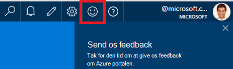
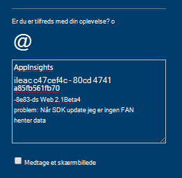
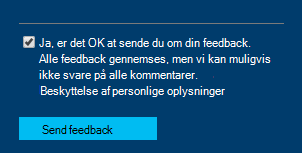

<properties 
    pageTitle="Sådan får du teknisk support fra programmet indsigt udviklingsteamet | Microsoft Azure" 
    description="Når du har en sag, der kræver særlig støtte fra programmet indsigt development-teamet, er dette, hvordan du kan sende detaljer for at få support." 
    services="application-insights" 
    documentationCenter=""
    authors="alexbulankou" 
    manager="douge"/>
 
<tags 
    ms.service="application-insights" 
    ms.workload="tbd" 
    ms.tgt_pltfrm="ibiza" 
    ms.devlang="na" 
    ms.topic="article" 
    ms.date="06/01/2016" 
    ms.author="albulank"/>
    
# <a name="how-to-get-technical-support-from-application-insights-development-team"></a>Sådan får du teknisk support fra programmet indsigt development-teamet
    
Når du har et teknisk problem med [Visual Studio programmet viden](app-insights-overview.md), får dine muligheder for at få hjælp:

## <a name="1-check-the-documents"></a>1. Markér feltet dokumenter

* Manglende data? Udføre: [udvalg](app-insights-sampling.md), [kvotaer og (throttling)](app-insights-pricing.md).
* Fejlfinding: [ASP.NET](app-insights-troubleshoot-faq.md) | [Java](app-insights-java-troubleshoot.md)

## <a name="2-search-the-forums"></a>2. Søg i forummerne

* [MSDN-forum](https://social.msdn.microsoft.com/Forums/vstudio/home?forum=ApplicationInsights)
* [StackOverflow](http://stackoverflow.com/questions/tagged/ms-application-insights)

## <a name="3-azure-support-plan"></a>3. understøttelse af azure Plan?

Der er visse situationer, hvor du vil have udviklere for at undersøge det specifikke tilfælde. 

Hvis du har en [understøtter plan med Microsoft Azure](https://azure.microsoft.com/support/plans/) kan du [åbne en supportbilletter](https://portal.azure.com/?#blade/Microsoft_Azure_Support/HelpAndSupportBlade).

## <a name="4-contact-the-application-insights-team"></a>4. Kontakt programmet indsigt teamet

Hvis du ikke har en supportplan, er vores udviklingsteam tilfreds tilbyde bedste yde support til programmet indsigt kunder, som vi forberede milepælen generelt tilgængelig. Vi Introduktion til **en ny supportmulighed**: Du kan beskrive din sag til os ved at sende en feedbackformular på Azure-portalen og har en udvikler på programmet indsigt team kontakter du igen for at hjælpe med at løse problemet.


1. Klik på det smilende ansigt i det øverste højre hjørne i [programmet indsigt portalen](https://portal.azure.com):  

       

2. Kontroller, at angive **AppInsights** som den første linje i kommentarboksen og derefter indeholder følgende oplysninger:   

    ```

    AppInsights   
    ikey: <instrumentation key>   
    sdk: <SDK that you are using, including name and version>  
    issue: <please describe the problem you are having>

    ```   

       

3. Se "Ja, det er ok for at sende du". 

      

En tekniker programmet indsigt teammedlemmer kan kontakte dig snart. Som vi yder denne tjeneste på grundlag af bedste indsats, kan ingen formelle SLA gives på dette tidspunkt.


