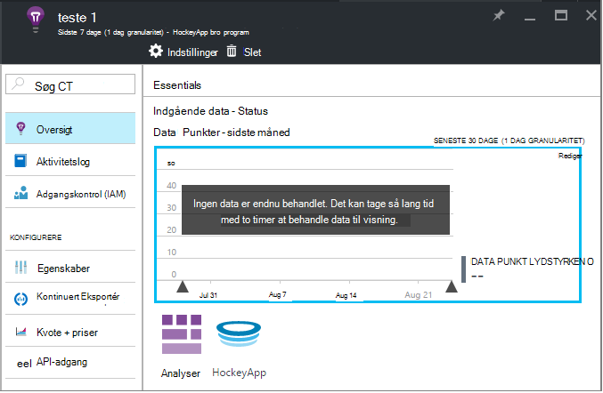

<properties 
    pageTitle="Udforske HockeyApp data i programmet indsigt | Microsoft Azure" 
    description="Analysere brugen og ydeevnen af din Azure-app med programmet indsigt." 
    services="application-insights" 
    documentationCenter="windows"
    authors="alancameronwills" 
    manager="douge"/>

<tags 
    ms.service="application-insights" 
    ms.workload="tbd" 
    ms.tgt_pltfrm="ibiza" 
    ms.devlang="na" 
    ms.topic="article" 
    ms.date="08/25/2016" 
    ms.author="awills"/>

#  Udforske HockeyApp data i programmet indsigt

[HockeyApp](https://azure.microsoft.com/services/hockeyapp/) er det anbefalede platform til overvågning direkte stationære og bærbare apps. Fra HockeyApp, kan du sende brugerdefinerede og spore telemetri til at overvåge brugen og hjælper med at diagnosticering (ud over henter nedbrud data). Denne strøm af telemetri kan forespørges på ved hjælp af funktionen effektive [analyser](app-insights-analytics.md) af [Visual Studio programmet indsigt](app-insights-overview.md). Desuden kan du [eksportere brugerdefineret og spore telemetri](app-insights-export-telemetry.md). For at aktivere disse funktioner skal konfigurere du en bro, der videresender HockeyApp dataene til programmet indsigt.

## Appen HockeyApp bro

HockeyApp bro App er de grundlæggende funktion, der gør det muligt at få adgang til dine HockeyApp data i programmet indsigt via analyser og fortløbende eksportere funktioner. Alle data, der indsamles via HockeyApp, efter at oprettelsen af HockeyApp bro App vil være tilgængelige i disse funktioner. Lad os se, hvordan du konfigurerer en af disse bro Apps.

Åbn kontoindstillinger, [API Tokens](https://rink.hockeyapp.net/manage/auth_tokens)i HockeyApp. Opret et nyt id eller genbruge en eksisterende liste. De rettigheder, der kræves er "skrivebeskyttede". Tage en kopi af API token.

Åbn Microsoft Azure portalen og [oprette en programmet indsigt ressource](app-insights-create-new-resource.md). Angive programtype "HockeyApp bro programmet":

Du behøver ikke at angive et navn, – dette angives automatisk fra HockeyApp navn.

Felterne HockeyApp bro vises. 

Angiv HockeyApp tokenet du nævnt tidligere. Denne handling udfylder i "HockeyApp programmet" rullemenuen med alle dine HockeyApp-programmer. Vælg det, du vil bruge, og Udfyld resten af felterne. 

Åbn den nye ressource. 

Bemærk, at dataene tager lang tid at starte der flyder.

Det var det! Alle data, der indsamles i din HockeyApp udstyret app fra resten af dokumentet er nu tilgængelig for dig på analyser og fortløbende eksportere funktionerne i programmet indsigt også.

Lad os kortvarigt gennemgå hver enkelt af disse funktioner, der er nu tilgængelig for dig.

## Analyser

Analytics er et effektivt værktøj til ad hoc-forespørgsler af dine data, så du kan diagnosticere og analysere dine telemetri og hurtigt finde rod årsager og mønstre.

* [Lær mere om analyser](app-insights-analytics-tour.md)
* [Introduktion video](https://channel9.msdn.com/events/Build/2016/T666)
* [Avancerede koncepter video](https://channel9.msdn.com/Events/Build/2016/P591)

## Kontinuert Eksportér

Kontinuert Eksportér kan du eksportere dataene til en objektbeholder med Azure Blob-lager. Dette er meget nyttigt, hvis du har brug at holde dataene i mere end opbevaringsperiode, tilbydes aktuelt ved programmet indsigt. Du kan holde dataene i blob-lager, behandle den ind i en SQL-Database eller dine foretrukne data opbevaring løsning.

[Få flere oplysninger om kontinuerlig eksportere](app-insights-export-telemetry.md)

## Næste trin

* [Anvende Analytics på dine data](app-insights-analytics-tour.md)

