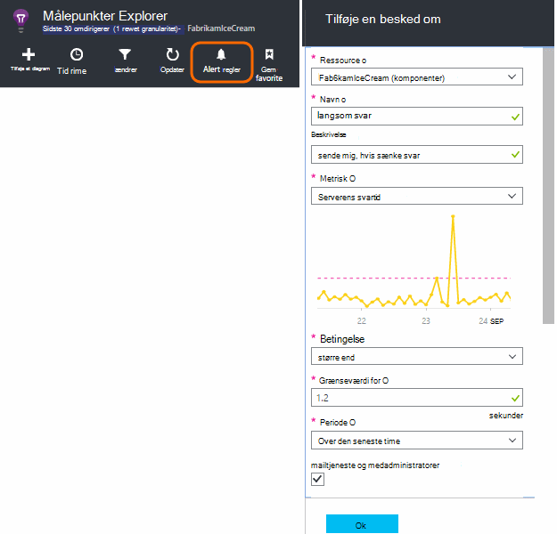
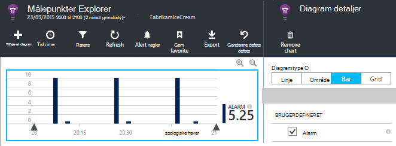
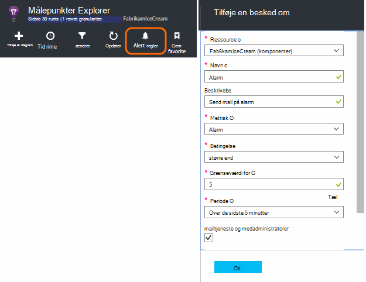
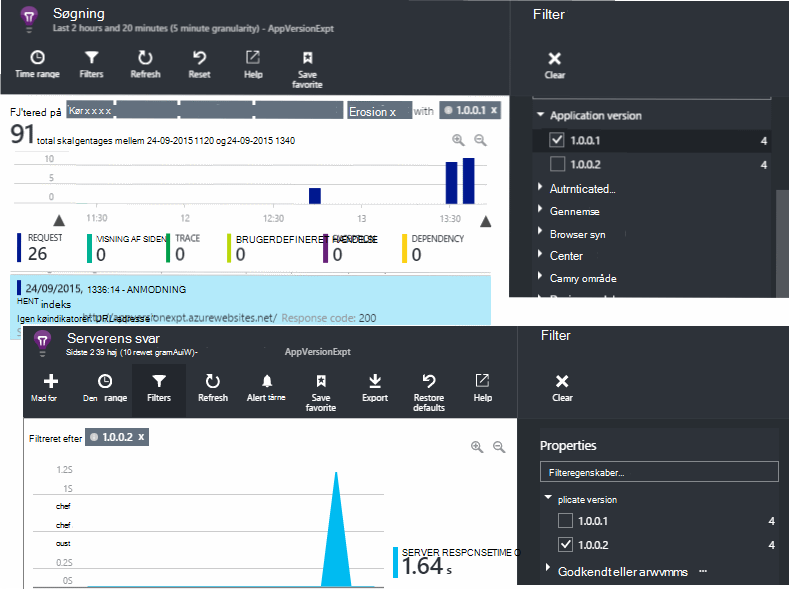
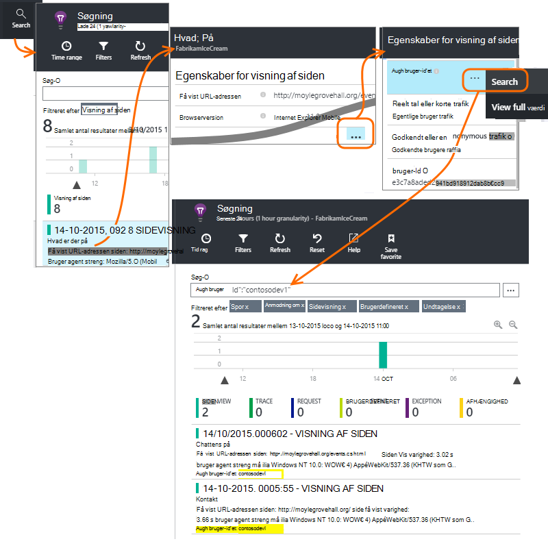
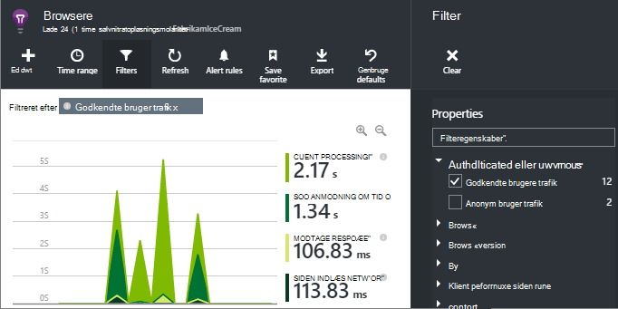
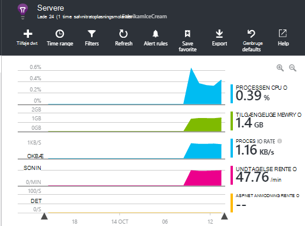

<properties 
    pageTitle="Hvordan får jeg … i programmet indsigt | Microsoft Azure" 
    description="Ofte stillede spørgsmål i programmet indsigt." 
    services="application-insights" 
    documentationCenter=""
    authors="alancameronwills" 
    manager="douge"/>

<tags 
    ms.service="application-insights" 
    ms.workload="tbd" 
    ms.tgt_pltfrm="ibiza" 
    ms.devlang="na" 
    ms.topic="article" 
    ms.date="02/05/2016" 
    ms.author="awills"/>

# <a name="how-do-i--in-application-insights"></a>Hvordan får jeg … i programmet indsigt?

## <a name="get-an-email-when-"></a>Få en mail når...

### <a name="email-if-my-site-goes-down"></a>Hvis mit websted går ned

Angive en [tilgængelighed web teste](app-insights-monitor-web-app-availability.md).

### <a name="email-if-my-site-is-overloaded"></a>Hvis mit websted er overbelastet

Indstille en [besked](app-insights-alerts.md) på **serverens svartid**. En grænseværdi mellem 1 og 2 sekunder skulle virke.



Din app kan også viser ikke tegn på belastning ved at returnere fejlkoder. Indstille en advarsel om **mislykket anmodninger**.

Hvis du vil indstille en besked på **Server undtagelser**, kan du skal gøre [nogle yderligere konfiguration](app-insights-asp-net-exceptions.md) for at kunne se data.

### <a name="email-on-exceptions"></a>Mail på undtagelser

1. [Konfigurere undtagelse overvågning](app-insights-asp-net-exceptions.md)
2. [Indstille en besked](app-insights-alerts.md) på undtagelse Tæl metrisk


### <a name="email-on-an-event-in-my-app"></a>Mail på en begivenhed i min app

Antag, at du vil have en mail, når en bestemt hændelse indtræffer. Programmet indsigt indeholder ikke denne funktion direkte, men det kan du [sende en besked, når en metrikværdi krydser en grænseværdi](app-insights-alerts.md). 

Beskeder kan ikke indstilles på [brugerdefinerede målepunkter](app-insights-api-custom-events-metrics.md#track-metric), men ikke brugerdefinerede hændelser. Skrive kode for at øge en metrikværdi, når den indtræffer:

    telemetry.TrackMetric("Alarm", 10);

eller:

    var measurements = new Dictionary<string,double>();
    measurements ["Alarm"] = 10;
    telemetry.TrackEvent("status", null, measurements);

Fordi beskeder har to tilstande, har du sende en lav værdi, når du finder den vigtige besked til har afsluttet:

    telemetry.TrackMetric("Alarm", 0.5);

Oprette et diagram i [metriske explorer](app-insights-metrics-explorer.md) for at se din alarm:



Nu indstille en besked til et billede, når metrikværdien går over værdien midt i en kort periode:




Angiv den formidlingstid til minimum. 

Både når metrikværdien går over og under grænsen, får du vist mails.

Nogle punkter du bør overveje:

* En besked har to tilstande ("besked" og "sund"). Tilstanden evalueres kun, når der modtages en metrikværdi.
* Kun, når tilstanden ændres, sendes en mail. Dette er, hvorfor du skal sende begge høj og lav værdi målepunkter. 
* Hvis du vil evaluere den vigtige besked, benyttes gennemsnittet af modtagne værdierne i den foregående periode. Dette sker, hver gang en metrikværdi modtages, så mails kan sendes hyppigere end den periode, du angiver.
* Da mails sendes både på "besked" og "sund", kan du overveje at igen tænker one-shot begivenheden som to tilstande betingelse. For eksempel i stedet for hændelsen "job fuldført" har betingelsen "igangværende job", hvor du får mails i starten og slutningen af et job.

### <a name="set-up-alerts-automatically"></a>Konfigurere beskeder automatisk

[Bruge PowerShell til at oprette nye beskeder](app-insights-alerts.md#set-alerts-by-using-powershell)

## <a name="use-powershell-to-manage-application-insights"></a>Bruge PowerShell til at administrere programmet indsigt

* [Oprette nye ressourcer](app-insights-powershell-script-create-resource.md)
* [Oprette nye beskeder](app-insights-alerts.md#set-alerts-by-using-powershell)

## <a name="application-versions-and-stamps"></a>Programmet versioner og stempler

### <a name="separate-the-results-from-dev-test-and-prod"></a>Adskille resultaterne fra Udviklingscenter, test og Prod.ordre

* Konfigurere forskellige ikeys for forskellige environmnents
* For forskellige stempler (Udviklingscenter, teste, prod) mærke telemetri med forskellige egenskabsværdier

[Lær mere](app-insights-separate-resources.md)
 

### <a name="filter-on-build-number"></a>Filtrere efter build-nummer

Når du publicerer en ny version af din app, skal du vil kunne adskille telemetri fra forskellige builds.

Du kan angive egenskaben programmet Version, så du kan filtrere [søgning](app-insights-diagnostic-search.md) og [metriske explorer](app-insights-metrics-explorer.md) resultater. 




Der er flere forskellige metoder til at angive egenskaben Version af programmet.

* Angive direkte:

    `telemetryClient.Context.Component.Version = typeof(MyProject.MyClass).Assembly.GetName().Version;`

* Ombryde pågældende linje i en [telemetri initialisering](app-insights-api-custom-events-metrics.md#telemetry-initializers) at sikre, at alle forekomster af TelemetryClient er defineret konsekvent.

* [ASP.NET] Angiv versionen `BuildInfo.config`. Webmodulet vil vælge versionen fra noden BuildLabel. Medtage denne fil i dit projekt, og Husk at angive egenskaben kopi altid i Solution Explorer.

    ```XML

    <?xml version="1.0" encoding="utf-8"?>
    <DeploymentEvent xmlns:xsi="http://www.w3.org/2001/XMLSchema-instance" xmlns:xsd="http://www.w3.org/2001/XMLSchema" xmlns="http://schemas.microsoft.com/VisualStudio/DeploymentEvent/2013/06">
      <ProjectName>AppVersionExpt</ProjectName>
      <Build type="MSBuild">
        <MSBuild>
          <BuildLabel kind="label">1.0.0.2</BuildLabel>
        </MSBuild>
      </Build>
    </DeploymentEvent>

    ```
* [ASP.NET] Generere BuildInfo.config automatisk i MSBuild. For at gøre dette skal du tilføje et par linjer til filen som indeholder .csproj:

    ```XML

    <PropertyGroup>
      <GenerateBuildInfoConfigFile>true</GenerateBuildInfoConfigFile>    <IncludeServerNameInBuildInfo>true</IncludeServerNameInBuildInfo>
    </PropertyGroup> 
    ```

    Dette genererer en fil kaldet *yourProjectName*. BuildInfo.config. Publicer processen omdøber den til BuildInfo.config.

    Etiketten build indeholder en pladsholder (AutoGen_...), når du opretter med Visual Studio. Men når oprettet med MSBuild, det er udfyldt med det korrekte versionsnummeret.

    Hvis du vil tillade MSBuild til at generere version tal, Angiv versionen som `1.0.*` i AssemblyReference.cs

## <a name="monitor-backend-servers-and-desktop-apps"></a>Overvåge back end-servere og -programmer på computeren

[Brug af Windows Server SDK-modulet](app-insights-windows-desktop.md).


## <a name="visualize-data"></a>Visualisere data

#### <a name="dashboard-with-metrics-from-multiple-apps"></a>Dashboard med målepunkter fra flere apps

* Tilpasse dit diagram i [Metrisk Explorer](app-insights-metrics-explorer.md), og Gem den som en favorit. Fastgøre den til Azure dashboard.


#### <a name="dashboard-with-data-from-other-sources-and-application-insights"></a>Dashboard med data fra andre kilder og programmet indsigt

* [Eksportere telemetri til Power BI](app-insights-export-power-bi.md). 

Eller

* Du kan bruge SharePoint som dit dashboard, vise data i SharePoint-webdele. Du kan [bruge fortløbende Eksporter og Stream Analytics til at eksportere til SQL](app-insights-code-sample-export-sql-stream-analytics.md).  Bruge Power View til at undersøge databasen, og oprette en SharePoint-webdel til Power View.


<a name="search-specific-users"></a>
### <a name="filter-out-anonymous-or-authenticated-users"></a>Filtrere anonyme eller godkendte brugere

Hvis dine brugere logger på, kan du angive den [godkendte bruger-id](app-insights-api-custom-events-metrics.md#authenticated-users). (Det ikke sker automatisk.) 

Derefter kan du:

* Søge på bestemte bruger-id'er



* Filtrere målepunkter til anonyme eller godkendte brugere



## <a name="modify-property-names-or-values"></a>Ændre egenskabsnavne eller værdier

Oprette et [filter](app-insights-api-filtering-sampling.md#filtering). Her kan du ændre eller filtrere telemetri, før de sendes fra din app til programmet indsigt.

## <a name="list-specific-users-and-their-usage"></a>Få vist bestemte brugere og deres brugen

Hvis du blot ønsker at [søge efter bestemte brugere](#search-specific-users), kan du angive den [godkendte bruger-id](app-insights-api-custom-events-metrics.md#authenticated-users).

Hvis du vil have en liste over brugere med data såsom hvilke sider de ser på eller hvor ofte de logger, har du to muligheder:

* [Angiv godkendte bruger-id](app-insights-api-custom-events-metrics.md#authenticated-users), [eksportere til en database](app-insights-code-sample-export-sql-stream-analytics.md) og brug passende værktøjer til at analysere dine brugerdata.
* Hvis du har et lille antal brugere, sende brugerdefinerede hændelser eller statistik, bruge data fra interesse som metriske værdi eller en begivenhed navnet og angive bruger-id som en egenskab. For at analysere sidevisninger, skal du erstatte standard JavaScript trackPageView opkaldet. For at analysere serversiden telemetri, skal du bruge ved initialisering af en telemetri til at tilføje bruger-id til alle server telemetri. Du kan derefter Filtrer og segmentet målepunkter og søgninger på bruger-id.


## <a name="reduce-traffic-from-my-app-to-application-insights"></a>Reducere trafik fra min app til programmet indsigt

* Deaktivere moduler, du ikke har brug for, så den ydeevne tæller-indsamler i [ApplicationInsights.config](app-insights-configuration-with-applicationinsights-config.md).
* Brug [udvalg og filtrering](app-insights-api-filtering-sampling.md) på SDK.
* Begrænse antallet af Ajax opkald, rapporteret for hver sidevisning på dine websider. I script kodestykket efter `instrumentationKey:...` , indsætte: `,maxAjaxCallsPerView:3` (eller et passende tal).
* Hvis du bruger [TrackMetric](app-insights-api-custom-events-metrics.md#track-metric), skal du beregne samlet mængde batches med metriske værdier før afsendelse af resultatet. Der findes en overbelastning af TrackMetric(), hvor du kan.


Lær mere om [priser og kvoter for](app-insights-pricing.md).

## <a name="disable-telemetry"></a>Deaktivere telemetri

Sådan **dynamisk stoppe og starte** samlingen og overførslen af telemetri fra serveren:

```

    using  Microsoft.ApplicationInsights.Extensibility;

    TelemetryConfiguration.Active.DisableTelemetry = true;
```


**Deaktivere markerede standard opkøber** - eksempelvis tællere i ydeevne, HTTP-anmodninger eller afhængigheder - Slet eller kommentar ud af de relevante linjer i [ApplicationInsights.config](app-insights-api-custom-events-metrics.md). Du kan gøre dette, f.eks, hvis du vil sende dine egne TrackRequest data.


## <a name="view-system-performance-counters"></a>Få vist system ydeevne tællere

Blandt de målepunkter, kan du vise i målepunkter explorer er et sæt af system tællere i ydeevne. Der er en foruddefineret blade med titlen **servere** , der viser flere af dem.



### <a name="if-you-see-no-performance-counter-data"></a>Hvis du får vist nogen tæller ydelsesdata

* På din egen computer eller på en VM **IIS-server** . [Installere Status skærm](app-insights-monitor-performance-live-website-now.md). 
* **Azure websted** – vi understøtter ikke tællere i ydeevne endnu. Der findes flere målepunkter, kan du få som en standard del af Azure websted i Kontrolpanel.
* **UNIX-server** - [installere collectd](app-insights-java-collectd.md)

### <a name="to-display-more-performance-counters"></a>At få vist flere tællere i ydeevne

* Først skal [tilføje et nyt diagram](app-insights-metrics-explorer.md) og se, om tælleren i grundlæggende indstilles, som vi tilbyder.
* Hvis ikke, [tilføje tælleren, så det sæt, der indsamles via Ydelsestællermodulet](app-insights-performance-counters.md).


