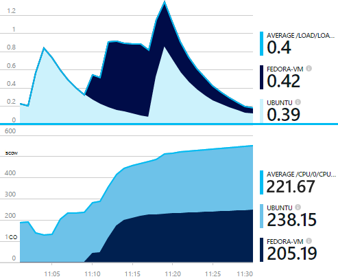
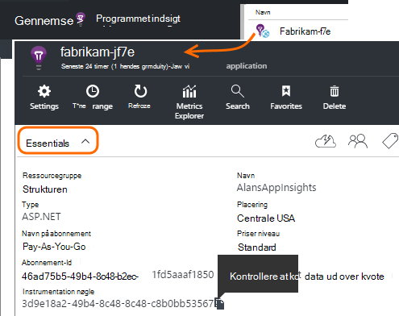
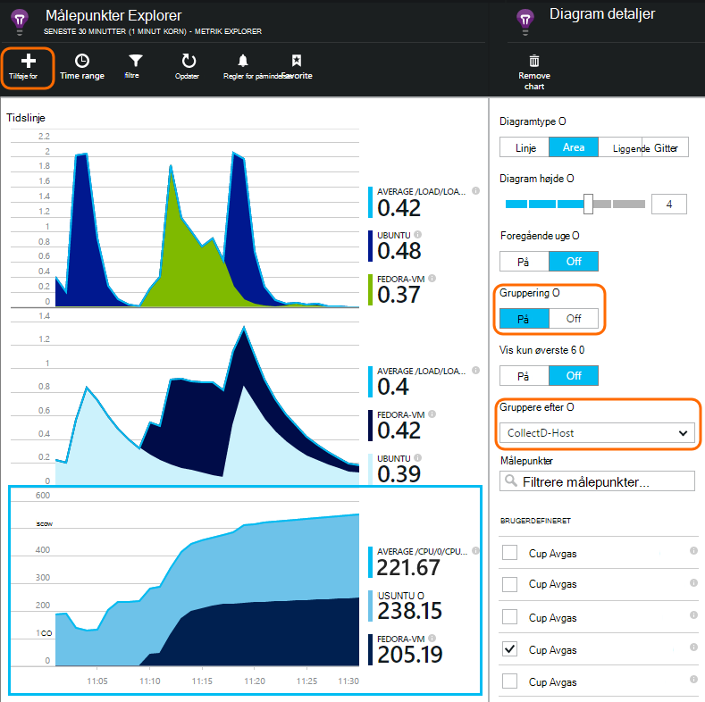

<properties 
    pageTitle="collectd: performance statistik til Java på Unix i programmet indsigt" 
    description="Udvidet overvågning af webstedet Java med den CollectD plug-in'en til programmet indsigt" 
    services="application-insights" 
    documentationCenter="java"
    authors="alancameronwills" 
    manager="douge"/>

<tags 
    ms.service="application-insights" 
    ms.workload="tbd" 
    ms.tgt_pltfrm="ibiza" 
    ms.devlang="na" 
    ms.topic="article" 
    ms.date="08/24/2016" 
    ms.author="awills"/>
 
# <a name="collectd-unix-performance-metrics-in-application-insights"></a>collectd: parametre for Unix-ydeevne i programmet indsigt

*Programmet indsigt er i Vis udskrift.*

For at udforske Unix system ydeevne målepunkter i [Programmet viden](app-insights-overview.md), installere [collectd](http://collectd.org/), sammen med dens programmet indsigt plug-in'en. Denne open source-løsning indsamler statistik for forskellige system og netværk.

Typisk du skal bruge collectd, hvis du allerede har [udstyret din Java-webtjeneste med programmet indsigt][java]. Det giver dig flere data til at hjælpe dig med at forbedre din app ydeevnen eller diagnosticere problemer. 



## <a name="get-your-instrumentation-key"></a>Få din instrumentation nøgle

Åbn den [Programmet indsigt](app-insights-overview.md) ressource, hvor du vil dataene, der vises i [Microsoft Azure-portalen](https://portal.azure.com). (Eller [oprette en ny ressource](app-insights-create-new-resource.md).)

Tage en kopi af tasten instrumentation, som identificerer ressourcen.




## <a name="install-collectd-and-the-plug-in"></a>Installere collectd og plug-in'en

På din Unix servere:

1. Installere [collectd](http://collectd.org/) version 5.4.0 eller nyere.
2. Hent [programmet indsigt collectd writer plug-in'en](https://aka.ms/aijavasdk). Bemærk versionsnummeret.
3. Kopiér plug-in'et JAR til `/usr/share/collectd/java`.
3. Redigere `/etc/collectd/collectd.conf`:
 * Sørg for, [plug-in'en til Java](https://collectd.org/wiki/index.php/Plugin:Java) er aktiveret.
 * Opdater JVMArg for java.class.path for at medtage følgende glas. Opdatere versionsnummeret så det svarer til et, du har hentet:
  * `/usr/share/collectd/java/applicationinsights-collectd-1.0.5.jar`
 * Tilføje denne kodestykke, ved hjælp af tasten Instrumentation fra din ressource:

```

     LoadPlugin "com.microsoft.applicationinsights.collectd.ApplicationInsightsWriter"
     <Plugin ApplicationInsightsWriter>
        InstrumentationKey "Your key"
     </Plugin>
```

Her er en del af en stikprøve konfigurationsfil:

    ...
    # collectd plugins
    LoadPlugin cpu
    LoadPlugin disk
    LoadPlugin load
    ...

    # Enable Java Plugin
    LoadPlugin "java"

    # Configure Java Plugin
    <Plugin "java">
      JVMArg "-verbose:jni"
      JVMArg "-Djava.class.path=/usr/share/collectd/java/applicationinsights-collectd-1.0.5.jar:/usr/share/collectd/java/collectd-api.jar"

      # Enabling Application Insights plugin
      LoadPlugin "com.microsoft.applicationinsights.collectd.ApplicationInsightsWriter"
                
      # Configuring Application Insights plugin
      <Plugin ApplicationInsightsWriter>
        InstrumentationKey "12345678-1234-1234-1234-123456781234"
      </Plugin>

      # Other plugin configurations ...
      ...
    </Plugin>
.   ...

Konfigurere andre [collectd plug-ins](https://collectd.org/wiki/index.php/Table_of_Plugins), som kan indsamle forskellige data fra forskellige kilder.

Genstart collectd ifølge dens [manuelt](https://collectd.org/wiki/index.php/First_steps).

## <a name="view-the-data-in-application-insights"></a>Få vist dataene i programmet indsigt

Åbn i dit program indsigt ressource [målepunkter Explorer og tilføje diagrammer][metrics], vælge den målepunkter, du vil se fra kategorien Brugerdefineret.



Som standard samles målene på tværs af alle host maskiner, hvor målene indsamles. Slå gruppering for at få vist målepunkter per vært, i bladet diagram detaljer, og vælg derefter gruppere af CollectD-vært.


## <a name="to-exclude-upload-of-specific-statistics"></a>Udelade Overfør bestemte statistik

Som standard sender programmet indsigt plug-in'et alle de data, der indsamles via alle aktiveret collectd 'Læs' plug-ins. 

Udelade data fra bestemte plug-ins eller datakilder:

* Rediger konfigurationsfilen. 
* I `<Plugin ApplicationInsightsWriter>`, Tilføj direktiv linjer således:

Direktiv | Effekt
---|---
`Exclude disk` | Udelade alle data, der indsamles via den `disk` -plug-in
`Exclude disk:read,write` | Udelade de kilder, med navnet `read` og `write` fra den `disk` plug-in'en.

Særdirektiver med en ny linje.


## <a name="problems"></a>Problemer med?

*Jeg kan ikke se data i portalen*

* Åbne [søgning i] [ diagnostic] at se, hvis de rå hændelser er modtaget. Nogle gange tage de længere tid at vises i målepunkter Stifinder.
* Du skal muligvis [angive undtagelser for udgående data](app-insights-ip-addresses.md)
* Aktivere sporing af i programmet indsigt plug-in'en. Indsæt følgende linje i `<Plugin ApplicationInsightsWriter>`:
 *  `SDKLogger true`
* Åbne en terminal og starte collectd i detaljeret tilstand, at se den rapporterer problemer:
 * `sudo collectd -f`


<!--Link references-->

[api]: app-insights-api-custom-events-metrics.md
[apiexceptions]: app-insights-api-custom-events-metrics.md#track-exception
[availability]: app-insights-monitor-web-app-availability.md
[diagnostic]: app-insights-diagnostic-search.md
[eclipse]: app-insights-java-eclipse.md
[java]: app-insights-java-get-started.md
[javalogs]: app-insights-java-trace-logs.md
[metrics]: app-insights-metrics-explorer.md
[usage]: app-insights-web-track-usage.md

 
