<properties 
    pageTitle="Komme i gang med programmet indsigt med Java i Eklipse" 
    description="Brug den Eklipse plug-in'en til at tilføje ydeevne og overvåge brugen på webstedet Java med programmet indsigt" 
    services="application-insights" 
    documentationCenter="java"
    authors="alancameronwills" 
    manager="douge"/>

<tags 
    ms.service="application-insights" 
    ms.workload="tbd" 
    ms.tgt_pltfrm="ibiza" 
    ms.devlang="na" 
    ms.topic="article" 
    ms.date="03/02/2016" 
    ms.author="awills"/>
 
# Komme i gang med programmet indsigt med Java i Eklipse

Programmet indsigt SDK sender telemetri fra dit Java webprogram, så du kan analysere brugen og ydeevne. Den plug-in til programmet indsigt Eklipse installeres automatisk i SDK i dit projekt, så du får ud af feltet telemetri samt en API, som du kan bruge til at skrive brugerdefinerede telemetri.   

## Forudsætninger

I øjeblikket plug-in'en works for Maven projekter og dynamiske webprojekter i Eklipse. ([Tilføje programmet indsigt til andre typer Java project][java].)

Skal du:

* Oracle JRE 1,6 eller nyere
* Et abonnement på [Microsoft Azure](https://azure.microsoft.com/). (Du kan starte med [gratis prøveversion](https://azure.microsoft.com/pricing/free-trial/)).
* [Eklipse IDE for Java EE udviklere](http://www.eclipse.org/downloads/)småt eller nyere.
* Windows 7 eller nyere eller Windows Server 2008 eller nyere

## Installere SDK på Eklipse (én gang)

Du kun behøver at gøre dette én gang hver computer. Dette trin installerer en værktøjskassen, som kan derefter føje SDK til hvert dynamisk Web-projekt.

1. Eklipse, klik på Hjælp, installere ny Software.

    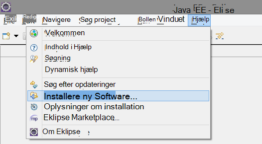

2. SDK er i http://dl.windowsazure.com/eclipse under Azure-værktøjskassen. 
3. Fjern markeringen i **alle Opdater websteder du kontakte...**

    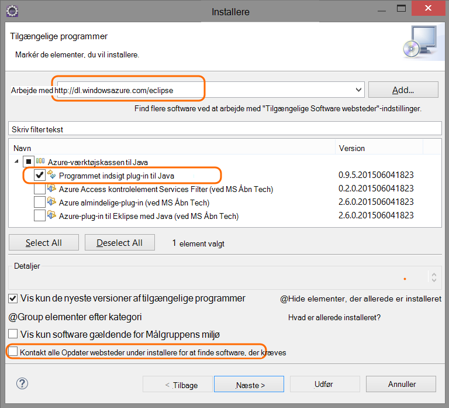

Følg de tilbageværende trin for hvert Java-projekt.

## Oprette en ressource programmet indsigt i Azure

1. Log på [Azure-portalen](https://portal.azure.com).
2. Oprette en ny programmet indsigt ressource.  

    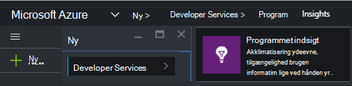  
3. Angiv programtypen til Java-webprogrammet.  

    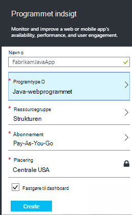  
4. Find instrumentation nøglen i den nye ressource. Du skal indsætte det i dine Kodeprojektet kort.  

      

## Føje programmet indsigt til projektet

1. Tilføj programmet indsigt i kontekstmenuen for projektet Java web.

    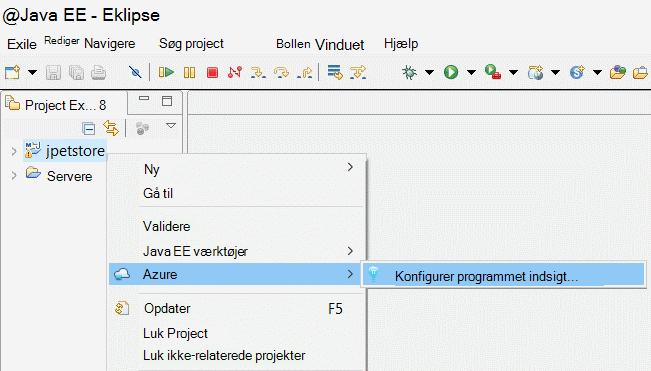

2. Indsæt nøglen instrumentation, som du har fået fra Azure-portalen.

    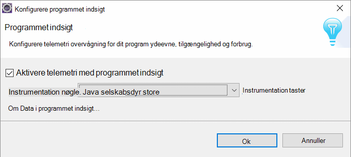

Tasten sendes sammen med hver vare telemetri og fortæller programmet indsigt at få den vist i din ressource.

## Kør programmet, og se målepunkter

Kør programmet.

Gå tilbage til dit program indsigt ressource i Microsoft Azure.

HTTP-anmodninger om data vises på bladet oversigt. (Hvis det ikke er der, vent et par sekunder, og klik derefter på Opdater).

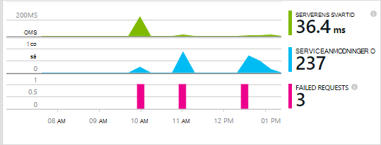
 

Klik dig gennem et diagram for at se flere målepunkter. 

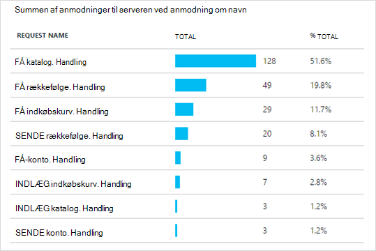

[Lær mere om målepunkter.][metrics]

 

Og når du får vist egenskaberne for en anmodning, kan du se de telemetri hændelser, der er knyttet til den som anmodninger og undtagelser.
 
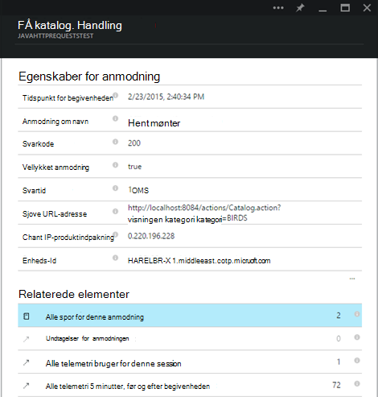

## Klientsiden telemetri

Klik på Hent-koden for at overvåge mine websider fra bladet Hurtig start: 

Indsætte kodestykket i overskriften af HTML-filerne.

#### Vis klientsiden data

Åbn din opdaterede websider og bruge dem. Vent et minut eller to, og derefter gå tilbage til programmet viden, og Åbn bladet brugen. (Bladet oversigt, Rul ned, og klik på brugen.)

Siden visning, bruger og session målepunkter vises på bladet brugen:

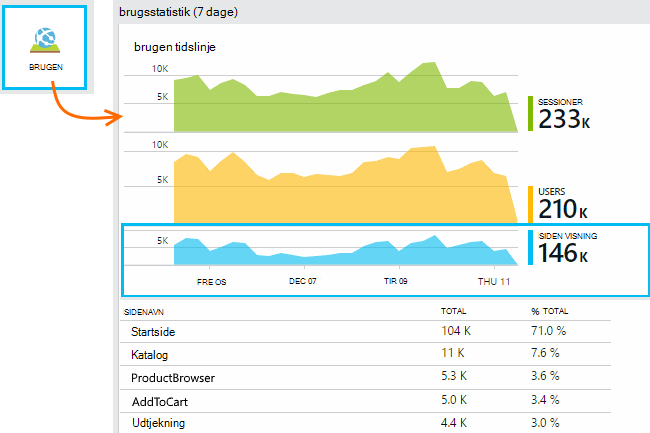

[Lær mere om konfiguration af klientsiden telemetri.][usage]

## Publicere dit program

Nu publicere din app på serveren, lade folk Brug den, og se telemetri vises på portalen.

* Sørg for, at din firewall tillader dit program til at sende telemetri til disse porte:

 * DC.Services.visualstudio.com:443
 * DC.Services.visualstudio.com:80
 * F5.Services.visualstudio.com:443
 * F5.Services.visualstudio.com:80

* Installere på Windows-servere:

 * [Microsoft Visual C++ Redistributable](http://www.microsoft.com/download/details.aspx?id=40784)

    (Dette gør det muligt for tællere i ydeevne.)

## Undtagelser og anmodning om fejl

Ikke-afviklet undtagelser samles automatisk:

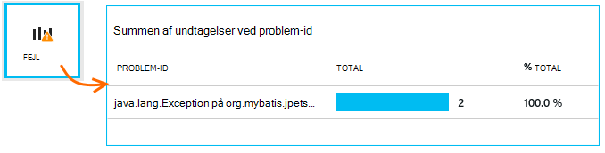

Hvis du vil indsamle oplysninger om andre undtagelser, har du to muligheder:

* [Indsætte opkald til TrackException i din kode](app-insights-api-custom-events-metrics.md#track-exception). 
* [Installere Java Agent på din server](app-insights-java-agent.md). Du angiver de metoder, du vil se.

## Overvåge metode opkald og eksterne afhængigheder

[Installere Java Agent](app-insights-java-agent.md) til at logge angivet interne metoder og opkald foretages via JDBC, med tidsindstilling data.

## Tællere i ydeevne

Rul ned på din oversigt blade, og klik på feltet **servere** . Du får vist en række tællere i ydeevne.

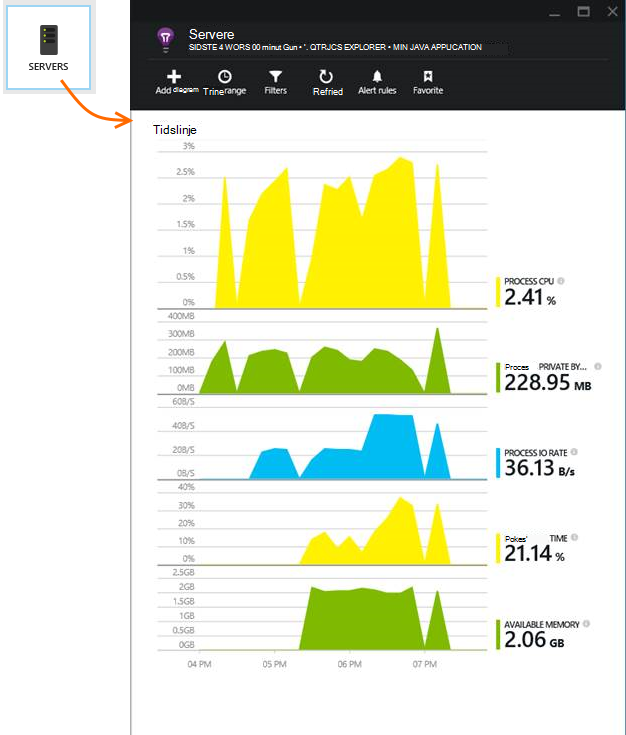

### Tilpasse ydeevne tæller af websteder

Hvis du vil deaktivere samling af standardsæt af tællere i ydeevne, du tilføje følgende kode under noden i roden af filen ApplicationInsights.xml:

    <PerformanceCounters>
       <UseBuiltIn>False</UseBuiltIn>
    </PerformanceCounters>

### Indsamle flere ydeevne tællere

Du kan angive yderligere ydeevne tællere for at blive indsamlet.

#### JMX tællere (vises ved Java Virtual Machine)

    <PerformanceCounters>
      <Jmx>
        <Add objectName="java.lang:type=ClassLoading" attribute="TotalLoadedClassCount" displayName="Loaded Class Count"/>
        <Add objectName="java.lang:type=Memory" attribute="HeapMemoryUsage.used" displayName="Heap Memory Usage-used" type="composite"/>
      </Jmx>
    </PerformanceCounters>

*   `displayName`– Navnet vises i portalen programmet indsigt.
*   `objectName`– JMX objektnavn.
*   `attribute`– På attributten for objektnavn JMX til at hente
*   `type`(valgfrit) – typen JMX objektets attributter:
 *  Standard: en simpel type som int eller lang.
 *  `composite`: performance tællerdata er i formatet af 'Attribute.Data'
 *  `tabular`: performance tællerdata er i formatet af en tabelrække

#### Windows tællere i ydeevne

Hver [Windows ydeevne tæller](https://msdn.microsoft.com/library/windows/desktop/aa373083.aspx) er medlem af en kategori (på samme måde, et felt er medlem af en klasse). Kategorier kan kan enten være global, eller have nummererede eller navngivne forekomster.

    <PerformanceCounters>
      <Windows>
        <Add displayName="Process User Time" categoryName="Process" counterName="%User Time" instanceName="__SELF__" />
        <Add displayName="Bytes Printed per Second" categoryName="Print Queue" counterName="Bytes Printed/sec" instanceName="Fax" />
      </Windows>
    </PerformanceCounters>

*   vist navn – vises navnet på programmet indsigt portalen.
*   Kategorinavn – ydeevne tæller kategori (ydeevne objekt), som er tilknyttet tælleren ydeevne.
*   counterName – navnet på tælleren ydeevne.
*   navn på forekomst – navnet på den ydeevne tæller kategori forekomst eller en tom streng (""), hvis kategorien indeholder en enkelt forekomst. Hvis kategorinavn er proces, og tælleren ydeevne, du vil indsamle er fra den aktuelle JVM proces på som din app kører, skal du angive `"__SELF__"`.

Din tællere i ydeevne kan ses som brugerdefineret målepunkter i [Målepunkter Explorer][metrics].

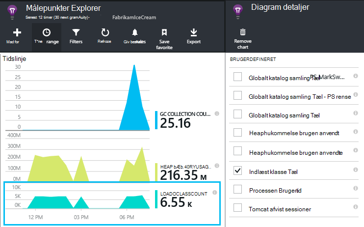

### UNIX tællere i ydeevne

* [Installere collectd med programmet indsigt plug-in'et](app-insights-java-collectd.md) til at hente en lang række system og netværk data.

## Tilgængelighed web test

Programmet indsigt kan du teste dit websted med jævne mellemrum at kontrollere, at det er op og reagerer godt. [Konfigurere][availability], rulle ned for at klikke på tilgængelighed.

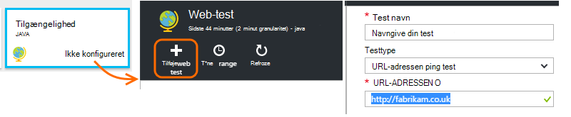

Hvis webstedet går ned, får du vist diagrammer af svar gange samt besked via mail.

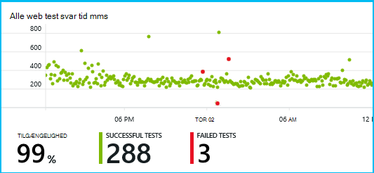

[Lær mere om tilgængeligheden af web test.][availability] 

## Diagnosticeringslogge

Hvis du bruger Logback eller Log4J (version 1.2 eller v2.0) i sporing, kan du få sporingslogfilerne sendes automatisk til programmet viden, hvor du kan udforske og søge efter dem.

[Lær mere om diagnosticeringslogfiler][javalogs]

## Brugerdefineret telemetri 

Indsætte et par kodelinjer i Java-webprogrammet til at finde ud af, hvad brugerne laver med den eller at finde årsagerne problemer. 

Du kan indsætte kode, både i webside JavaScript og i serversiden Java.

[Få mere at vide om brugerdefinerede telemetri][track]

## Næste trin

#### Registrere og diagnosticere problemer

* [Tilføje web klient telemetri] [ usage] at få ydeevnen telemetri fra webklienten.
* [Konfigurere web test] [ availability] at sikre, at dit program forbliver direkte og svarede.
* [Søge begivenheder og logge] [ diagnostic] at finde årsagerne problemer.
* [Registrere Log4J eller Logback sporinger][javalogs]

#### Registrere brugen

* [Tilføje web klient telemetri] [ usage] til at overvåge sidevisninger og grundlæggende bruger målepunkter.
* [Spore brugerdefinerede hændelser og målepunkter] [ track] til at få mere at vide om, hvordan dit program bruges, både i klienten og serveren.

<!--Link references-->

[availability]: app-insights-monitor-web-app-availability.md
[diagnostic]: app-insights-diagnostic-search.md
[java]: app-insights-java-get-started.md
[javalogs]: app-insights-java-trace-logs.md
[metrics]: app-insights-metrics-explorer.md
[track]: app-insights-api-custom-events-metrics.md
[usage]: app-insights-web-track-usage.md

 