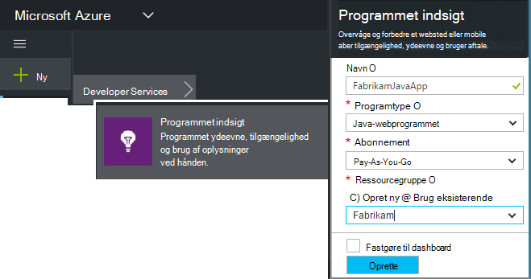
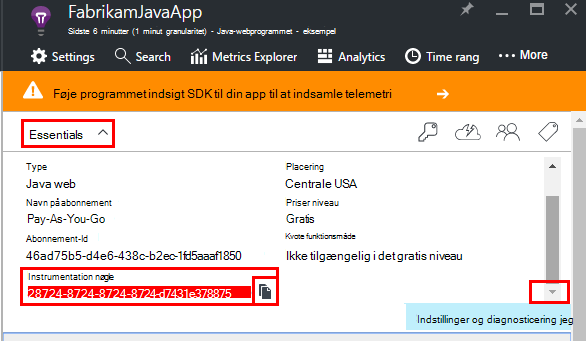
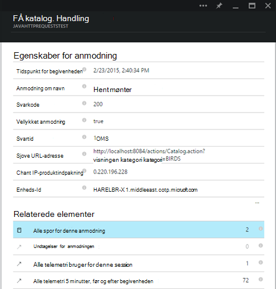
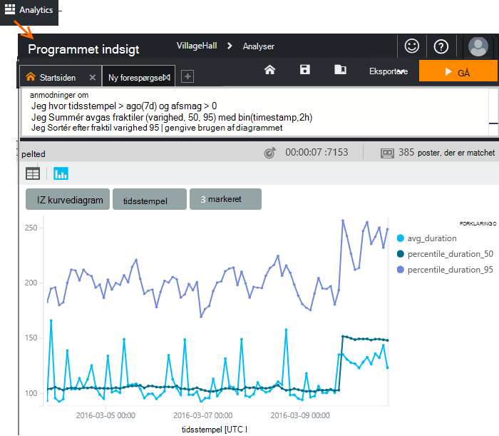
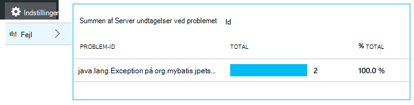
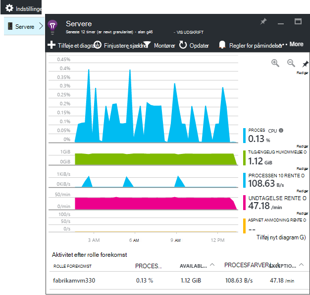
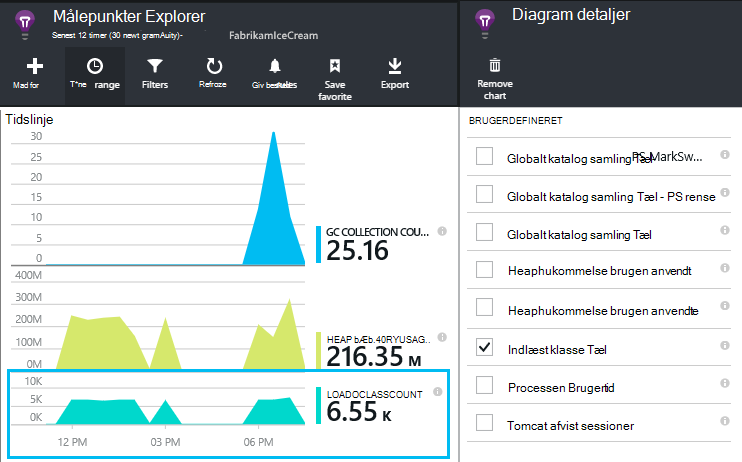
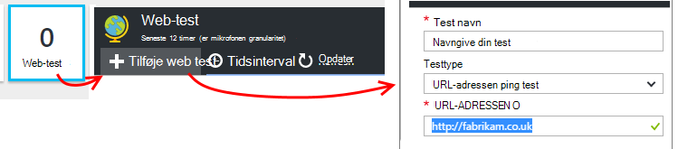
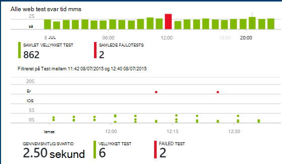

<properties
    pageTitle="Java app Webanalyse med programmet indsigt | Microsoft Azure"
    description="Overvåge ydeevnen for og brugen af webstedet Java med programmet indsigt. "
    services="application-insights"
    documentationCenter="java"
    authors="alancameronwills"
    manager="douge"/>

<tags
    ms.service="application-insights"
    ms.workload="tbd"
    ms.tgt_pltfrm="ibiza"
    ms.devlang="na"
    ms.topic="get-started-article"
    ms.date="08/17/2016"
    ms.author="awills"/>

# Introduktion til programmet indsigt i et Java webprojekt

*Programmet indsigt er i Vis udskrift.*

[AZURE.INCLUDE [app-insights-selector-get-started](../../includes/app-insights-selector-get-started.md)]

[Programmet indsigt](https://azure.microsoft.com/services/application-insights/) er en extensible analytics-tjeneste, der hjælper dig med at forstå den ydeevne og brugen af dit live-program. Bruge det til at [registrere og diagnosticere problemer med ydeevnen og undtagelser](app-insights-detect-triage-diagnose.md), og [skrive programkode] [ api] til at registrere foretage brugere med din app.

Programmet indsigt understøtter Java-apps, der kører på Linux, Unix eller Windows.

Du har brug for:

* Oracle JRE 1,6 eller nyere eller Zulu JRE 1,6 eller nyere
* Et abonnement på [Microsoft Azure](https://azure.microsoft.com/). (Du kan starte med [gratis prøveversion](https://azure.microsoft.com/pricing/free-trial/)).

*Hvis du har en WebApp, der allerede er direkte, kan du følge den alternative fremgangsmåde til at [tilføje SDK på kørselstidspunktet i web-serveren](app-insights-java-live.md). Pågældende alternativ undgår genopbygge koden, men du får ikke mulighed for at skrive programkode for at spore brugeraktivitet.*

## 1. få en programmet indsigt instrumentation nøgle

1. Log på [Microsoft Azure-portalen](https://portal.azure.com).
2. Oprette en programmet indsigt ressource. Angiv programtypen til Java-webprogrammet.

    
4. Find instrumentation nøglen i den nye ressource. Du skal indsætte denne tast i din Kodeprojektet kort.

    

## 2. Tilføj programmet indsigt SDK til Java til dit projekt

*Vælg den relevante måde for projektet.*

#### Hvis du bruger Eklipse til at oprette et projekt Maven eller dynamisk Web...

Brug af [Programmet indsigt SDK til Java plug-in][eclipse].

#### Hvis du bruger Maven...

Hvis dit projekt er allerede konfigureret til at bruge Maven til build, flette følgende kode i filen pom.xml.

Derefter opdatere Projektafhængigheder for at få de binære filer, der er hentet.

    <repositories>
       <repository>
          <id>central</id>
          <name>Central</name>
          <url>http://repo1.maven.org/maven2</url>
       </repository>
    </repositories>

    <dependencies>
      <dependency>
        <groupId>com.microsoft.azure</groupId>
        <artifactId>applicationinsights-web</artifactId>
        <!-- or applicationinsights-core for bare API -->
        <version>[1.0,)</version>
      </dependency>
    </dependencies>

* *Opret eller kontrolsum valideringsfejl?* Prøv at bruge en bestemt version, f.eks.: `<version>1.0.n</version>`. Du finder den nyeste version, i den [SDK produktbemærkninger](https://github.com/Microsoft/ApplicationInsights-Java#release-notes) eller i vores [Maven elementer](http://search.maven.org/#search%7Cga%7C1%7Capplicationinsights).
* *Brug for at opdatere til en ny SDK?* Opdatere dit projekts afhængigheder.

#### Hvis du bruger Gradle...

Hvis dit projekt er allerede konfigureret til at bruge Gradle til build, flette følgende kode i filen build.gradle.

Derefter opdatere Projektafhængigheder for at få de binære filer, der er hentet.

    repositories {
      mavenCentral()
    }

    dependencies {
      compile group: 'com.microsoft.azure', name: 'applicationinsights-web', version: '1.+'
      // or applicationinsights-core for bare API
    }

* *Build eller kontrolsum validering fejl? Prøv at bruge en bestemt version, f.eks.:* `version:'1.0.n'`. *Du finder den nyeste version i [SDK produktbemærkninger](https://github.com/Microsoft/ApplicationInsights-Java#release-notes).*
* *Opdatere en ny SDK*
 * Opdatere dit projekts afhængigheder.

#### Ellers...

Tilføje SDK manuelt:

1. Hent [programmet indsigt SDK til Java](https://aka.ms/aijavasdk).
2. Udtrække de binære filer fra zip-filen, og føj dem til dit projekt.

### Spørgsmål...

* *Hvad er forholdet mellem det `-core` og `-web` komponenter i postnummeret?*

 * `applicationinsights-core`får du mest API. Du skal altid denne komponent.
 * `applicationinsights-web`giver dig metrik, der registrerer HTTP-anmodning om tæller og svar klokkeslæt. Hvis du ikke vil denne telemetri automatisk der indsamles, kan du springe denne komponent. Hvis du vil skrive din egen f.eks.

* *Opdatere SDK, når vi udgiver ændringer*
 * Hent den seneste [Programmet indsigt SDK til Java](https://aka.ms/qqkaq6) og erstatte de gamle.
 * Ændringer er beskrevet i [SDK produktbemærkninger](https://github.com/Microsoft/ApplicationInsights-Java#release-notes).

## 3. tilføje en programmet indsigt .XML-fil

Tilføj ApplicationInsights.xml til mappen ressourcer i projektet, eller Sørg for, at den er føjet til dit projekts installationssti klasse. Kopiere følgende XML-filen til den.

Erstatte nøglen instrumentation, som du har fået fra Azure-portalen.

    <?xml version="1.0" encoding="utf-8"?>
    <ApplicationInsights xmlns="http://schemas.microsoft.com/ApplicationInsights/2013/Settings" schemaVersion="2014-05-30">

      <!-- The key from the portal: -->

      <InstrumentationKey>** Your instrumentation key **</InstrumentationKey>

      <!-- HTTP request component (not required for bare API) -->

      <TelemetryModules>
        <Add type="com.microsoft.applicationinsights.web.extensibility.modules.WebRequestTrackingTelemetryModule"/>
        <Add type="com.microsoft.applicationinsights.web.extensibility.modules.WebSessionTrackingTelemetryModule"/>
        <Add type="com.microsoft.applicationinsights.web.extensibility.modules.WebUserTrackingTelemetryModule"/>
      </TelemetryModules>

      <!-- Events correlation (not required for bare API) -->
      <!-- These initializers add context data to each event -->

      <TelemetryInitializers>
        <Add   type="com.microsoft.applicationinsights.web.extensibility.initializers.WebOperationIdTelemetryInitializer"/>
        <Add type="com.microsoft.applicationinsights.web.extensibility.initializers.WebOperationNameTelemetryInitializer"/>
        <Add type="com.microsoft.applicationinsights.web.extensibility.initializers.WebSessionTelemetryInitializer"/>
        <Add type="com.microsoft.applicationinsights.web.extensibility.initializers.WebUserTelemetryInitializer"/>
        <Add type="com.microsoft.applicationinsights.web.extensibility.initializers.WebUserAgentTelemetryInitializer"/>

      </TelemetryInitializers>
    </ApplicationInsights>

* Tasten instrumentation sendes sammen med hver vare telemetri og fortæller programmet indsigt at få den vist i din ressource.
* Komponenten HTTP-anmodning er valgfrit. Telemetri om mødeindkaldelser og svar gange sendes automatisk til portalen.
* Hændelser korrelations er en tilføjelse til komponenten HTTP-anmodning. Der tildeles et id til hver enkelt anmodning, der er modtaget af serveren og føjer dette id som en egenskab til hver vare telemetri som egenskaben 'Operation.Id'. Det gør det muligt at koordinere den telemetri, der er knyttet til hver enkelt anmodning ved at angive et filter i [diagnosticering Søg][diagnostic].
* Tasten programmet indsigt kan overføres dynamisk fra Azure-portalen som en systemegenskab (-DAPPLICATION_INSIGHTS_IKEY = your_ikey). Hvis der er ingen egenskab, der er defineret, søges der efter miljøvariablen (APPLICATION_INSIGHTS_IKEY) i Azure App-indstillinger. Hvis begge egenskaberne er ikke defineret, bruges standard InstrumentationKey fra ApplicationInsights.xml. Denne fremgangsmåde hjælper dig med at administrere forskellige InstrumentationKeys for forskellige miljøer dynamisk.

### Andre måder at indstille nøglen instrumentation

Programmet indsigt SDK søger efter tasten i denne rækkefølge:

1. Systemegenskab:-DAPPLICATION_INSIGHTS_IKEY = your_ikey
2. Miljøvariablen: APPLICATION_INSIGHTS_IKEY
3. Konfigurationsfil: ApplicationInsights.xml

Du kan også [angive den kode](app-insights-api-custom-events-metrics.md#ikey):

    telemetryClient.InstrumentationKey = "...";

## 4. Tilføj en HTTP-filter

Det sidste trin i konfigurationen kan komponenten HTTP-anmodning om at logge af hver webforespørgsel. (Ikke kræves Hvis du blot ønsker enkelt API).

Find og Åbn filen web.xml i dit projekt, og flette følgende kode under noden web-app, hvor dine programmet filtre er konfigureret.

For at få de mest præcise resultater, skal være knyttet filteret før alle andre filtre.

    <filter>
      <filter-name>ApplicationInsightsWebFilter</filter-name>
      <filter-class>
        com.microsoft.applicationinsights.web.internal.WebRequestTrackingFilter
      </filter-class>
    </filter>
    <filter-mapping>
       <filter-name>ApplicationInsightsWebFilter</filter-name>
       <url-pattern>/*</url-pattern>
    </filter-mapping>

#### Hvis du bruger foråret Web MVC 3.1 eller nyere

Redigere disse elementer for at medtage pakken programmet indsigt:

    <context:component-scan base-package=" com.springapp.mvc, com.microsoft.applicationinsights.web.spring"/>

    <mvc:interceptors>
        <mvc:interceptor>
            <mvc:mapping path="/**"/>
            <bean class="com.microsoft.applicationinsights.web.spring.RequestNameHandlerInterceptorAdapter" />
        </mvc:interceptor>
    </mvc:interceptors>

#### Hvis du bruger Struts 2

Føje elementet til den højde konfigurationsfil (som regel kaldet struts.xml eller højde-default.xml):

     <interceptors>
       <interceptor name="ApplicationInsightsRequestNameInterceptor" class="com.microsoft.applicationinsights.web.struts.RequestNameInterceptor" />
     </interceptors>
     <default-interceptor-ref name="ApplicationInsightsRequestNameInterceptor" />

(Hvis du har defineret en standard-stablede interceptors, interceptor kan blot føjes til denne bunke.)

## 5. Kør dit program

Enten at køre i fejlsikret tilstand på computeren udvikling, eller publicere til din server.

## 6. se din telemetri i programmet indsigt

Gå tilbage til dit program indsigt ressource [Microsoft Azure](https://portal.azure.com)-portalen.

HTTP-anmodninger om data vises på bladet oversigt. (Hvis det ikke er der, vent et par sekunder, og klik derefter på Opdater).

[Lær mere om målepunkter.][metrics]

Klik dig gennem et diagram for at se mere detaljerede aggregeret målepunkter.

> Programmet indsigt antages det, at formatet af HTTP-anmodninger om MVC programmer er: `VERB controller/action`. For eksempel `GET Home/Product/f9anuh81`, `GET Home/Product/2dffwrf5` og `GET Home/Product/sdf96vws` er inddelt i `GET Home/Product`. Denne gruppering aktiverer sigende sammenlægninger af anmodninger, som antallet af anmodninger om og gennemsnitlige kørselstid anmodninger om.

### Forekomst af data 

Klik dig gennem en bestemt anmodningstype for at se individuelle forekomster. 

To typer data vises i programmet indsigt: aggregerede data, gemmes og vises som gennemsnit, antal og summer; og forekomst data - individuelle rapporter på HTTP-anmodninger, undtagelser, sidevisninger eller brugerdefinerede hændelser.

Når du får vist egenskaberne for en anmodning, kan du se de telemetri hændelser, der er knyttet til den som anmodninger og undtagelser.

### Analytics: Effektiv forespørgselssprog

Når du samle flere data, kan du køre forespørgsler både til at indsamle data og til at finde individuelle forekomster. [Analytics]() er et effektivt værktøj til både til ydeevne og brugen og til diagnosticering.

## 7. Installer din app på serveren

Nu publicere din app på serveren, lade folk Brug den, og se telemetri vises på portalen.

* Sørg for, at din firewall tillader dit program til at sende telemetri til disse porte:

 * DC.Services.visualstudio.com:443
 * F5.Services.visualstudio.com:443

* Installere på Windows-servere:

 * [Microsoft Visual C++ Redistributable](http://www.microsoft.com/download/details.aspx?id=40784)

    (Denne komponent aktiverer tællere i ydeevne).

## Undtagelser og anmodning om fejl

Ikke-afviklet undtagelser samles automatisk:

Hvis du vil indsamle oplysninger om andre undtagelser, har du to muligheder:

* [Indsætte opkald til trackException() i din kode][apiexceptions]. 
* [Installere Java Agent på din server](app-insights-java-agent.md). Du angiver de metoder, du vil se.

## Overvåge metode opkald og eksterne afhængigheder

[Installere Java Agent](app-insights-java-agent.md) til at logge angivet interne metoder og opkald foretages via JDBC, med tidsindstilling data.

## Tællere i ydeevne

Åbn **Indstillinger for** **servere**, hvis du vil se en række tællere i ydeevne.

### Tilpasse ydeevne tæller af websteder

Hvis du vil deaktivere samling af standardsæt af tællere i ydeevne, du tilføje følgende kode under noden i roden af filen ApplicationInsights.xml:

    <PerformanceCounters>
       <UseBuiltIn>False</UseBuiltIn>
    </PerformanceCounters>

### Indsamle flere ydeevne tællere

Du kan angive yderligere ydeevne tællere for at blive indsamlet.

#### JMX tællere (vises ved Java Virtual Machine)

    <PerformanceCounters>
      <Jmx>
        <Add objectName="java.lang:type=ClassLoading" attribute="TotalLoadedClassCount" displayName="Loaded Class Count"/>
        <Add objectName="java.lang:type=Memory" attribute="HeapMemoryUsage.used" displayName="Heap Memory Usage-used" type="composite"/>
      </Jmx>
    </PerformanceCounters>

*   `displayName`– Navnet vises i portalen programmet indsigt.
*   `objectName`– JMX objektnavn.
*   `attribute`– På attributten for objektnavn JMX til at hente
*   `type`(valgfrit) – typen JMX objektets attributter:
 *  Standard: en simpel type som int eller lang.
 *  `composite`: performance tællerdata er i formatet af 'Attribute.Data'
 *  `tabular`: performance tællerdata er i formatet af en tabelrække

#### Windows tællere i ydeevne

Hver [Windows ydeevne tæller](https://msdn.microsoft.com/library/windows/desktop/aa373083.aspx) er medlem af en kategori (på samme måde, et felt er medlem af en klasse). Kategorier kan kan enten være global, eller have nummererede eller navngivne forekomster.

    <PerformanceCounters>
      <Windows>
        <Add displayName="Process User Time" categoryName="Process" counterName="%User Time" instanceName="__SELF__" />
        <Add displayName="Bytes Printed per Second" categoryName="Print Queue" counterName="Bytes Printed/sec" instanceName="Fax" />
      </Windows>
    </PerformanceCounters>

*   vist navn – vises navnet på programmet indsigt portalen.
*   Kategorinavn – ydeevne tæller kategori (ydeevne objekt), som er tilknyttet tælleren ydeevne.
*   counterName – navnet på tælleren ydeevne.
*   navn på forekomst – navnet på den ydeevne tæller kategori forekomst eller en tom streng (""), hvis kategorien indeholder en enkelt forekomst. Hvis kategorinavn er proces, og tælleren ydeevne, du vil indsamle er fra den aktuelle JVM proces på som din app kører, skal du angive `"__SELF__"`.

Din tællere i ydeevne kan ses som brugerdefineret målepunkter i [Målepunkter Explorer][metrics].

### UNIX tællere i ydeevne

* [Installere collectd med programmet indsigt plug-in'et](app-insights-java-collectd.md) til at hente en lang række system og netværk data.

## Hent data for brugeren og session

OK, sender du telemetri fra webserveren. Nu for at få den fulde 360-graders visning af dit program, kan du tilføje flere overvågning:

* [Føje telemetri til dine websider] [ usage] til at overvåge sidevisninger og bruger målepunkter.
* [Konfigurere web test] [ availability] at sikre, at dit program forbliver direkte og svarede.

## Registrere log sporinger

Du kan bruge programmet indsigt til udsnit og terningerne logfiler fra Log4J, Logback eller andre logføring strukturer. Du kan justere logfiler med HTTP-anmodninger og andre telemetri. [Få mere at vide hvordan][javalogs].

## Sende din egen telemetri

Nu hvor du har installeret SDK, kan du bruge API til at sende din egen telemetri.

* [Spore brugerdefinerede hændelser og målepunkter] [ api] til at få mere at vide, hvad brugerne laver med dit program.
* [Søge begivenheder og logge] [ diagnostic] at finde årsagerne problemer.

## Tilgængelighed web test

Programmet indsigt kan du teste dit websted med jævne mellemrum at kontrollere, at det er op og reagerer godt. [Konfigurere][availability], skal du klikke på Web test.

Hvis webstedet går ned, får du vist diagrammer af svar gange samt besked via mail.

[Lær mere om tilgængeligheden af web test.][availability] 

## Har du spørgsmål? Problemer med?

[Fejlfinding i forbindelse med Java](app-insights-java-troubleshoot.md)

## Næste trin

Du kan finde yderligere oplysninger finder [Java Developer Center](/develop/java/).

<!--Link references-->

[api]: app-insights-api-custom-events-metrics.md
[apiexceptions]: app-insights-api-custom-events-metrics.md#track-exception
[availability]: app-insights-monitor-web-app-availability.md
[diagnostic]: app-insights-diagnostic-search.md
[eclipse]: app-insights-java-eclipse.md
[javalogs]: app-insights-java-trace-logs.md
[metrics]: app-insights-metrics-explorer.md
[usage]: app-insights-web-track-usage.md
