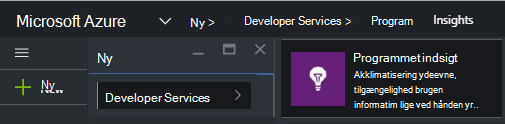
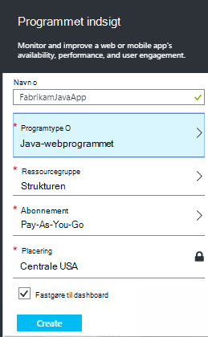
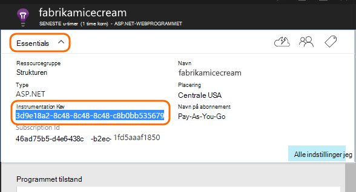
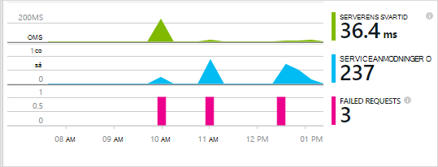
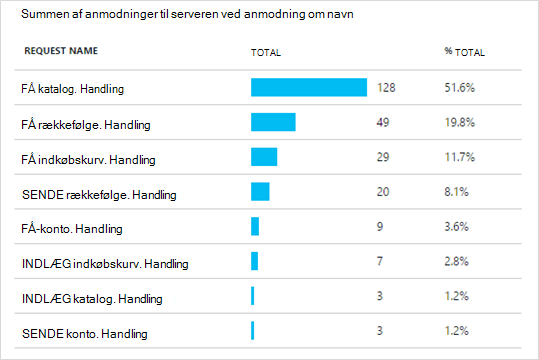

<properties 
    pageTitle="Programmet indsigt til Java webapps, der allerede findes live" 
    description="Starte overvågning af et webprogram, der allerede kører på serveren" 
    services="application-insights" 
    documentationCenter="java"
    authors="alancameronwills" 
    manager="douge"/>

<tags 
    ms.service="application-insights" 
    ms.workload="tbd" 
    ms.tgt_pltfrm="ibiza" 
    ms.devlang="na" 
    ms.topic="article" 
    ms.date="08/24/2016" 
    ms.author="awills"/>
 
# Programmet indsigt til Java webapps, der allerede findes live

*Programmet indsigt er i Vis udskrift.*

Hvis du har et webprogram, der allerede kører på din J2EE-server, kan du starte overvågning med [Programmet indsigt](app-insights-overview.md) uden at skulle foretage kodeændringer eller genkompilere projektet. Med denne indstilling, kan du få oplysninger om HTTP-anmodninger sendes til din server, ikke-afviklet undtagelser og tællere i ydeevne.

Du skal have et abonnement på [Microsoft Azure](https://azure.com).

> [AZURE.NOTE] Fremgangsmåden på denne side føjer SDK til din online på kørselstidspunktet. Denne runtime instrumentation er nyttigt, hvis du ikke vil opdatere eller genopbygge din kildekode. Men hvis det er muligt, anbefaler vi du [tilføjer SDK til koden](app-insights-java-get-started.md) i stedet. Får du flere indstillinger, såsom skrive kode til at registrere brugeraktivitet.

## 1. få en programmet indsigt instrumentation nøgle

1. Log på [Microsoft Azure-portalen](https://portal.azure.com)
2. Oprette en ny programmet indsigt ressource

    
3. Angiv programtypen til Java-webprogrammet.

    
4. Find instrumentation nøglen i den nye ressource. Du skal indsætte denne tast i din Kodeprojektet kort.

    

## 2. Hent SDK

1. Hent [programmet indsigt SDK til Java](https://aka.ms/aijavasdk). 
2. Udtrække SDK indholdet til den mappe, hvor din project binære filer er indlæst på din server. Hvis du bruger Tomcat, vil typisk være denne mappe under`webapps\<your_app_name>\WEB-INF\lib`

## 3. tilføje en programmet indsigt XML-fil

Oprette ApplicationInsights.xml i den mappe, hvor du har tilføjet i SDK. Sætte ind i den følgende XML.

Erstatte nøglen instrumentation, som du har fået fra Azure-portalen.

    <?xml version="1.0" encoding="utf-8"?>
    <ApplicationInsights xmlns="http://schemas.microsoft.com/ApplicationInsights/2013/Settings" schemaVersion="2014-05-30">

      <!-- The key from the portal: -->

      <InstrumentationKey>** Your instrumentation key **</InstrumentationKey>

      <!-- HTTP request component (not required for bare API) -->

      <TelemetryModules>
        <Add type="com.microsoft.applicationinsights.web.extensibility.modules.WebRequestTrackingTelemetryModule"/>
        <Add type="com.microsoft.applicationinsights.web.extensibility.modules.WebSessionTrackingTelemetryModule"/>
        <Add type="com.microsoft.applicationinsights.web.extensibility.modules.WebUserTrackingTelemetryModule"/>
      </TelemetryModules>

      <!-- Events correlation (not required for bare API) -->
      <!-- These initializers add context data to each event -->

      <TelemetryInitializers>
        <Add   type="com.microsoft.applicationinsights.web.extensibility.initializers.WebOperationIdTelemetryInitializer"/>
        <Add type="com.microsoft.applicationinsights.web.extensibility.initializers.WebOperationNameTelemetryInitializer"/>
        <Add type="com.microsoft.applicationinsights.web.extensibility.initializers.WebSessionTelemetryInitializer"/>
        <Add type="com.microsoft.applicationinsights.web.extensibility.initializers.WebUserTelemetryInitializer"/>
        <Add type="com.microsoft.applicationinsights.web.extensibility.initializers.WebUserAgentTelemetryInitializer"/>

      </TelemetryInitializers>
    </ApplicationInsights>

* Tasten instrumentation sendes sammen med hver vare telemetri og fortæller programmet indsigt at få den vist i din ressource.
* Komponenten HTTP-anmodning er valgfrit. Telemetri om mødeindkaldelser og svar gange sendes automatisk til portalen.
* Hændelser korrelations er en tilføjelse til komponenten HTTP-anmodning. Der tildeles et id til hver enkelt anmodning, der er modtaget af serveren og føjer dette id som en egenskab til hver vare telemetri som egenskaben 'Operation.Id'. Det gør det muligt at koordinere den telemetri, der er knyttet til hver enkelt anmodning ved at angive et filter i [diagnosticering Søg](app-insights-diagnostic-search.md).

## 4. Tilføj en HTTP-filter

Find og Åbn filen web.xml i dit projekt, og flette følgende kodestykke af kode under noden web-app, hvor dine programmet filtre er konfigureret.

For at få de mest præcise resultater, skal være knyttet filteret før alle andre filtre.

    <filter>
      <filter-name>ApplicationInsightsWebFilter</filter-name>
      <filter-class>
        com.microsoft.applicationinsights.web.internal.WebRequestTrackingFilter
      </filter-class>
    </filter>
    <filter-mapping>
       <filter-name>ApplicationInsightsWebFilter</filter-name>
       <url-pattern>/*</url-pattern>
    </filter-mapping>

## 5. Kontroller undtagelser

Du skal muligvis [angive undtagelser til at sende udgående data](app-insights-ip-addresses.md).

## 6. Genstart din online

## 7. se din telemetri i programmet indsigt

Gå tilbage til dit program indsigt ressource [Microsoft Azure](https://portal.azure.com)-portalen.

Telemetri om HTTP-anmodninger vises på bladet oversigt. (Hvis det ikke er der, vent et par sekunder, og klik derefter på Opdater).

 

Klik dig gennem et diagram for at se flere målepunkter. 

 

Og når du får vist egenskaberne for en anmodning, kan du se de telemetri hændelser, der er knyttet til den som anmodninger og undtagelser.
 

[Lær mere om målepunkter.](app-insights-metrics-explorer.md)

## Næste trin

* [Tilføj telemetri til dine websider](app-insights-web-track-usage.md) til at overvåge sidevisninger og bruger målepunkter.
* [Konfigurere web test](app-insights-monitor-web-app-availability.md) for at sikre, at dit program forbliver direkte og svarede.
* [Registrere log sporinger](app-insights-java-trace-logs.md)
* [Søg begivenheder og logfiler](app-insights-diagnostic-search.md) for at diagnosticere problemer.

 
