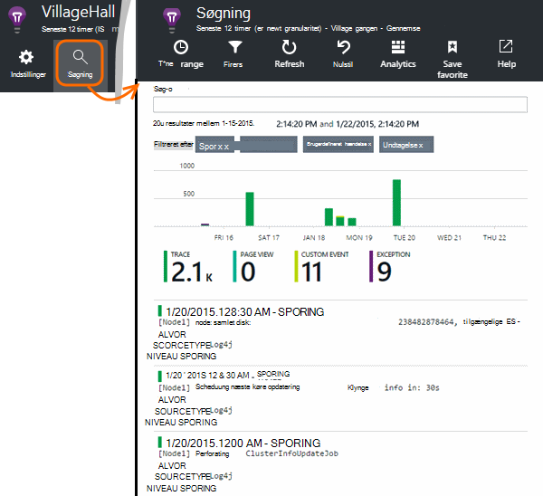

<properties 
    pageTitle="Udforske Java sporing logfiler i programmet indsigt" 
    description="Søg Log4J eller Logback sporinger i programmet indsigt" 
    services="application-insights" 
    documentationCenter="java"
    authors="alancameronwills" 
    manager="douge"/>

<tags 
    ms.service="application-insights" 
    ms.workload="tbd" 
    ms.tgt_pltfrm="ibiza" 
    ms.devlang="na" 
    ms.topic="article" 
    ms.date="07/12/2016" 
    ms.author="awills"/>

# Udforske Java sporing logfiler i programmet indsigt

Hvis du bruger Logback eller Log4J (version 1.2 eller v2.0) i sporing, kan du få sporingslogfilerne sendes automatisk til programmet viden, hvor du kan udforske og søge efter dem.

Installere [Programmet indsigt SDK til Java][java], hvis du ikke allerede har gjort.

## Føje logføring biblioteker til dit projekt

*Vælg den relevante måde for projektet.*

#### Hvis du bruger Maven...

Hvis dit projekt er allerede konfigureret til at bruge Maven til build, flette et af følgende kodestykker af kode til filen pom.xml.

Derefter opdatere Projektafhængigheder, for at få de binære filer, der er hentet.

*Logback*

    <dependencies>
       <dependency>
          <groupId>com.microsoft.azure</groupId>
          <artifactId>applicationinsights-logging-logback</artifactId>
          <version>[1.0,)</version>
       </dependency>
    </dependencies>

*Log4J v2.0*

    <dependencies>
       <dependency>
          <groupId>com.microsoft.azure</groupId>
          <artifactId>applicationinsights-logging-log4j2</artifactId>
          <version>[1.0,)</version>
       </dependency>
    </dependencies>

*Log4J version 1.2*

    <dependencies>
       <dependency>
          <groupId>com.microsoft.azure</groupId>
          <artifactId>applicationinsights-logging-log4j1_2</artifactId>
          <version>[1.0,)</version>
       </dependency>
    </dependencies>

#### Hvis du bruger Gradle...

Hvis dit projekt er allerede konfigureret til at bruge Gradle til build, tilføje et af følgende linjer til den `dependencies` gruppere i build.gradle filen:

Derefter opdatere Projektafhængigheder, for at få de binære filer, der er hentet.

**Logback**

    compile group: 'com.microsoft.azure', name: 'applicationinsights-logging-logback', version: '1.0.+'

**Log4J v2.0**

    compile group: 'com.microsoft.azure', name: 'applicationinsights-logging-log4j2', version: '1.0.+'

**Log4J version 1.2**

    compile group: 'com.microsoft.azure', name: 'applicationinsights-logging-log4j1_2', version: '1.0.+'

#### Ellers...

Hent og udtrække den relevante appender, og derefter tilføje den relevante dokumentbibliotek til dit projekt:

Logføring | Download | Bibliotek
----|----|----
Logback|[SDK med Logback appender](https://aka.ms/xt62a4)|applicationinsights-logføring-logback
Log4J v2.0|[SDK med Log4J v2 appender](https://aka.ms/qypznq)|applicationinsights-logføring-log4j2 
Log4j version 1.2|[SDK med Log4J version 1.2 appender](https://aka.ms/ky9cbo)|applicationinsights-logføring-log4j1_2 

## Føje appender til din logføring framework

Hvis du vil modtage sporinger, Flet den relevante kodestykke af kode til konfigurationsfil Log4J eller Logback: 

*Logback*

    <appender name="aiAppender" 
      class="com.microsoft.applicationinsights.logback.ApplicationInsightsAppender">
    </appender>
    <root level="trace">
      <appender-ref ref="aiAppender" />
    </root>

*Log4J v2.0*

    <Configuration packages="com.microsoft.applicationinsights.Log4j">
      <Appenders>
        <ApplicationInsightsAppender name="aiAppender" />
      </Appenders>
      <Loggers>
        <Root level="trace">
          <AppenderRef ref="aiAppender"/>
        </Root>
      </Loggers>
    </Configuration>

*Log4J version 1.2*

    <appender name="aiAppender" 
         class="com.microsoft.applicationinsights.log4j.v1_2.ApplicationInsightsAppender">
    </appender>
    <root>
      <priority value ="trace" />
      <appender-ref ref="aiAppender" />
    </root>

Programmet indsigt appenders kan det referere til en hvilken som helst konfigureret logføring og ikke nødvendigvis logføring af rod (som vist i eksemplerne i ovenfor).

## Udforske dine sporinger i portalen programmet indsigt

Nu, hvor du har konfigureret dit projekt for at sende sporinger til programmet viden, kan du få vist og Søg efter disse spor i portalen programmet indsigt i feltet [Søg] [ diagnostic] blade.

## Næste trin

[Diagnosticering søgning][diagnostic]

<!--Link references-->

[diagnostic]: app-insights-diagnostic-search.md
[java]: app-insights-java-get-started.md

 
