<properties
    pageTitle="Programmet indsigt til JavaScript web apps | Microsoft Azure"
    description="Få siden visning og session tæller, web klientdata og registrere brugsmønstre. Registrere undtagelser og problemer med ydeevnen i JavaScript websider."
    services="application-insights"
    documentationCenter=""
    authors="alancameronwills"
    manager="douge"/>

<tags
    ms.service="application-insights"
    ms.workload="tbd"
    ms.tgt_pltfrm="ibiza"
    ms.devlang="na"
    ms.topic="get-started-article"
    ms.date="08/15/2016"
    ms.author="awills"/>

# Programmet indsigt til websider

[AZURE.INCLUDE [app-insights-selector-get-started-dotnet](../../includes/app-insights-selector-get-started-dotnet.md)]

Lær mere om den ydeevne og brugen af din webside eller en app. Hvis du føjer Visual Studio programmet indsigt til din side-script, får du tidsindstillinger af indlæse siden og AJAX-opkald, tæller og detaljer i browseren undtagelser og AJAX fejl, samt brugere og session tæller. Alle dette kan være opdelt ved siden klient OS og browserversion, geografisk placering og andre dimensioner. Du kan også angive beskeder på manglende tæller eller sænke siden indlæsning.

Du kan bruge programmet indsigt med en hvilken som helst websider – du tilføje blot korte JavaScript. Hvis din webtjeneste er [Java](app-insights-java-get-started.md) eller [ASP.NET](app-insights-asp-net.md), kan du integrere telemetri fra serveren og klienter.

Du har brug for et abonnement på [Microsoft Azure](https://azure.com). Hvis dit team har et organisatorisk abonnement stille ejeren af at føje din Microsoft-Account til den. Der er en gratis priser niveau, så udvikling og mindre Brug ikke omkostninger noget.

## Konfigurere programmet indsigt til din webside

Først skal du føje programmet indsigt til dine websider? Du kan allerede har gjort det. Hvis du vælger at føje programmet indsigt til din online i dialogboksen nyt projekt i Visual Studio, blev scriptet tilføjet derefter. Det er tilfældet, behøver du ikke at udføre mere.

Ellers skal du tilføje et stykke af kode dine websider, på følgende måde.

### Åbn en ressource, som programmet indsigt

Programmet indsigt ressourcen er, hvor data om ydeevne og brug af din side vises. 

Log på [Azure-portalen](https://portal.azure.com).

Hvis du allerede konfigureret overvågning for serversiden af din app, har du allerede en ressource:

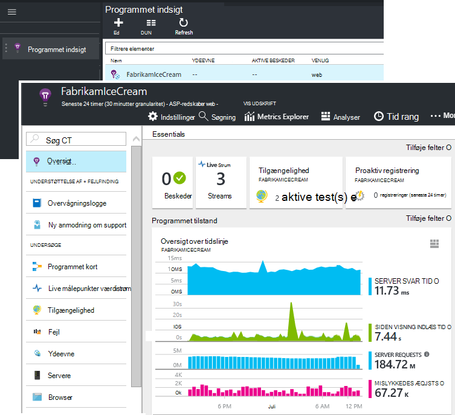

Hvis du ikke har en, du Opret den:

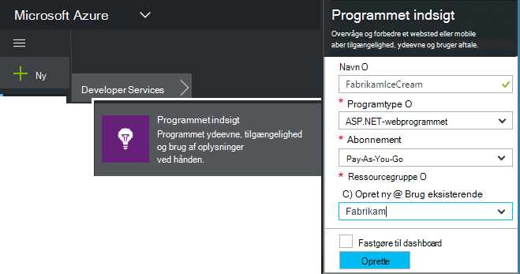

*Allerede spørgsmål?* [Mere om oprettelse af en ressource](app-insights-create-new-resource.md).

### Føje SDK scriptet til din app eller websider

Få scriptet til websider i Hurtig Start:

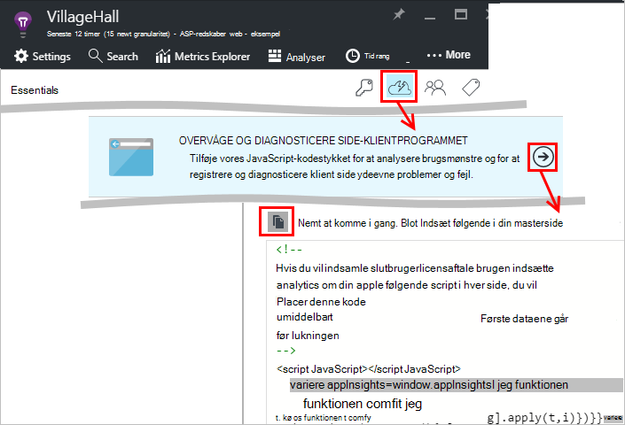

Indsæt scriptet lige før den `</head>` mærke på hver side, du vil registrere. Hvis webstedet har en masterside, kan du flytte scriptet der. Eksempel:

* I et ASP.NET MVC projekt, skal du sætte den`View\Shared\_Layout.cshtml`
* Åbn i et SharePoint-websted på Kontrolpanel [Indstillinger for websted / masterside](app-insights-sharepoint.md).

Scriptet indeholder tasten instrumentation, der omdirigerer data til dit program indsigt ressource. 

([Dybere forklaring af scriptet](http://apmtips.com/blog/2015/03/18/javascript-snippet-explained/))

*(Hvis du bruger en velkendt webside ramme, se efter program indsigt kort. For example, der er [et AngularJS modul](http://ngmodules.org/modules/angular-appinsights).)*

## Oplysninger om konfigurationen

Der er flere [parametre](https://github.com/Microsoft/ApplicationInsights-JS/blob/master/API-reference.md#config) , du kan angive, selvom de fleste tilfælde kan du ikke bør nødt til at. For eksempel kan du deaktivere eller begrænse antallet Ajax opkald rapporteret per sidevisning (for at reducere trafik). Eller du kan konfigurere fejlsikret tilstand skal have telemetri hurtigt flytte gennem en pipeline uden at blive batches.

Hvis du vil angive disse parametre, se for denne linje kodestykket, og tilføje flere kommaseparerede elementer efter det:

    })({
      instrumentationKey: "..."
      // Insert here
    });

[Tilgængelige parametre](https://github.com/Microsoft/ApplicationInsights-JS/blob/master/API-reference.md#config) omfatter:

    // Send telemetry immediately without batching.
    // Remember to remove this when no longer required, as it
    // can affect browser performance.
    enableDebug: boolean,

    // Don't log browser exceptions.
    disableExceptionTracking: boolean,

    // Don't log ajax calls.
    disableAjaxTracking: boolean,

    // Limit number of Ajax calls logged, to reduce traffic.
    maxAjaxCallsPerView: 10, // default is 500

    // Time page load up to execution of first trackPageView().
    overridePageViewDuration: boolean,

    // Set these dynamically for an authenticated user.
    appUserId: string,
    accountId: string,

## Køre din app

Køre din online, skal du bruge det et stykke tid til at generere telemetri, og vent et par sekunder. Du kan enten køre den ved hjælp af tasten **F5** på computeren udvikling eller publicere den og lade brugere lege med den.

Hvis du vil kontrollere den telemetri, der bruges til at sende en online til programmet indsigt, kan du bruge browserens fejlfindingsværktøjer (**F12** i mange browsere). Data, der sendes til dc.services.visualstudio.com.

## Udforske dine ydeevnedata i browseren

Åbn bladet browsere for at få vist samlede ydelsesdata fra dine brugeres browsere.

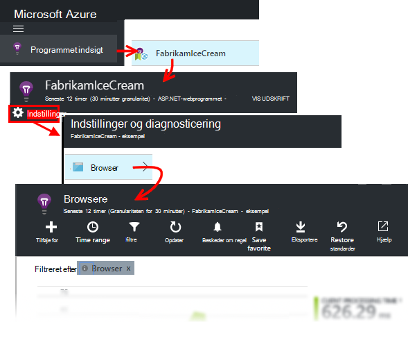

*Ingen data endnu? Klik på * *opdatere* * øverst på siden. Stadig noget? Se [fejlfinding](app-insights-troubleshoot-faq.md).*

Bladet browsere er en [målepunkter Explorer blade](app-insights-metrics-explorer.md) med forudindstillede filtre og diagram valg. Du kan redigere tidsinterval, filtre og konfiguration af diagrammet, hvis du vil, og Gem resultatet som en favorit. Klik på **gendanne standardindstillinger for** at komme tilbage til den oprindelige blade konfiguration.

## Siden Indlæs ydeevne

Er et segmenteret diagram over sideindlæsningstider øverst. Den samlede højde i diagrammet repræsenterer den gennemsnitlige tid at indlæse og vise sider fra din app i dine brugeres browsere. Tid, målt fra, når browseren sender indledende HTTP-anmodningen indtil alle synkron Indlæs hændelser er blevet behandlet, herunder layout og køre scripts. Det omfatter ikke asynkron opgaver som indlæser webdele fra AJAX opkald.

Diagrammet segmenter indlæsningstiden samlede side til [standard tidsindstillinger, der er defineret af W3C](http://www.w3.org/TR/navigation-timing/#processing-model). 

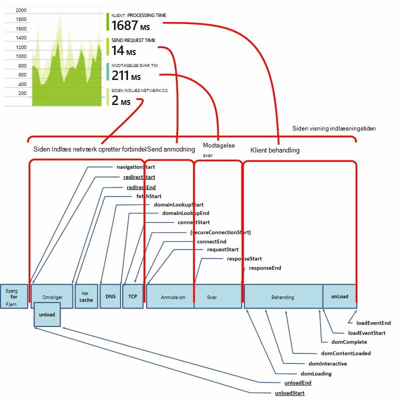

Bemærk, at *netværket forbinde* er ofte lavere, end du kan forvente, fordi det er et gennemsnit over alle anmodninger fra browseren på serveren. Mange individuelle anmodninger have forbinde klokkeslæt på 0, fordi der allerede findes en aktiv forbindelse til serveren.

### Sænke indlæsning?

Indlæse langsom siden er en hyppig årsag til utilfredshed for dine brugere. Hvis diagrammet angiver langsom siden indlæses, er det nemt at gøre nogle diagnosticering opslag.

Diagrammet viser gennemsnittet af alle siden indlæses i din app. Hvis du vil se, hvis problemet er begrænset til bestemte sider, Kig længere nede bladet, hvor der ikke er et gitter, opdelt efter URL-adressen:

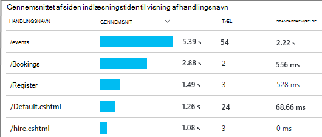

Bemærk sidetallet til visning og standardafvigelse. Hvis sidetælleren er meget lav, derefter påvirker problemet ikke brugere meget. En høj standardafvigelse (sammenlignes med gennemsnittet selve) angiver en masse variation mellem individuelle målinger.

**Zoome ind på én URL-adresse og få vist én side.** Klik på en hvilken som helst sidenavn for at se en blade browser diagrammer, der er filtreret til URL-adressen; og derefter på en forekomst af en sidevisning.

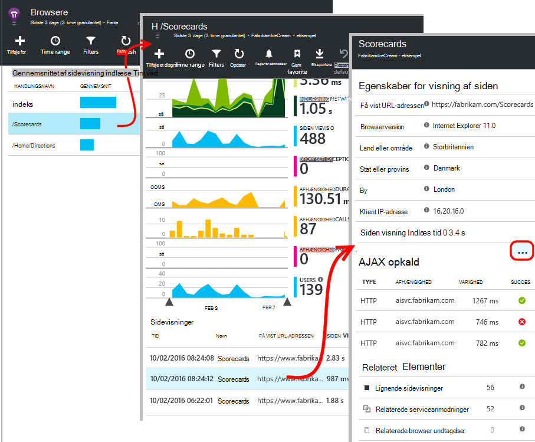

Klik på `...` for en komplet liste over egenskaberne for begivenheden, eller Undersøg Ajax opkald og relaterede begivenheder. Langsom Ajax-opkald påvirker den overordnede side indlæsningstiden, hvis de er synkron. Relaterede hændelser indeholder anmodninger til serveren til den samme URL-adresse (Hvis du har konfigureret programmet indsigt på webserveren).

**Siden ydeevne over tid.** Ændre gitteret siden visning indlæsningstiden til et kurvediagram at se, om der er blevet spidser på bestemte tidspunkter tilbage på bladet browsere:

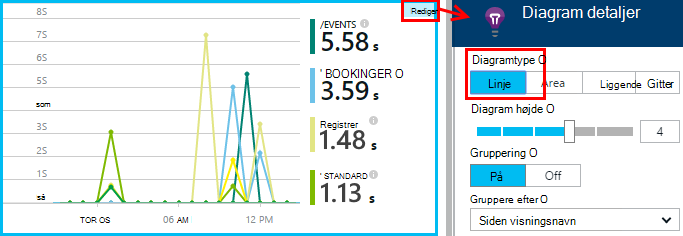

**Segment skal tildeles efter andre dimensioner.** Dine sider er måske langsommere at indlæse på en bestemt browser, klienten OS eller bruger lokalitet? Tilføje et nyt diagram og eksperimentere med dimensionen **Group by** .

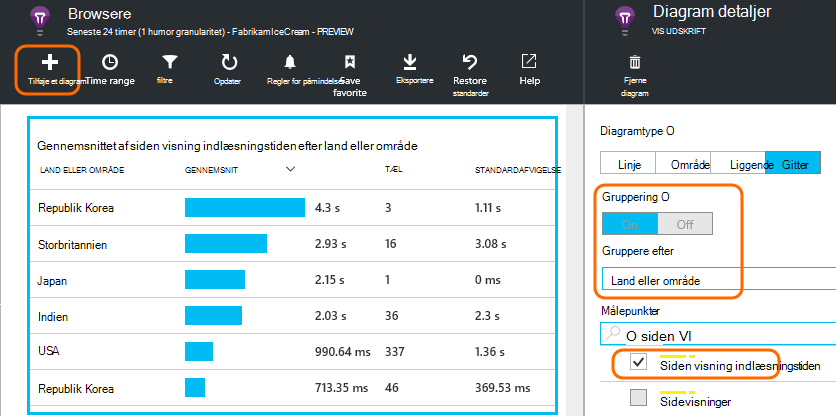

## AJAX ydeevne

Kontrollér, at en hvilken som helst AJAX opkald på dine websider fungerer godt. De er ofte bruges til at udfylde dele af din side asynkront. Selvom den overordnede side kan indlæse straks, skal kunne brugerne komprimering af foran tom webdele, venter på data, der skal vises i dem.

AJAX-opkald foretages fra din webside vises under bladet browsere som afhængigheder.

Der er oversigtsdiagrammer i den øverste del af bladet:

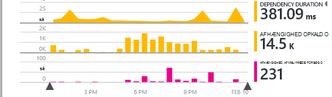

og detaljerede gitre nederste ned:

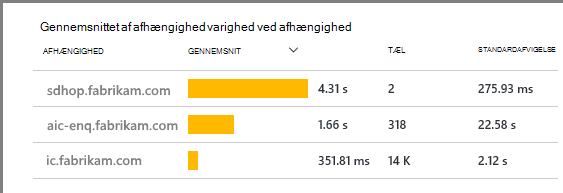

Klik på en hvilken som helst række til særlige detaljer.

> [AZURE.NOTE] Hvis du sletter browsere filteret på bladet, medtages både server og AJAX afhængigheder i disse diagrammer. Klik på Gendan standardindstillinger for at omkonfigurere filteret.

Rul ned til gitteret afhængighed mislykkede forsøg på **at dykke ned mislykkedes Ajax-opkald** , og klik derefter på en række for at se specifikke forekomster.

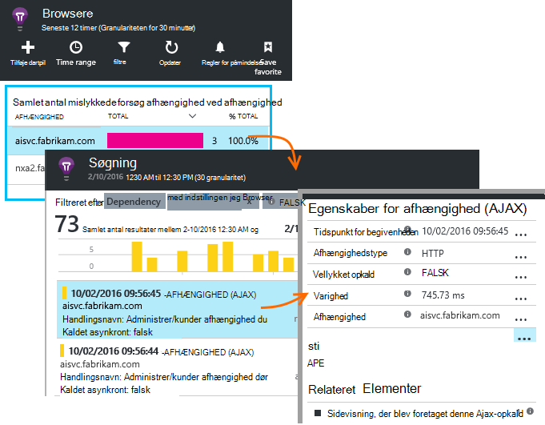

Klik på `...` for den fulde telemetri til en Ajax-opkald.

### Der er ingen Ajax opkald rapporteret?

AJAX opkald omfatter en hvilken som helst HTTP-opkald foretages fra scriptet på websiden. Hvis du ikke kan se dem rapporteret, Kontrollér, at kodestykket ikke indstillet på `disableAjaxTracking` eller `maxAjaxCallsPerView` [parametre](https://github.com/Microsoft/ApplicationInsights-JS/blob/master/API-reference.md#config).

## Browser undtagelser

På bladet browsere er der en oversigt over undtagelser-diagram, og et gitter med undtagelse typer yderligere ned bladet.

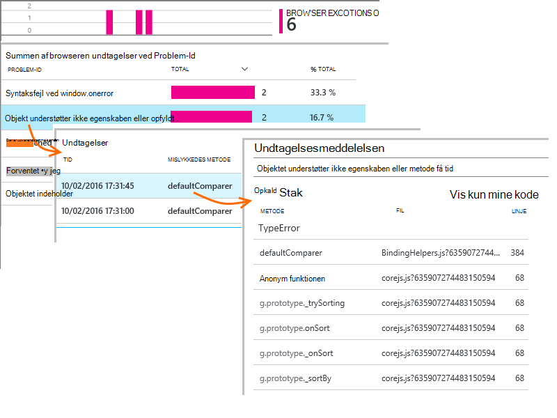

Hvis du ikke kan se browser undtagelser rapporteret, Kontrollér, at kodestykket ikke indstillet på `disableExceptionTracking` [parameter](https://github.com/Microsoft/ApplicationInsights-JS/blob/master/API-reference.md#config).

## Undersøge enkelte sider Vis hændelser

Normalt siden visning telemetri analysere ved programmet viden, og du se kun akkumuleret rapporter, beregne et gennemsnit over alle dine brugere. Men forbindelse med fejlfinding, kan du også se på enkelte sider Vis hændelser.

Angive filtre til visning af siden i bladet diagnosticering søgning.

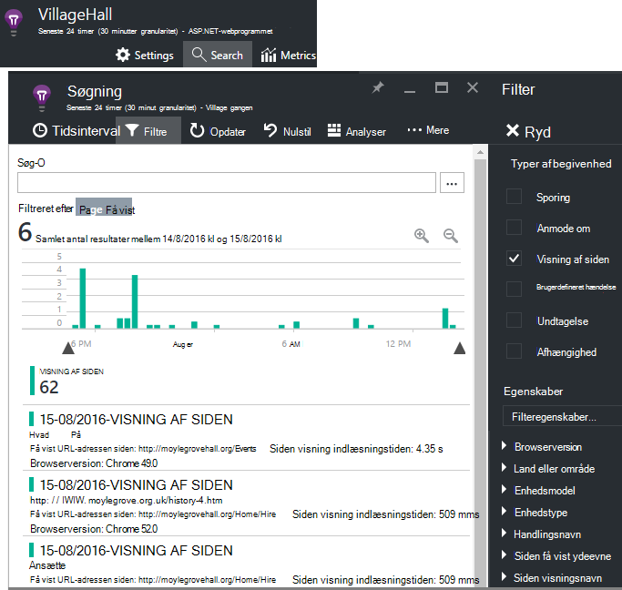

Vælg en hvilken som helst begivenhed til at få vist flere detaljer. Klik på "..." for at se endnu flere detaljer i siden detaljer.

> [AZURE.NOTE] Hvis du bruger [Søg](app-insights-diagnostic-search.md), Bemærk, at du skal kun hele ord: "Abou" og "bout" stemmer ikke overens "Om".

Du kan også bruge de effektive [analyser forespørgsel sprog](app-insights-analytics-tour.md) til at søge sidevisninger.

### Siden Vis egenskaber

* **Siden Vis varighed** 

 * Som standard er den tid, det tager for at indlæse siden fra klient anmode om at fuld belastning (herunder ekstra filer, men ikke asynkrone opgaver, som Ajax kalder). 
 * Hvis du angiver `overridePageViewDuration` på [siden konfiguration](#detailed-configuration), intervallet mellem klient anmode om at udførelse af først `trackPageView`. Hvis du har flyttet trackPageView fra den sædvanlige placering efter initialiseringen af scriptet, afspejles den en anden værdi.
 * Hvis `overridePageViewDuration` er indstillet til samt en varighed af argumenterne ikke er angivet i den `trackPageView()` opkald, og derefter argumentets værdi bruges i stedet. 

## Brugerdefineret tæller

Som standard opstår et antal sider, hver gang en ny side indlæser i klient-browseren.  Men kan du vil tælle yderligere sidevisninger. For eksempel en side kan vise dens indhold i faner, og du vil tælle en side, når brugeren skifter faner. Eller JavaScript-kode på siden indlæses måske nyt indhold uden at ændre URL-adressen i browseren.

Indsætte et JavaScript opkald således på det ønskede sted i din klientkode:

    appInsights.trackPageView(myPageName);

Navnet på siden kan indeholde de samme tegn som en URL-adresse, men alt efter "#" eller "?" ignoreres.

## Brug af sporing

Vil du finde ud af, hvad brugerne gøre med din app?

* [Få mere at vide om brugen registrering](app-insights-web-track-usage.md)
* [Få mere at vide om brugerdefinerede hændelser og målepunkter API](app-insights-api-custom-events-metrics.md).

#### Video: Registrere brugen

> [AZURE.VIDEO tracking-usage-with-application-insights]

## Næste trin

* [Registrere brugen](app-insights-web-track-usage.md)
* [Brugerdefinerede hændelser og målepunkter](app-insights-api-custom-events-metrics.md)
* [Build-mål-få mere at vide](app-insights-overview-usage.md)

