<properties 
    pageTitle="Udforske målepunkter i programmet indsigt | Microsoft Azure" 
    description="Sådan læser du diagrammer på metriske explorer, og hvordan du tilpasser metriske explorer blade." 
    services="application-insights" 
    documentationCenter=""
    authors="alancameronwills" 
    manager="douge"/>

<tags 
    ms.service="application-insights" 
    ms.workload="tbd" 
    ms.tgt_pltfrm="ibiza" 
    ms.devlang="na" 
    ms.topic="article" 
    ms.date="10/15/2016" 
    ms.author="awills"/>
 
# Udforske målepunkter i programmet indsigt

Målepunkter i [Programmet indsigt] [ start] er målt værdier og optællinger for de hændelser, der sendes i telemetri fra dit program. De hjælpe dig med at registrere problemer med ydeevnen og se tendenser i hvordan dit program anvendes. Der er en lang række standard målepunkter, og du kan også oprette dine egne brugerdefinerede målepunkter og begivenheder.

Målepunkter og begivenhed tæller vises i diagrammer af aggregerede værdier som summer, gennemsnit eller tæller.

Her er et eksempel på diagram:

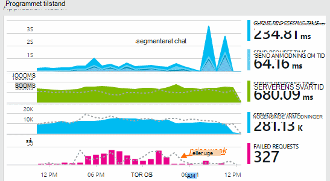

Nogle diagrammer er opdelt: samlet højden på diagrammet, hvor som helst er summen af målene vises. Forklaringen som standard viser det største antal.

Stiplede linjer viser værdien af metrikken en uge tidligere.

## Tidsinterval

Du kan ændre det tidsrum, der er dækket af diagrammer eller gitre på en hvilken som helst blade.

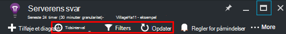

Hvis du forventer nogle data, der ikke blev vist endnu, kan du klikke på Opdater. Diagrammer opdatere sig selv med intervaller, men intervallerne er længere tid for større tidsintervaller. Det kan tage et øjeblik, før data til at komme gennem en analyse pipeline til et diagram i release tilstand.

Træk markøren hen over den for at zoome ind på en del af et diagram ved:

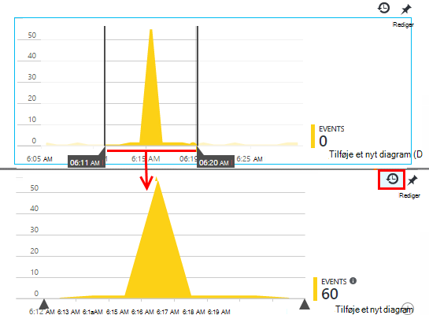

Klik på knappen Fortryd zoome for at gendanne den.

## Granularitet og pege værdier

Hold musen over diagrammet for at få vist værdierne for målene på det pågældende tidspunkt.

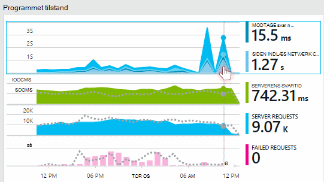

Værdien af metrik på et bestemt sted sammenlægges over det foregående udvalg tidsinterval. 

Udvalg interval eller "granularitet" vises øverst i bladet. 

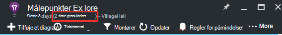

Du kan justere Granulariteten i bladet tid område:

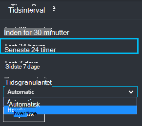

De tilgængelige granulariteter afhænger af det tidsrum, du vælger. Eksplicitte granulariteter er alternativer til "automatisk" granularitet for tidsintervallet. 

## Målepunkter Explorer

Klik dig gennem et diagram på bladet oversigt til at se en mere detaljeret række relaterede diagrammer og gitre. Du kan redigere disse diagrammer og gitre til at fokusere på de oplysninger, du er interesseret i.

Eller du kan bare klikke på knappen målepunkter Explorer i overskriften af bladet oversigt.

For eksempel Klik dig gennem de online mislykkedes anmodninger diagram:

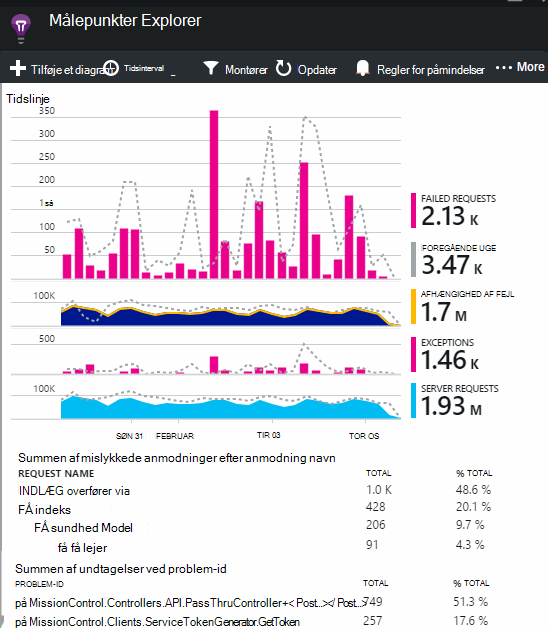

## Hvad betyder tal?

Forklaring til siden, der som standard viser som regel den aggregerede værdi i perioden i diagrammet. Hvis du placerer markøren over diagrammet, vises værdien på det pågældende tidspunkt.

Hvert datapunkt i diagrammet er et aggregat af dataværdierne modtaget i den foregående udvalg interval eller "granularitet". Granularitet vises øverst i bladet og afhænger af den overordnede tidsskalaen i diagrammet.

Målepunkter kan være sammenlagt på forskellige måder: 

 * **Sum** Adderer værdierne i alle datapunkter, der er modtaget via udvalg interval eller punktum i diagrammet.
 * **Gennemsnitlig** dividerer summen af antallet datapunkter, der er modtaget over intervallet.
 * **Entydig** tæller bruges til optællinger for de brugere og -konti. Over udvalg intervallet, eller i perioden i diagrammet vises i figur antallet af forskellige brugere fremgår af periode.

Du kan ændre metoden sammenlægning:

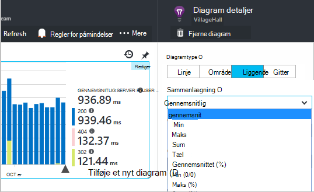

Standardmetoden for hver metrisk vises, når du opretter et nyt diagram eller når alle målepunkter er ikke er markeret:

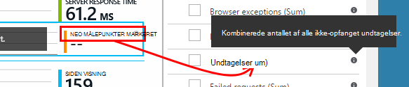

## Redigere diagrammer og gitre

Sådan føjes et nyt diagram til bladet:

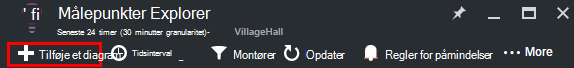

Vælg **Rediger** på en eksisterende eller nye diagram til at redigere den viser:

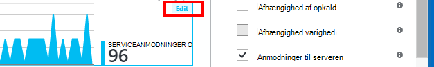

Du kan få vist mere end én metrikværdi i et diagram, selvom der er begrænsninger om de kombinationer, der kan vises sammen. Så snart du vælger en metrikværdi, er nogle af de andre deaktiveret. 

Hvis du indkodet [brugerdefinerede målepunkter] [ track] til din app (opkald til TrackMetric og TrackEvent) vises de her.

## Opdele dataene

Du kan opdele en metrikværdi ved egenskaben – for eksempel for at sammenligne sidevisninger på klienter med forskellige operativsystemer. 

Vælg et diagram eller gitter, skifte til gruppering og vælge en egenskab til at gruppere efter:

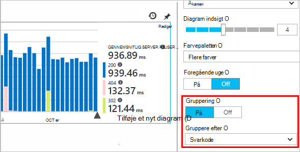

> [AZURE.NOTE] Når du bruger gruppering, giver typerne område og liggende søjlediagram et stablet visning. Dette er egnet, hvor metoden sammenlægning er Sum. Men hvor typen sammenlægning er gennemsnittet skal du vælge typerne linje eller gitter visning. 

Hvis du indkodet [brugerdefinerede målepunkter] [ track] til din app, og de omfatter egenskabsværdier, du vil kunne vælge egenskaben på listen.

Er diagrammet, der er for lille til segmenteret data? Juster højden:

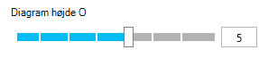

## Filtrere dine data

For at se målene for et markeret egenskabsværdier:

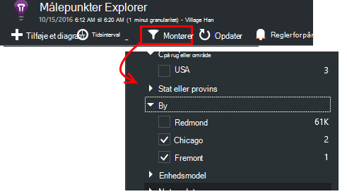

Hvis du ikke markerer alle værdier for en bestemt egenskab, det er den samme som at markere dem alle: der er ingen filter på denne egenskab.

Bemærk optællinger for de hændelser sammen med hver egenskabsværdi. Når du vælger værdier i én egenskab, justeres antallet af poster sammen med andre egenskabsværdier.

Filtre gælder for alle diagrammer på en blade. Hvis du vil forskellige filtre, der er anvendt på forskellige diagrammer, skal du oprette og gemme forskellige måleenheder blade. Hvis du vil, kan du fastgøre diagrammer fra forskellige blade til dashboard, så du kan se dem sammen med hinanden.

### Fjerne bot og web test trafik

Anvende filteret **reelle eller korte trafik** , og Markér **reelt tal**.

Du kan også filtrere efter **kilden til korte trafik**.

### Føje egenskaber til filterlisten

Vil du gerne filtrere telemetri på en kategori efter eget valg? For eksempel måske du dividere dine brugere i forskellige kategorier, og du vil opdele dataene efter disse kategorier.

[Opret din egen egenskab](app-insights-api-custom-events-metrics.md#properties). Angive det i en [Telemetri initialisering](app-insights-api-custom-events-metrics.md#telemetry-initializers) at få den vises i alle telemetri - herunder den standard telemetri sendes af forskellige SDK moduler.

## Redigere diagramtypen

Bemærk, at du kan skifte mellem gitre og grafer:

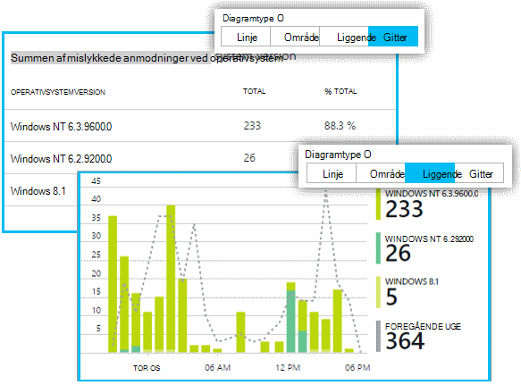

## Gemme din målepunkter blade

Når du har oprettet nogle diagrammer skal du gemme dem som en favorit. Du kan vælge, om at dele den med andre gruppemedlemmer, hvis du bruger en organisationskonto.

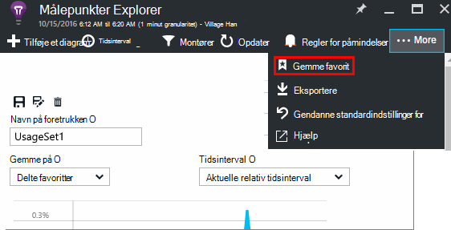

Se blade igen, **Gå til bladet oversigt** og åbne favoritter:

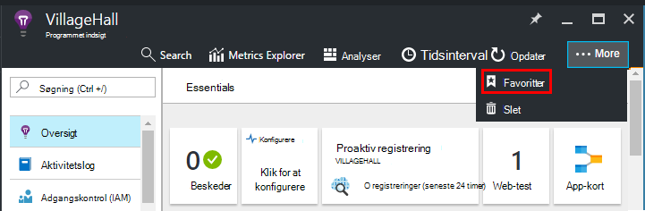

Hvis du vælger Relative tidsinterval, når du har gemt, opdateres bladet med den seneste målepunkter. Hvis du vælger absolutte tidsinterval, vises den de samme data hver gang.

## Nulstil bladet

Hvis du redigerer en blade, men derefter du gerne vil gå tilbage til den oprindelige gemt sæt, skal du klikke på Nulstil.

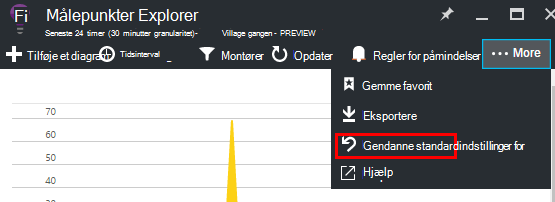

## Live målepunkter Stream: Chat måleredskaber for Luk overvågning

Live målepunkter Stream viser du dit program målepunkter højre i meget øjeblikket, med en nær realtid forsinkelse på 1 sekund. Dette er særdeles nyttigt, når du frigivelse af et nyt build og vil sikre dig, at alt er en arbejdsdag som forventet, eller ved at undersøge en hændelse i realtid.

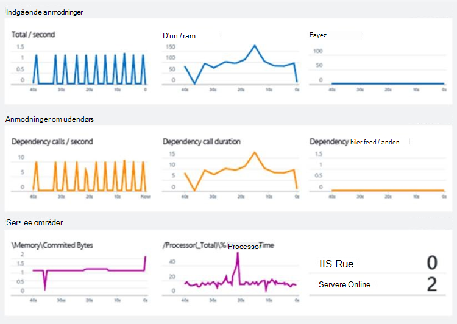

I modsætning til målepunkter Explorer viser Live målepunkter Stream et fast antal målepunkter. Dataene fortsætter kun til, så længe den er i diagrammet, og derefter kasseres. 

Live målepunkter Stream leveres med programmet indsigt SDK til ASP.NET, version 2.1.0 eller nyere.

## Angive beskeder

Hvis du vil have besked via mail usædvanlige værdierne af enhver metrisk, skal du tilføje en besked. Du kan vælge enten at sende mail til konto administratorer eller til bestemte mailadresser.

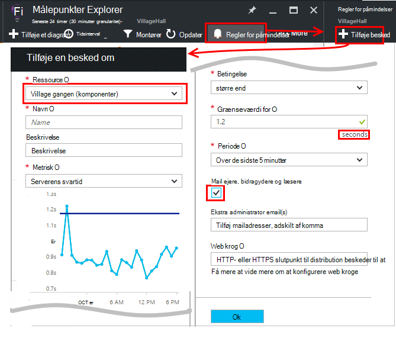

[Få flere oplysninger om beskeder][alerts].

## Eksporter til Excel

Du kan eksportere metriske data, der vises i metrisk Explorer til en Excel-fil. De eksporterede data indeholder data fra alle diagrammer og tabeller, som det fremgår på portalen. 

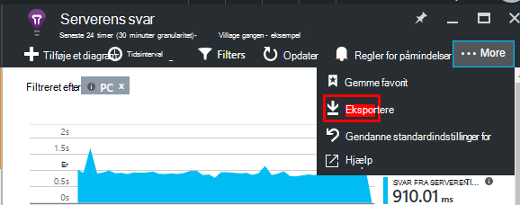

Eksporteres data for hver diagram eller en tabel til et separat ark i Excel-filen.

Hvad du se hvad der bliver eksporteret. Ændre tidsintervallet eller filtrene, hvis du vil ændre dataområdet, der er eksporteret. For tabeller, hvis kommandoen **indlæse flere** vises, du kan klikke på den før du klikker på Export, hvis du vil have flere data, der er eksporteret.

*Eksportere fungerer kun for Internet Explorer og Chrome på nuværende tidspunkt. Vi arbejder på at tilføje understøttelse af andre browsere.*

## Kontinuert Eksportér

Hvis du vil data eksporteres løbende, så du kan behandle den eksternt, kan du overveje at bruge [fortløbende eksportere](app-insights-export-telemetry.md).

### Power BI

Hvis du vil endnu bedre visning af dine data, kan du [eksportere til Power BI](http://blogs.msdn.com/b/powerbi/archive/2015/11/04/explore-your-application-insights-data-with-power-bi.aspx).

## Analyser

[Analyser](app-insights-analytics.md) er en mere alsidige metode til at analysere din telemetri ved hjælp af en effektiv forespørgselssprog. Brug den, hvis du vil kombinere eller beregne resultater fra målepunkter eller udføre en i deph udforskning af din app seneste ydeevne. Brug på den anden side målepunkter Explorer, hvis du vil automatisk opdatering, diagrammer dashboard og beskeder.

## Fejlfinding i forbindelse med

*Jeg kan ikke se alle data i diagrammet.*

* Filtre gælder for alle diagrammer på bladet. Sørg for, mens du fokus på et diagram, er du ikke at angive et filter, der udelader alle data på en anden. 

    Hvis du vil angive forskellige filtre på forskellige diagrammer, skal du oprette dem i forskellige blade, skal du gemme dem som separate Favoritter. Hvis du vil, kan du fastgøre dem til dashboard, så du kan se dem sammen med hinanden.

* Hvis du grupperer et diagram ved en egenskab, der ikke er defineret i metrikværdien, vil være der noget i diagrammet. Prøv at rydde 'gruppere efter' eller vælge en anden grupperingsegenskab.
* Ydelsesdata (CPU, læse / skrivehastighed og osv.) er tilgængelig for Java webtjenester, Windows-programmer på computeren, [IIS web apps og tjenester, hvis du installerer status skærm](app-insights-monitor-performance-live-website-now.md)og [Azure Cloud Services](app-insights-azure.md). Det er ikke tilgængelig for Azure websteder.

## Næste trin

* [Overvåge brugen af med programmet indsigt](app-insights-overview-usage.md)
* [Ved hjælp af diagnosticering søgning](app-insights-diagnostic-search.md)

<!--Link references-->

[alerts]: app-insights-alerts.md
[start]: app-insights-overview.md
[track]: app-insights-api-custom-events-metrics.md

 