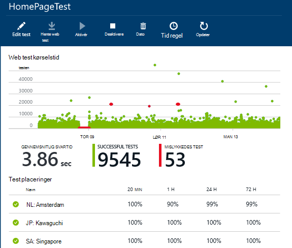
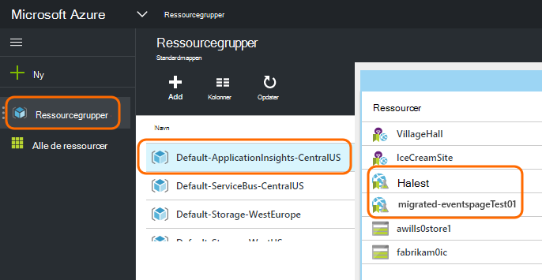
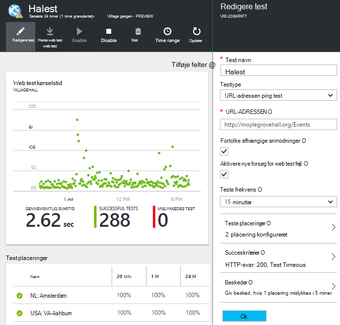

<properties 
    pageTitle="Overføre Azure slutpunkt til programmet indsigt tilgængelighed test" 
    description="Overføre klassisk Azure slutpunkt overvågning test i programmet indsigt tester tilgængelighed ved oktober 31 2016."
    services="application-insights" 
    documentationCenter=""
    authors="soubhagyadash" 
    manager="douge"/>

<tags 
    ms.service="application-insights" 
    ms.workload="tbd" 
    ms.tgt_pltfrm="ibiza" 
    ms.devlang="na" 
    ms.topic="article" 
    ms.date="07/25/2016" 
    ms.author="awills"/>
 
# Flytte fra Azure slutpunkt overvågning til programmet indsigt tilgængelighed test

Skal du bruge [slutpunkt overvågning](https://blogs.msdn.microsoft.com/mast/2013/03/03/windows-azure-portal-update-configure-web-endpoint-status-monitoring-preview/) til Azure-apps? Ved *oktober 31 2016*, får vi erstatte dem med de nye og mere effektiv [tilgængelighed test](app-insights-monitor-web-app-availability.md). Vi har allerede oprettet nogle af de nye test, selvom de er deaktiveret, indtil oktober 31 2016. 

Du kan redigere de nye test og gøre Skift selv hvis du vil have. Du finder dem [Azure portal](https://portal.azure.com) i standard-ApplicationInsights-CentralUS ressourcegruppe.

## Hvad er tilgængelighed test?

Test af tilgængelighed er en funktion i Azure, kontinuerligt kontrollerer, at et websted eller en tjeneste er op at køre ved at sende HTTP-anmodninger til den (enkelt ping test eller Visual Studio web test) fra op til 16 placeringer i hele verden. 

I [Klassisk Azure portal](https://manage.windowsazure.com)blev disse test kaldt Endpoint overvågning. De er mere begrænset omfang. De nye tilgængelighed test er en omfattende forbedring:

* Op til 10 Visual Studio web test eller ping test hver programmet indsigt ressource. 
* Op til 16 placeringer i hele verden til at sende test anmodninger til din online. Større kontrol over test succeskriterier. 
* Teste et websted eller en tjeneste - ikke kun Azure webapps.
* Teste forsøg: reducere falsk positiv beskeder på grund af forbigående netværksproblemer. 
* Webhooks kan modtage HTTP POST meddelelser om de vigtige beskeder.

Få mere at vide om [tilgængeligheden af test her](app-insights-monitor-web-app-availability.md).

Tilgængelighed test er en del af [Visual Studio programmet viden](app-insights-overview.md), som er en extensible analytics-tjenesten for et webprogram.

## Så Hvad sker der med mine slutpunkt tester?

* Vi har kopieret slutpunktet overvågning test til de nye programmet indsigt tilgængelighed test.
* De nye tilgængelighed test er deaktiveret, og de gamle slutpunkt test stadig aktiv.
* Den advarer regler *ikke* blevet overført. De nye test der først er oprettet med en standard-regel:
 * Udløsere, når mere end 1 placering rapporterer fejl i fem minutter.
 * Sender mail til abonnement administratorer.

Du kan finde de overførte test i gruppen "Standard-ApplicationInsights-CentralUS" ressource i [Azure-portalen](https://portal.azure.com). Test navnene er præfikset "Migrated-". 

## Hvad skal jeg gøre?

* Hvis vi ikke en eller anden måde har set overføre test, er de nye tilgængelighed test [nemme at konfigurere](app-insights-monitor-web-app-availability.md).

### Alternativ SV: gør noget. Skrive til os.

**På 31 oktober 2016,** vi vil:

* Deaktivere de gamle slutpunkt test.
* Aktivér de overførte tilgængelighed test.

### Indstillingen B: du administrere og/eller aktivere de nye test.

* Gennemse og redigere de nye tilgængelighed test i den nye [Azure-portalen](https://portal.azure.com). 
 * Gennemse kriterierne, der udløser
 * Gennemse e-mail-modtagere
* Aktivér de nye test
* Vi deaktiverer ældre slutpunktet overvågning test på oktober 31 2016 

### Indstillingen C: tilmelding ud

Hvis du ikke vil bruge tilgængelighed test, kan du slette dem i [Azure portal](https://portal.azure.com). Der er også en Ophæv abonnement link i bunden af besked om mails.

Vi vil stadig slette gamle slutpunkt test på oktober 31 2016. 

## Hvordan redigerer jeg de nye test?

Log på [Azure portal](https://portal.azure.com) og finde 'Migrated-' web testene: 

Redigere og/eller aktivere testen:

## Hvorfor sker dette?

Bedre service. Den gamle slutpunkt tjeneste er meget smallere. Du kan angive blot to URL-adresser til enkel ping test fra 3 geografisk placeringer på en Azure VM eller web app. De nye test kan køre flere trin web test fra op til 16 placeringer, og du kan angive op til 10 test for et program. Du kan teste alle URL-Adresser – det behøver ikke at være et Azure-websted.

De nye test konfigureres separat fra WebApp eller VM, som du tester. 

Vi overfører test for at sikre, at du fortsat har kontrol over dem, når du bruger den nye portal. 

## Hvad er programmet indsigt?

De nye tilgængelighed test er en del af [Visual Studio programmet indsigt](app-insights-overview.md). Her er et [2-minutters video](http://go.microsoft.com/fwlink/?LinkID=733921).

## Jeg betale for de nye test?

De overførte test er konfigureret med en værdi i en ressource programmet indsigt i den gratis standard-plan. Dette giver mulighed for samling af op til 5 millioner datapunkter. Der omhandler nemt data lydstyrken test oftest bruger i øjeblikket. 

Naturligvis, hvis du have programmet indsigt og oprette flere tilgængelighed test eller indføre flere af dens overvågning af ydeevnen og diagnosticering funktioner, oprette derefter du flere datapunkter.  Resultatet vil kun dog, kan du klikker på kvoten for den gratis plan. Du modtager ikke en faktura, medmindre du vælger den til Standard eller Premium-planer. 

[Få mere at vide om programmet indsigt priser og kvote overvågning](app-insights-pricing.md). 

## Hvad er og ikke overflyttet?

Bevaret fra dit gamle slutpunkt-test:

* URL-adressen testes slutpunkt.
* Geografisk placeringer, der sendes anmodninger.
* Test frekvens forbliver 5 minutter.
* Test timeout forbliver 30 sekunder. 

Ikke overflyttet:

* Beskeder om udløser reglen. Den regel, vi har konfigureret udløsere, når 1 placering rapporterer fejl i fem minutter.
* Beskeder om modtagere. Meddelelse om mails sendes til abonnementsejere og samtidig ejere. 

## Hvordan finder jeg de nye test?

Du kan redigere enhver af de nye test nu, hvis du vil have. Log på [Azure-portalen](https://portal.azure.com), Åbn **Ressourcegrupper** , og vælg **Standard-ApplicationInsights-CentralUS**. I den pågældende gruppe finder du de nye web-test. [Få mere at vide om de nye tilgængelighed test](app-insights-monitor-web-app-availability.md).

Bemærk, at de nye beskeder om mails der sendes fra denne adresse: App indsigt beskeder(ai-noreply@microsoft.com)

## Hvad sker der, hvis jeg ikke gør noget?

Indstillingen A gælder. Vi vil aktivere de test, der er overført, og Konfigurer standard beskeder om regler, som nævnt ovenfor. Du er nødt til at tilføje en brugerdefineret beskeder om regler, modtagere som nævnt ovenfor. Vi deaktiverer ældre slutpunktet overvågning test. 

## Hvor kan jeg give feedback om dette? 

Tak for din feedback. Du skal [sende en e-mail](mailto:vsai@microsoft.com). 

