<properties
    pageTitle="Diagnosticere problemer med ydeevnen på et, der kører IIS-websted | Microsoft Azure"
    description="Overvågning af ydeevnen for et websted uden at installere det igen. Bruge enkeltstående eller med programmet indsigt SDK at få afhængighed telemetri."
    services="application-insights"
    documentationCenter=".net"
    authors="alancameronwills"
    manager="douge"/>

<tags
    ms.service="application-insights"
    ms.workload="tbd"
    ms.tgt_pltfrm="ibiza"
    ms.devlang="na"
    ms.topic="get-started-article"
    ms.date="10/24/2016"
    ms.author="awills"/>

# Instrument Onlines på kørselstidspunktet med programmet indsigt

*Programmet indsigt er i Vis udskrift.*

Du kan instrumentere en direkte WebApp med Visual Studio programmet viden, uden at ændre eller geninstaller din kode. I dine apps er hostet af en lokal IIS-server, du har installeret en skærm med Status eller hvis de er Azure Onlines eller afspille i en Azure VM, kan du installere programmet indsigt filtypenavn. (Der er også separat artikler om instrumentering [live J2EE Onlines](app-insights-java-live.md) og [Azure Cloud Services](app-insights-cloudservices.md)).

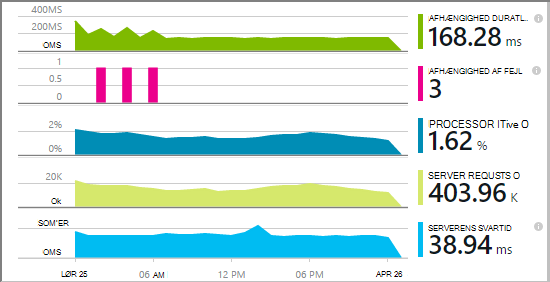

Du har et valg af tre omdirigerer anvende programmet indsigt til dine .NET webprogrammer:

* **Opbygge tid:** [Tilføje programmet indsigt SDK] [greenbrown] til din web app-kode. 
* **Kørselstidspunkt:** Instrumentere din online på serveren, som beskrevet nedenfor, uden at skulle genopbygge og geninstallation af koden.
* **Begge dele:** Opbygge SDK i din web app-kode, og også anvende Runtime-udvidelser. Få bedst fra begge muligheder. 

Her er en oversigt over du får ved hver rute:

||Opbygge tid|Kørselstid|
|---|---|---|
|Anmodninger om og undtagelser|Ja|Ja|
|[Flere undtagelser](app-insights-asp-net-exceptions.md)||Ja|
|[Afhængighed diagnosticering](app-insights-asp-net-dependencies.md)|På .NET 4.6 +|Ja|
|[System tællere i ydeevne](app-insights-performance-counters.md)||IIS eller Azure skybaseret tjeneste, ikke Azure online|
|[API til brugerdefinerede telemetri][api]|Ja||
|[Spore log integration](app-insights-asp-net-trace-logs.md)|Ja||
|[Siden visning og bruger data](app-insights-javascript.md)|Ja||
|Du behøver ikke at genopbygge kode|Nej||

## Instrumentere din online på kørselstidspunktet

Du skal bruge et [Microsoft Azure](http://azure.com) -abonnement.

### Hvis din app er en Azure WebApp eller en skybaseret tjeneste

* Vælg programmet indsigt i den app Kontrolpanel i Azure. 

    [Få mere at vide](app-insights-azure.md).

### Hvis din app er placeret på din IIS-server

1. Logge på med legitimationsoplysninger for administrator på webserveren IIS.
2. Hente og køre [Status skærm installer](http://go.microsoft.com/fwlink/?LinkId=506648).
4. Log på Microsoft Azure i installationsguiden.

    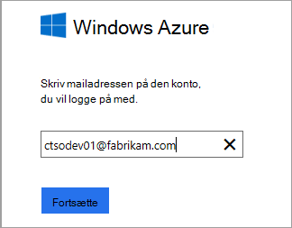

    *Forbindelsesfejl? Se [fejlfinding](#troubleshooting).*

5. Vælg den installerede webprogram eller websted, som du vil overvåge, og derefter konfigurere den ressource, hvor du vil se resultaterne i portalen programmet indsigt.

    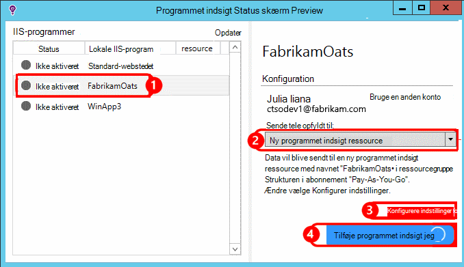

    Normalt, du vælger at konfigurere en ny ressource og [ressourcegruppe][roles].

    Ellers skal bruge en eksisterende ressource, hvis du allerede konfigureret [web tester] [ availability] for dit websted eller [webklient overvågning][client].

6. Genstarte IIS.

    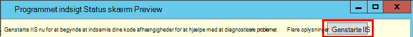

    Din webtjeneste afbrydes for kort tid.

6. Bemærk, at ApplicationInsights.config er blevet indsat i web-apps, du vil overvåge.

    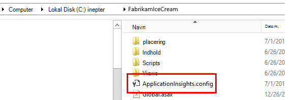

   Der er også nogle ændringer i web.config.

#### Vil du konfigurere senere (ad)?

Når du har afsluttet guiden, kan du konfigurere agenten igen, når du vil. Du kan også bruge dette, hvis du har installeret agenten, men der er nogle problemer med den indledende installation.

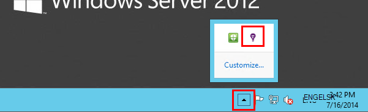

## Få vist ydeevnen telemetri

Log på [portalen Azure](https://portal.azure.com), gennemse programmet viden, og Åbn den ressource, du har oprettet.

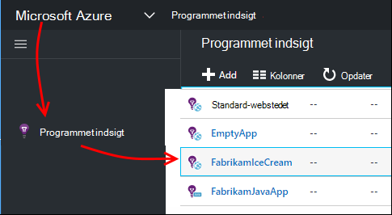

Åbn bladet ydeevne for at få vist anmodning, svartid, afhængighed og andre data.

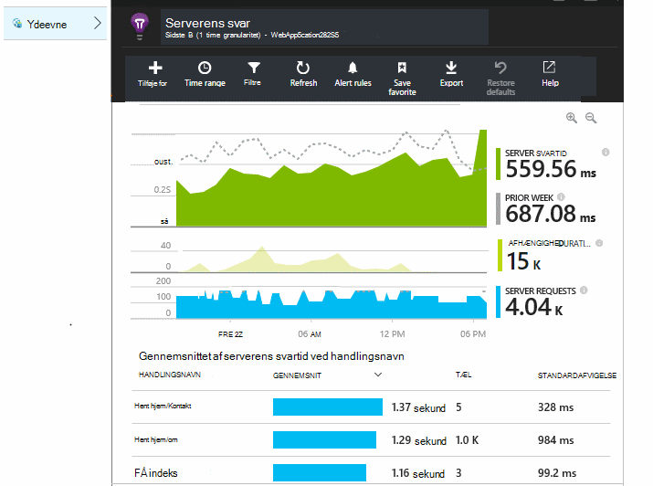

Klik på et diagram for at åbne en mere detaljeret visning.

Du kan [redigere, omarrangere, gemme](app-insights-metrics-explorer.md), og Fastgør diagrammer eller bladet hele til et [dashboard](app-insights-dashboards.md).

## Afhængigheder

Diagrammet afhængighed varighed viser den tid, det tager ved opkald fra din app til eksterne komponenter som databaser, REST API'er eller Azure blob-lager.

Til at inddele diagrammet ved opkald til forskellige afhængigheder: redigere diagrammet, slå gruppering og derefter gruppere efter afhængighed, afhængighedstype eller afhængighed ydeevne.

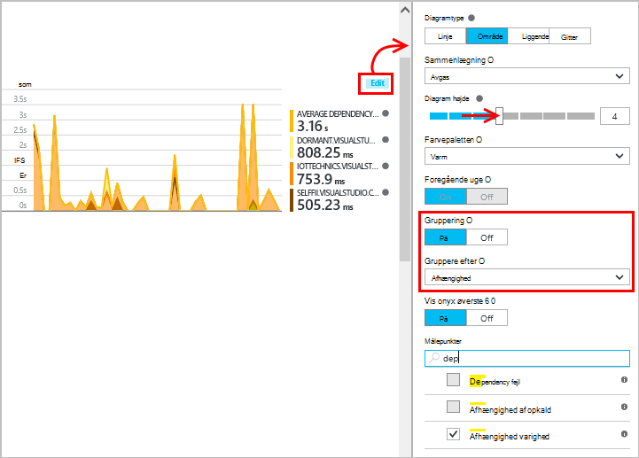

## Tællere i ydeevne 

(Ikke til Azure Onlines.) Klik på servere på bladet oversigt for at få vist diagrammer af server ydeevne tællere som CPU'en ibrugtagning og hukommelse.

Hvis du har flere forekomster af server, kan du vil redigere diagrammer til at gruppere efter rolle forekomst.

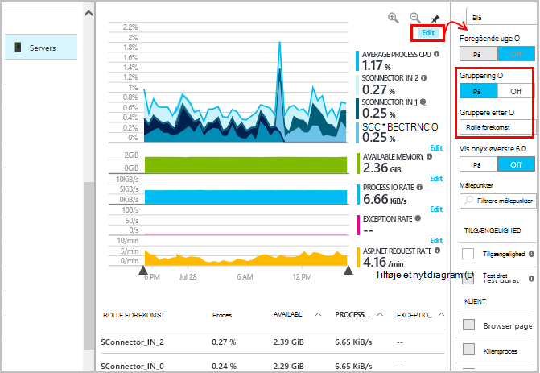

Du kan også [ændre sæt af tællere i ydeevne, der rapporteres ved SDK](app-insights-configuration-with-applicationinsights-config.md#nuget-package-3). 

## Undtagelser

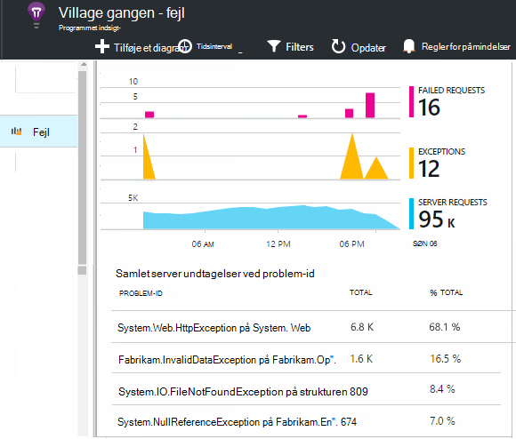

Du kan analysere ned til specifikke undtagelser (fra de seneste syv dage) og få staksporinger og kontekstdata.

## Udvalg

Hvis dit program sender en stor mængde data, og du bruger programmet indsigt SDK til ASP.NET version 2.0.0-beta3 eller nyere, kan funktionen tilpasset udvalg betjene og send kun en procentdel af din telemetri. [Lær mere om udvalg.](app-insights-sampling.md)

## Fejlfinding i forbindelse med

### Forbindelsesfejl

Du har brug at åbne [nogle udgående porte](app-insights-ip-addresses.md#outgoing-ports) i din server firewall for at tillade Status skærm til at arbejde.

### Ingen telemetri?

  * Brug dit websted til at oprette nogle data.
  * Vent et par minutter for at lade dataene ankommer, og klik derefter på **Opdater**.
  * Åbn diagnosticering søgning (feltet søgning) for at se individuelle begivenheder. Hændelser er ofte synlige i diagnosticering Søg, før aggregere data vises i diagrammerne.
  * Åbn Status skærm, og vælg dit program i venstre rude. Kontrollere, om der er nogen diagnosticering meddelelser til dette program i afsnittet "Konfiguration beskeder":

  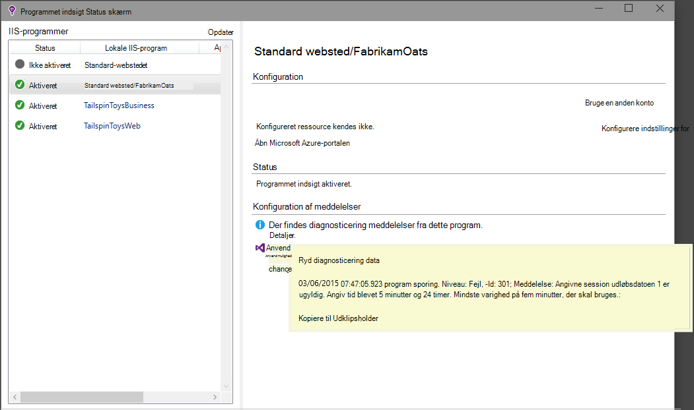

  * Kontrollér, at din server firewall tillader udgående trafik på de porte, der er nævnt ovenfor.
  * På serveren, hvis du ser en meddelelse om "ikke tilstrækkelige tilladelser", skal du prøve følgende:
    * I IIS Manager: Vælg programgruppen, Åbn **Avancerede indstillinger**, og notér identitet under **Process Model** .
    * Tilføj denne identitet til gruppen ydeevne overvåge brugere i Computer administration i Kontrolpanel.
  * Hvis du har MMA/SCOM installeret på din server, kan nogle versioner kommer i konflikt. Fjerne både SCOM og Status skærm, og installere de seneste versioner den igen.
  * Se [fejlfinding af][qna].

## Systemkrav

OS support for programmet indsigt Status skærm på Server:

- Windows Server 2008
- Windows Server 2008 R2
- Windows Server 2012
- Windows server 2012 R2

med seneste SP og .NET Framework 4.0 og 4.5

På klientsiden Windows 7, 8 og 8.1, igen med .NET Framework 4.0 og 4.5

IIS understøttes: IIS 7, 7.5, 8, 8.5 (IIS er påkrævet)

## Automatisering med PowerShell

Du kan starte og stoppe med at overvåge ved hjælp af PowerShell på din IIS-server.

Starte med at importere modulet programmet indsigt:

`Import-Module 'C:\Program Files\Microsoft Application Insights\Status Monitor\PowerShell\Microsoft.Diagnostics.Agent.StatusMonitor.PowerShell.dll'`

Finde ud af, hvilke apps overvåges:

`Get-ApplicationInsightsMonitoringStatus [-Name appName]`

* `-Name`(Valgfrit) Navnet på en web-app.
* Viser den programmet indsigt overvåge statussen for hver WebApp (eller det navngivne app) i denne IIS-server.

* Returnerer `ApplicationInsightsApplication` for hver app:
 * `SdkState==EnabledAfterDeployment`: App der skal overvåges og blev udstyret på kørselstidspunktet, enten ved værktøjet Status skærm eller ved at `Start-ApplicationInsightsMonitoring`.
 * `SdkState==Disabled`: Appen er ikke anvendes for programmet indsigt. Du kan enten den aldrig er udstyret eller Runtime-overvågning blev deaktiveret med værktøjet Status skærm eller med `Stop-ApplicationInsightsMonitoring`.
 * `SdkState==EnabledByCodeInstrumentation`: Appen blev anvendes ved at tilføje SDK koden. Dens SDK kan ikke opdateres eller ikke længere.
 * `SdkVersion`Viser versionen bruges til at overvåge denne app.
 * `LatestAvailableSdkVersion`Viser den version, der er tilgængelige i galleriet NuGet. Hvis du vil opgradere appen til denne version, skal du bruge `Update-ApplicationInsightsMonitoring`.

`Start-ApplicationInsightsMonitoring -Name appName -InstrumentationKey 00000000-000-000-000-0000000`

* `-Name`Navnet på app'en i IIS
* `-InstrumentationKey`Ikey af programmet indsigt ressourcen, hvor du vil have resultatet skal vises.

* Denne cmdlet påvirker kun apps, der ikke allerede udstyret – det vil sige, SdkState == NotInstrumented.

    Cmdletten påvirker ikke en app, som er allerede udstyret, enten på build tid ved at tilføje SDK koden eller på kørselstidspunktet ved en tidligere anvendelse af denne cmdlet.

    Den SDK-version, der bruges til at instrumentere appen er den version, der senest er blevet hentet til denne server.

    Brug Opdater ApplicationInsightsVersion for at hente den nyeste version.

* Returnerer `ApplicationInsightsApplication` på succes. Hvis det ikke lykkes, logføres en sporing til stderr.

    
          Name                      : Default Web Site/WebApp1
          InstrumentationKey        : 00000000-0000-0000-0000-000000000000
          ProfilerState             : ApplicationInsights
          SdkState                  : EnabledAfterDeployment
          SdkVersion                : 1.2.1
          LatestAvailableSdkVersion : 1.2.3

`Stop-ApplicationInsightsMonitoring [-Name appName | -All]`

* `-Name`Navnet på en app i IIS
* `-All`Stop overvågning alle apps i denne IIS-server`SdkState==EnabledAfterDeployment`

* Holder op med at overvåge de angivne apps og fjerner instrumentation. Det fungerer kun for apps, der er blevet udstyret på kørselstidspunktet ved hjælp af statusovervågning værktøj eller Start-ApplicationInsightsApplication. (`SdkState==EnabledAfterDeployment`)

* Returnerer ApplicationInsightsApplication.

`Update-ApplicationInsightsMonitoring -Name appName [-InstrumentationKey "0000000-0000-000-000-0000"`]

* `-Name`: Navnet på en WebApp i IIS.
* `-InstrumentationKey`(Valgfrit). Brug dette til at ændre den ressource, som den app telemetri sendes.
* Denne cmdlet:
 * Opgraderinger navngivne appen til versionen af SDK hentes senest på denne computer. (Fungerer kun, hvis `SdkState==EnabledAfterDeployment`)
 * Hvis du angiver en instrumentation nøgle, konfigureres den navngivne app for at sende telemetri til ressourcen med den pågældende nøgle. (Fungerer, hvis `SdkState != Disabled`)

`Update-ApplicationInsightsVersion`

* Henter seneste programmet indsigt SDK til serveren.

## Næste trin

* [Oprette web test] [ availability] at sikre, at webstedet overholder direkte.
* [Søge begivenheder og logge] [ diagnostic] at finde årsagerne problemer.
* [Tilføje web klient telemetri] [ usage] kan se undtagelser fra webstedskode og gør det muligt at indsætte sporing opkald.
* [Føje programmet indsigt SDK til din web tjenestekode] [ greenbrown] så du kan indsætte sporing, og log opkald i server-kode.

<!--Link references-->

[api]: app-insights-api-custom-events-metrics.md
[availability]: app-insights-monitor-web-app-availability.md
[client]: app-insights-javascript.md
[diagnostic]: app-insights-diagnostic-search.md
[greenbrown]: app-insights-asp-net.md
[qna]: app-insights-troubleshoot-faq.md
[roles]: app-insights-resources-roles-access-control.md
[usage]: app-insights-web-track-usage.md
