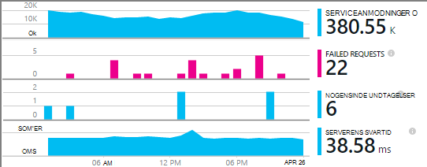
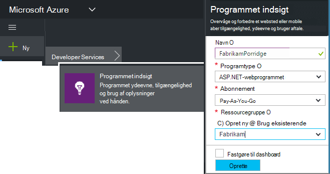
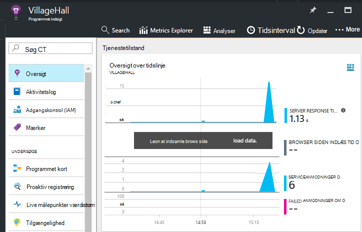

<properties
    pageTitle="Tilføje programmet indsigt SDK for at overvåge din Node.js app | Microsoft Azure"
    description="Analysere brugen, tilgængelighed og ydeevnen i din lokale eller Microsoft Azure-webprogrammet med programmet indsigt."
    services="application-insights"
    documentationCenter=""
    authors="alancameronwills"
    manager="douge"/>

<tags
    ms.service="application-insights"
    ms.workload="tbd"
    ms.tgt_pltfrm="ibiza"
    ms.devlang="na"
    ms.topic="get-started-article"
    ms.date="08/30/2016"
    ms.author="awills"/>


# <a name="add-application-insights-sdk-to-monitor-your-nodejs-app"></a>Tilføje programmet indsigt SDK for at overvåge din Node.js-app

*Programmet indsigt er i Vis udskrift.*

[Visual Studio programmet indsigt](app-insights-overview.md) overvåger direkte programmet kan hjælpe dig med [at registrere og diagnosticere problemer med ydeevnen og undtagelser](app-insights-detect-triage-diagnose.md), og [se, hvordan din app bruges](app-insights-overview-usage.md). Det fungerer til apps, der er hostet på din egen lokale IIS-servere eller Azure FOS samt Azure webapps.


SDK indeholder automatisk samling af indgående HTTP-anmodning om satser og svar, tællere i ydeevne (CPU, hukommelse, RPS) og ikke-afviklet undtagelser. Desuden kan du tilføje brugerdefinerede opkald til at spore afhængigheder, målepunkter eller andre begivenheder.




#### <a name="before-you-start"></a>Før du starter

Du har brug for:

* Visual Studio 2013 eller nyere. Senere er bedre.
* Et abonnement på [Microsoft Azure](http://azure.com). Hvis dit team eller din organisation har et abonnement på Azure, kan ejeren føje dig til det, ved hjælp af din [Microsoft-konto](http://live.com).

## <a name="add"></a>Oprette en programmet indsigt ressource

Log på [Azure portal][portal], og Opret en ny programmet indsigt ressource. En [ressource] [ roles] i Azure er en forekomst af en tjeneste. Denne ressource er hvor telemetri fra din app, analysere og præsenteres for dig.



Du kan vælge andre som programtypen. Valg af programtype angiver standard indholdet af ressource blade og egenskaberne, ses i [Målepunkter Stifinder][metrics].

#### <a name="copy-the-instrumentation-key"></a>Kopiere Instrumentation nøglen

Tasten identificerer ressourcen, og du vil installere den snart i SDK til at dirigere data til ressourcen.


## <a name="sdk"></a>Installere SDK i dit program

```
npm install applicationinsights --save
```

## <a name="usage"></a>Brugen

Dette vil aktivere anmodning om overvågning, ikke-afviklet undtagelse registrering og ydeevne for systemet overvågning (CPU/hukommelse/RPS).

```javascript

var appInsights = require("applicationinsights");
appInsights.setup("<instrumentation_key>").start();
```

Tasten instrumentation kan også angives i miljøvariablen APPINSIGHTS_INSTRUMENTATIONKEY. Hvis dette er gjort, ingen argument er påkrævet, når du ringer til `appInsights.setup()` eller `appInsights.getClient()`.

Du kan prøve SDK uden at sende telemetri: indstille nøglen instrumentation til en streng ikke er tom.


## <a name="run"></a>Køre dit projekt

Kør programmet, og prøv det: åbne forskellige sider for at generere nogle telemetri.


## <a name="monitor"></a>Få vist din telemetri

Gå tilbage til [Azure-portalen](https://portal.azure.com) , og gå til dit program indsigt ressource.


Søge efter data på siden Oversigt. I første omgang ser du bare et eller to punkter. Eksempel:



Klik dig gennem et diagram for at se flere målepunkter. [Lær mere om målepunkter.][perf]

#### <a name="no-data"></a>Ingen data?

* Bruge programmet, åbne forskellige sider, så det genererer nogle telemetri.
* Åbn feltet [Søg](app-insights-diagnostic-search.md) for at få vist individuelle begivenheder. Nogle gange tager det begivenheder lidt mens længere tid at komme gennem en målepunkter pipeline.
* Vent et par sekunder og klikke på **Opdater**. Diagrammer med jævne mellemrum opdatere sig selv, men du kan opdatere manuelt, hvis du venter for nogle data vises.
* Se [fejlfinding af][qna].

## <a name="publish-your-app"></a>Publicere din app

Nu installere programmet til IIS eller til Azure, og se samler dataene.


#### <a name="no-data-after-you-publish-to-your-server"></a>Ingen data, når du publicerer til din server?

Åbn følgende porte til udgående trafik i din server firewall:

+ `dc.services.visualstudio.com:443`
+ `f5.services.visualstudio.com:443`


#### <a name="trouble-on-your-build-server"></a>Problemer med at på build-serveren?

Se [emnet Fejlfinding](app-insights-asp-net-troubleshoot-no-data.md#NuGetBuild).


## <a name="customized-usage"></a>Tilpassede brugen 

### <a name="disabling-auto-collection"></a>Deaktivere automatisk samling

```javascript
import appInsights = require("applicationinsights");
appInsights.setup("<instrumentation_key>")
    .setAutoCollectRequests(false)
    .setAutoCollectPerformance(false)
    .setAutoCollectExceptions(false)
    // no telemetry will be sent until .start() is called
    .start();
```

### <a name="custom-monitoring"></a>Brugerdefineret overvågning

```javascript
import appInsights = require("applicationinsights");
var client = appInsights.getClient();

client.trackEvent("custom event", {customProperty: "custom property value"});
client.trackException(new Error("handled exceptions can be logged with this method"));
client.trackMetric("custom metric", 3);
client.trackTrace("trace message");
```

[Lær mere om telemetri API](app-insights-api-custom-events-metrics.md).

### <a name="using-multiple-instrumentation-keys"></a>Brug af flere instrumentation taster

```javascript
import appInsights = require("applicationinsights");

// configure auto-collection with one instrumentation key
appInsights.setup("<instrumentation_key>").start();

// get a client for another instrumentation key
var otherClient = appInsights.getClient("<other_instrumentation_key>");
otherClient.trackEvent("custom event");
```

## <a name="examples"></a>Eksempler

### <a name="tracking-dependency"></a>Sporing af afhængighed

```javascript
import appInsights = require("applicationinsights");
var client = appInsights.getClient();

var startTime = Date.now();
// execute dependency call
var endTime = Date.now();

var elapsedTime = endTime - startTime;
var success = true;
client.trackDependency("dependency name", "command name", elapsedTime, success);
```


### <a name="manual-request-tracking-of-all-get-requests"></a>Manuel anmodning om registrering af alle "Hent" anmodninger

```javascript
var http = require("http");
var appInsights = require("applicationinsights");
appInsights.setup("<instrumentation_key>")
    .setAutoCollectRequests(false) // disable auto-collection of requests for this example
    .start();

// assign common properties to all telemetry sent from the default client
appInsights.client.commonProperties = {
    environment: process.env.SOME_ENV_VARIABLE
};

// track a system startup event
appInsights.client.trackEvent("server start");

// create server
var port = process.env.port || 1337
var server = http.createServer(function (req, res) {
    // track all "GET" requests
    if(req.method === "GET") {
        appInsights.client.trackRequest(req, res);
    }

    res.writeHead(200, { "Content-Type": "text/plain" });
    res.end("Hello World\n");
}).listen(port);

// track startup time of the server as a custom metric
var start = +new Date;
server.on("listening", () => {
    var end = +new Date;
    var duration = end - start;
    appInsights.client.trackMetric("StartupTime", duration);
});
```

## <a name="next-steps"></a>Næste trin

* [Overvåge dit telemetri i portalen](app-insights-dashboards.md)
* [Overskrive din telemetri Analytics forespørgsler](app-insights-analytics-tour.md)


<!--Link references-->

[knowUsers]: app-insights-overview-usage.md
[metrics]: app-insights-metrics-explorer.md
[perf]: app-insights-web-monitor-performance.md
[portal]: http://portal.azure.com/
[qna]: app-insights-troubleshoot-faq.md
[roles]: app-insights-resources-roles-access-control.md
