<properties
    pageTitle="Besøgsanalyse med programmet indsigt"
    description="Oversigt over brugsstatistik med programmet indsigt"
    services="application-insights"
    documentationCenter=""
    authors="alancameronwills"
    manager="douge"/>

<tags
    ms.service="application-insights"
    ms.workload="tbd"
    ms.tgt_pltfrm="ibiza"
    ms.devlang="multiple"
    ms.topic="article" 
    ms.date="04/08/2016"
    ms.author="awills"/>

# Besøgsanalyse med programmet indsigt

Viden om, hvordan folk bruger dit program, kan du fokusere din udviklingsarbejde på de scenarier, der er vigtigst for dem, og få indblik i, som de kan finde lettere eller sværere at opnå mål.

Programmet indsigt kan giver en oversigt over brug af dit program, hjælper dig med at forbedre brugernes oplevelse, og opfylder dine forretningsmæssige mål.

Programmet indsigt fungerer for både separat apps (på iOS, Android- og Windows) og webapps (hostes på .NET eller J2EE). 

## Føje programmet indsigt til projektet

For at komme i gang skal du hente en gratis konto med [Microsoft Azure](https://azure.com). (Når prøveperioden, kan du fortsætte med det gratis niveau i tjenesten.)

Oprette en ressource programmet indsigt i [Azure-portalen](https://portal.azure.com). Dette er, hvor du kan se brugen og ydeevne data om din app.

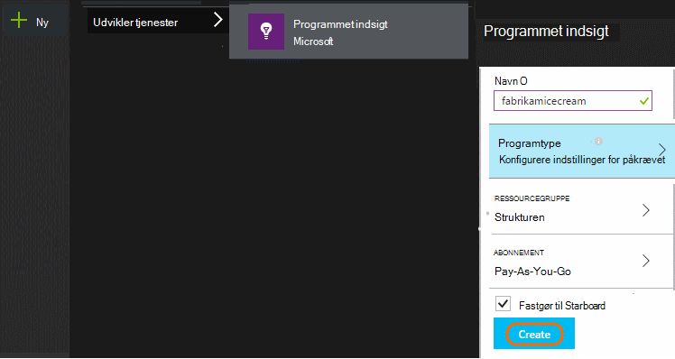

**Hvis din app er en enhed,** kan du tilføje programmet indsigt SDK til projektet. Præcis fremgangsmåden varierer afhængigt af din [IDE og platform](app-insights-platforms.md). Til Windows-apps, lige skal du højreklikke på projektet i Visual Studio og vælge "Tilføj programmet indsigt."

**Hvis det er en WebApp** Åbn bladet Hurtig Start, og få kodestykke til at føje til dine websider. Publicere dem igen med denne kodestykke.

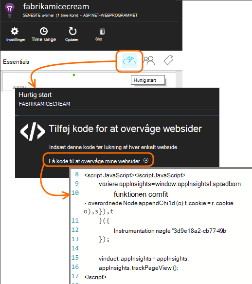

Du kan også tilføje programmet indsigt i din [ASP.NET](app-insights-asp-net.md) eller [J2EE](app-insights-java-get-started.md) server-kode for at kombinere telemetri fra både klienten og serveren.

### Kør projektet og få vist første resultater

Kør projektet i fejlsikret tilstand for et par minutter, og gå til [Azure-portalen](https://portal.azure.com) og gå til dit projektressource i programmet indsigt.

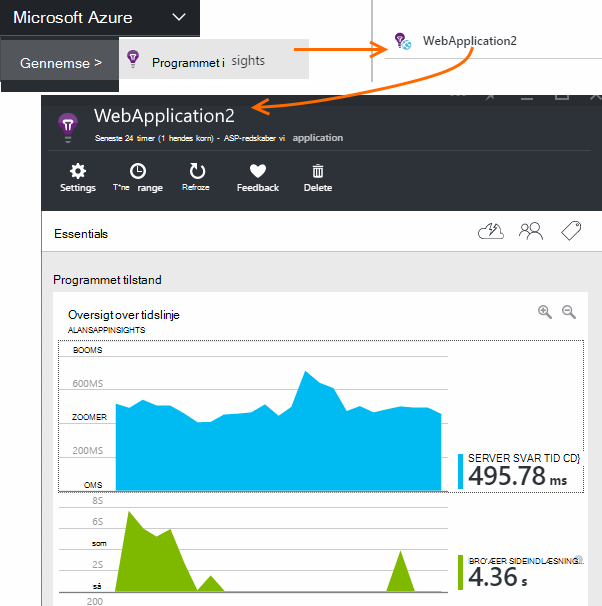

Udgive din app for at få flere telemetri og finde ud af, hvad brugerne laver med din app.

## Analyse af feltet

Klik på feltet sidevisninger for at få vist detaljer om anvendelse.

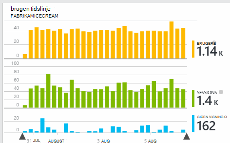

Hold markøren over den tomme side over en graph for at se antallet af poster på et bestemt sted. Ellers skal vise tallene værdien sammenlagt i perioden, som et gennemsnit, en total eller en optælling af forskellige brugere i perioden.

I webprogrammer tælles brugere ved hjælp af cookies. En person, der bruger flere browsere, rydder cookies eller bruger funktionen beskyttelse af personlige oplysninger, der skal tælles flere gange.

En web-session tælles efter 30 minutters inaktivitet. En session på en mobiltelefon eller en anden enhed tælles når appen er afbrudt i mere end et par sekunder.

Klik dig gennem et diagram for at se mere detaljeret. Eksempel:

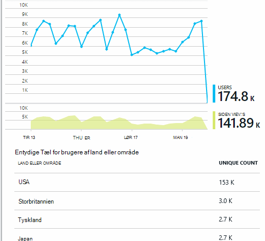

(I dette eksempel er fra et websted, men diagrammerne ligner til apps, der kører på enheder).

Sammenligne med den forrige uge til at se, om ting, du ændrer:

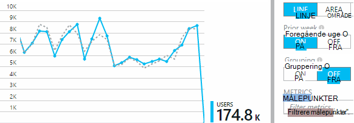

Sammenligne to statistik, for eksempel brugere og nye brugere:

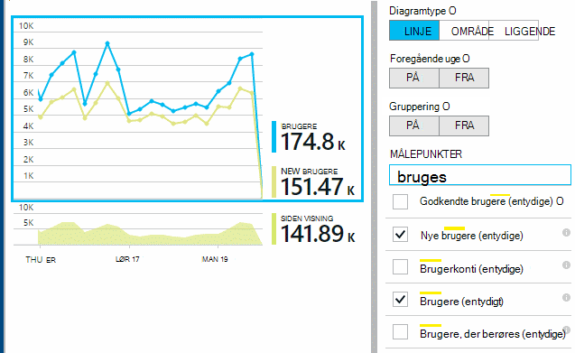

Gruppe (segment) data efter en egenskab som Browser, operativsystem eller by:

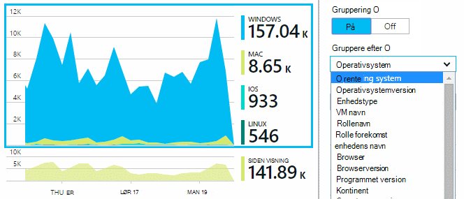

## Brug af siden

Klik på sidevisningerne side om side for at få en en opdeling af de mest populære sider:

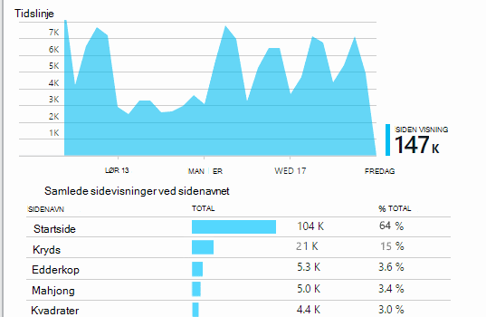

Ovenstående eksempel er fra et spil websted. Herfra kan vi med det samme se:

* Brug ikke er forbedret i den seneste uge. Vi bør måske tænke søgemaskineoptimering?
* Mange færre personer se spil sider end startsiden. Hvorfor ikke startsiden tiltrække andre kan afspille spil?
* 'Kryds' er de mest populære game. Vi bør give prioritet til nye ideer og forbedringer der.

## Brugerdefineret registrering

Lad os sige, i stedet for implementering af hver game i en separat webside, du beslutter at refactor dem alle i den samme enkeltsidet app med de fleste funktioner kodet som Javascript på websiden. Dette gør det muligt for brugeren at skifte hurtigt mellem én game og en anden, eller også har flere spil på én side.

Men du stadig vil have programmet indsigt til at logge af antallet gange hver game åbnes på nøjagtigt samme måde som når de er på separate websider. Det er nemt: kun indsætte et opkald til modulet telemetri i din JavaScript, hvor du vil post, der er åbnet en ny side:

    telemetryClient.trackPageView(game.Name);

## Brugerdefinerede hændelser

Du kan bruge telemetri på mange måder at forstå, hvordan dit program anvendes. Men du altid vil ikke blande meddelelserne med sidevisninger. I stedet bruge brugerdefinerede hændelser. Du kan sende dem fra enheden apps, websider eller en webserver:

(JavaScript)

    telemetryClient.trackEvent("GameEnd");

(C#)

    var tc = new Microsoft.ApplicationInsights.TelemetryClient();
    tc.TrackEvent("GameEnd");

(VB)

    Dim tc = New Microsoft.ApplicationInsights.TelemetryClient()
    tc.TrackEvent("GameEnd")

De mest anvendte brugerdefinerede hændelser er angivet på bladet oversigt.

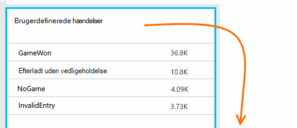

Klik på afsnit i tabellen for at få vist samlede antal begivenheder. Du kan inddele diagrammet ved forskellige attributter som navnet på begivenheden:

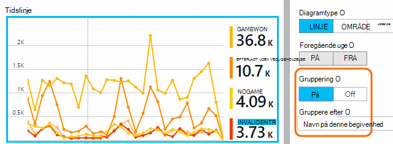

Funktionen særligt nyttige i tidslinjer er, at du kan justere ændringer med andre målepunkter og begivenheder. For eksempel på tidspunkter, hvor flere spil afspilles, forventer du at se en stigning i afbrudte spil samt. Men stigning i afbrudte spil er uforholdsmæssig, du vil finde ud af, om høj belastning forårsager problemer, som brugere kan finde kan accepteres.

## Fokuser på detaljer i bestemte hændelser

For at få en bedre forståelse af, hvordan en typisk session går, vil du fokusere på en bestemt brugersession, der indeholder en bestemt type hændelse.

I dette eksempel skal indkodet vi en brugerdefineret hændelse "NoGame", som kaldes, hvis brugeren logger uden rent faktisk startes en game. Hvorfor vil en bruger, der? Hvis vi Fokuser på detaljer i nogle bestemte forekomster, så vi måske får dette.

De brugerdefinerede hændelser, der er modtaget fra app vises efter navn på bladet oversigt:

Klik dig gennem hændelsen af interesse, og vælg en seneste bestemte forekomst:

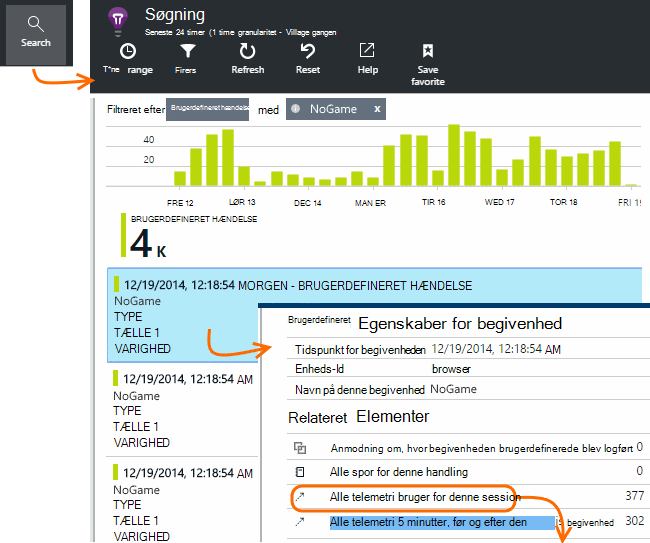

Lad os se på alle telemetri for den session, hvori bestemt NoGame hændelsen opstod.

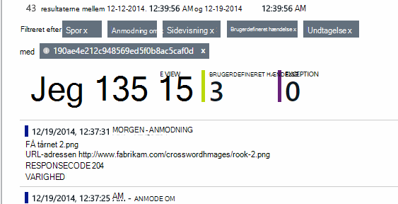

Der ikke er nogen undtagelser, så brugeren ikke blev forhindres afspilning af nogle fejl.

Vi kan filtrere alle typer telemetri undtagen sidevisninger for denne session:

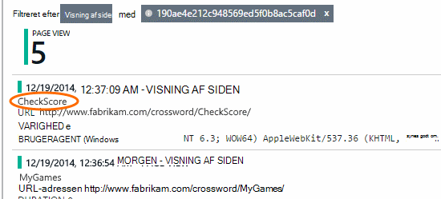

Og vi kan nu se, at denne bruger logget på blot for at kontrollere de seneste resultater. Vi bør måske overveje at udvikle en bruger tekstenhed, der gør det nemmere at gøre det. (Og vi skal implementere en brugerdefineret hændelse til rapport, når denne bestemte tekstenhed indtræffer.)

## Filtrere, søge og opdele dataene med egenskaber
Du kan vedhæfte vilkårlig mærker og numeriske værdier til begivenheder.

JavaScript på klient

    appInsights.trackEvent("WinGame",
        // String properties:
        {Game: currentGame.name, Difficulty: currentGame.difficulty},
        // Numeric measurements:
        {Score: currentGame.score, Opponents: currentGame.opponentCount}
    );

C# på serveren

    // Set up some properties:
    var properties = new Dictionary <string, string>
        {{"game", currentGame.Name}, {"difficulty", currentGame.Difficulty}};
    var measurements = new Dictionary <string, double>
        {{"Score", currentGame.Score}, {"Opponents", currentGame.OpponentCount}};

    // Send the event:
    telemetry.TrackEvent("WinGame", properties, measurements);

VB på serveren

    ' Set up some properties:
    Dim properties = New Dictionary (Of String, String)
    properties.Add("game", currentGame.Name)
    properties.Add("difficulty", currentGame.Difficulty)

    Dim measurements = New Dictionary (Of String, Double)
    measurements.Add("Score", currentGame.Score)
    measurements.Add("Opponents", currentGame.OpponentCount)

    ' Send the event:
    telemetry.TrackEvent("WinGame", properties, measurements)

Tilknytte egenskaber til sidevisninger på samme måde:

JavaScript på klient

    appInsights.trackPageView("Win",
        {Game: currentGame.Name},
        {Score: currentGame.Score});

Få vist egenskaberne ved at klikke på via en enkelt forekomst af en begivenhed i diagnosticering Søg.

Brug søgefeltet til at se begivenhed forekomster med en bestemt egenskabsværdi.

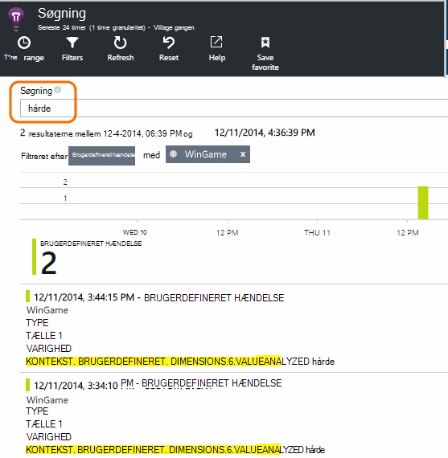

## A | Test af B

Hvis du ikke ved, hvilken variant af en funktion vil være bedre, slip begge af dem, at hver tilgængeligt for forskellige brugere. Måle succes af hver, og derefter flytte til en samlet version.

For denne metode vedhæfte du særskilte mærker til alle telemetri, der sendes af hver version af din app. Du kan gøre det ved at definere egenskaber i den aktive TelemetryContext. Disse standardegenskaber føjes til alle telemetri meddelelser, der sender programmet – ikke kun dine brugerdefinerede meddelelser, men den standard telemetri samt.

I portalen programmet viden, du vil derefter kunne Filtrer og grupper (segment) dine data på mærkerne, således at sammenligne de forskellige versioner.

C# på serveren

    using Microsoft.ApplicationInsights.DataContracts;

    var context = new TelemetryContext();
    context.Properties["Game"] = currentGame.Name;
    var telemetry = new TelemetryClient(context);
    // Now all telemetry will automatically be sent with the context property:
    telemetry.TrackEvent("WinGame");

VB på serveren

    Dim context = New TelemetryContext
    context.Properties("Game") = currentGame.Name
    Dim telemetry = New TelemetryClient(context)
    ' Now all telemetry will automatically be sent with the context property:
    telemetry.TrackEvent("WinGame")

Individuelle telemetri kan tilsidesætte standardværdierne.

Du kan konfigurere ved initialisering af en universal, så alle nye TelemetryClients automatisk bruge din kontekst.

    // Telemetry initializer class
    public class MyTelemetryInitializer : ITelemetryInitializer
    {
        public void Initialize (ITelemetry telemetry)
        {
            telemetry.Properties["AppVersion"] = "v2.1";
        }
    }

I app-initialisering som Global.asax.cs:

    protected void Application_Start()
    {
        // ...
        TelemetryConfiguration.Active.TelemetryInitializers
        .Add(new MyTelemetryInitializer());
    }

## Få mere at vide build - mål-

Når du bruger analytics, bliver en integreret del af din udviklingscyklus – ikke bare noget du synes om for at løse problemer. Her er nogle tip:

* Find ud af den vigtigste metrikværdi for dit program. Vil du have så mange brugere som muligt, eller foretrækker du et lille sæt meget tilfreds brugere? Vil du maksimere besøg eller salg?
* Planlægge at måle hver tekstenhed. Når du skitsere en ny bruger tekstenhed eller funktion, eller for at opdatere en eksisterende database, synes altid om, hvordan du vil måle succes efter ændringen. Spørg før kodningssprog starter "hvilken virkning vil dette have på vores statistik, hvis det fungerer? Bør vi registrere alle nye begivenheder?"
Og naturligvis når funktionen er direkte, skal du se på analyser og handle på siden resultater.
* Anden metrik er relateret til den vigtige metrikværdi. Eksempelvis hvis du føjer en 'Favoritter' funktion, du vil gerne vide, hvor ofte brugerne tilføje favoritter. Men det er måske mere interessant at vide, hvor ofte de kommer tilbage til deres Favoritter. Og det vigtigste er, kan kunder, der bruger Favoritter i sidste ende købe mere af dit produkt?
* Kanariske test. Konfigurere en funktion parameter, der gør det muligt at foretage en ny funktion vises kun for nogle brugere. Bruge programmet indsigt til at se, om den nye funktion bruges i den måde, du planlagte. Foretage justeringer, og slip det til et større publikum.
* Tale med dine brugere! Analytics er ikke nok af sig selv, men komplementære til at vedligeholde en god kunderelation.

## Lær mere

* [Registrere, prioritere og diagnosticere går ned, og problemer med ydeevnen i din app](app-insights-detect-triage-diagnose.md)
* [Komme i gang med programmet indsigt på mange platforme](app-insights-detect-triage-diagnose.md)

## Video

> [AZURE.VIDEO usage-monitoring-application-insights]

 
