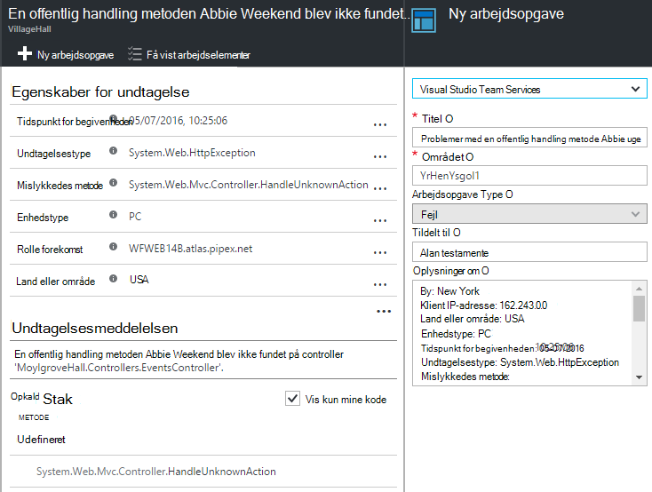
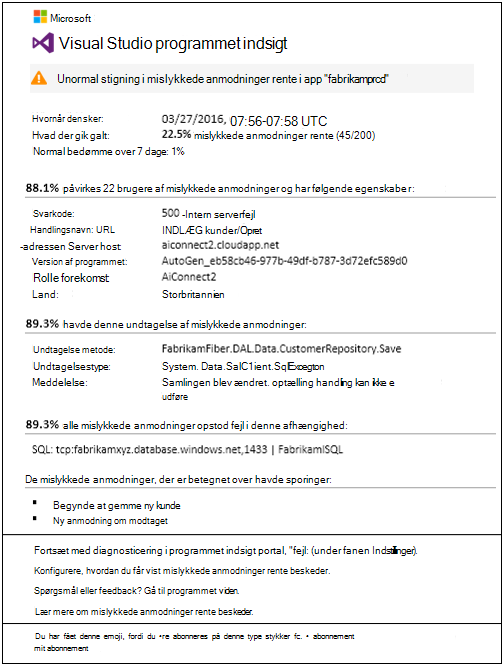

<properties 
    pageTitle="Programmet indsigt selvstudium | Microsoft Azure" 
    description="Spore brugen og ydeevnen af dit live webprogram.  Registrere, prioritere og diagnosticere problemer. Løbende overvåge og forbedre succes med dine brugere." 
    services="application-insights" 
    documentationCenter=""
    authors="alancameronwills" 
    manager="douge"/>

<tags 
    ms.service="application-insights" 
    ms.workload="tbd" 
    ms.tgt_pltfrm="ibiza" 
    ms.devlang="na" 
    ms.topic="article" 
    ms.date="10/15/2016" 
    ms.author="awills"/>
 
# Programmet indsigt - Introduktion

Visual Studio programmet indsigt er en extensible analytics-tjeneste, som overvåger dit live webprogram. Med den kan du registrere og diagnosticere problemer med ydeevnen og forstå, hvad brugerne rent faktisk gøre med din app. Det er udviklet til udviklere kan hjælpe dig med at forbedre ydeevnen og brugervenligheden løbende. Det fungerer for apps på en lang række platforme, herunder .NET, Node.js og J2EE hostet lokalt eller i skyen. 

[Se nærmere på Introduktion animationen](https://www.youtube.com/watch?v=fX2NtGrh-Y0).

## Hvordan fungerer det?

Du installerer en lille instrumentation pakke i dit program og konfigurere en programmet indsigt ressource i Microsoft Azure-portalen. Instrumenterne overvåger din app og sender telemetridata til portalen. På portalen viser du statistiske diagrammer og giver effektive søgeværktøjer for at hjælpe dig med at diagnosticere problemer.

Programmet indsigt har forskellige [standard instrumentmoduler](app-insights-configuration-with-applicationinsights-config.md) , samle forskellige typer telemetri som anmodning om svar gange, undtagelser og afhængighed opkald. Du kan også [skrive programkode for at sende brugerdefinerede telemetri](app-insights-api-custom-events-metrics.md) til portalen.

### Hvad er spild?

Påvirkning af ydeevnen for din app er meget lille. Sporing opkald er ikke-blokerer, og batches og sendes i en separat tråd. 

## Hvad gør den?

Programmet indsigt henvender sig til udviklingsteamet, kan hjælpe dig med at forstå, hvordan det overordnet går din app og hvordan den bruges. Den indeholder:

Telemetri typer:

* HTTP-anmodning om satser, svar klokkeslæt, succes satser.
* Afhængighed (HTTP- og SQL) ringe satser, svar klokkeslæt, succes satser.
* Undtagelse sporinger fra både server og klient.
* Diagnosticeringsloggene sporinger.
* Sidevisning tæller, bruger og session tæller, browseren indlæsningstider, undtagelser.
* AJAX opkald satser, svar gange og succes satser.
* Server tællere i ydeevne.
* Brugerdefineret klient- og telemetri.
* Segmentering af klienten placering, browserversion, OS-version, server-forekomst, brugerdefinerede mål og mere.
* Tilgængelighed test

Værktøjer til diagnosticering og analytisk:

* Smart og manuel beskeder om manglende satser og anden metrik og om tilgængelighed.
* Diagrammer over tid af aggregeret målepunkter.
* Diagnosticering Søg på forekomster af anmodninger, undtagelser, brugerdefinerede hændelser, log sporinger, sidevisninger, afhængighed og AJAX opkald. 
* Analytics - en effektiv forespørgselssprog over din telemetri
* Dashboards - Skriv de diagrammer, du har brug for til at overvåge alle komponenter din app.

## Hvordan bruger jeg det?

### Skærm

Installere programmet indsigt i din online, konfigurere tilgængelighed web test og:

* Konfigurere et dashboard til dit team plads til at holde øje med indlæsning, svartid og ydeevnen af din afhængigheder, siden indlæses og AJAX opkald. 
* Opdag, som er den lavest og de fleste fejlbehæftede anmodninger.
* Se Live Stream, når du installerer en ny version, at vide om en hvilken som helst er forringet med det samme.

### Diagnosticere

Når du modtager en besked eller finde et problem:

* Koordinere fejl med undtagelser, afhængighed opkald og sporinger.
* Undersøg stak gemmer og spore logfiler.

### Vurder

Måle effektiviteten af hver ny funktion, som du installerer.

* Planlægge at måle, hvordan kunder anvender nye UX eller business-funktioner.
* Skriv brugerdefinerede telemetri i din kode til at logge brugen.
* Basere hver udviklingscyklus på hårde dokumentation fra telemetri.

## Komme i gang

Programmet indsigt er et af de mange tjenester, der findes i Microsoft Azure, og der sendes telemetri til analyse og præsentation. Så før du gør noget andet, skal du et abonnement på [Microsoft Azure](http://azure.com). Det er meget Velkommen til at tilmelde dig, og du kan vælge den gratis [priser niveau](https://azure.microsoft.com/pricing/details/application-insights/) af programmet indsigt. Hvis din organisation allerede har et abonnement, kan de tilføjer din Microsoft-konto til den. 

Der er flere måder at komme i gang. Starte med afhængigt af hvad der fungerer bedst for dig. Du kan tilføje de andre senere.

* **På kørselstidspunktet: instrumentere din online på serveren.** Undgår en opdatering til koden. Du skal have administratoradgang til din server.
 * [**IIS lokalt eller på en VM**](app-insights-monitor-performance-live-website-now.md)
 * [**Azure WebApp eller VM**](app-insights-monitor-performance-live-website-now.md#if-your-app-runs-as-an-azure-web-app)
 * [**J2EE**](app-insights-java-live.md)
* **På udviklingstid: indsætte programmet indsigt i din kode.** Gør det muligt at skrive brugerdefinerede telemetri og instrument back end-og-programmer på computeren.
 * [Visual Studio](app-insights-asp-net.md) 2013 opdatering 2 eller nyere.
 * Java i [Eklipse](app-insights-java-eclipse.md) eller [andre værktøjer](app-insights-java-get-started.md)
 * [Node.js](app-insights-nodejs.md)
 * [Andre platforme](app-insights-platforms.md)
* **[Instrumentere dine websider](app-insights-javascript.md)** til sidevisning, AJAX og andre klientsiden telemetri.
* **[Tilgængelighed test](app-insights-monitor-web-app-availability.md)** - ping webstedet regelmæssigt fra vores servere.

> [AZURE.NOTE]  På dette tidspunkt måske vil du blot få på og eksperimentere. Men hvis du gerne vil se, hvordan programmet indsigt kan, kan du læse videre...

## Udforske målepunkter

Kør din app - enten i fejlsikret tilstand på computeren udvikling, eller ved at installere det på en server - og bruge det til et stykke tid. Log derefter på [Azure-portalen](https://portal.azure.com).

Gå til din app programmet indsigt oversigt blade:

Oversigten kan du straks se, hvordan det overordnet går din app. Du kan sammenligne indlæsning (med hensyn til antal anmodninger) med tiden din app for at svare på mødeindkaldelser. Hvis der er en uforholdsmæssig stigning i svartid når afkrydsningsfeltet Indlæs går op, kan du få allokerer yderligere ressourcer til din app. Hvis den vises flere mislykkedes svar højre, når du har installeret et nyt build, kan du vil vende tilbage.

#### Få flere oplysninger

Klik dig gennem et diagram for at få mere detaljerede diagrammer. For eksempel fører serverens svartid diagrammet til diagrammer, der viser anmodning satser, svar og svar tidspunkter for afhængigheder (det vil sige, tjenester, der ringer til din app).  

Afhængigheder diagrammet er nyttigt, fordi den måde kan du se om databaser og REST API'er, der bruger din app svarer godt eller medfører forsinkelser.

#### Tilpasse et diagram

Prøv at redigere en af disse diagrammer. Hvis din online kører på en samling af forekomster af server, kan du sammenligne svar gange på anden server forekomsterne:

1. Hold markøren over diagrammet, og klik på Rediger.
2. Vælg en metrikværdi. Flere målepunkter kan vises i ét diagram, men kun i visse kombinationer: det være nødvendigt at fjerne markeringen ét metrisk, før du vælge det, du vil.
3. Brug Group By til segment skal tildeles en metrikværdi efter en egenskab. I dette eksempel vises vi separate linjer for forskellige svar gange. 

    Bemærk, at du skal markere en gyldig egenskab for en metrikværdi eller diagrammet bliver ikke vist nogen data.
4. Vælg en diagramtype. Område- og søjlediagrammer vise en stablet skærm passende, når sammenlægning typen er 'Sum'.

[Mere om undersøgelse statistik](app-insights-metrics-explorer.md).

## Søg forekomst af data

Hvis du vil undersøge et problem, er det nyttigt at undersøge bestemt hændelse forekomster.

Klik dig gennem et metriske diagram til at gennemsøge Forekomstdata med relevante filtre og tidsinterval. Klik på gennem serveranmodning tæller for eksempel for at se individuel anmodning rapporter. 

Eller du kan gå direkte til forekomst af data fra søgningen på oversigtssiden:

Bruge filtre til at fokusere på bestemte typer begivenhed og valgte egenskabsværdier:

Klik på "..." for at se en komplet liste over egenskaber, eller Åbn andre begivenheder, der er knyttet til den samme anmodning. I dette eksempel har mislykkedes anmodningen en tilknyttet undtagelsesrapport:

Åbne en begivenhed – i dette eksempel den relaterede undtagelse -, og du kan oprette en arbejdsopgave (Hvis du bruger Visual Studio Team Services til at registrere opgaver). 
 

## Analyser

[Analyser](app-insights-analytics.md) er en endnu mere effektiv søgning og analyse funktion, hvor du kan skrive SQL-lignende forespørgsler over din telemetridata, enten til at søge efter specifikke problemer eller at samle statistiske oplysninger.

Åbn vinduet selvstudium for at se og køre eksempler på forespørgsler over dine data, eller Læs længere [selvstudium gennemgang](app-insights-analytics-tour.md). IntelliSense beder dig om med de forespørgsler, du kan bruge, og der er en [fuld sprogreference](app-insights-analytics-reference.md). 

Forespørgsler begynder normalt med navnet på en telemetri stream som anmodninger, undtagelser eller afhængigheder. Pop Åbn værktøjslinjen skema til venstre for at se en liste over tilgængelige telemetri streams. Forespørgslen er en rørledning af [forespørgslerne](app-insights-analytics-reference.md#queries-and-operators) såsom `where` - et boolesk filter - eller `project` -som beregner nye egenskaber. `summarize`[samlinger forekomster](app-insights-analytics-tour.md#aggregate-groups-of-rows), gruppere dem ved hjælp af funktioner, du definerer, og derefter anvende sammenlægningsfunktioner over de grupperede data.

Resultater kan være [gengives i tabeller eller forskellige typer af diagrammet](app-insights-analytics-tour.md#charting-the-results).

## Brugerdefineret telemetri

Den indbyggede telemetri, som du får lige ved at installere programmet indsigt gør det muligt at analysere tæller, succes satser og svar tiden begge webanmodninger om din app og afhængigheder – det vil sige, opkald fra din app til SQL, REST API'er. Du kan også finde undtagelse sporinger og (med Status skærmen på serveren) system tællere i ydeevne. Hvis du har tilføjet i klienten kodestykke på dine websider, du får vist siden visning tæller og indlæsningstider, klienten undtagelser og AJAX ringe succes og svar. 

Analyse af denne telemetri kan fortælle dig meget om ydeevne og brug af din app. Men nogle gange, der er ikke nok. Vil du muligvis skærmen længden af en kø, så du kan finjustere ydeevnen i; eller tælle salg og segment skal tildeles dem efter placering; eller på klientsiden, finde ud af, hvordan ofte brugerne klikker på en bestemt knap, så du kan finjustere brugeroplevelsen.

[Programmet indsigt API](app-insights-api-custom-events-metrics.md) giver opkald `TrackEvent(name)` og `TrackMetric(name, value)` så kan du sende dine egne brugerdefinerede hændelser og målepunkter. Der findes tilsvarende opkald for klientsiden.

Hvis din webside er en enkelt side game app, kan du indsætte en linjer i de relevante steder at logge, når brugeren vinder eller mister en game:

    
    appInsights.trackEvent("WinGame");
    ...
    appInsights.trackEvent("LoseGame");

Vi kan derefter diagram brugerdefineret hændelse tæller segmentering dem ved navn på denne begivenhed:

### Log sporinger

Diagnosticering, der er en brugerdefineret hændelse `TrackTrace(message)` , som du kan bruge til udførelse af sporinger. Du kan søge på indholdet i den meddelelse, som kan være længere end navnet på en begivenhed i funktionerne Søg og analyser. 

Hvis du allerede bruger et logføring framework såsom Log4Net, NLog, Log4J eller System.Diagnostic.Trace, derefter disse spor opkald kan hentes af programmet indsigt og vises sammen med andre telemetri. Visual Studio-værktøjerne Tilføj automatisk det relevante SDK-modul.

## Dashboards

Mange programmer består af flere komponenter som en webtjeneste, og en eller flere afslutte tilbage processorer. Hver komponent vil blive overvåget af en separat program indsigt ressource. Hvis dit system kører på Azure, kan du bruger - og overvåge - tjenester f.eks begivenhed machine learning-samt. 

Hvis du vil overvåge hele systemet, kan du vælge de mest interessante diagrammer fra forskellige apps og fastgøre dem til en Azure [dashboard](app-insights-dashboards.md), så du kan holde øje med hele systemet løbende. 

Faktisk kan du oprette flere dashboards – for eksempel en team rum dashboard til at overvåge generelle systemtilstand; et design-dashboard, der fokuserer på brugen af forskellige funktioner et separat dashboard for komponenter under prøven. og så videre.  

Dashboards, som ressourcer, kan deles mellem teammedlemmer.

## Udvikling i Visual Studio

Hvis du bruger Visual Studio til at udvikle din app, finder du flere programmet indsigt værktøjer, der er indbygget i. 

### Diagnosticering søgning

Vinduet Søg vises hændelser, der er blevet gemt. (Hvis du logget på Azure, når du konfigurerer programmet viden, du vil kunne søge de samme hændelser på portalen.)

Gratis tekst søgningen fungerer på en hvilken som helst felter i hændelserne. Eksempelvis Søg efter en del af URL-adressen på en side eller værdien af en egenskab som klient by; eller bestemte ord i en logfil over sporing.

Klik på en hvilken som helst begivenhed for at få vist egenskaberne detaljerede.

Du kan også åbne fanen relaterede elementer for at hjælpe med at diagnosticere mislykkede anmodninger eller undtagelser.

### Diagnosticerings-hub

Diagnosticerings-Hub (i Visual Studio 2015 eller nyere) viser programmet indsigt server telemetri, som den er oprettet. Det fungerer også selvom du har valgt kun, hvis du vil installere SDK, uden at oprette forbindelse til en ressource på portalen Azure.

### Undtagelser

Hvis du har [oprettet undtagelse overvågning](app-insights-asp-net-exceptions.md), undtagelse rapporter, vises i vinduet Søg. 

Klik på en undtagelse for at få et stablen spor. Hvis koden for appen er åben i Visual Studio, kan du klikke gennem fra staksporing til den relevante linje af koden.

Desuden i linjen kode Lens over hver enkelt metode, får du vist en optælling af de undtagelser, der er logget af programmet indsigt i det seneste 24 timer.

### Lokal overvågning

(Fra Visual Studio 2015 opdatering 2) Hvis du ikke har konfigureret SDK for at sende telemetri til portalen programmet indsigt (så der ikke er nogen instrumentation nøgle i ApplicationInsights.config) vises vinduet diagnosticering telemetri fra din seneste fejlfinding session. 

Dette er hensigtsmæssigt, hvis du allerede har udgivet en tidligere version af din app. Du vil ikke telemetri fra din fejlfinding sessioner for at være blandet sammen med telemetri på portalen programmet indsigt fra publicerede app.

Det er også nyttigt, hvis du har nogle [brugerdefinerede telemetri](app-insights-api-custom-events-metrics.md) , som du vil foretage fejlfinding inden du sender telemetri til portalen.

* *I første omgang konfigureret jeg fuldt programmet indsigt for at sende telemetri til portalen. Men nu jeg gerne vil se telemetri kun i Visual Studio.*

 * I vinduet Søg indstillinger, der ikke mulighed for at søge lokale diagnosticering, selvom din app sender telemetri til portalen.
 * Hvis du vil stoppe telemetri, der sendes til portalen, skrive en kommentar ud linjen `<instrumentationkey>...` fra ApplicationInsights.config. Fjern den, når du er klar til at sende telemetri til portalen igen.

## Tendenser

Tendenser er et værktøj i Visual Studio til at visualisere, hvordan din app opfører sig over en periode. 

Vælg **Udforske Telemetri tendenser** fra programmet indsigt værktøjslinjeknap eller søgevinduet programmet indsigt. Vælg en af fem almindelige forespørgsler for at komme i gang. Du kan analysere forskellige datasæt baseret på telemetri typer, tidsintervaller og andre egenskaber. 

For at finde afvigelser i dine data skal du vælge en af anomali indstillingerne under "Visningstype" rulleliste. De filtreringsindstillinger nederst i vinduet gør det nemt at finpudse i på bestemte undersæt af din telemetri.

## Frigive et nyt build

### Live målepunkter værdistrøm

Live målepunkter Stream viser du dit program målepunkter højre i meget øjeblikket, med en nær realtid forsinkelse på 1 sekund. Dette er særdeles nyttigt, når du frigivelse af et nyt build og vil sikre dig, at alt er en arbejdsdag som forventet, eller ved at undersøge en hændelse i realtid.

I modsætning til målepunkter Explorer viser Live målepunkter Stream et fast antal målepunkter. Dataene fortsætter kun til, så længe den er i diagrammet, og derefter kasseres. 

### Anmærkninger

[Release anmærkninger](app-insights-annotations.md) i målepunkter diagrammer viser, hvor du har installeret et nyt build. De gør det nemt at se, om dine ændringer havde indflydelse på programmets ydeevne. De kan oprettes automatisk af [Visual Studio Team Services byg system](https://www.visualstudio.com/en-us/get-started/build/build-your-app-vs), og du kan også [oprette dem fra PowerShell](#create-annotations-from-powershell).

Release anmærkninger er en funktion i Opret skybaseret og slip-tjenesten for den Visual Studio Team Services. 

## Beskeder

Hvis noget går galt med din app, vil du gerne vil vide om det med det samme. 

Programmet indsigt indeholder tre typer sikkerhedsmeddelelsen, der leveres via mail.

### Proaktiv diagnosticering 

[Proaktiv diagnosticering](app-insights-proactive-failure-diagnostics.md) er automatisk konfigureret – du behøver ikke at konfigurere den. Hvis webstedet har tilstrækkelig trafik, får du vist en mail, hvis der er en stigning i mislykkede anmodninger, der er usædvanlige til tidspunktet på dagen eller anmodning rente. Beskeden indeholder diagnostiske oplysninger. 

Her er et eksempel på en skrivebordsbesked. 

En anden type proaktiv registrering opdager korrelationer mellem fejl og faktorer som placering, klienten OS eller BrowserType.

### Metriske beskeder

Du kan konfigurere [metriske beskeder](app-insights-alerts.md) for at fortælle dig, når en hvilken som helst metrisk krydser en grænseværdi for nogle periode - som manglende tæller, hukommelse eller sidevisninger.

### Tilgængelighed

[Tilgængelighed web test](app-insights-monitor-web-app-availability.md) sende anmodninger til dit websted fra vores servere på forskellige steder over hele verden. De fortælle dig, når dit websted er ikke tilgængelig på internettet eller svarer langsomt. 

## Eksportere

Der er flere måder, du kan finde dit telemetridata af programmet indsigt portalen:

* [Kontinuert eksportere](app-insights-export-telemetry.md) er velegnet, hvis du vil beholde store dele af din telemetri i mere end standard opbevaringsperioden.
* [Målepunkter](app-insights-metrics-explorer.md#export-to-excel) tabeller, søgeresultater og [Analytics](app-insights-analytics.md) resultater kan alle eksporteres til et Excel-regneark. 
* Data Access REST-API kan bruges til at søge efter og udtrække data, herunder Analytics forespørgsler, der kører. API er i øjeblikket i private preview. [Få mere at vide om deltagelse i eksemplet](https://visualstudio.uservoice.com/forums/357324-application-insights/suggestions/4999529-make-data-accessible-via-apis-for-custom-processin).
* Du kan eksportere [Analytics forespørgsler til Power BI](app-insights-export-power-bi.md) -dashboards og se resultaterne i visualiseringer af Power BI, som kan opdateres automatisk.

 
## Datastyring

Der er begrænsninger på din brugen af programmet viden, der afhænger af til en vis grad priser farveskema, som du vælger. Der er primære begrænsningerne på:

* Telemetri rente i minuttet
* Datapunkt Tæl månedsbasis
* Opbevaringsperiode til data

[Indsamle](app-insights-sampling.md) er en funktion til at reducere omkostninger og undgår (throttling). Den sletter en del af din telemetri, holde styr på en repræsentant stikprøve. Tilknyttede elementer (som undtagelser og de anmodninger, der forårsagede dem) er enten bevares eller kasseres sammen. Til ASP.NET-programmer, stikprøver, hvor der er automatisk og anvendes i appen; Ellers kan du angive det skal anvendes på indtagelse på portalen.

## Næste trin

Kom i gang på kørselstidspunktet med:

* [IIS-server](app-insights-monitor-performance-live-website-now.md)
* [J2EE server](app-insights-java-live.md)

Kom i gang med udviklingstiden med:

* [ASP.NET](app-insights-asp-net.md)
* [Java](app-insights-java-get-started.md)
* [Node.js](app-insights-nodejs.md)

## Support og feedback

* Spørgsmål og problemer for:
 * [Fejlfinding i forbindelse med][qna]
 * [MSDN-Forum](https://social.msdn.microsoft.com/Forums/vstudio/home?forum=ApplicationInsights)
 * [StackOverflow](http://stackoverflow.com/questions/tagged/ms-application-insights)
 * [Få support til udviklere](app-insights-get-dev-support.md)
* Dine forslag:
 * [UserVoice](https://visualstudio.uservoice.com/forums/357324)
* Blog:
 * [Programmet indsigt blog](https://azure.microsoft.com/blog/tag/application-insights)

## Videoer

> [AZURE.VIDEO 218]

> [AZURE.VIDEO usage-monitoring-application-insights]

> [AZURE.VIDEO performance-monitoring-application-insights]

> [Indledende animation](https://www.youtube.com/watch?v=fX2NtGrh-Y0)

<!--Link references-->

[android]: https://github.com/Microsoft/ApplicationInsights-Android
[azure]: ../insights-perf-analytics.md
[client]: app-insights-javascript.md
[desktop]: app-insights-windows-desktop.md
[detect]: app-insights-detect-triage-diagnose.md
[greenbrown]: app-insights-asp-net.md
[ios]: https://github.com/Microsoft/ApplicationInsights-iOS
[java]: app-insights-java-get-started.md
[knowUsers]: app-insights-overview-usage.md
[platforms]: app-insights-platforms.md
[portal]: http://portal.azure.com/
[qna]: app-insights-troubleshoot-faq.md
[redfield]: app-insights-monitor-performance-live-website-now.md

 