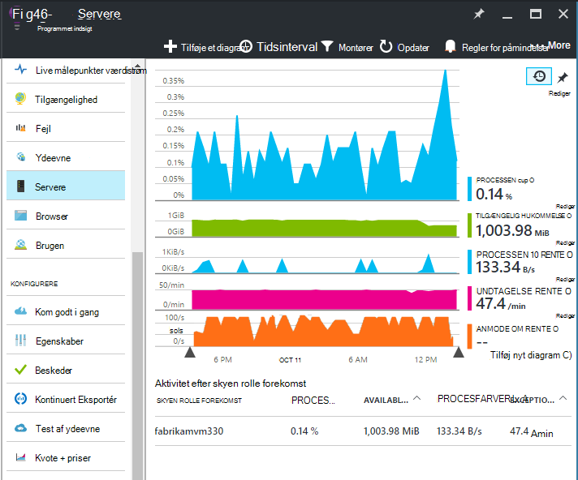
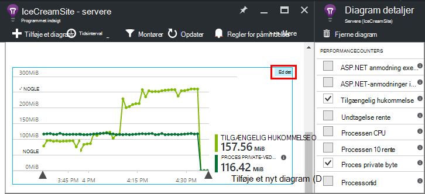
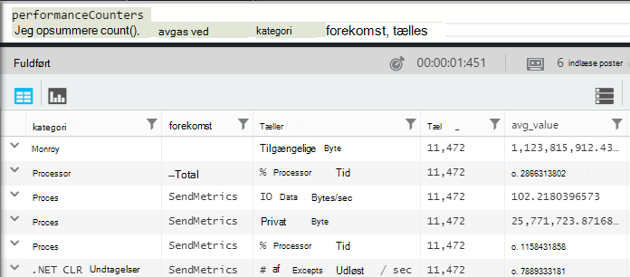
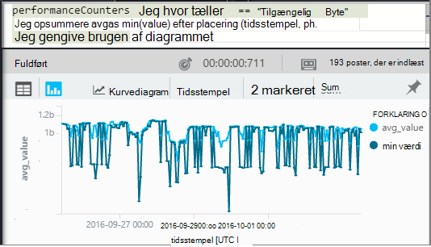
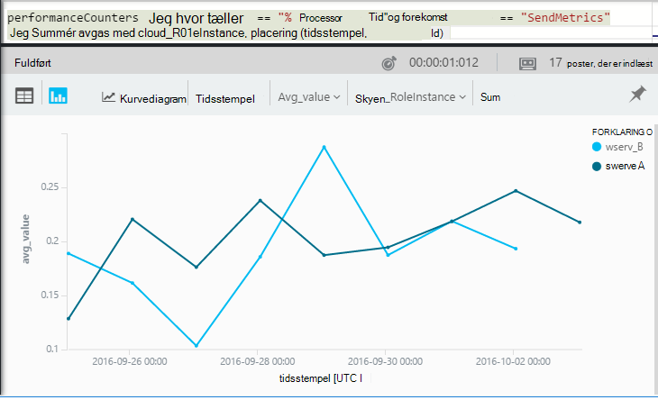

<properties 
    pageTitle="Tællere i ydeevne i programmet indsigt | Microsoft Azure" 
    description="Overvåge system og brugerdefinerede tællere i .NET ydeevne i programmet indsigt." 
    services="application-insights" 
    documentationCenter=""
    authors="alancameronwills" 
    manager="douge"/>

<tags 
    ms.service="application-insights" 
    ms.workload="tbd" 
    ms.tgt_pltfrm="ibiza" 
    ms.devlang="na" 
    ms.topic="article" 
    ms.date="10/11/2016" 
    ms.author="awills"/>
 
# <a name="system-performance-counters-in-application-insights"></a>System tællere i ydeevne i programmet indsigt


Windows indeholder et bredt udvalg af [tællere i ydeevne](http://www.codeproject.com/Articles/8590/An-Introduction-To-Performance-Counters) som CPU ibrugtagning, hukommelse, disk, og brug af netværket. Du kan også definere dine egne. [Programmet indsigt](app-insights-overview.md) kan vise disse tællere i ydeevne, hvis dit program, der kører under IIS på en lokal vært eller virtuel maskine, du har administratoradgang. Angive de ressourcer, der er tilgængelige for direkte programmet diagrammerne, og kan hjælpe med at identificere opgjorte Indlæs mellem forekomster af server.

Tællere i ydeevne vises i bladet servere, der indeholder en tabel, der segmenter ved server-forekomst.



(Tællere i ydeevne er ikke tilgængelige for Azure Web Apps. Men du kan [sende Azure diagnosticering til programmet indsigt](app-insights-azure-diagnostics.md).)

## <a name="configure"></a>Konfigurere

Hvis programmet indsigt Status skærm endnu ikke er installeret på din server maskiner, skal du installere den for at se tællere i ydeevne.

Downloade og køre [Status skærm installer](http://go.microsoft.com/fwlink/?LinkId=506648) på hver forekomst af server. Hvis det allerede er installeret, behøver du ikke at installere det igen.

* *Jeg [installeret programmet indsigt SDK i min app](app-insights-asp-net.md) under udviklingen. Skal jeg stadig bruge Status skærm?*

    Ja, Status skærm er påkrævet til at indsamle tællere i ydeevne til ASP.NET webapps. Som du måske allerede kender, kan Status skærm også bruges til at [overvåge webapps, der allerede er direkte](app-insights-monitor-performance-live-website-now.md), uden at installere SDK under udviklingen.


## <a name="view-counters"></a>Få vist tællere

Bladet servere, der viser et standardsæt af tællere i ydeevne. 

For at se andre tællere skal enten redigere diagrammer på bladet servere eller Åbn en ny [Målepunkter Explorer](app-insights-metrics-explorer.md) blade og tilføje nye diagrammer. 

De tilgængelige tællere er angivet som målepunkter, når du redigerer et diagram.



Oprette et [dashboard](app-insights-dashboards.md) for at få vist alle dine diagrammer, der er mest effektiv på ét sted, og Fastgør dem til den.

## <a name="add-counters"></a>Føje tællere

Hvis tælleren ydeevne, du vil ikke vises på listen over målepunkter, er det fordi det ikke indsamling af programmet indsigt SDK i web-serveren. Du kan konfigurere den for at gøre dette.

1. Finde ud af, hvilke tællere er tilgængelig på din server ved hjælp af denne PowerShell-kommando på serveren:

    `Get-Counter -ListSet *`

    (See [`Get-Counter`](https://technet.microsoft.com/library/hh849685.aspx).)

1. Åbn ApplicationInsights.config.

 * Hvis du har tilføjet programmet indsigt til din app under udvikling, Rediger ApplicationInsights.config i dit projekt, og derefter installere det igen på serverne.
 * Hvis du har brugt Status skærm til instrumentere en WebApp på kørselstidspunktet, kan du finde ApplicationInsights.config i appen i IIS rodmappe. Opdatere den der i hver forekomst af server.

2. Redigere direktivet ydeevne indsamler:

 ```XML

    <Add Type="Microsoft.ApplicationInsights.Extensibility.PerfCounterCollector.PerformanceCollectorModule, Microsoft.AI.PerfCounterCollector">
      <Counters>
        <Add PerformanceCounter="\Objects\Processes"/>
        <Add PerformanceCounter="\Sales(photo)\# Items Sold" ReportAs="Photo sales"/>
      </Counters>
    </Add>

```

Du kan hente både standard tællere og dem, du har implementeret dig selv. `\Objects\Processes`er et eksempel på en standard tæller tilgængelige på alle Windows-systemer. `\Sales(photo)\# Items Sold`er et eksempel på en brugerdefineret tæller, der implementeres muligvis i en webtjeneste. 

Formatet er `\Category(instance)\Counter"`, eller for kategorier, der ikke har forekomster, lige `\Category\Counter`.

`ReportAs`kræves til tællernavne, der ikke matcher `[a-zA-Z()/-_ \.]+` – det vil sige, de indeholder tegn, der ikke er i de følgende sæt: bogstaver, afrunde parenteser, skråstreg, bindestreg, understregning, mellemrum, dot.

Hvis du angiver en forekomst, indsamles det som en dimension "CounterInstanceName" af anmeldt metrik.

### <a name="collecting-performance-counters-in-code"></a>Indsamling af tællere i ydeevne i kode

Hvis du vil indsamle system tællere i ydeevne og sende dem til programmet viden, kan du tilpasse det kodestykke nedenfor:

    var perfCollectorModule = new PerformanceCollectorModule();
    perfCollectorModule.Counters.Add(new PerformanceCounterCollectionRequest(
      @"\.NET CLR Memory([replace-with-application-process-name])\# GC Handles", "GC Handles")));
    perfCollectorModule.Initialize(TelemetryConfiguration.Active);

Eller du kan gøre det samme med brugerdefinerede målepunkter, du har oprettet:

    var perfCollectorModule = new PerformanceCollectorModule();
    perfCollectorModule.Counters.Add(new PerformanceCounterCollectionRequest(
      @"\Sales(photo)\# Items Sold", "Photo sales"));
    perfCollectorModule.Initialize(TelemetryConfiguration.Active);

## <a name="performance-counters-in-analytics"></a>Tællere i ydeevne i Analytics

Du kan søge og få vist rapporter over tæller ydeevne i [analyser](app-insights-analytics.md).


**PerformanceCounters** skemaet viser den `category`, `counter` navn, og `instance` navn for hver ydeevne tæller.  I telemetri for hvert program, får du vist kun tællerne for det pågældende program. For eksempel for at se, findes hvilke tællere: 



('Forekomst' her refererer til forekomsten ydeevne tæller ikke den rolle eller server machine forekomst. Navnet på forekomsten for ydeevnen tæller typisk segmenter tællere som processortid af navnet på det proces eller program.)

Sådan får du et diagram af tilgængelig hukommelse over den seneste periode: 




**PerformanceCounters** har også en kolonne som andre telemetri `cloud_RoleInstance` , der angiver den host server-forekomst, som din app kører identitet. For eksempel, at sammenligne ydeevnen for din app på forskellige computere: 




## <a name="aspnet-and-application-insights-counts"></a>ASP.NET og programmet indsigt optællinger

*Hvad er forskellen mellem undtagelse rente og undtagelser målepunkter?*

* *Undtagelse rente* er en system ydeevne tæller. CLR tæller alle håndteret og ikke-afviklet undtagelser, der er udløst, og deler samlede i et udvalg interval med længden af intervallet. Programmet indsigt SDK indsamler dette resultat og sender den til portalen.
* *Undtagelser* er en optælling af de TrackException rapporter, der modtages af portalen i stikprøver, hvor intervallet i diagrammet. Den indeholder kun de håndterede undtagelser, hvor du har skrevet TrackException ringer i din kode, og omfatter ikke alle [ikke-afviklet undtagelser](app-insights-asp-net-exceptions.md). 

## <a name="alerts"></a>Beskeder

Som andre statistik kan du [indstille en besked](app-insights-alerts.md) for at advare dig, hvis en ydeevne tæller går uden for en grænse, du angiver. Åbn bladet beskeder, og klik på Tilføj besked.


## <a name="next"></a>Næste trin

* [Afhængighed registrering](app-insights-asp-net-dependencies.md)
* [Undtagelse registrering](app-insights-asp-net-exceptions.md)