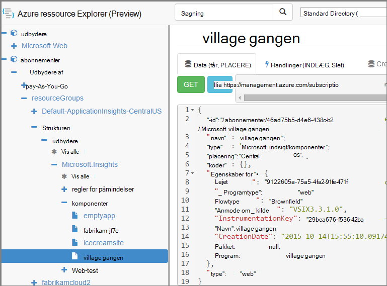

<properties 
    pageTitle="Oprette programmet indsigt ressourcer ved hjælp af PowerShell" 
    description="Oprette programmet indsigt ressourcer fra et program som en del af din build." 
    services="application-insights" 
    documentationCenter=""
    authors="alancameronwills" 
    manager="douge"/>

<tags 
    ms.service="application-insights" 
    ms.workload="tbd" 
    ms.tgt_pltfrm="ibiza" 
    ms.devlang="na" 
    ms.topic="article" 
    ms.date="03/02/2016" 
    ms.author="awills"/>
 
# <a name="create-application-insights-resources-using-powershell"></a>Oprette programmet indsigt ressourcer ved hjælp af PowerShell

I denne artikel beskrives, hvordan du opretter en [Programmet indsigt](app-insights-overview.md) ressource i Azure automatisk. Du kan for eksempel gøre det som en del af en proces i build. Sammen med grundlæggende programmet indsigt ressourcen, kan du oprette [tilgængelighed web test](app-insights-monitor-web-app-availability.md), [konfigurere beskeder](app-insights-alerts.md), og oprette andre Azure ressourcer.

Tasten for at oprettelsen af disse ressourcer er JSON skabeloner til [Azure ressourcestyring](../powershell-azure-resource-manager.md). Kort sagt, er fremgangsmåden: hente JSON definitioner af eksisterende ressourcer standardelementet bestemte værdier som navne; og derefter køre skabelonen, når du vil oprette en ny ressource. Du kan pakke flere ressourcer sammen, til at oprette dem på én gå - for eksempel en app-skærm med tilgængelighed test, beskeder og lagerplads på fortløbende Eksportér. Der er nogle detaljerne til nogle af parameterizations, som vi gennemgår her.

## <a name="one-time-setup"></a>Enkeltstående installation

Hvis du ikke har brugt PowerShell med abonnementet Azure før:

Installere Azure Powershell-modulet på den computer, hvor du vil køre scripts:

1. Installere [Microsoft Web Platform Installer (v5 eller nyere)](http://www.microsoft.com/web/downloads/platform.aspx).
2. Bruge det til at installere Microsoft Azure Powershell.

## <a name="copy-the-json-for-existing-resources"></a>Kopiere JSON for eksisterende ressourcer

1. Konfigurere [Programmet indsigt](app-insights-overview.md) for et projekt ligner dem, du vil generere automatisk. Tilføje web test og beskeder, hvis du vil have dem.
2. Oprette en ny .json fil – Lad os kald den `template1.json` i dette eksempel. Kopiér indholdet i den:


    ```JSON

        {
          "$schema": "https://schema.management.azure.com/schemas/2015-01-01/deploymentTemplate.json#",
          "contentVersion": "1.0.0.0",
          "parameters": {
            "appName": { "type": "string" },
            "webTestName": { "type": "string" },
            "url": { "type": "string" },
            "text": { "type" : "string" }
          },
          "variables": {
            "testName": "[concat(parameters('webTestName'), 
               '-', toLower(parameters('appName')))]"
            "alertRuleName": "[concat(parameters('webTestName'), 
               '-', toLower(parameters('appName')), 
               '-', subscription().subscriptionId)]"
          },
          "resources": [
            {
              // component JSON file contents
            },
            {
              //web test JSON file contents
            },
            {
              //alert rule JSON file contents
            }
 
            // Any other resources go here
          ]
        }
    
    ```

    Denne skabelon kan konfigurere en tilgængelighed test ud over den primære ressource.


2. Åbn [Azure ressourcestyring](https://resources.azure.com/). Navigere ned gennem `subscriptions/resourceGroups/<your resource group>/providers/Microsoft.Insights/components`, til dit program ressource. 

    

    *Komponenter* er de grundlæggende programmet indsigt ressourcer til visning af programmer. Der er separat ressourcer for den tilknyttede regler for påmindelser og tilgængelighed web test.

3. Kopiere JSON af komponenten til det relevante sted i `template1.json`.
6. Slette disse egenskaber:
  * `id`
  * `InstrumentationKey`
  * `CreationDate`
4. Åbn sektionerne webtests og alertrules og kopiere JSON til individuelle elementer til din skabelon. (Ikke kopiere fra noderne webtests eller alertrules: gå til elementerne under dem.)

    Hver web test har en tilknyttet reglen, så du behøver at kopiere dem begge.

    Web-test skal gå, før reglen.

5. For at tilfredsstille skemaet, kan du indsætte denne linje i hver ressource:

    `"apiVersion": "2014-04-01",`

    (Skemaet også klager om brugen af store bogstaver af typen ressourcenavne `Microsoft.Insights/*` – men *ikke* ændre disse.)


## <a name="parameterize-the-template"></a>Standardelementet skabelonen

Nu har du erstatte bestemte navnene med parametre. Til [standardelementet en skabelon](../resource-group-authoring-templates.md)skriver du udtryk ved hjælp af en [række hjælpefunktioner](../resource-group-template-functions.md). 

Du kan ikke standardelementet kun en del af en streng, så brug `concat()` til at opbygge strenge.

Her er eksempler på erstatninger du skal sikre. Der findes flere forekomster af hver erstatning. Du skal muligvis andre i din skabelon. Disse eksempler bruger de parametre og variabler, som vi definerede øverst i skabelonen.

finde | Erstat med
---|---
`"hidden-link:/subscriptions/.../components/MyAppName"`| `"[concat('hidden-link:',`<br/>` resourceId('microsoft.insights/components',` <br/> ` parameters('appName')))]"`
`"/subscriptions/.../alertrules/myAlertName-myAppName-subsId",` | `"[resourceId('Microsoft.Insights/alertrules', variables('alertRuleName'))]",`
`"/subscriptions/.../webtests/myTestName-myAppName",` | `"[resourceId('Microsoft.Insights/webtests', parameters('webTestName'))]",`
`"myWebTest-myAppName"` | `"[variables(testName)]"'`
`"myTestName-myAppName-subsId"` | `"[variables('alertRuleName')]"`
`"myAppName"` | `"[parameters('appName')]"`
`"myappname"`(små bogstaver) | `"[toLower(parameters('appName'))]"`
`"<WebTest Name=\"myWebTest\" ...`<br/>` Url=\"http://fabrikam.com/home\" ...>"`|`[concat('<WebTest Name=\"',` <br/> `parameters('webTestName'),` <br/> `'\" ... Url=\"', parameters('Url'),` <br/> `'\"...>')]" `


## <a name="set-dependencies-between-the-resources"></a>Indstille afhængigheder mellem ressourcerne

Azure skal konfigurere ressourcer i faste rækkefølge. Tilføj afhængighedslinjer for at sikre, at en installationen er fuldført, før næste begynder:

* I webdelen til at teste ressource:

    `"dependsOn": ["[resourceId('Microsoft.Insights/components', parameters('appName'))]"],`

* I beskeder om ressourcen:

    `"dependsOn": ["[resourceId('Microsoft.Insights/webtests', variables('testName'))]"],`

## <a name="create-application-insights-resources"></a>Oprette programmet indsigt ressourcer

1. Log på Azure i PowerShell

    `Login-AzureRmAccount`

2. Køre en kommando således:

    ```PS

        New-AzureRmResourceGroupDeployment -ResourceGroupName Fabrikam `
               -templateFile .\template1.json `
               -appName myNewApp `
               -webTestName aWebTest `
               -Url http://myapp.com `
               -text "Welcome!"
               -siteName "MyAzureSite"

    ``` 

    * -ResourceGroupName er gruppen, hvor du vil oprette de nye ressourcer.
    * -templateFile skal falde før de brugerdefinerede parametre.
    * -Programnavn navnet på ressourcen til at oprette.
    * -webTestName navnet på web-testen til at oprette.
    * -URL-adressen URL-adressen for din online.
    * -tekst en streng, der vises på websiden.
    * -siteName - bruges, hvis det er en Azure websted


## <a name="define-metric-alerts"></a>Definere metriske beskeder

Der er en [PowerShell metode til at konfigurere beskeder](app-insights-alerts.md#set-alerts-by-using-powershell).


## <a name="an-example"></a>Et eksempel

Her er fuldført komponent, web test og test beskeder om skabelon, som jeg har oprettet:

``` JSON

{
  "$schema": "https://schema.management.azure.com/schemas/2015-01-01/deploymentTemplate.json#",
  "contentVersion": "1.0.0.0",
  "parameters": {
    "webTestName": { "type": "string" },
    "appName": { "type": "string" },
    "URL": { "type": "string" },
    "text": { "type" : "string" }
  },
  "variables": {
    "alertRuleName": "[concat(parameters('webTestName'), '-', toLower(parameters('appName')), '-', subscription().subscriptionId)]",
    "testName": "[concat(parameters('webTestName'), '-', toLower(parameters('appName')))]"
  },
  "resources": [
    {
      //"id": "[resourceId('Microsoft.Insights/components', parameters('appName'))]",
      "apiVersion": "2014-04-01",
      "kind": "web",
      "location": "Central US",
      "name": "[parameters('appName')]",
      "properties": {
        "TenantId": "9122605a-471fc50f8438",
        "Application_Type": "web",
        "Flow_Type": "Brownfield",
        "Request_Source": "VSIX3.3.1.0",
        "Name": "[parameters('appName')]",
        //"CreationDate": "2015-10-14T15:55:10.0917441+00:00",
        "PackageId": null,
        "ApplicationId": "[parameters('appName')]"
      },
      "tags": { },
      "type": "microsoft.insights/components"
    },
    {
      //"id": "[resourceId('Microsoft.Insights/webtests', variables('testName'))]",
      "name": "[variables('testName')]",
      "apiVersion": "2014-04-01",
      "type": "microsoft.insights/webtests",
      "location": "Central US",
      "tags": {
        "[concat('hidden-link:', resourceId('microsoft.insights/components', parameters('appName')))]": "Resource"
      },
      "properties": {
        "provisioningState": "Succeeded",
        "Name": "[parameters('webTestName')]",
        "Description": "",
        "Enabled": true,
        "Frequency": 900,
        "Timeout": 120,
        "Kind": "ping",
        "RetryEnabled": true,
        "Locations": [
          {
            "Id": "us-va-ash-azr"
          },
          {
            "Id": "emea-nl-ams-azr"
          },
          {
            "Id": "emea-gb-db3-azr"
          }
        ],
        "Configuration": {
          "WebTest": "[concat(
             '<WebTest   Name=\"', 
                parameters('webTestName'), 
              '\"  Id=\"32cfc791-aaad-4b50-9c8d-993c21beb218\"   Enabled=\"True\"         CssProjectStructure=\"\"    CssIteration=\"\"  Timeout=\"120\"  WorkItemIds=\"\"         xmlns=\"http://microsoft.com/schemas/VisualStudio/TeamTest/2010\"         Description=\"\"  CredentialUserName=\"\"  CredentialPassword=\"\"         PreAuthenticate=\"True\"  Proxy=\"default\"  StopOnError=\"False\"         RecordedResultFile=\"\"  ResultsLocale=\"\">  <Items>  <Request Method=\"GET\"         Guid=\"a6f2c90b-61bf-b28hh06gg969\"  Version=\"1.1\"  Url=\"', 
              parameters('Url'), 
              '\" ThinkTime=\"0\"  Timeout=\"300\" ParseDependentRequests=\"True\"         FollowRedirects=\"True\" RecordResult=\"True\" Cache=\"False\"         ResponseTimeGoal=\"0\"  Encoding=\"utf-8\"  ExpectedHttpStatusCode=\"200\"         ExpectedResponseUrl=\"\" ReportingName=\"\" IgnoreHttpStatusCode=\"False\" />        </Items>  <ValidationRules> <ValidationRule  Classname=\"Microsoft.VisualStudio.TestTools.WebTesting.Rules.ValidationRuleFindText, Microsoft.VisualStudio.QualityTools.WebTestFramework, Version=10.0.0.0, Culture=neutral, PublicKeyToken=b03f5f7f11d50a3a\" DisplayName=\"Find Text\"         Description=\"Verifies the existence of the specified text in the response.\"         Level=\"High\"  ExectuionOrder=\"BeforeDependents\">  <RuleParameters>        <RuleParameter Name=\"FindText\" Value=\"', 
              parameters('text'), 
              '\" />  <RuleParameter Name=\"IgnoreCase\" Value=\"False\" />  <RuleParameter Name=\"UseRegularExpression\" Value=\"False\" />  <RuleParameter Name=\"PassIfTextFound\" Value=\"True\" />  </RuleParameters> </ValidationRule>  </ValidationRules>  </WebTest>')]"
        },
        "SyntheticMonitorId": "[variables('testName')]"
      }
    },
    {
      //"id": "[resourceId('Microsoft.Insights/alertrules', variables('alertRuleName'))]",
      "name": "[variables('alertRuleName')]",
      "apiVersion": "2014-04-01",
      "type": "microsoft.insights/alertrules",
      "location": "East US",
      "dependsOn": [
        "[resourceId('Microsoft.Insights/components', parameters('appName'))]",
        "[resourceId('Microsoft.Insights/webtests', variables('testName'))]"
      ],
      "tags": {
        "[concat('hidden-link:', resourceId('Microsoft.Insights/components', parameters('appName')))]": "Resource",
        "[concat('hidden-link:', resourceId('Microsoft.Insights/webtests', variables('testName')))]": "Resource"
      },
      "properties": {
        "name": "[variables('alertRuleName')]",
        "description": "",
        "isEnabled": true,
        "condition": {
          "$type": "Microsoft.WindowsAzure.Management.Monitoring.Alerts.Models.LocationThresholdRuleCondition, Microsoft.WindowsAzure.Management.Mon.Client",
          "odata.type": "Microsoft.Azure.Management.Insights.Models.LocationThresholdRuleCondition",
          "dataSource": {
            "$type": "Microsoft.WindowsAzure.Management.Monitoring.Alerts.Models.RuleMetricDataSource, Microsoft.WindowsAzure.Management.Mon.Client",
            "odata.type": "Microsoft.Azure.Management.Insights.Models.RuleMetricDataSource",
            "resourceUri": "[resourceId('microsoft.insights/webtests', variables('testName'))]",
            "metricName": "GSMT_AvRaW"
          },
          "windowSize": "PT15M",
          "failedLocationCount": 2
        },
        "action": {
          "$type": "Microsoft.WindowsAzure.Management.Monitoring.Alerts.Models.RuleEmailAction, Microsoft.WindowsAzure.Management.Mon.Client",
          "odata.type": "Microsoft.Azure.Management.Insights.Models.RuleEmailAction",
          "sendToServiceOwners": true,
          "customEmails": [ ]
        },
        "provisioningState": "Succeeded",
        "actions": [ ]
      }

    }
  ]
}

```

## <a name="see-also"></a>Se også

Andre artikler med automation:

* [Opret en programmet indsigt ressource](app-insights-powershell-script-create-resource.md) - hurtig metode uden at bruge en skabelon.
* [Konfigurere beskeder](app-insights-powershell-alerts.md)
* [Oprette web test](https://azure.microsoft.com/blog/creating-a-web-test-alert-programmatically-with-application-insights/)
* [Sende Azure diagnosticering til programmet indsigt](app-insights-powershell-azure-diagnostics.md)
* [Oprette release anmærkninger](https://github.com/Microsoft/ApplicationInsights-Home/blob/master/API/CreateReleaseAnnotation.ps1)
