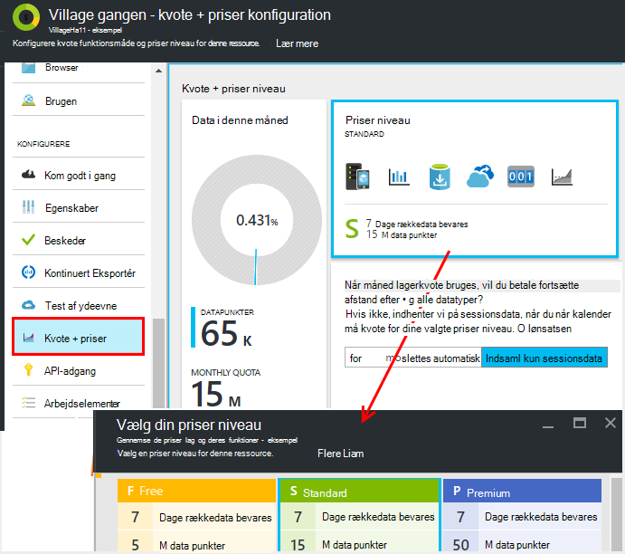
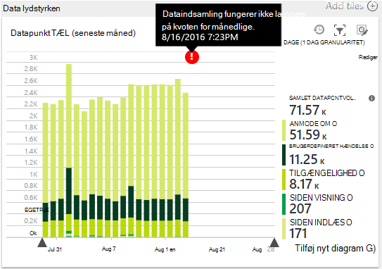
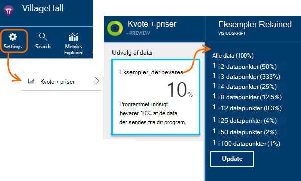
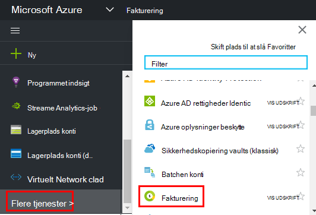

<properties 
    pageTitle="Administrere priser og kvote for programmet indsigt | Microsoft Azure" 
    description="Vælge pris plan, skal du administrere telemetri enheder" 
    services="application-insights" 
    documentationCenter=""
    authors="alancameronwills" 
    manager="douge"/>

<tags 
    ms.service="application-insights" 
    ms.workload="tbd" 
    ms.tgt_pltfrm="ibiza" 
    ms.devlang="na" 
    ms.topic="article" 
    ms.date="10/13/2016" 
    ms.author="awills"/>

# Administrere priser og kvote for programmet indsigt

*Programmet indsigt er i Vis udskrift.*

[Priser] [ pricing] til [Visual Studio programmet indsigt] [ start] er baseret på den mængde data i programmet. Der findes et omfattende gratis trin, hvor du får de fleste funktioner med nogle begrænsninger.

Hver programmet indsigt ressource faktureres som en separat tjeneste, og bidrager til faktura til dit abonnement på Azure.

[Se priser skemaet][pricing].

## Gennemgå kvote og pris plan for dit program indsigt ressource

Du kan åbne kvoten + priser blade fra programmet ressourcens indstillinger.

Valget af priser farveskema påvirker:

* [Månedlig kvote](#monthly-quota) - mængden af telemetri, kan du analysere hver måned.
* [Data rate](#data-rate) - den maksimale hastighed, hvormed dataene fra din app kan behandles.
* [Fortløbende eksportere](#continuous-export) – om du kan eksportere data til andre værktøjer og -tjenester.

Disse begrænsninger angives separat for hver programmet indsigt ressource.

### Gratis prøveversion af Premium

Når du opretter en ny programmet indsigt ressource, starter den i det gratis niveau.

Du kan skifte til den 30-dages gratis Premium prøveversion når som helst. Det giver dig fordelene ved Premium niveau. Efter 30 dage, det vil automatisk blive konverteret til den klasse, du var i før -, medmindre du eksplicit vælge et andet niveau. Du vælger det niveau, du vil have når som helst i prøveperioden, men du stadig får vist den gratis prøveversion indtil slutningen af perioden 30 dage.

## Månedlig kvote

* I hver måned i kalender, kan dit program sende til et angivet antal telemetri til programmet indsigt. Kvoten for det gratis priser niveau er i øjeblikket 5 millioner data for hver måned og væsentligt mere til de andre farveskemaer Du kan købe flere, hvis du når kvoten.  Se den [priser farveskema] [ pricing] for de faktiske tal. 
* Kvoten for afhænger af det priser niveau, du har valgt.
* Kvoten for tælles fra midnat UTC på den første dag i hver måned.
* Data punkter diagram viser, hvor meget af kvoten er blevet brugt af denne måned.
* Kvoten for måles i *datapunkter.* Et enkelt datapunkt er et opkald til en af Registrer metoderne, uanset om kaldet eksplicit i din kode eller af en af de almindelige telemetri moduler. Det kan have flere vedhæftede egenskaber og målepunkter.
* Datapunkter der genereres af:
 * [SDK moduler](app-insights-configuration-with-applicationinsights-config.md) , der automatisk indsamle data, for eksempel at rapportere en anmodning om eller går ned eller til at måle ydeevne.
 * [API](app-insights-api-custom-events-metrics.md) `Track...` opkald, du har skrevet, såsom `TrackEvent` eller `trackPageView`.
 * [Tilgængelighed web test](app-insights-monitor-web-app-availability.md) , som du har konfigureret.
* Mens du fejlfinding, kan du se datapunkter, der sendes fra din app i Visual Studio output-vinduet. Klient begivenheder kan ses ved at åbne fanen netværk i din browser er fejlfinding ruden (som regel F12).
* *Sessionsdata* tælles ikke med i kvoten. Dette omfatter optællinger for de brugere, sessioner, miljø og enhedsdata.
* Hvis du vil tælle op datapunkter ved undersøgelsen, kan du finde dem på forskellige steder:
 * Hvert element, du ser i [diagnosticering søgning](app-insights-diagnostic-search.md), som indeholder HTTP-anmodninger, undtagelser, log sporinger, sidevisninger, afhængighed begivenheder og brugerdefinerede hændelser.
 * Hver rå måling af en [metrikværdi](app-insights-metrics-explorer.md) som en ydeevne tæller. (De punkter, du kan se på diagrammerne er som regel samlinger af flere rækkedata punkter).
 * Hvert punkt i et web tilgængelighed diagram er også et aggregat flere datapunkter.
* Du kan også kontrollere individuelle datapunkter på kilde under fejlfinding:
 * Hvis du kører din app i fejlsikret tilstand i Visual Studio, registreres datapunkterne i vinduet Output. 
 * Åbn din browser fejlfinding ruden (som regel F12) for at få vist klient datapunkter, og Åbn fanen netværk.
* Data rente reduceres (som standard) ved [tilpasset stikprøver](app-insights-sampling.md). Dette betyder, at, som brugen af din app øger telemetri rente ikke øges som nogenlunde samme måde som du måske havde forventet.

### Overskud

Hvis dit program sender mere end kvoten for månedlige, kan du:

* Betale for yderligere data. Se den [priser farveskema] [ pricing] få mere at vide. Du kan vælge denne indstilling i forvejen. Denne indstilling er ikke tilgængelig i den gratis priser niveau.
* Opgradere din priser niveau.
* Ikke gøre noget. Sessionsdata fortsat registreres, men andre data vises ikke i diagnosticering Søg eller målepunkter Stifinder.

## Hvor meget data sender jeg?

Diagrammet i bunden af den priser blade viser programmets data punkt beholdning, grupperet efter punkt datatype. (Du kan også oprette dette diagram i metrisk Explorer).

Klik på diagrammet for at få flere detaljer, eller træk hen over den, og klik på (+) for at få detaljer for et tidsinterval.

Diagrammet viser mængden data, der modtages på tjenesten programmet indsigt efter [udvalg](app-insights-sampling.md).

Hvis data lydstyrken når kvoten månedlige, vises en anmærkning i diagrammet.

## Data rente

Ud over kvoten for månedlige er der variere den benyttede begrænsninger på data rente. Til den gratis [priser niveau] [ pricing] grænsen er 200 data punkter/andet gennemsnit over 5 minutter, og for den betalte tiers den er 500/s gennemsnit over 1 minut. 

Der er tre filsæt som tælles separat:

* [TrackTrace opkald](app-insights-api-custom-events-metrics.md#track-trace) og [hentes logfiler](app-insights-asp-net-trace-logs.md)
* [Undtagelser](app-insights-api-custom-events-metrics.md#track-exception), som begrænset til 50 punkter/s.
* Alle andre telemetri (sidevisninger sessioner anmodninger, afhængigheder, målepunkter, brugerdefinerede hændelser, og web testresultater).

*Hvad sker der, hvis min app overstiger den hastighed per sekund?*

* Mængden data, der sender din app vurderes hvert minut. Hvis den overstiger den per sekunders rente gennemsnit over minuttet, afviser serveren nogle anmodninger. SDK placerer dataene og derefter forsøger at sende igen, sprede en beskyttelse ud over nogle minutter. Hvis din app sender konsekvent data over den variere den benyttede rente, fjernes nogle data. (ASP.NET, Java og JavaScript SDK'er forsøger at sende igen på denne måde, andre SDK'er kan blot slip begrænset data).

Hvis (throttling) opstår, får du vist en advarsel om, at dette er sket meddelelse.

*Hvordan ved jeg, hvor mange datapunkter, der bruges til at sende min app?*

* Åbn indstillinger/kvote og priser for at få vist Data lydstyrken diagrammet.
* Eller målepunkter Stifinder, tilføje et nyt diagram og vælge **datapunkt lydstyrken** som dens metrisk. Skifte til gruppering og gruppere efter **datatype**.

## Du kan reducere dine data rente

Hvis du støder på variere den benyttede begrænsningerne, er her nogle ting, du kan gøre:

* Brug [udvalg](app-insights-sampling.md). Denne teknologi reducerer data rente uden giver et forvrænget billede din målepunkter og uden at forstyrre muligheden for at navigere mellem relaterede elementer på Søg.
* [Begrænse antallet af Ajax opkald, der kan rapporteres](app-insights-javascript.md#detailed-configuration) i hver sidevisning eller skifte fra Ajax rapportering.
* Skifte fra samling moduler, ikke behøver du ved at [redigere ApplicationInsights.config](app-insights-configuration-with-applicationinsights-config.md). For eksempel kan du beslutter, der inessential tællere i ydeevne eller afhængighed data.
* Udfyldt sammenlægge målepunkter. Hvis du har indsat opkald til TrackMetric i din app, kan du reducere trafik ved hjælp af overbelastning, der accepterer din beregning af gennemsnitlige og standardafvigelsen for en mængde mål. Eller du kan bruge en [udfyldt samle pakke](https://www.myget.org/gallery/applicationinsights-sdk-labs). 

## Udvalg

[Indsamle](app-insights-sampling.md) er en metode til at reducere den rente, hvormed telemetri sendes til din app, mens du stadig bevares mulighed for at finde relaterede hændelser under diagnosticering søgninger og stadig bevares korrekte begivenhed tæller. 

Stikprøver, hvor der er en effektiv måde til at reducere gebyrer og blive i den månedlige lagerkvote. Algoritmen udvalg bevarer relaterede elementer af telemetri, så, f.eks, når du bruger Søg, du kan finde din anmodning, der er relateret til en bestemt undtagelse. Algoritmen bevarer også korrekte tæller, så du kan se de korrekte værdier i metrisk Explorer til anmodning om satser, undtagelse satser og andre tæller.

Der findes flere former for udvalg.

* [Tilpasset stikprøver, hvor der](app-insights-sampling.md) er standard for ASP.NET SDK, som automatisk justeres til mængde telemetri, der sender din app. Det fungerer automatisk i SDK i din online, så telemetri trafikken på netværket er reduceret. 
* *Indtagelse udvalg* er en alternativ tekst, der fungerer på det sted, hvor telemetri fra din app indtaster tjenesten programmet indsigt. Den påvirker ikke mængde telemetri, der sendes fra din app, men det reducerer lydstyrken bevares af tjenesten. Du kan bruge det til at reducere kvoten for bruges af telemetri fra browsere og andre SDK'er.

For at angive indtagelse udvalg skal du angive kontrolelementet i kvoterne + priser blade:

> [AZURE.WARNING] Den værdi, der vises under feltet eksempler bevares angiver kun den værdi, du har angivet for indtagelse udvalg. Det vises ikke den udvalg rente, der kører på SDK i din app. 
> 
> Hvis den indgående telemetri er allerede udtaget på SDK, anvendes ikke indtagelse udvalg.
 
Hvis du vil finde den faktiske udvalg rente uanset hvor det er anvendt, ved at bruge en [Analytics forespørgsel](app-insights-analytics.md) som dette:

    requests | where timestamp > ago(1d)
  	| summarize 100/avg(itemCount) by bin(timestamp, 1h) 
  	| render areachart 

Bevares i hver post, `itemCount` angiver antallet oprindelige poster, der repræsenterer det, lig med 1 + antallet af forrige kasseret poster. 

## Gennemse faktura til dit abonnement på Azure

Programmet indsigt gebyrer føjes til din Azure faktura. Du kan se oplysningerne om din Azure stykliste på sektionen fakturering i portalen Azure eller [Azure fakturering Portal](https://account.windowsazure.com/Subscriptions). 

## Begrænsninger for navn

1.  Maksimalt 200 entydige metriske navne og 200 entydige egenskab for dit program. Målepunkter omfatter data, der sendes via TrackMetric samt målinger på andre datatyper som begivenheder.  [Målepunkter og egenskaben navne] [ api] er globale per instrumentation nøgle.
2.  [Egenskaber for] [ apiproperties] kan bruges til filtrering og Gruppér efter-kun, når de har mindre end 100 entydige værdier for hver egenskab. Når 100 er større end antallet af entydige værdier, kan du stadig søge egenskaben, men ikke længere bruge det til filtre eller Gruppér efter.
3.  Standardegenskaber som anmode om navn og URL-adressen er begrænset til 1000 entydige værdier om ugen. Når 1000 entydige værdier, er flere værdier markeret som "Andre værdier." De oprindelige værdier kan stadig bruges til søgning i hele teksten og filtrering.

Hvis du finder dit program er overstiger disse begrænsninger, kan du overveje opdeling af dine data mellem forskellige instrumentation taster – det vil sige, [oprette nye programmet indsigt ressourcer](app-insights-create-new-resource.md) og sende nogle af dataene til de nye instrumentation nøgler. Du kan finde, resultatet er struktureret bedre. Du kan bruge [dashboards](app-insights-dashboards.md#dashboards) til at hente de forskellige måleenheder på samme skærmen, så denne metode ikke begrænse din mulighed for at sammenligne forskellige måleenheder. 

## Begrænsninger for oversigt

[AZURE.INCLUDE [application-insights-limits](../../includes/application-insights-limits.md)]

<!--Link references-->

[api]: app-insights-api-custom-events-metrics.md
[apiproperties]: app-insights-api-custom-events-metrics.md#properties
[start]: app-insights-overview.md
[pricing]: http://azure.microsoft.com/pricing/details/application-insights/

 