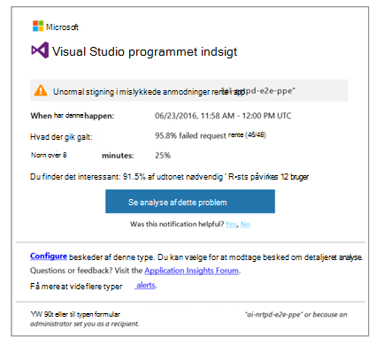
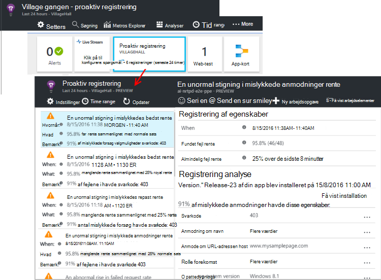

<properties 
    pageTitle="Proaktiv diagnosticering i programmet indsigt | Microsoft Azure" 
    description="Programmet indsigt udfører automatisk deep analyse af din app telemetri og advarer dig om potentielle problemer." 
    services="application-insights" 
    documentationCenter="windows"
    authors="rakefetj" 
    manager="douge"/>

<tags 
    ms.service="application-insights" 
    ms.workload="tbd" 
    ms.tgt_pltfrm="ibiza" 
    ms.devlang="na" 
    ms.topic="article" 
    ms.date="08/15/2016" 
    ms.author="awills"/>

#  Proaktiv diagnosticering i programmet indsigt

 Proaktiv diagnosticering advarer automatisk dig om potentielle problemer med ydeevnen i dit webprogram. Smart analyse af telemetri, som sender din app til [Visual Studio programmet indsigt](app-insights-overview.md)udfører. Hvis der er en pludselig stigning i manglende satser eller unormal mønstre i klient- eller ydeevne, får du en besked. Denne funktion kræver ingen konfiguration. Det fungerer, hvis dit program sender nok telemetri.

Du kan få adgang til proaktiv registrering påmindelser både fra de e-mails, du modtager og fra bladet proaktiv registrering.

## Gennemse dine proaktiv registreringer

Du kan finde registreringer på to måder:

* **Du modtager en mail** fra programmet indsigt. Her er en typisk eksempel:

    

    Klik på knappen for at åbne flere detaljer i portalen.

* **Feltet proaktiv registrering af flisen** på din app oversigt blade viser en optælling af nye beskeder. Klik på feltet for at få vist en liste over seneste beskeder.

Vælg en besked til at se detaljerne.

## Hvilke problemer der registreres?

Der findes tre typer registrering:

* [Proaktiv manglende rente diagnosticering](app-insights-proactive-failure-diagnostics.md). Vi bruger maskine lære at angive det forventede antal mislykkede anmodninger for din app samkøres med indlæsning og andre faktorer. Hvis den manglende rente går uden for det forventede konvolut, sender vi en besked.
* [Proaktiv ydeevne diagnosticering](app-insights-proactive-performance-diagnostics.md). Vi søge efter uoverensstemmende mønstre i svar gange og manglende satser hver dag. Vi koordinere disse problemer med egenskaber som placering, browser, klienten OS, server-forekomst og tidspunkt på dagen.
* [Azure Cloud Services](https://azure.microsoft.com/blog/proactive-notifications-on-cloud-service-issues-with-azure-diagnostics-and-application-insights/). Du kan få beskeder, hvis din app er hostet i Azure Cloud Services og en forekomst af rolle har følgende mislykkede forsøg på Start, hyppige genbrug eller runtime går ned.

(Hjælp-links i hver meddelelse fører dig til de relevante artikler.)

## Næste trin

Disse værktøjer til diagnosticering hjælpe dig med at undersøge telemetri fra din app:

* [Metriske explorer](app-insights-metrics-explorer.md)
* [Søg explorer](app-insights-diagnostic-search.md)
* [Analytics - effektive forespørgselssprog](app-insights-analytics-tour.md)

Proaktiv diagnosticering er helt automatisk. Men måske du gerne vil konfigurere nogle flere beskeder?

* [Manuelt konfigureret metriske beskeder](app-insights-alerts.md)
* [Tilgængelighed web test](app-insights-monitor-web-app-availability.md) 

