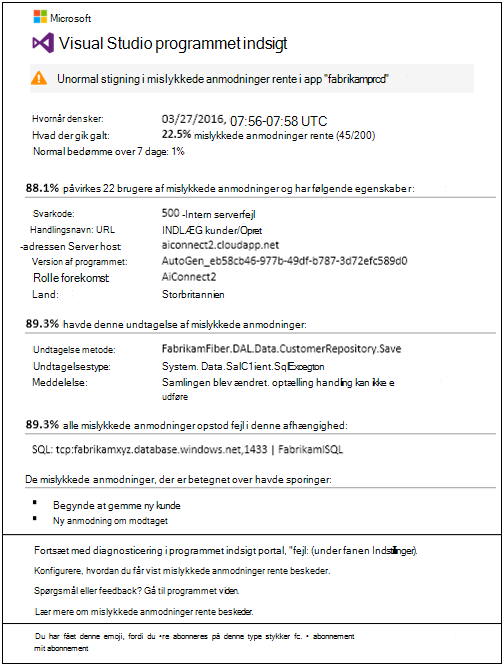
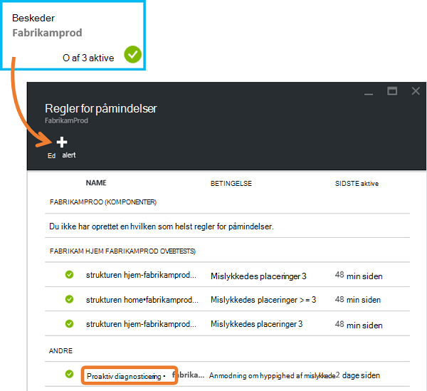
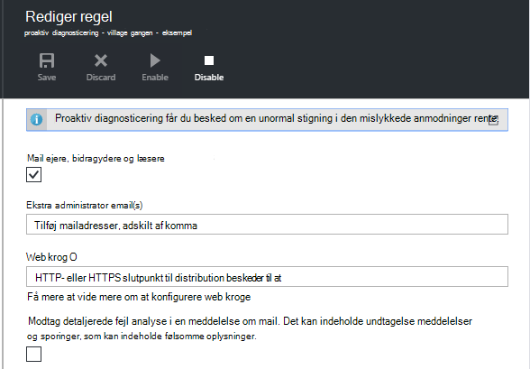
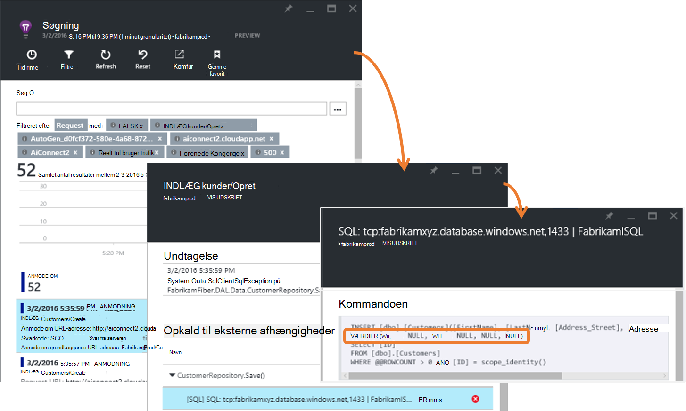
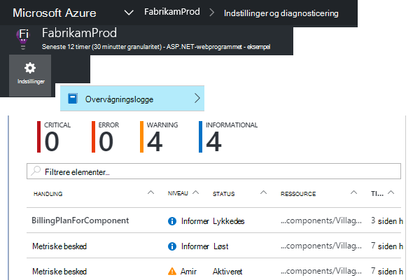
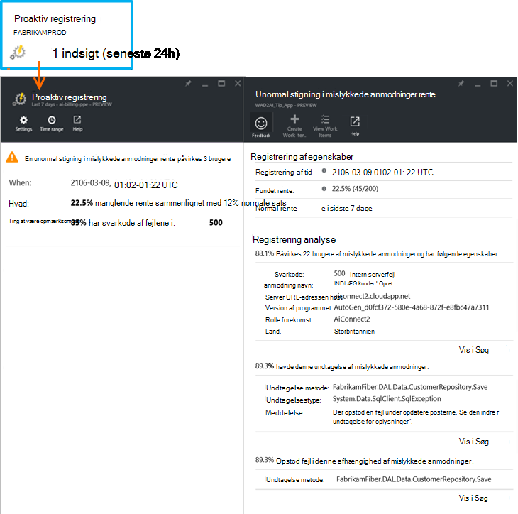

<properties 
    pageTitle="Proaktiv manglende rente diagnosticering i programmet indsigt | Microsoft Azure" 
    description="Giver dig besked om usædvanlige ændringer i antal mislykkede anmodninger til din online, og giver diagnosticering analyse. Der kræves ingen konfiguration." 
    services="application-insights" 
    documentationCenter=""
    authors="yorac" 
    manager="douge"/>

<tags 
    ms.service="application-insights" 
    ms.workload="tbd" 
    ms.tgt_pltfrm="ibiza" 
    ms.devlang="na" 
    ms.topic="article" 
    ms.date="10/12/2016" 
    ms.author="awills"/>
 
# Proaktiv manglende rente diagnosticering

[Visual Studio programmet indsigt](app-insights-overview.md) automatisk giver dig besked i nær realtid Hvis din online har en unormal stigning i frekvens for fejl. Det registrerer en usædvanlige stigning i hastigheden på HTTP-anmodninger rapporteret mislykkedes. Disse er som regel dem med svarkoder i 400 - og 500-områder. For at hjælpe dig med at prioritere og diagnosticere problemet, findes en analyse af mislykkede anmodninger og relaterede telemetri karakteristika i meddelelsen. Der er også links til portalen programmet indsigt til yderligere diagnosticering. Funktionen kræver ingen konfiguration eller konfiguration, som machine learning algoritmer bruges til at forudsige den normale manglende rente.

Denne funktion virker til Java og ASP.NET web apps, hostet i skyen eller på din egen servere. Det fungerer også for en app, som genererer anmodning telemetri – for eksempel, hvis du har en kollega rolle, som kalder [TrackRequest()](app-insights-api-custom-events-metrics.md#track-request). 

Når konfiguration af [Programmet indsigt til dit projekt](app-insights-overview.md), og fået din app genereres et bestemt minimum af telemetri, proaktiv manglende diagnosticering træder 24 timer for at få mere for at vide normal funktionsmåden for din app, før den er aktiveret og kan sende beskeder.

Her er et eksempel på en skrivebordsbesked. 

> [AZURE.NOTE] Som standard får du en kortere format mail end i dette eksempel. Men du kan [skifte til dette detaljerede format](#configure-alerts).

Bemærk, at det fortæller dig:

* Den manglende rente sammenlignet med normal app funktionsmåde.
* Hvor mange brugere påvirkes – så du ved, hvor meget at bekymre dig.
* Et karakteristisk mønster, der er knyttet til de mislykkede forsøg. I dette eksempel er der et bestemt svarkode, anmodning navn (operationen) og app-version. Det fortæller du straks hvor skal begynde at søge i din kode. Andre muligheder kan være et bestemt browser eller klient-operativsystem.
* Den undtagelse, log sporinger og afhængighed fejl (databaser eller andre eksterne komponenter), der ser ud til at være knyttet til de karakteriserede mislykkede anmodninger.
* Links til relevante søgninger på telemetri i programmet indsigt direkte.

## Fordele ved proaktiv beskeder

Almindelige [metriske beskeder](app-insights-alerts.md) fortæller dig, der kan være et problem. Men proaktiv manglende diagnosticering starter diagnosticering arbejdet for dig ved at udføre en masse analysen du ellers ville have til at gøre dig selv. Du får de resultater, pænt pakket, så du kan komme hurtigt i roden af problemet.

## Sådan fungerer det

I nærheden af realtid proaktiv diagnosticering skærme modtaget på telemetri fra din app, og særlig mislykkede anmodninger rente. Denne metrikværdi tæller antallet af anmodninger, den `Successful request` egenskab er falsk. Som standard `Successful request== (resultCode < 400)` (medmindre du har skrevet brugerdefineret kode til at [filtrere](app-insights-api-filtering-sampling.md#filtering) eller oprette dine egne [TrackRequest](app-insights-api-custom-events-metrics.md#track-request) opkald). 

Din app ydeevnen har en typisk anvendelse af funktionsmåde. Nogle anmodninger vil være mere giver risiko for fejl end andre; og den samlede manglende hastighed kan gå op som Indlæs øges. Proaktiv manglende diagnosticering bruger maskine lære at finde disse afvigelser. 

Som telemetri kommer til programmet indsigt fra din online, sammenligner proaktiv manglende diagnosticering aktuelle funktionsmåden med mønstre set over de seneste par dage. Hvis en unormal stigning i manglende rente strækker sig over sammenligning med forrige ydeevne, udløses en analyse.

Når en analyse udløses, udfører en klynge analyse på mislykkedes anmodningen, kan du prøve at identificere et mønster med værdier, der beskrive fejlene i tjenesten. I det foregående eksempel har analysen opdaget, er de fleste fejl om et bestemt Resultatkode, anmodning om navn, URL-adressen Server host og rolle forekomst. Derimod har analysen opdaget, egenskaben klient operativsystem er fordelt over flere værdier, og så det ikke er anført.

Når din tjeneste er udstyret med disse telemetri, finder analysatoren en undtagelse og en afhængighed-fejl, der er knyttet til anmodninger i klynge den har identificeret, sammen med et eksempel på en hvilken som helst spore logfiler, der er knyttet til disse anmodninger.

Den resulterende analysis er sendt til dig som sikkerhedsmeddelelsen, medmindre du har konfigureret det ikke til.

Som [du manuelt angive beskeder](app-insights-alerts.md), kan du undersøge tilstanden for den vigtige besked og Konfigurer den i bladet beskeder for dit program indsigt ressource. Men i modsætning til andre beskeder, du behøver ikke at oprette eller konfigurere proaktiv manglende diagnosticering. Hvis du vil, kan du deaktivere den eller ændre dens mål mailadresser.

## Konfigurere beskeder 

Du kan deaktivere proaktiv diagnosticering, ændre e-mail-modtagere, oprette en webhook eller vælge flere vigtige beskeder.

Åbn siden beskeder. Proaktiv diagnosticering er inkluderet sammen med påmindelser, du har angivet manuelt, og du kan se, om det er i øjeblikket i tilstanden besked.

Klik på beskeden for at konfigurere den.

Meddelelse om, at du kan deaktivere proaktiv diagnosticering, men du kan ikke slette den (eller oprette en anden).

#### Detaljeret beskeder

Hvis du vælger "Modtage detaljeret analyse" indeholder e-mailen flere diagnostiske oplysninger. Nogle gange vil du kunne diagnosticere problemet lige fra dataene i mailen. 

Der er mindre risiko, mere detaljerede beskeden kan indeholde følsomme oplysninger, fordi den indeholder undtagelse og sporing meddelelser. Men dette vil kun ske, hvis din kode kan tillade følsomme oplysninger i disse meddelelser. 

## Triaging og diagnosticering en besked

En advarsel angiver, at en unormal stigning i den mislykkede anmodninger rente blev fundet. Det er sandsynligvis, at der er et problem med din app eller dens miljø.

Du kan bestemme, hvordan hastende problemet bliver fra procentdelen af anmodninger om og antallet af brugere, der berøres. I det foregående eksempel den manglende rente 22,5% sammenlignet med en normal sats på 1%, angiver, at noget forkert der foregår. På den anden side blev kun 11 brugere påvirket. Hvis det var din app, vil du kunne vurdere, hvor alvorligt, der er.

I mange tilfælde vil du kunne diagnosticere problemet hurtigt fra anmodning om navn, undtagelse, afhængighed systemfejl og sporing data, der leveres. 

Der er nogle andre tegn. For eksempel er afhængighed manglende rente i dette eksempel den samme som den undtagelse rente (89.3%). Dette foreslår, at undtagelsen opstår direkte fra afhængighed fejl – hvorved du får en Ryd ide om, hvor du vil begynde at søge i din kode.

Hvis du vil undersøge yderligere, kommer linkene i hver sektion du direkte til en [søgeside](app-insights-diagnostic-search.md) filtreret, så den relevante serviceanmodninger, undtagelse, afhængighed eller spor. Eller du kan åbne [Azure-portalen](https://portal.azure.com), gå til programmet indsigt ressourcen for din app og åbne bladet mislykkede forsøg.

I dette eksempel klikker på linket 'Få vist oplysninger om afhængighed mislykkede forsøg på' åbnes programmet indsigt Søg blade på SQL-sætningen med den egentlige årsag: null-værdier, hvor det er angivet i obligatoriske felter og ikke består validering under Gem handling.

## Gennemse seneste beskeder

Åbn **Indstillinger for overvågningslogge**for at få vist beskeder i portalen.

Klik på en besked for at se den fulde detaljer.

Eller klik på **proaktiv registrering** , der kan gå direkte til den seneste besked:

## Hvad er forskellen...

Proaktiv manglende rente diagnosticering supplerer andre lignende men forskellige funktioner i programmet indsigt. 

* [Metrisk beskeder](app-insights-alerts.md) er angivet af dig og kan overvåge en lang række målepunkter som CPU ibrugtagning, anmodning om satser, sideindlæsningstider og så videre. Du kan bruge dem til at advare dig, f.eks, hvis du vil tilføje flere ressourcer. Proaktiv manglende diagnosticering dækker derimod et lille område af kritiske målepunkter (i øjeblikket kun mislykkede anmodninger rente), udviklet til at informere dig i nær realtid måde, når din online mislykkedes anmode om rente øges betydeligt sammenlignet med normal funktionsmåde for WebApp.

    Proaktiv manglende rente diagnosticering justerer automatisk dens grænseværdi som svar på gældende betingelser.

    Proaktiv manglende rente diagnosticering starter diagnosticering arbejdet for dig. 
* [Proaktiv ydeevne diagnosticering](app-insights-proactive-performance-diagnostics.md) bruger også maskine intelligence til at opdage usædvanlige mønstre i din målepunkter, og der kræves ingen konfiguration af dig. Men i modsætning til proaktiv manglende rente diagnosticering er formålet med proaktiv ydeevne diagnosticering til at finde segmenter af din brugen manifold, der kan være forkert fungeret – for eksempel som bestemte sider på en bestemt type browser. Analysen udføres dagligt, og hvis der findes et resultat, er det sandsynligvis er meget mindre hastende end en besked. Derimod analysen til proaktiv manglende diagnosticering udføres løbende på indgående telemetri, og du får besked i minutter, hvis serveren manglende satser er større end forventet.

## Hvis du modtager en proaktiv manglende rente diagnosticering besked

*Hvorfor har jeg har modtaget denne besked?*

*   Vi har fundet en unormal stigning i mislykkede anmodninger tilvækst i sammenligning med normal grundlinjen af den foregående periode. Efter analysen af mislykkede forsøg og tilknyttede telemetri mener vi, at der er et problem, skal du kigge i. 

*Betyder meddelelsen jeg helt har et problem?*

*   Vi kan du prøve at give besked om på app afbrydelser eller er forringet, selvom kun du kan fuldt forstå semantikken og påvirkningen app eller brugere.

*Så du teamet se mine data?*

*   Nej. Tjenesten er helt automatisk. Du får kun i meddelelser. Dine data er [private](app-insights-data-retention-privacy.md).

*Har jeg abonnere på denne besked?* 

*   Nej. Hver programmet afsendelse anmodning om telemetri har beskeder om reglen.

*Kan jeg opsige abonnementet eller få de meddelelser, der er sendt til mine kolleger i stedet?*

*   Regler for i påmindelser, klik på Ja, proaktiv diagnosticering regel til at konfigurere den. Du kan deaktivere beskeden, eller du kan ændre modtagere til beskeden. 

*Jeg har mistet e-mailen. Hvor kan jeg finde i meddelelser i portalen?*

*   I overvågningslogge. Klik på indstillinger, overvågningslogge, og derefter en besked for at få vist dets forekomst, men med begrænset detaljeret visning.

*Nogle af de vigtige beskeder er over kendte problemer, og jeg ønsker ikke at få dem.*

*   Vi har beskeder om bekæmpelse på vores ordrebeholdningen.

## Næste trin

Disse værktøjer til diagnosticering hjælpe dig med at undersøge telemetri fra din app:

* [Metriske explorer](app-insights-metrics-explorer.md)
* [Søg explorer](app-insights-diagnostic-search.md)
* [Analytics - effektive forespørgselssprog](app-insights-analytics-tour.md)

Proaktiv registreringer er helt automatisk. Men måske du gerne vil konfigurere nogle flere beskeder?

* [Manuelt konfigureret metriske beskeder](app-insights-alerts.md)
* [Tilgængelighed web test](app-insights-monitor-web-app-availability.md) 

