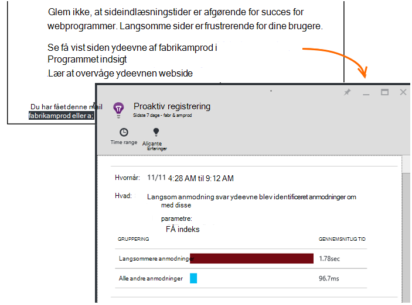

<properties 
    pageTitle="Programmet indsigt: Proaktiv ydeevne diagnosticering | Microsoft Azure" 
    description="Programmet indsigt udfører deep analyse af din app telemetri og advarer dig om potentielle problemer." 
    services="application-insights" 
    documentationCenter="windows"
    authors="antonfrMSFT" 
    manager="douge"/>

<tags 
    ms.service="application-insights" 
    ms.workload="tbd" 
    ms.tgt_pltfrm="ibiza" 
    ms.devlang="na" 
    ms.topic="article" 
    ms.date="08/31/2016" 
    ms.author="awills"/>

#  Proaktiv ydeevne diagnosticering

*Programmet indsigt er i Vis udskrift.*

[Visual Studio programmet indsigt](app-insights-overview.md) udfører deep analyse af din app telemetri og kan advare dig om potentielle problemer med ydeevnen. Du sandsynligvis læse dette, fordi du har modtaget en af vores proaktiv beskeder via mail. 

Denne funktion kræves ikke nogen opsætning og er automatisk aktivt, når din app genereres nok telemetri.

## Hvad er proaktiv ydeevne diagnosticering?

Proaktiv ydeevne diagnosticering opdager usædvanlige mønstre af ydeevne i din app, ved at analysere telemetri, som sender din app til programmet indsigt. 

Det finder især problemer med ydeevnen, der påvirker kun nogle af dine brugere eller kun påvirke brugere i nogle tilfælde.

For eksempel den kan give dig besked, hvis din app-sider indlæse meget langsommere på en type webbrowser end andre, eller hvis anmodninger der leveres langsommere fra en bestemt server. Det kan også finde problemer i forbindelse med kombinationer af egenskaber, som langsom siden indlæses i et geografisk område på bestemte tidspunkter på dagen.

Afvigelser som disse er meget svært at registrere ved at undersøge dataene, men er mere almindelig, end du tror. Ofte de kun grundflade, når dine kunder klager. På dette tidspunkt, det er for sent: de brugere, der påvirkes allerede skifter til dine konkurrenter!

I øjeblikket, se vores algoritmer på sideindlæsningstider, anmodning om svar klokkeslæt på serveren og afhængighed svar gange.  

Du behøver ikke at angive en hvilken som helst tærskler eller konfigurere regler. Maskine læring og data miningalgoritmer, der bruges til at registrere unormal mønstre. 

Vi er meget rundvisningen har din feedback. At fortælle os, hvordan det kan du, hvordan vi kan forbedre proaktiv registrering, og hvilke yderligere funktioner du have os til at tilføje. Du kan give feedback til Send en glad/sur smiley i portalen eller sende os til at AppInsightsML@microsoft.com. 

## Om proaktiv påmindelsen

* *Hvorfor har jeg har modtaget denne mail?*
 * Proaktiv registrering analysere telemetri dit program, der er sendt til programmet indsigt og registreret problemer med ydeevnen i dit program. 
* *Betyder meddelelsen jeg helt har et problem?*
 * Nej. Det er blot et forslag om noget, kan du vil se nærmere på mere. 
* *Hvad skal jeg gøre?*
 * [Se på de data, der præsenteres](#responding-to-an-alert). Bruge målepunkter Stifinder til at gennemse ydeevnen over tid og analysere i flere målepunkter. Brug Søg til at filtrere bestemte hændelser, der hjælper dig med at identificere den egentlige årsag. 
* *Så du teamet se mine data?*
 * Nej. Tjenesten er helt automatisk. Du får kun i meddelelser. Dine data er [private](app-insights-data-retention-privacy.md).

## Registreringsprocessen

* *Hvilke typer af ydeevnen afvigelser er fundet?*
 * Mønstre, som du vil finde den tidskrævende at kontrollere til dig selv. For eksempel dårlig ydeevne i en bestemt kombination af placering, tidspunktet på dagen og platform.
* *Du analysere alle de data, der indsamles via programmet indsigt?*
 * Ikke på nuværende tidspunkt. I øjeblikket, analysere vi anmodning om svartid, afhængighed svartid og siden indlæse tid. Analyse af flere statistikker kommer snart. 
* *Kan jeg oprette mit eget anomali regler for registrering af?*
 * Ikke endnu. Men det kan du:
 * [Konfigurere beskeder](app-insights-alerts.md) , der fortæller, når en metrikværdi krydser en grænse).
 * [Eksportere telemetri](app-insights-export-telemetry.md) til en [database](app-insights-code-sample-export-sql-stream-analytics.md) eller [til PowerBI](app-insights-export-power-bi.md) eller [andre](app-insights-code-sample-export-telemetry-sql-database.md) funktioner, hvor du kan analysere det selv.
* *Hvor ofte udføres analysen?*
 * Vi køre analysen dagligt på telemetri fra den forrige dag.
* * Så erstatter dette [metriske beskeder](app-insights-alerts.md)?
 * Nej.  Vi Bekræft ikke for at registrere hver adfærd, som du kan overveje at unormale.

## Sådan Undersøg problemer opløftet

Åbn rapporten diagnosticering fra mailen eller fra listen afvigelser.

* **Når** du viser den tid, problemet, der blev registreret.
* Beskriver, **hvilke**
 * Det problem, der blev registreret
 * Egenskaberne for rækken hændelser, vi fandt vises problemet.
* Tabellen sammenligner sættet dårligt udføre med funktionen gennemsnit af alle andre begivenheder.

Klik på linkene for at åbne metrisk Stifinder og søge i relevante rapporter, filtreret efter dato og egenskaber for sættet langsom ydeevne.

Redigere tidsinterval og filtre til at udforske telemetri.

## Hvordan kan jeg forbedre ydeevnen?

Langsom og mislykkede svar er en af de største frustrations for brugere af websteder, som du kender fra din egen oplevelse. Så er det vigtigt at løse problemerne.

### Nu

Først, betyder det noget? Hvis en side altid er langsom, men kun 1% af webstedets brugere har nogensinde før at kigge på den, måske har du flere vigtige ting at huske på. Hvis der kun 1% af brugere, åbne den, men den viser undtagelser hver gang, kan, på den anden side være værd at undersøge.

Bruge sætningen virkning i mails som en generel vejledning, men vær opmærksom på, at den ikke hele historien. Indsaml anden dokumentation for at bekræfte.

Overvej at parametrene for problemet. Hvis det er afhængige af Geografi, konfigurere [tilgængelighed test](app-insights-monitor-web-app-availability.md) , herunder denne region: der kan blot være netværksproblemer i det pågældende område. 

### Diagnosticere langsom siden indlæses 

Hvor er problemet? Er serveren reagerer langsomt, er siden meget lang, eller har browseren til at gøre en masse arbejde at få den vist?

Åbn bladet browsere metriske. De [segmenteret visningen af browseren siden indlæsningstiden](app-insights-javascript.md#explore-your-data) viser, hvor tid der skal. 

* Hvis **Send anmodning om tid** er høj, serveren svarer langsomt, eller anmodningen er et indlæg med en stor mængde data. Se på [ydeevne målepunkter](app-insights-web-monitor-performance.md#metrics) for at undersøge svar gange. 
* Konfigurere [afhængighed sporing](app-insights-dependencies.md) til at se, om omstændelige er på grund af eksterne services eller din database.
* Hvis **Modtage svar** er primært, er din side og dens afhængige dele - JavaScript, CSS, billeder og så videre (men ikke asynkront indlæst data) lange. Konfigurere en [tilgængelighed test](app-insights-monitor-web-app-availability.md), og Sørg for at angive indstillingen for at indlæse afhængige dele. Når du får nogle resultater, Åbn oplysninger om et resultat, og udvid den for at se indlæsningstider forskellige filer.
* Høj **behandling af klienten tid** foreslår scripts kører langsomt. Hvis årsagen ikke indlysende, skal du overveje at føje tidsindstilling kode og sende klokkeslæt i trackMetric opkald.

### Forbedre langsomme sider

Der er et websted, der er fyldt med gode råd om forbedring af din server svar og sideindlæsningstider, så vi ikke kan forsøger at gentage det hele her. Her er nogle tip, som du formentlig allerede vide om, så du tænker kan komme:

* Langsom indlæsning på grund af store filer: indlæse scriptene og andre dele asynkront. Brug af script samler. Opdele hovedsiden i knapper, der indlæser deres data separat. Send ikke almindelig gamle HTML for lange tabeller: Brug et script til at anmode om dataene som JSON eller et andet kompakt format, og derefter udfylde tabellen i stedet. Der er gode rammer, der kan hjælpe dig med alt dette. (De også kan medføre stor scripts, naturligvis.)
* Sænke server afhængigheder: Overvej geografiske placeringer af dine komponenter. Eksempelvis hvis du bruger Azure, kontrollere webserveren og databasen er i samme område. Forespørgsler hente flere oplysninger, end de har brug for? Vil cachelagring eller samling hjælp?
* Kapacitet problemer: se på server målepunkter svar gange og anmodning om tæller. Hvis svar gange hastigheder under spidsbelastning uforholdsmæssigt med spidser i anmodning tæller, er det sandsynligvis, at serverne er den strækkes. 

## Meddelelse om mails

* *Har jeg abonnere på denne tjeneste for at modtage meddelelser?*
 * Nej. Vores bot med jævne mellemrum undersøgelser dataene fra alle programmet indsigt brugere, og sender meddelelser, hvis der registreres problemer.
* *Kan jeg opsige abonnementet eller få de meddelelser, der er sendt til mine kolleger i stedet?*
 * Klik på linket Ophæv abonnement i besked eller mail. 
 
    De er i øjeblikket er sendt til dem, der har [skriveadgang til programmet indsigt ressourcen](app-insights-resources-roles-access-control.md).

    Du kan også redigere modtagerlisten indstillinger i bladet proaktiv registrering.
* *Jeg vil ikke overfyldt med disse meddelelser.*
 * De er begrænset til en dagen med de mest relevante problem, vi ikke har rapporteret om endnu. Du kan ikke få skal gentages i en hvilken som helst meddelelse.
* *Hvis jeg ikke gøre noget, får jeg en påmindelse?*
 * Nej, du får en meddelelse om hver enkelt problem kun én gang. 
* *Jeg har mistet e-mailen. Hvor kan jeg finde i meddelelser i portalen?*
 * Klik på feltet **Proaktiv registrering** i oversigten programmet indsigt af din app. Der vil du kunne finde alle meddelelser til 7 dage tilbage.

## Næste trin

Disse værktøjer til diagnosticering hjælpe dig med at undersøge telemetri fra din app:

* [Metriske explorer](app-insights-metrics-explorer.md)
* [Søg explorer](app-insights-diagnostic-search.md)
* [Analytics - effektive forespørgselssprog](app-insights-analytics-tour.md)

Proaktiv registreringer er helt automatisk. Men måske du gerne vil konfigurere nogle flere beskeder?

* [Manuelt konfigureret metriske beskeder](app-insights-alerts.md)
* [Tilgængelighed web test](app-insights-monitor-web-app-availability.md) 

