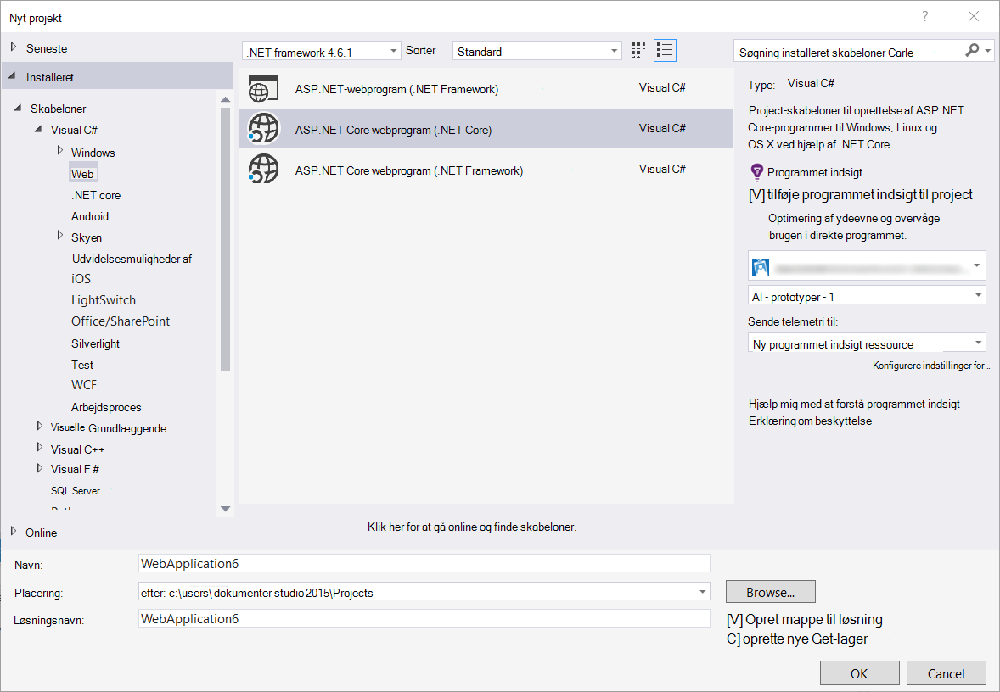

<properties
    pageTitle="Produktbemærkninger til Visual Studio-typenavn for udvikler analyser"
    description="De seneste opdateringer til Visual Studio-værktøjer for udvikler analyser."
    services="application-insights"
    documentationCenter=""
    authors="acearun"
    manager="douge"/>
<tags
    ms.service="application-insights"
    ms.workload="tbd"
    ms.tgt_pltfrm="ibiza"
    ms.devlang="na"
    ms.topic="article"
    ms.date="06/09/2016"
    ms.author="acearun"/>

# Produktbemærkninger til Analytics-udviklerværktøjer
Nyheder: programmet indsigt og HockeyApp analytics i Visual Studio.
## Version 7.0
### Visual Studio programmet indsigt tendenser
Visual Studio programmet indsigt er et nyt værktøj i Visual Studio, som du kan bruge til at hjælpe dig med at analysere, hvordan din app fungerer over tid. Vælg **Udforske Telemetri tendenser**for at komme i gang skal **Programmet indsigt** på knappen på værktøjslinjen eller i vinduet program indsigt Søg. Eller, skal du klikke på **Andre Windows**i menuen **Vis** , og klik derefter på **Program indsigt tendenser**. Vælg en af fem almindelige forespørgsler for at komme i gang. Du kan analysere forskellige datasæt baseret på telemetri typer, tidsintervaller og andre egenskaber. For at finde afvigelser i dine data skal du vælge en af indstillingerne for anomali i rullelisten **Visningstype** . De filtreringsindstillinger nederst i vinduet gør det nemt at finpudse i på bestemte undersæt af din telemetri.

### Undtagelser i CodeLens
Undtagelse telemetri vises nu i CodeLens. Hvis du har tilsluttet dit projekt til tjenesten programmet viden, får du vist antallet undtagelser, der er opstået i hver enkelt metode fremstilling i de seneste 24 timer. Fra CodeLens, kan du hoppe til søgning eller tendenser for at undersøge undtagelser mere detaljeret.

### ASP.NET Core support
Programmet indsigt understøtter nu ASP.NET Core RC2 projekter i Visual Studio. Du kan føje programmet indsigt til nye ASP.NET Core RC2 projekter fra dialogboksen **Nyt projekt** , som i følgende skærmbillede. Eller du kan føje det til et eksisterende projekt, højreklik på projektet i Solution Explorer, og klik derefter på **Tilføj programmet indsigt Telemetri**.

ASP.NET 5 RC1 og ASP.NET Core RC2 projekter også have nye support i vinduet værktøjer til diagnosticering. Du får vist programmet indsigt begivenheder som anmodninger og undtagelser fra din ASP.NET-app, mens du foretager fejlfinding lokalt på din PC. Klik på **Søg** til at analysere ned for at få flere oplysninger i hver enkelt hændelse.

### HockeyApp til Universal Windows-apps
Ud over beta fordeling og bruger feedback indeholder HockeyApp symbolicated nedbrud rapporterer til dine Universal Windows-apps. Vi har gjort det er nemmere at tilføje HockeyApp SDK: Højreklik på projektet Universal Windows, og klik derefter på **Hockey App - aktivere ned analyser**. Dette SDK-installationer, konfigurerer nedbrud af websteder og danner en HockeyApp ressource i skyen, alt sammen uden at overføre din app til tjenesten HockeyApp.

Andre nye funktioner:

* Vi har gjort programmet indsigt brugernes søgeoplevelse hurtigere og mere intuitiv. Nu anvendes tidsintervaller og detaljeret filtre automatisk, når du markerer dem.
* Også i programmet indsigt Søg er nu der mulighed for at gå til koden direkte fra anmodning om telemetri.
* Vi har foretaget forbedringer af HockeyApp logon oplevelsen.
* Der vises i diagnosticeringsværktøjer, fremstilling telemetri oplysninger om undtagelser.

## Version 5.2
Vi vil gerne meddele indførelsen af HockeyApp scenarier i Visual Studio. Den første integration er i betafordelingen Universal Windows apps og Windows Forms-apps fra Visual Studio.

Med betafordelingen overfører du tidlige versioner af dine apps til HockeyApp til distribution til et markeret undersæt af kunder eller testere. BETAFORDELING, kombineres med HockeyApp nedbrud af websteder og bruger feedback funktioner, kan give dig med værdifulde oplysninger om din app, før du foretager en mere omfattende udgivelse. Du kan bruge disse oplysninger til at løse problemer med din app, så du kan undgå eller minimere problemer senere, som lav app bedømmelser, negativ feedback og så videre.

Se hvor nemt det er at overføre opbygger for betafordelingen fra i Visual Studio.
### Universal Windows apps
Genvejsmenuen for en Universal Windows app projektnode omfatter nu mulighed for at overføre din build til HockeyApp.

Vælg elementet og HockeyApp Overfør dialogboksen åbnes. Du skal bruge en HockeyApp konto for at overføre din build. Hvis du er ny bruger, ikke bekymre dig. Det er let at oprette en konto.

Når du har forbindelse, vil du se formularen Overfør i dialogboksen.

Vælg indholdet, overføre (en .appxbundle eller .appx-fil), og vælg derefter udgivelsesindstillinger i guiden. Du kan eventuelt tilføje produktbemærkninger på den næste side. Vælg **Udfør** for at starte overførslen.

Når overførslen er fuldført, vises en meddelelse om HockeyApp med bekræftelse og et link til app i portalen HockeyApp.

Det var det! Du har lige har overført et build for betafordelingen med blot nogle få klik.

Du kan administrere dit program på flere måder i portalen HockeyApp. Dette omfatter invitere brugere, få vist nedbrud rapporter og feedback, ændre detaljer, og så videre.

Se [HockeyApp Knowledge Base](http://support.hockeyapp.net/kb/app-management-2) få mere at vide om administration af app.

### Windows-formularer apps
Genvejsmenuen for en Windows-formular projektnode omfatter nu mulighed for at overføre din build til HockeyApp.

Dette åbner dialogboksen HockeyApp Overfør, der minder om det, i en Universal Windows-app.

Bemærk et nyt felt i denne guide til at angive versionen af appen. Universal Windows Apps, skal udfyldes oplysningerne fra manifestet. Windows Forms apps desværre har ikke en tilsvarende med denne funktion. Du skal angive dem manuelt.

Resten af strømmen ligner Universal Windows apps: vælge build og slip indstillinger, tilføje release noter, overføre, og administrer i portalen HockeyApp.

Det er så enkelt som. Prøv det, og fortæl os, hvad du mener.
## Version 4,3
### Søg telemetri fra lokale fejlfinding sessioner
Med denne version kan du nu søge efter programmet indsigt telemetri, der er oprettet i Visual Studio sessionen med fejlfinding. Før, kan du bruge funktionen Søg kun, hvis du har registreret din app i programmet indsigt. Nu skal din app kun have programmet indsigt SDK installeret for at søge efter lokale telemetri.

Hvis du har en ASP.NET-program med programmet indsigt SDK, kan du gøre følgende for at bruge søgning.

1. Foretage fejlfinding af dit program.
2. Åbn programmet indsigt søgning i en af følgende måder:
    - Klikke på **Andre vinduer**i menuen **Vis** , og klik derefter på **Program indsigt søgning**.
    - Klik på knappen **Programmet indsigt** værktøjslinjen.
    - Udvid **ApplicationInsights.config**i Solution Explorer, og klik derefter på **Søg fejlfinding session telemetri**.
3. Hvis du ikke har tilmeldt dig programmet viden, åbnes vinduet Søg i fejlfinding session telemetri tilstand.
4. Klik på ikonet **Søg** for at få vist dine lokale telemetri.

## Version 4.2
I denne udgave tilføjede vi funktioner for at sikre, at søge efter data nemmere i forbindelse med begivenheder med muligheden for at gå til kode fra flere data begivenheder og en problemfri oplevelse til at sende dataene logføring til programmet indsigt. Dette lokalnummer opdateres hver måned. Hvis du har anmodninger om feedback eller en funktion, du sender den til aidevtools@microsoft.com.
### Nej, og klik på logføring oplevelse
Hvis du allerede bruger NLog, log4net eller System.Diagnostics.Tracing, kan du ikke behøver at bekymre dig om at flytte alle dine sporinger til programmet indsigt. I denne udgave, har vi integreret programmet indsigt logføring kort med normal konfiguration oplevelsen.
Hvis du allerede har en af disse logføring strukturer, der er konfigureret, beskrives de følgende afsnit, hvordan du kan få den.
**Hvis du allerede har tilføjet programmet indsigt:**
1. Højreklik på projektnoden, og klik derefter på **Program viden**, og klik **Konfigurere programmet indsigt**. Sørg for, at du ser muligheden for at tilføje det rigtige kort i konfigurationsvinduet.
2. Du kan også, når du opretter løsningen, Bemærk pop op-vinduet, der vises i øverste højre hjørne af skærmen, og klik på **Konfigurer**.

Når du har installeret den logføring kort, kører dit program, og Sørg for, at du få vist alle dataene på fanen værktøjer til diagnosticering således:

### Hoppe til eller finde koden, hvor telemetri hændelsesegenskaben udsendes
Med den nye version brugeren kan klikke på en værdi i detaljer, og dette vil søge efter en tilsvarende streng i den aktuelle Åbn løsning. Resultaterne vises i Visual Studio "finde" resultatlisten som vist nedenfor:

### Ny Søgevindue for når du ikke er logget på
Vi har forbedret udseendet af programmet indsigt søgevinduet kan hjælpe dig med at søge efter dine data, mens din app er i fremstilling.

### Have vist alle telemetri hændelser, der er knyttet til hændelsen
Vi har tilføjet en ny fane med foruddefinerede forespørgsler for alle de data, der er relateret til hændelsen telemetri brugeren vist, ved siden af fanen for detaljer om begivenheder. Eksempelvis har en anmodning om et felt med navnet **Handlings-ID**. Hver begivenhed, der er knyttet til denne anmodning, har den samme værdi for **Handlings-ID**. Hvis der opstår en undtagelse, mens handlingen behandler anmodningen, får undtagelsen samme handlings-ID'ET som anmodningen om at gøre det nemmere at finde. Hvis du leder efter en anmodning, skal du klikke på **alle telemetri til denne handling** for at åbne en ny fane, der viser de nye søgeresultater.

### Frem og tilbage oversigt i Søg
Du kan nu gå frem og tilbage mellem søgeresultater.

## Version 4.1
Denne version leveres med en række nye funktioner og opdateringer. Du skal have opdatering 1 installeret for at installere denne version.

### Gå fra en undtagelse til metode i kildekode
Nu, hvis du får vist undtagelser fra din fremstilling app i søgevinduet i programmet viden, kan du hoppe til metoden i din kode hvor undtagelsen opstår. Du kun vil have det korrekte projekt, der er indlæst og programmet indsigt tager sig af resten! (Hvis du vil vide mere om programmet indsigt søgevinduet skal du se produktbemærkninger til Version 4.0 i de følgende afsnit.)

Hvordan fungerer det? Selvom en løsning ikke er åben, kan du bruge programmer indsigt søgning. Området stak sporing viser en oplysningsmeddelelse, og mange af elementerne i stablen sporing er ikke tilgængelig.

Hvis filen oplysninger er tilgængelige, nogle elementer kan være links, men løsning oplysninger vare vil stadig være synlige.

Hvis du klikker på linket, skal du gå til placeringen for den valgte metode i din kode. Der kan være forskel på versionsnummeret, men funktionen til at gå til den korrekte version af koden, kommer fra nyere versioner.

### Nye genveje til søgningen oplevelse i Solution Explorer
Du kan nu få adgang søgning via Solution Explorer.

### Viser en meddelelse når udgiver er fuldført
En pop op-dialogboks vises, når projektet er blevet publiceret online, så du kan få vist dataene programmet indsigt i fremstilling.

## Version 4.0

### Søge programmet indsigt dataene i Visual Studio
Søgefunktionen i programmet indsigt portal, nu i Visual Studio kan du filtrere og søge efter begivenhed typer, egenskabsværdier og tekst kan lide, og derefter undersøge individuelle begivenheder.

### Se data, der kommer fra din lokale computer i diagnosticeringsværktøjer

Du kan få vist din telemetri, ud over andre fejlfinding data på siden Visual Studio diagnosticeringsværktøjer. Kun ASP.NET 4.5 understøttes.

### Føje SDK til projektet uden at logge på Azure

Du skal ikke længere logge på Azure programmet indsigt pakker føjes til projektet, enten via dialogboksen **Nyt projekt** eller fra genvejsmenuen for project. Hvis du logger på, er i SDK installeret og konfigureret til at sende telemetri til portalen som før. Hvis du ikke kan logge på, i SDK, føjes til projektet, og det genererer telemetri til diagnosticering hubben. Du kan konfigurere den senere, hvis du vil have.

### Understøttelse af enheder

På *Connect();* 2015, vi [offentliggjort](https://azure.microsoft.com/blog/deep-diagnostics-for-web-apps-with-application-insights/) , vores mobile udvikler oplevelse for enheder er HockeyApp. HockeyApp hjælper dig med at distribuere beta builds til din testere, indsamle og analysere alle nedbrud fra din app og indsamler feedback direkte fra dine kunder.
HockeyApp understøtter din app på uanset hvilken platform, du vælger at opbygge, uanset om det er iOS, Android, eller Windows eller en på tværs af platforme løsning som Xamarin, Cordova eller enhed.

I fremtidige versioner af filtypenavnet programmet viden, lærer en mere integreret oplevelse mellem HockeyApp og Visual Studio. Nu kan du starte med HockeyApp ved blot at tilføje NuGet reference. Se i [dokumentationen](http://support.hockeyapp.net/kb/client-integration-windows-and-windows-phone) til flere oplysninger.
