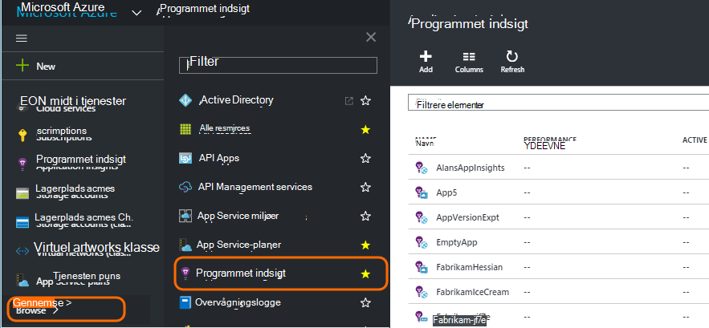
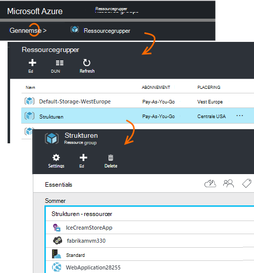
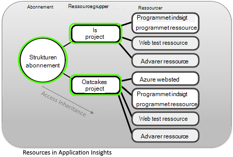
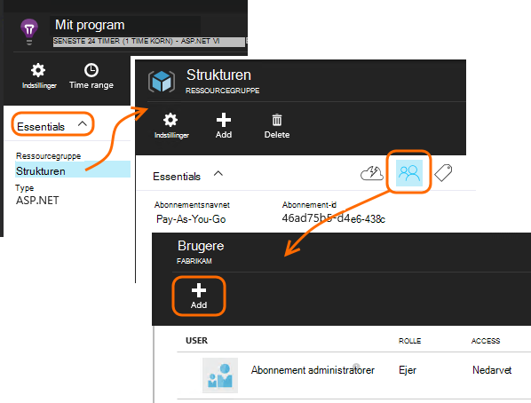
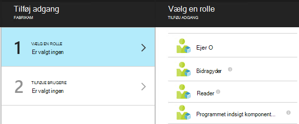
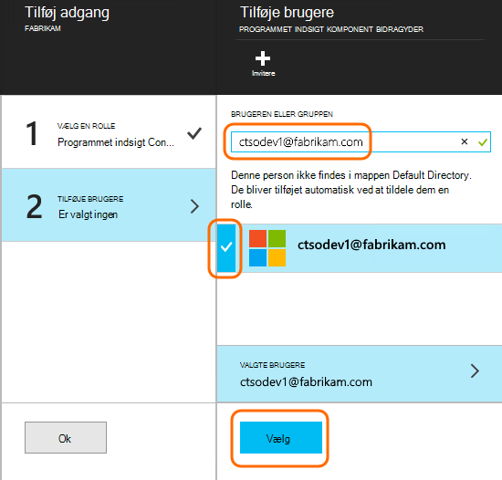

<properties
    pageTitle="Ressourcer, roller og adgangskontrol i programmet indsigt"
    description="Ejere, bidragydere og læsere af organisationens indsigt."
    services="application-insights"
    documentationCenter=""
    authors="alancameronwills"
    manager="douge"/>

<tags
    ms.service="application-insights"
    ms.workload="tbd"
    ms.tgt_pltfrm="ibiza"
    ms.devlang="na"
    ms.topic="article"
    ms.date="05/07/2016"
    ms.author="awills"/>

# Ressourcer, roller og adgangskontrol i programmet indsigt

Du kan styre, hvem der har læse- og opdatere adgang til dine data i Visual Studio [Programmet indsigt][start], ved hjælp af [Rollebaseret adgangskontrol i Microsoft Azure](../active-directory/role-based-access-control-configure.md).

> [AZURE.IMPORTANT] Tildele adgang til brugere i **ressourcegruppe eller et andet abonnement** som dit program ressource tilhører - ikke i selve ressourcen. Tildele rollen **programmet indsigt komponent bidragyder** . Dette sikrer ensartet kontrol af adgang til internettet test og beskeder sammen med dit program ressource. [Få mere at vide](#access).

## Ressourcer, grupper og abonnementer

Første, nogle definitioner:

* **Ressource** - en forekomst af en Microsoft Azure-tjeneste. Dit program indsigt ressource indsamler, analyserer og viser de telemetridata, der sendes fra dit program.  Andre typer Azure ressourcer omfatter webapps, databaser og FOS.

    For at se alle dine ressourcer skal du gå til [Azure Portal][portal], log på, og klik på Gennemse.

    

* [**Ressourcegruppe** ] [ group] -hver ressource tilhører en gruppe. En gruppe er en praktisk metode til at administrere relaterede ressourcer særligt for at kontrollere adgangen. For eksempel i én ressourcegruppe kan man lægge en WebApp, en programmet indsigt ressource til at overvåge appen og en lagerplads ressource for at holde eksporterede data.

    

* [**Abonnement**](https://manage.windowsazure.com) - du skal bruge programmet indsigt eller andre Azure ressourcer, du logger på et Azure-abonnement. Hver ressourcegruppe hører til ét Azure abonnement, hvor du vælger din pris pakke og, hvis det er en organisation abonnement, Vælg medlemmerne og deres adgangstilladelser.
* [**Microsoft-konto** ] [ account] -brugernavn og adgangskode, du bruger til at logge på Microsoft Azure-abonnementer, XBox Live, Outlook.com og andre Microsoft-tjenester.

## Styre adgangen i ressourcegruppen

Det er vigtigt at forstå, ud over den ressource, du har oprettet for dit program, der er også separat skjulte ressourcer til beskeder og web test. De er knyttet til den samme [ressourcegruppe](#resource-group) som dit program. Du kan også har indsat andre Azure tjenester der, som websteder eller lagerplads.

Til at styre adgangen til disse ressourcer derfor anbefales det at:

* Kontrollere adgang på niveauet for **ressourcegruppe eller et andet abonnement** .
* Tildele rollen **bidragyder programmet indsigt komponent** til brugere. Dette gør det muligt at redigere web test, beskeder og programmet indsigt ressourcer, uden at give adgang til andre tjenester i gruppen.

## Til at give adgang til en anden bruger

Du skal have ejerrettigheder til abonnementet eller ressourcegruppen.

Brugeren skal have en [Microsoft-konto][account], eller adgang til deres [Organisatoriske Microsoft-konto](..\active-directory\sign-up-organization.md). Du kan give adgang til personer, og til brugergrupper, der er defineret i Azure Active Directory.

#### Gå til ressourcegruppen

Tilføj bruger der.

Eller du kan gå op til et andet niveau og føje brugeren til abonnementet.

#### Vælg en rolle

Rolle | I ressourcegruppen
---|---
Ejer | Kan ændre alt, herunder brugeradgang
Bidragyder | Kan redigere alt, herunder alle de ressourcer
Programmet indsigt komponent bidragyder | Kan redigere programmet indsigt ressourcer, web test og beskeder
Reader | Kan få vist, men ikke ændre noget

Oprette, slette og opdatere indeholder 'Redigering':

* Ressourcer
* Web-test
* Beskeder
* Kontinuert Eksportér

#### Vælg brugeren

Hvis den bruger, du vil ikke i bibliotek, kan du invitere alle med en Microsoft-konto.
(Hvis de bruger tjenester som Outlook.com, OneDrive, Windows Phone eller XBox Live, de har en Microsoft-konto.)

## Brugere og roller

* [Rollebaseret adgangskontrol i Azure](../active-directory/role-based-access-control-configure.md)

<!--Link references-->

[account]: https://account.microsoft.com
[group]: ../resource-group-overview.md
[portal]: https://portal.azure.com/
[start]: app-insights-overview.md
