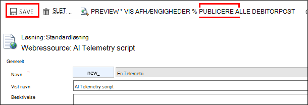

<properties 
    pageTitle="Gennemgang: Overvåge Microsoft Dynamics CRM med programmet indsigt" 
    description="Få telemetri fra Microsoft Dynamics CRM Online ved hjælp af programmet indsigt. Gennemgang af konfigurationen, hentning af data, visualisering og Eksportér." 
    services="application-insights" 
    documentationCenter=""
    authors="mazharmicrosoft" 
    manager="douge"/>

<tags 
    ms.service="application-insights" 
    ms.workload="tbd" 
    ms.tgt_pltfrm="ibiza" 
    ms.devlang="na" 
    ms.topic="article" 
    ms.date="11/17/2015" 
    ms.author="awills"/>
 
# Gennemgang: Aktivering Telemetri til Microsoft Dynamics CRM Online ved hjælp af programmet indsigt

I denne artikel beskrives, hvordan at få telemetridata fra [Microsoft Dynamics CRM Online](https://www.dynamics.com/) ved hjælp af [Visual Studio programmet indsigt](https://azure.microsoft.com/services/application-insights/). Vi gennemgår fuldført processen med at tilføje programmet indsigt script til dit program indsamle data og datavisualisering.

>[AZURE.NOTE] [Gennemse løsningen eksempel](https://dynamicsandappinsights.codeplex.com/).

## Føje programmet indsigt til nye eller eksisterende CRM Online forekomst 

Hvis du vil overvåge dit program, kan du tilføje et program indsigt SDK i dit program. SDK sender telemetri til [programmet indsigt portal](https://portal.azure.com), hvor du kan bruge vores effektive analyser og værktøjer til diagnosticering eller eksportere dataene til-lager.

### Oprette en ressource programmet indsigt i Azure

1. Få [en konto i Microsoft Azure](http://azure.com/pricing). 
2. Log på [Azure-portalen](https://portal.azure.com) , og Tilføj en ny programmet indsigt ressource. Dette er, hvor dine data, behandles og vises.

    

    Vælg ASP.NET som programtypen.

3. Åbn fanen Hurtig Start, og Åbn scriptet kode.

    

**Hold siden kode åben** , mens du gør næste trin i en anden browser-vindue. Du skal have koden snart. 

### Oprette en JavaScript webressource i Microsoft Dynamics CRM

1. Åbn CRM Online forekomst og log på med administratorrettigheder.
2. Åbn Microsoft Dynamics CRM indstillinger og derefter tilpasninger, tilpasse systemet

    
    
    

    

3. Oprette en JavaScript-ressource.

    

    Give den et navn, Vælg **Script (JScript)** , og Åbn tekstredigeringsprogrammet.

    
    
4. Kopiere koden til fra programmet indsigt. Sørg for at ignorere script-koder under kopieringen. Se under skærmbillede:

    

    Koden indeholder tasten instrumentation, der identificerer dine programmet indsigt ressource.

5. Gem og Publicer.

    

### Instrument formularer

1. Åbn formularen firma i Microsoft CRM Online

    

2. Åbn formularen egenskaber

    

3. Føje JavaScript webressourcen, du har oprettet

    

    

4. Gem og Publicer tilpasningerne formular.

## Målepunkter hentes

Du har nu konfigureret telemetri capture til formularen. Når den bruges, sendes data til dit program indsigt ressource.

Her er nogle eksempler på de data, du får vist.

#### Programmet tilstand

Browser undtagelser:

Klik på diagrammet for at få flere detaljer:

#### Brugen

#### Browsere

#### Geolokalitet

#### Indvendig sideanmodning for visning

## Eksempel på kode

[Gennemse eksempelkoden](https://dynamicsandappinsights.codeplex.com/).

## Power BI

Du kan gøre endnu bedre analyse, hvis du [eksportere dataene til Microsoft Power BI](app-insights-export-power-bi.md).

## Eksempel Microsoft Dynamics CRM-løsning

[Her er implementeret i Microsoft Dynamics CRM eksempel løsningen] (https://dynamicsandappinsights.codeplex.com/).

## Lær mere

* [Hvad er programmet indsigt?](app-insights-overview.md)
* [Programmet indsigt til websider](app-insights-javascript.md)
* [Flere eksempler og gennemgange](app-insights-code-samples.md)

 
