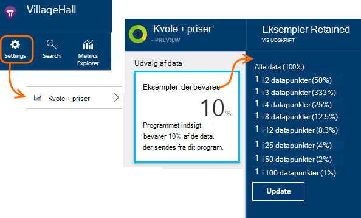

<properties 
    pageTitle="Telemetri stikprøver i programmet indsigt | Microsoft Azure" 
    description="Sådan holder du lydstyrken for telemetri under kontrol." 
    services="application-insights" 
    documentationCenter="windows"
    authors="vgorbenko" 
    manager="douge"/>

<tags 
    ms.service="application-insights" 
    ms.workload="tbd" 
    ms.tgt_pltfrm="ibiza" 
    ms.devlang="na" 
    ms.topic="article" 
    ms.date="08/30/2016" 
    ms.author="awills"/>

#  <a name="sampling-in-application-insights"></a>Stikprøver i programmet indsigt

*Programmet indsigt er i Vis udskrift.*


Stikprøver, hvor der er en funktion i [Visual Studio programmet indsigt](app-insights-overview.md) er den anbefalede måde at reducere telemetri trafik og lager og samtidig bevare en statistisk korrekt analyse af programmet data. Filteret markerer elementer, der vedrører, så du kan navigere mellem elementerne, når du udfører diagnosticering efterforskninger.
Når metriske tæller præsenteres for dig på portalen, er de renormalized for at tage hensyn til udvalg at minimere nogen effekt på Statistik.

Udvalg reducerer trafik, kan du holde inden for månedlige kvoter for data og hjælper dig med at undgå (throttling).

## <a name="in-brief"></a>Kort:

* Udvalg bevarer 1 i *n* poster og sletter resten. Det kan for eksempel bevare 1 til 5 begivenheder rente et udvalg af 20%. 
* Stikprøver, hvor der sker automatisk, hvis dit program sender en masse telemetri, i ASP.NET web server apps.
* Du kan også angive indsamle manuelt, enten i portalen på siden priser; eller i ASP.NET SDK i .config-fil, du kan også reducere netværkstrafikken.
* Hvis du logger brugerdefinerede hændelser, og du vil sikre dig, at et sæt hændelser enten bevares eller kasseres sammen, skal du kontrollere, at de har samme OperationId værdi.
* Udvalg divisoren *n* rapporteres i hver post i egenskaben `itemCount`, som i Søg vises under den fulde navn "anmodning antal" eller "begivenhed Tæl". Når stikprøver, hvor der ikke findes i handling `itemCount==1`.
* Hvis du skriver Analytics forespørgsler, skal du [tage hensyn til udvalg](app-insights-analytics-tour.md#counting-sampled-data). Især i stedet for blot optælling af poster, skal du bruge `summarize sum(itemCount)`.


## <a name="types-of-sampling"></a>Typer af udvalg


Der er tre alternative udvalg metoder:

* **Tilpasset udvalg** justerer automatisk lydstyrken for telemetri, der sendes fra SDK i din ASP.NET-app. Som standard fra SDK v 2.0.0-beta3. Aktuelt tilgængelig for ASP.NET serversiden telemetri kun. 
* **Fast rente udvalg** reducerer lydstyrken for telemetri, der sendes fra begge ASP.NET serveren og fra dine brugeres browsere. Du angive rente. Klienten og serveren synkroniserer deres udvalg så, i søgningen, du kan navigere mellem relaterede sidevisninger og anmodninger.
* **Indtagelse udvalg** reducerer lydstyrken for telemetri bevares af tjenesten programmet indsigt med en hastighed, som du fastsætter. Den reducere ikke telemetri trafik, men hjælper dig med at holde inden for den månedlige lagerkvote. 

Hvis Adaptiv eller fast rente stikprøver, hvor der er i handlingen, deaktiveres indtagelse udvalg.

## <a name="ingestion-sampling"></a>Indtagelse udvalg

Denne form for udvalg fungerer på det sted, hvor telemetri fra din webserver, browsere og enheder, når programmet indsigt tjenesteslutpunkt. Selvom det ikke reducere telemetri trafikken sendes fra din app, det reducere mængden behandles og bevares (og betale for) ved programmet indsigt.

Brug denne type af stikprøver, hvor der, hvis din app ofte handler om dens månedlige kvote, og du ikke har mulighed for at benytte en af de SDK-baserede typer udvalg. 

Angive et udvalg DISKONTO i kvotaerne og priser blade:



Som andre typer udvalg bevarer algoritmen relaterede telemetri elementer. For eksempel, når du undersøge telemetri i Søg, vil du kunne finde den anmodning, der er relateret til en bestemt undtagelse. Metrisk tæller som anmodning rente og undtagelse rente bevares korrekt.

Datapunkter, der er kasseret ved stikprøver, hvor der er ikke tilgængelige i en hvilken som helst program indsigt funktion som [Sammenhængende eksportere](app-insights-export-telemetry.md).

Indtagelse udvalg fungerer ikke, mens SDK-baserede tilpasset eller fast rente stikprøver, hvor der er i handlingen. Hvis udvalg hyppigheden SDK er mindre end 100%, ignoreres den indtagelse udvalg rente, som du fastsætter.

> [AZURE.WARNING] Den værdi, der vises i feltet angiver den værdi, som du angiver for indtagelse udvalg. Den repræsenterer ikke den faktiske udvalg rente, hvis SDK udvalg er i handlingen.


## <a name="adaptive-sampling-at-your-web-server"></a>Tilpasset udvalg på webserveren

Tilpasset stikprøver, hvor der er tilgængelig for programmet indsigt SDK for ASP.NET v 2.0.0-beta3 og nyere og er aktiveret som standard. 


Tilpasset udvalg påvirker mængde telemetri, der sendes fra din online server til tjenesten programmet indsigt. Lydstyrken justeres automatisk for at holde inden for en bestemt maksimal hastighed på trafik.

Den arbejde ikke med lav mængder telemetri, så en app i forbindelse med fejlfinding eller et websted med manglende brug påvirkes ikke.

For at opnå target lydstyrken, er nogle af de telemetri genereres kasseret. Men som andre typer udvalg, bevarer algoritmen relaterede telemetri elementer. For eksempel, når du undersøge telemetri i Søg, vil du kunne finde den anmodning, der er relateret til en bestemt undtagelse. 

Metrisk tæller som anmodning rente og undtagelse rente justeres kompensation for udvalg rente, så de vises cirka korrekte værdier i metrisk Explorer.

**Opdatere dit projekts NuGet** pakker til den seneste *foreløbige* version af programmet indsigt: Højreklik på projektet i Solution Explorer, vælge Administrer NuGet-pakker, skal du kontrollere **medtage foreløbig version** , og Søg efter Microsoft.ApplicationInsights.Web. 

I [ApplicationInsights.config](app-insights-configuration-with-applicationinsights-config.md), du kan justere flere parametre i den `AdaptiveSamplingTelemetryProcessor` node. Tallene vises er standardværdierne:

* `<MaxTelemetryItemsPerSecond>5</MaxTelemetryItemsPerSecond>`

    Den destinationsadresse rente, der har til formål algoritmen tilpasset til **på hver server vært**. Hvis din online kører på mange udbydere, kan du reducere denne værdi med henblik på at holde sig inden for dine mål rente trafik på portalen programmet indsigt.

* `<EvaluationInterval>00:00:15</EvaluationInterval>` 

    Det interval, hvor den aktuelle hastighed for telemetri er igen evalueres. Beregning udføres som et glidende gennemsnit. Du vil forkorte dette interval, hvis din telemetri, der skal betale pludselig lyseksplosioner.

* `<SamplingPercentageDecreaseTimeout>00:02:00</SamplingPercentageDecreaseTimeout>`

    Når indsamle procentdel værdi er ændres, hvor hurtigt efter har vi tilladelse til at sænke udvalg procentdel igen for at registrere færre data.

* `<SamplingPercentageIncreaseTimeout>00:15:00</SamplingPercentageIncreaseTimeout>`

    Når indsamle procentdel værdi er ændres, hvor hurtigt efter har vi tilladelse til at øge udvalg procentdel igen for at registrere flere data.

* `<MinSamplingPercentage>0.1</MinSamplingPercentage>`

    Hvad er den mindste værdi, som vi har tilladelse til at angive, som indsamle procentdel varierer.

* `<MaxSamplingPercentage>100.0</MaxSamplingPercentage>`

    Hvad er den maksimale værdi, som vi har tilladelse til at angive, som indsamle procentdel varierer.

* `<MovingAverageRatio>0.25</MovingAverageRatio>` 

    I beregningen af det glidende gennemsnit tildeles vægten til den seneste værdi. Brug en værdi, der er lig med eller mindre end 1. Mindre værdier Foretag algoritmen mindre inaktiv over for pludselig ændringer.

* `<InitialSamplingPercentage>100</InitialSamplingPercentage>`

    Den værdi, der er tildelt, når appen netop er startet. Ikke reducere dette mens du fejlfinding. 

### <a name="alternative-configure-adaptive-sampling-in-code"></a>Alternativ: konfigurere tilpassede udvalg i kode

I stedet for at justere udvalg i .config-filen, kan du bruge kode. Dette kan du angive en tilbagekaldsfunktion, der startes, når udvalg rente er igen evalueres. Du kan bruge det, for eksempel at finde ud af hvilke udvalg kurs bruges.

Fjerne den `AdaptiveSamplingTelemetryProcessor` node fra .config-filen.


*C#*

```C#

    using Microsoft.ApplicationInsights;
    using Microsoft.ApplicationInsights.Extensibility;
    using Microsoft.ApplicationInsights.WindowsServer.Channel.Implementation;
    using Microsoft.ApplicationInsights.WindowsServer.TelemetryChannel;
    ...

    var adaptiveSamplingSettings = new SamplingPercentageEstimatorSettings();

    // Optional: here you can adjust the settings from their defaults.

    var builder = TelemetryConfiguration.Active.TelemetryProcessorChainBuilder;
    
    builder.UseAdaptiveSampling(
         adaptiveSamplingSettings,

        // Callback on rate re-evaluation:
        (double afterSamplingTelemetryItemRatePerSecond,
         double currentSamplingPercentage,
         double newSamplingPercentage,
         bool isSamplingPercentageChanged,
         SamplingPercentageEstimatorSettings s
        ) =>
        {
          if (isSamplingPercentageChanged)
          {
             // Report the sampling rate.
             telemetryClient.TrackMetric("samplingPercentage", newSamplingPercentage);
          }
      });

    // If you have other telemetry processors:
    builder.Use((next) => new AnotherProcessor(next));

    builder.Build();

```

([Få mere at vide om telemetri processorer](app-insights-api-filtering-sampling.md#filtering).)


<a name="other-web-pages"></a>
## <a name="sampling-for-web-pages-with-javascript"></a>Udvalg for websider med JavaScript

Du kan konfigurere websider til fast rente udvalg fra en hvilken som helst server. 

Når du [konfigurerer websider for programmet viden](app-insights-javascript.md), Rediger kodestykke, som du angiver portalen programmet indsigt. (I ASP.NET-apps på kodestykke typisk går i _Layout.cshtml.)  Indsætte en streg som `samplingPercentage: 10,` før tasten instrumentation:

    <script>
    var appInsights= ... 
    }({ 


    // Value must be 100/N where N is an integer.
    // Valid examples: 50, 25, 20, 10, 5, 1, 0.1, ...
    samplingPercentage: 10, 

    instrumentationKey:...
    }); 
    
    window.appInsights=appInsights; 
    appInsights.trackPageView(); 
    </script> 

Procentdel stikprøver, hvor du ved at vælge en procentdel, som er tæt på 100/N, hvor N er et heltal.  I øjeblikket indsamle understøtter ikke andre værdier.

Hvis du også aktivere fast rente udvalg på serveren, synkroniseres klienter og server, så, i søgningen, du kan navigere mellem relaterede sidevisninger og anmodninger.


## <a name="fixed-rate-sampling-for-aspnet-web-sites"></a>Fast rente udvalg for ASP.NET-websteder

Fast rente udvalg reducerer trafikken sendes fra webserveren og en webbrowser. I modsætning til tilpasset udvalg reduceres telemetri med en fast rente besluttet af dig. Det også synkroniserer klienten og serveren udvalg så relaterede elementer bevares - f.eks, så hvis du ser på en sidevisning i søgningen, kan du finde relaterede anmodning.

Algoritmen udvalg bevarer relaterede elementer. For hver HTTP-anmodning er begivenhed, den og dens relaterede hændelser enten kasseret eller overføres. 

Målepunkter Stifinder multipliceret satser som anmodningen og undtagelse tæller med en faktor for rente udvalg at afhjælpe, så de er cirka korrekte.

1. **Opdatere dit projekts NuGet-pakker** til den seneste *foreløbige* version af programmet indsigt. Højreklik på projektet i Solution Explorer, vælge Administrer NuGet-pakker, skal du kontrollere **medtage foreløbig version** , og Søg efter Microsoft.ApplicationInsights.Web. 

2. **Deaktivere tilpasset udvalg**: I [ApplicationInsights.config](app-insights-configuration-with-applicationinsights-config.md), fjerne eller skrive en kommentar ud på `AdaptiveSamplingTelemetryProcessor` node.

    ```xml

    <TelemetryProcessors>
    <!-- Disabled adaptive sampling:
      <Add Type="Microsoft.ApplicationInsights.WindowsServer.TelemetryChannel.AdaptiveSamplingTelemetryProcessor, Microsoft.AI.ServerTelemetryChannel">
        <MaxTelemetryItemsPerSecond>5</MaxTelemetryItemsPerSecond>
      </Add>
    -->
    

    ```

2. **Aktivere modulet fast rente udvalg.** Føje denne kodestykke til [ApplicationInsights.config](app-insights-configuration-with-applicationinsights-config.md):

    ```XML

    <TelemetryProcessors>
     <Add  Type="Microsoft.ApplicationInsights.WindowsServer.TelemetryChannel.SamplingTelemetryProcessor, Microsoft.AI.ServerTelemetryChannel">

      <!-- Set a percentage close to 100/N where N is an integer. -->
     <!-- E.g. 50 (=100/2), 33.33 (=100/3), 25 (=100/4), 20, 1 (=100/100), 0.1 (=100/1000) -->
      <SamplingPercentage>10</SamplingPercentage>
      </Add>
    </TelemetryProcessors>

    ```

> [AZURE.NOTE] Procentdel stikprøver, hvor du ved at vælge en procentdel, som er tæt på 100/N, hvor N er et heltal.  I øjeblikket indsamle understøtter ikke andre værdier.


### <a name="alternative-enable-fixed-rate-sampling-in-your-server-code"></a>Alternativ: aktivere fast rente stikprøver i din server-kode


I stedet for at parameteren udvalg i .config-filen, kan du bruge kode. 

*C#*

```C#

    using Microsoft.ApplicationInsights.Extensibility;
    using Microsoft.ApplicationInsights.WindowsServer.TelemetryChannel;
    ...

    var builder = TelemetryConfiguration.Active.GetTelemetryProcessorChainBuilder();
    builder.UseSampling(10.0); // percentage

    // If you have other telemetry processors:
    builder.Use((next) => new AnotherProcessor(next));

    builder.Build();

```

([Få mere at vide om telemetri processorer](app-insights-api-filtering-sampling.md#filtering).)


## <a name="when-to-use-sampling"></a>Hvornår skal jeg bruge udvalg?

Tilpasset stikprøver, hvor der er automatisk aktiveret, hvis du bruger ASP.NET SDK version 2.0.0-beta3 eller nyere. Uanset hvilken SDK-version, du bruger, kan du bruge indtagelse udvalg (i vores server).

Du behøver udvalg for de fleste små og mellemstore størrelse programmer. De mest nyttige diagnostiske oplysninger og mest præcise statistik der opnås ved at indsamle data på alle dine brugeraktiviteter. 

 
De vigtigste fordele ved stikprøver, hvor der er:

* Programmet indsigt service tab ("throttles") datapunkter når din app sender en meget høj rente telemetri i kort tid interval. 
* For at holde i [kvote](app-insights-pricing.md) datapunkter for din priser niveau. 
* Du kan reducere netværkstrafik fra samling af telemetri. 

### <a name="which-type-of-sampling-should-i-use"></a>Hvilken type stikprøver, hvor skal jeg bruge?


**Brug indtagelse indsamle, hvis:**

* Du gennemfører ofte kvoten månedlige af telemetri.
* Du bruger en version af SDK, som ikke understøtter udvalg – for eksempel, Java SDK eller ASP.NET versioner tidligere end 2.
* Du får en masse telemetri fra dine brugeres webbrowsere.

**Brug fast rente indsamle, hvis:**

* Du bruger programmet indsigt SDK til ASP.NET web services version 2.0.0 eller nyere, og
* Du vil indsamle synkroniseret mellem klienten og serveren, så, når du er ved at undersøge begivenheder i [søgningen](app-insights-diagnostic-search.md), kan du skifte mellem relaterede begivenheder i klienten og serveren, som sidevisninger og HTTP-anmodninger.
* Du er sikker på, for den relevante udvalg procentdel for din app. Det skal være høj nok til at få præcise målepunkter, men under rente, der overskrider kvoten priser og variere den benyttede begrænsningerne. 


**Brug tilpasset udvalg:**

Vi anbefaler ellers tilpasset udvalg. Dette er aktiveret som standard i ASP.NET-server SDK, version 2.0.0-beta3 eller nyere. Den mindre ikke trafik indtil en bestemt mindste sats, så det ikke påvirker et lav Brug websted.


## <a name="how-do-i-know-whether-sampling-is-in-operation"></a>Hvordan ved jeg, om stikprøver, hvor der er i gang?

Hvis du vil finde den faktiske udvalg rente uanset hvor det er anvendt, ved at bruge en [Analytics forespørgsel](app-insights-analytics.md) som dette:

    requests | where timestamp > ago(1d)
  	| summarize 100/avg(itemCount) by bin(timestamp, 1h) 
  	| render areachart 

Bevares i hver post, `itemCount` angiver antallet oprindelige poster, der repræsenterer det, lig med 1 + antallet af forrige kasseret poster. 


## <a name="how-does-sampling-work"></a>Hvordan fungerer udvalg?

Fast rente og tilpasset stikprøver, hvor der er en funktion af SDK i ASP.NET-versioner fra 2.0.0 og derefter. Indtagelse udvalg er en funktion i tjenesten programmet indsigt og kan være i handlingen, hvis SDK ikke fungerer udvalg. 

Algoritmen udvalg bestemmer, hvilke elementer der telemetri skal slip, og hvilke beholde (uanset om det er i SDK eller i programmet indsigt service). Beslutningen stikprøver, hvor der er baseret på flere regler, der har til formål at bevare alle forbundne datapunkter intakte, vedligeholde en diagnosticering oplevelse i programmet viden, der er effektive og pålidelige selv med et reduceret datasæt. Eksempelvis hvis for en mislykket anmodning sender din app yderligere telemetri elementer (såsom undtagelse og sporinger logget fra denne anmodning), der opdele stikprøver, hvor ikke denne anmodning og andre telemetri. Det kan enten hele tiden eller slipper dem alle sammen. Når du ser på anmodning om oplysningerne i programmet viden, kan du derfor altid se anmodningen sammen med dens tilknyttede telemetri elementer. 

For programmer, der definerer "brugere" (det vil sige, mest typisk webprogrammer), beslutningen stikprøver, hvor der er baseret på hashværdien af det bruger-id, hvilket betyder, at alle telemetri for en bestemt bruger enten bevares eller fjernet. For typerne af programmer, der ikke kan definerer brugere (såsom web services) er beslutningen stikprøver, hvor der baseret på handlings-id'et for din anmodning. Til sidst skal for de telemetri elementer, der hverken har brugeren eller handling-id, der er angivet (for eksempel telemetri elementer rapporteret fra asynkron tråde med ingen HTTP-kontekst) registrerer udvalg blot en procentdel af telemetri elementer af hver type. 

Når du præsenterer telemetri tilbage til dig, justerer tjenesten programmet indsigt målene med den samme udvalg procentdel, der blev brugt på tidspunktet for af websteder, som kompensation for de manglende datapunkter. Det vil sige, når man kigger på telemetri i programmet viden, brugerne får vist statistisk korrekt tilnærmelsesvise beregninger, der er meget tæt reelle tal.

Nøjagtigheden af tilnærmelse afhænger konfigurerede udvalg procent. Desuden øger nøjagtigheden for programmer, der håndterer en stor mængde generelt lignende anmodninger fra mange brugere. På den anden side for programmer, der ikke kan arbejde med en betydeligt belastning, stikprøver, hvor der ikke er nødvendigt som disse programmer kan normalt sende alle deres telemetri, mens du holde i kvoten, uden at miste data fra (throttling). 

Bemærk, at programmet indsigt ikke eksempel målepunkter og sessioner telemetri typer, siden for disse filtyper, reduktion i præcisionen kan være meget uønsket. 

### <a name="adaptive-sampling"></a>Tilpasset udvalg

Tilpasset udvalg tilføjer en komponent, overvåger den aktuelle overførselshastighed fra SDK, og justerer udvalg procent for at forsøge at holde inden for den maksimale hastighed mål. Justeringen genberegnes med jævne mellemrum, og er baseret på et bevægeligt gennemsnit af den udgående overførselshastighed.

## <a name="sampling-and-the-javascript-sdk"></a>Udvalg og JavaScript SDK

Klientsiden (JavaScript) SDK deltager i stikprøver, hvor fast rente i forbindelse med serversiden SDK. De anvendte sider kun sende klientsiden telemetri fra de samme brugere, som serversiden oprettet sin beslutning om at "eksempel i". Denne logik er udviklet til at opretholde integriteten af brugersession på tværs af klient - og server-sider. Som et resultat, kan du finde alle telemetri elementer for denne bruger eller session fra en bestemt telemetri element i programmet indsigt. 

*Mine klienten og serveren telemetri Vis ikke koordineret eksempler når du beskriver ovenfor.*

* Kontrollér, at du har aktiveret fast rente udvalg både på serveren og klienten.
* Sørg for, er SDK versionen 2.0 eller nyere.
* Kontrollér, at du angiver den samme udvalg procentdel i både klienten og serveren.


## <a name="frequently-asked-questions"></a>Ofte stillede spørgsmål 

*Hvorfor er ikke indsamle en simpel "indsamle X procentdel af hver type telemetri"?*

 *  Mens denne metode stikprøver, hvor der kan give en meget høj præcision i metriske tilnærmelsesvise beregninger, vil det bryde mulighed for at koordinere diagnosticering data per bruger, session og -anmodning, som er afgørende for diagnosticering. Indsamle derfor fungerer bedre med "samle alle telemetri elementer for X procent app brugere" eller "indsamling alle telemetri for X procentdel af app-anmodninger" logik. For de telemetri elementer, der ikke er knyttet til anmodninger (som baggrund asynkron behandling), er faldet tilbage til "indsamle X procentdel af alle elementer for hver type telemetri." 

*Kan udvalg procentdelen ændrer sig med tiden?*

 * Ja, tilpassede udvalg gradvist ændres udvalg procenten, baseret på i øjeblikket observerede lydstyrken for telemetri.

 

*Hvis jeg bruger fast rente udvalg, hvordan ved jeg, hvilke udvalg procentdel fungerer bedst til min app?*

* En metode er skal starte med tilpasset udvalg, find ud af, hvad bedømme den udlignes på (se ovenstående spørgsmål), og derefter skifte til fast rente indsamling ved hjælp af denne sats. 

    Ellers skal have du at gætte. Analysere dine aktuelle telemetri brugen i AI, læg mærke til en hvilken som helst (throttling), der bliver til virkelighed og anslå mængde indsamlede telemetri. Disse tre input, sammen med din valgte priser niveau foreslå, hvor mange du måske ønsker at reducere mængde indsamlede telemetri. En stigning i antallet af dine brugere eller nogle andre Skift i lydstyrken for telemetri kan dog ødelægge din vurdering.

*Hvad sker der, hvis jeg konfigurerer udvalg procentdel for lav?*

* Meget lave udvalg procent (over-aggressive udvalg) reducerer nøjagtigheden af tilnærmelsesvise beregninger, når programmet indsigt forsøger at kompensation visualisering af data for data lydstyrken reduktion. Desuden kan diagnosticering oplevelse negativt, som nogle af de sjældent svigter eller langsom anmodninger skal undersøges ud.

*Hvad sker der, hvis jeg konfigurerer udvalg procentdel for høj?*

* Konfiguration af højt udvalg procent (ikke tilstanden ikke nok) resulterer i en utilstrækkelig formindskelse af mængde indsamlede telemetri. Du kan stadig opleve telemetri datatab, der er relateret til (throttling), og omkostningerne ved at bruge programmet indsigt kan være højere end du planlagt på grund af forældede gebyrer.

*På hvilke platforme kan jeg bruge udvalg?*

* Indtagelse udvalg kan opstå automatisk til en hvilken som helst telemetri over en bestemt beholdning, hvis SDK ikke udføre udvalg. Det kan fungere, for eksempel, hvis din app bruger en Java, eller hvis du bruger en ældre version af ASP.NET SDK.

* Hvis du bruger ASP.NET SDK versioner 2.0.0 og ovenfor (hostet i Azure eller på din egen server), skal du få tilpasset indsamle som standard, men du kan skifte til fast rente, som beskrevet ovenfor. Med fast rente udvalg synkroniserer browseren SDK automatisk til eksempel relaterede begivenheder. 

*Der er visse sjældne hændelser jeg altid vil have vist. Hvordan kan jeg få dem tidligere modulet udvalg?*

 * Initialiseret en separat forekomst af TelemetryClient med en ny TelemetryConfiguration (ikke valgt som standard aktivt). Bruge den til at sende dine sjældne begivenheder.


## <a name="next-steps"></a>Næste trin

* [Filtrering](app-insights-api-filtering-sampling.md) kan give flere streng kontrol af hvad din SDK sender.
