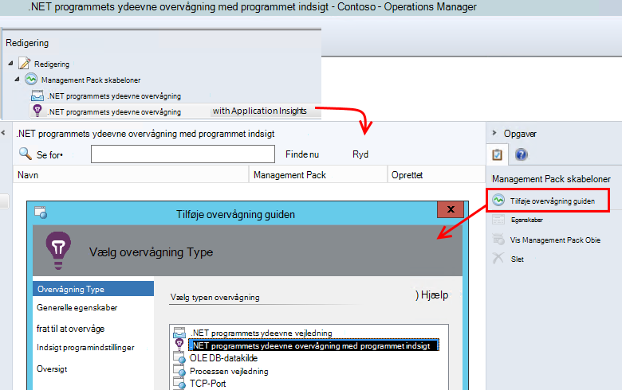
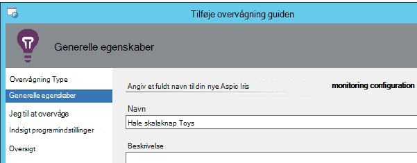
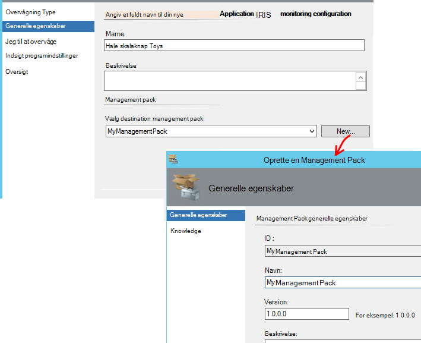
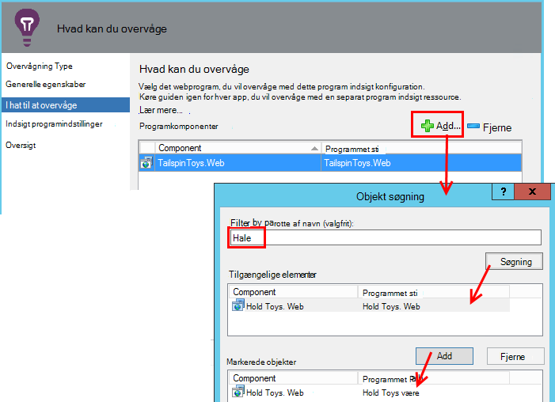
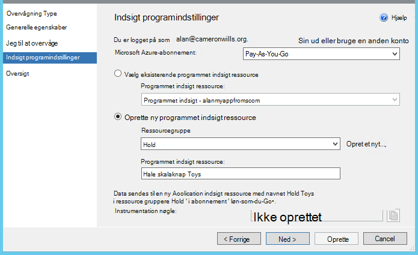
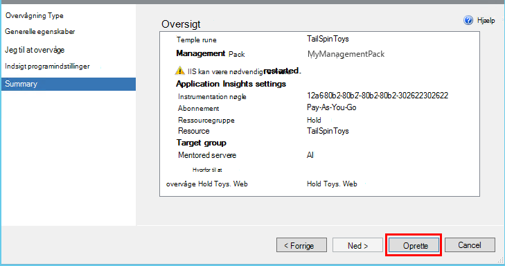
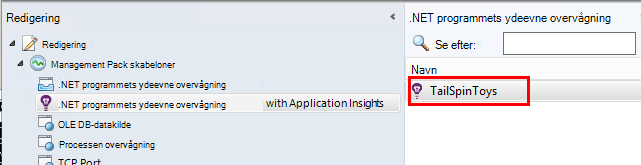
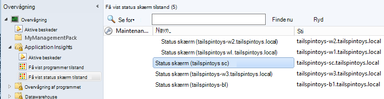

<properties 
    pageTitle="SCOM integration med programmet indsigt | Microsoft Azure" 
    description="Hvis du bruger en SCOM, overvåge ydeevnen og diagnosticere problemer med programmet indsigt. Omfattende dashboards, smart beskeder, effektive værktøjer til diagnosticering og analyse forespørgsler." 
    services="application-insights" 
    documentationCenter=""
    authors="alancameronwills" 
    manager="douge"/>

<tags 
    ms.service="application-insights" 
    ms.workload="tbd" 
    ms.tgt_pltfrm="ibiza" 
    ms.devlang="na" 
    ms.topic="article" 
    ms.date="08/12/2016" 
    ms.author="awills"/>
 
# Programmet overvågning af ydeevnen ved hjælp af programmet indsigt til SCOM

Hvis du bruger System Center Operations Manager (SCOM) til at administrere dine servere, kan du overvåge ydeevnen og diagnosticere problemer med ydeevnen ved hjælp af [Visual Studio programmet indsigt](app-insights-asp-net.md). Programmet indsigt overvåger dit webprogram indgående anmodninger, udgående RESTEN og SQL-opkald, undtagelser og log sporinger. Den indeholder dashboards med metriske diagrammer og smart advarsler, samt effektive diagnosticering Søg og analytiske forespørgsler over denne telemetri. 

Du kan skifte på programmet indsigt overvågning ved hjælp af en SCOM management pack.

## Før du starter

Vi antager, at:

* Du kender til SCOM, og at du bruger SCOM 2012 R2 eller 2016 til at administrere din IIS web servere.
* Du har allerede installeret på din servere et webprogram, du vil overvåge med programmet indsigt.
* App framework version er .NET 4.5 eller nyere.
* Du har adgang til et abonnement på [Microsoft Azure](https://azure.com) og kan logge på [Azure-portalen](https://portal.azure.com). Din organisation muligvis har et abonnement, og kan føje din Microsoft-konto til den.

(Udviklingsteamet kan oprette i [Programmet indsigt SDK](app-insights-asp-net.md) i WebApp. Denne build tid instrumentation giver dem større fleksibilitet i skrive brugerdefinerede telemetri. Men det er ligegyldigt: Du kan følge trinnene beskrevet her, med eller uden indbygget i SDK.)

## (Én gang) Installere programmet indsigt management pack

På den computer, hvor du kører Operations Manager:

2. Fjerne en tidligere version af management pack:
 1. Åbn Administration af Management Packs i Operations Manager. 
 2. Slet den gamle version.
1. Hent og Installer management pack fra kataloget.
2. Genstart Operations Manager.

## Oprette en management pack

1. Åbn **redigering**, **.NET... med programmet viden**, **Tilføje overvågning guiden**i Operations Manager, og vælg igen **.NET... med programmet indsigt**.

    

2. Navngiv konfigurationen, efter din app. (Du skal instrumentere én app ad gangen.)
    
    

3. Opret en ny management pack på den samme side i guiden, eller Vælg en pakke, du oprettede tidligere for programmet indsigt.

     (Programmet indsigt [management pack](https://technet.microsoft.com/library/cc974491.aspx) er en skabelon, hvorfra du opretter en forekomst. Du kan genbruge den samme forekomst senere.)

    

4. Vælg én app, du vil overvåge. Søgefunktionen søger mellem apps, der er installeret på din-servere.

    

    Feltet valgfrit overvågnings omfang kan bruges til at angive et undersæt af dine servere, hvis du ikke vil til at overvåge appen på alle servere.

5. På den næste side i guiden skal du først angive dine legitimationsoplysninger til at logge på Microsoft Azure.

    På denne side skal vælge du den programmet indsigt ressource, hvor du vil telemetridata til at analysere og vises. 

 * Hvis programmet blev konfigureret til programmet indsigt under udvikling, Vælg den eksisterende ressource.
 * Ellers skal du oprette en ny ressource navnet for app. Hvis der er andre apps, der indgår i det samme system, skal du placere dem i den samme ressourcegruppe, så adgang til telemetri lettere at administrere.

    Du kan ændre disse indstillinger senere.

    

6. Fuldføre guiden.

    
    
Gentag denne fremgangsmåde for hver app, du vil overvåge.

Hvis du vil ændre indstillinger senere, genåbnet egenskaberne for skærmen fra vinduet redigering.

## Bekræfte overvågning

Den skærm, du har installeret søger efter din app på hver server. Hvor der er angivet app'en, skal konfigurerer den programmet indsigt Status skærm for at overvåge appen. Hvis det er nødvendigt, installeres den først Status skærm på serveren.

Du kan kontrollere, hvilke forekomster af appen, der er fundet:

## Vis telemetri i programmet indsigt

Gå til ressourcen for din app i [Azure-portalen](https://portal.azure.com). Du kan [se diagrammer, der viser telemetri](app-insights-dashboards.md) fra din app. (Hvis det ikke er vist på hovedsiden endnu, skal du klikke på direkte målepunkter Stream).

## Næste trin

* [Konfigurere et dashboard](app-insights-dashboards.md) til samler de vigtigste diagrammer overvågning dette og andre apps.
* [Få mere at vide om statistik](app-insights-metrics-explorer.md)
* [Konfigurere beskeder](app-insights-alerts.md)
* [Diagnosticere problemer med ydeevnen](app-insights-detect-triage-diagnose.md)
* [Effektiv Analytics-forespørgsler](app-insights-analytics.md)
* [Tilgængelighed web test](app-insights-monitor-web-app-availability.md)
